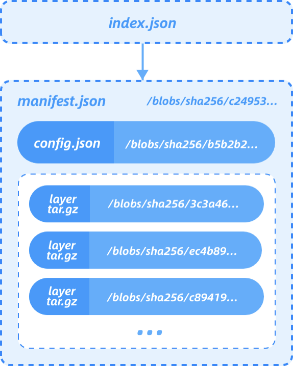
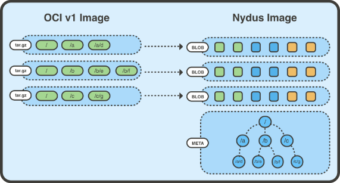
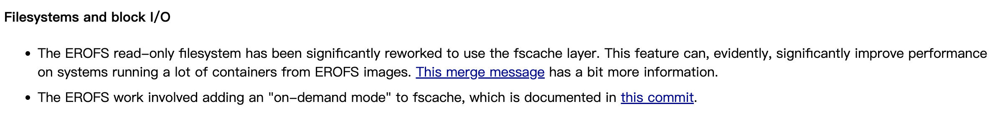
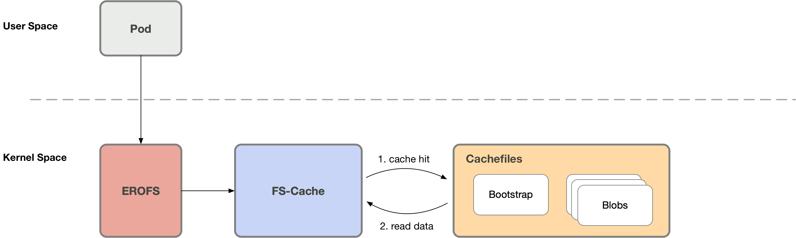
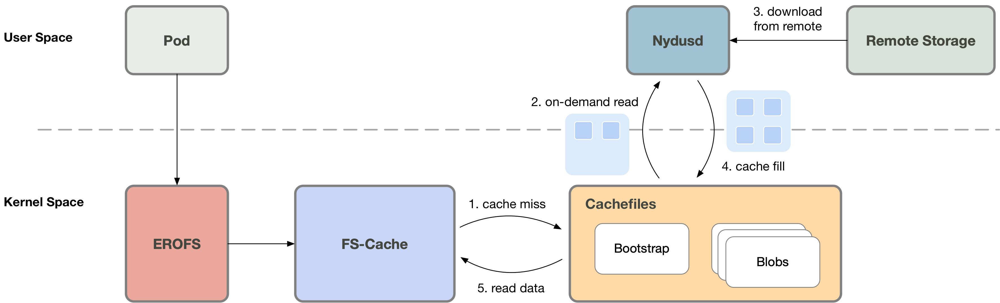

## The Evolution of the Nydus Image Acceleration

Optimized container images together with technologies such as P2P networks can effectively speed up the process of
container deployment and startup. In order to achieve this, we developed the Nydus image acceleration service (also
a sub-project of CNCF Dragonfly).

In addition to startup speed, core features such as image layering, lazy pulling etc. are also particularly
important in the field of container images. But since there is no native filesystem supporting that, most opt for the
userspace solution, and Nydus initially did the same. However user-mode solutions are encountering more and more
challenges nowadays, such as a huge gap in performance compared with native filesystems, and noticable resource
overhead in high-density employed scenarios.

Therefore, we designed and implemented the RAFS v6 format which is compatible with the in-kernel EROFS filesystem,
hoping to form a content-addressable in-kernel filesystem for container images.
After the lazy-pulling technology of "EROFS over Fscache" was merged into [5.19 kernel](https://git.kernel.org/pub/scm/linux/kernel/git/torvalds/linux.git/commit/?id=65965d9530b0c320759cd18a9a5975fb2e098462),
the next-generation architecture of Nydus is gradually becoming clear.
This is **the first** native [in-kernel solution](https://git.kernel.org/pub/scm/linux/kernel/git/torvalds/linux.git/tree/)
for container images, promoting a high-density, high-performance and high-availability solution for container images.

This article will introduce the evolution of Nydus from three perspectives: Nydus architecture outline, RAFS v6
image format and "EROFS over Fscache" on-demand loading technology.

Please refer to [Nydus](https://github.com/dragonflyoss/image-service) for more details of this project.
Now you can experience all these new features with this [user guide](https://github.com/dragonflyoss/image-service/blob/master/docs/nydus-fscache.md).

### Nydus Architecture Outline

In brief, Nydus is a *filesystem-based* image acceleration service that designs the RAFS (Registry Acceleration
File System) disk format, optimizing the startup performance of OCIv1 container images.

The fundamental idea of the container image is to provide the root directory (rootfs) of the container, which can
be carried by the filesystem or the archive format. Besides, it can also be implemented together with a custom block
format, but anyway it needs to present as a *directory tree*, providing the file interface to containers.

Let's take a look at the OCIv1 standard image format first. The OCIv1 format is an image format specification based on
the *Docker Image Manifest Version 2 Schema 2*. It consists of a manifest, an image index (optional), a series of
container image layers and configuration files. Essentially, OCIv1 is a layer-based image format, with each layer
storing file-level diff data in tgz archive format.

Due to the limitation of tgz, OCIv1 has some inherent issues, such as inability to load on demand, coarser level
deduplication granularity, unstable hash digest for each layer, etc.

As for the custom block format, it also has some flaws by design.

- Since the container image should be eventually presented as a directory tree, a filesystem (such as ext4) is needed
upon that. In this case the dependency chain is "custom block format + userspace block device + filesystem", which is
obviously more complex compared to the native filesystem solution;
- Since the block format is not aware of the upper filesystem, it would be impossible to distinguish the metadata and
data of the filesystem and process them separately (such as compression);
- Similarly, it is unable to implement file-based image analysis features such as security scanning, hotspot analysis,
and runtime interception, etc.;
- Unable to directly merge multiple existing images into one large image without modifying the blob image,
which is the natural ability of the filesystem solution.

Therefore, Nydus is a filesystem-based container image acceleration solution. It introduces a RAFS image format, in
which data (blobs) and metadata (bootstrap) of the image are separated, whilst the image layer only stores the data part.
Files within the image are divided into chunks for deduplication, with each image layer storing the corresponding chunk
data. Since then, the chunk-level deduplication is allowed between layers and images. Besides it also helps implement
on-demand loading. Since the metadata is separated from data and then combined into one place, the access to the
metadata does not need to pull the corresponding data, which speeds up the file access quite a lot.

The Nydus RAFS image format is shown below:

### RAFS v6 image format

#### Evolution of RAFS image format

Prior to the introduction of RAFS v6 format, Nydus used to handle a fully userspace implemented image format, working via
FUSE or virtiofs. However, the userspace filesystem has the following defects:

- The overhead of large amounts of system call cannot be ignored, especially in the case of random small I/Os with depth
1;
- Frequent file operations will generate a large number of FUSE requests, resulting in frequent switching of kernel/user
mode context, which becomes the performance bottleneck then;
- In non-FSDAX scenarios, the buffer copy from user to kernel mode will consume CPUs;
- In the FSDAX (via virtiofs) scenario, a large number of small files will occupy considerable DAX window resources,
resulting in potential performance jitter; frequent switching between small files will also generate noticeable DAX
mapping setup overhead.

Essentially these problems are caused by the natural limitations of the **userspace** filesystem solution, and if the
container filesystem is an in-kernel filesystem, the problems above can be resolved in practice. Therefore, we
introduced RAFS v6 image format, a container image format implemented in kernel based on EROFS filesystem.

#### Introduction to EROFS filesystem

EROFS filesystem has been in the Linux mainline since the Linux 4.19. In the past, it was mainly used for mobile
devices. It exists in the current major distributions (such as Fedora, Ubuntu, Archlinux, Debian, Gentoo, etc.).
The userspace tools erofs-utils also already exists in these distributions and the [OIN Linux system definition](https://openinventionnetwork.com/linux-system/table-11/)
list, and the community is quite active.

EROFS filesystem has the following characteristics:

- Native local read-only block-based filesystem suitable for various scenarios, the disk format has the minimum I/O
unit definition;
- Page-sized block-aligned uncompressed metadata;
- Effective space saving through Tail-packing inline technology while keeping high performance;
- Data is addressed in blocks (mmap I/O friendly, no post I/O processing required);
- Disk directory format friendly for random access;
- Simple on-disk format, easy to increase the payload, better scalability;
- Support DIRECT I/O access; support block devices, FSDAX and other backends;
- A boot sector is reserved, which can help bootstrap and other requirements.

#### Introduction to RAFS v6 image format

Over the past year, the Alibaba Cloud kernel team has made several improvements and enhancements to EROFS filesystem,
adapting it to the container image storage scenarios, and finally presenting it as a container image format implemented
on the kernel side, RAFS v6. In addition, RAFS v6 also carries out a series of optimizations on the image format, such
as block alignment, more compact metadata, and more.

The new RAFS v6 image format is as follows:

The improved Nydus image service architecture is illustrated as below, adding support for the (EROFS-based) RAFS
v6 image format:

### EROFS over Fscache

erofs over fscache is the next-generation container image **on-demand loading** technology developed by the Alibaba
Cloud kernel team for Nydus. It is also the **native** image on-demand loading feature of the Linux kernel.
It was integrated into the [Linux kernel mainline 5.19](https://git.kernel.org/pub/scm/linux/kernel/git/torvalds/linux.git/commit/?id=65965d9530b0c320759cd18a9a5975fb2e098462).

And on LWN.net as a [highlighting feature](https://lwn.net/SubscriberLink/896140/3d7b8c63b70776d4/) of the 5.19 merge window:

Prior to this, almost all lazy pulling solutions available were in the user mode. The userspace solution involves
frequent kernel/user mode context switching and memory copying between kernel/user mode, resulting in performance
bottlenecks. This problem is especially prominent when all the container images have been downloaded locally, in which
case the file access will still switch to userspace.

In order to avoid the unnecessary overhead, we can decouple the two operations of 1) cache management of image data
and 2) fetching data through various sources (such as network) on cache miss. Cache management can be all in the kernel
mode, so that it can avoid kernel/user mode context switching when the image is locally ready.
This is exactly the main benefit of erofs over fscache technology.

#### Brief Introduction

fscache/cachefiles (hereinafter collectively referred to as fscache) is a relatively mature file caching solution in
Linux systems, and is widely used in network filesystems (such as NFS, Ceph, etc.).
Our attempt is to make it work with the on-demand loading for local filesystems such as EROFS.

In this case, when the container accesses the container image, fscache will check whether the requested data has been
cached. On cache hit, the data will be read directly from the cache file. It is processed directly in kernel, and will
not switch to userspace.

Otherwise (cache miss), the userspace service Nydusd will be notified to process this request, while the container
process will sleep on this then; Nydusd will fetch data from remote, write it to the cache file through fscache, and
awake the original asleep process. Once awaken, the process is able to read the data from the cache file.

#### Advantages of the Solution

As described above, when the image has been downloaded locally, userspace solutions still need to switch to userspace
when accessing, while the memory copying overhead between kernel/user modes is also involved. As for erofs over fscache,
it will no longer switch to userspace, so that on-demand loading is truly "on-demand". IOWs, it has **native performance
and stability** when images has been locally ready. In brief, it implements a real one-stop and lossless solution in the
following two scenarios of 1) on-demand loading and 2) downloading container images in advance.

Specifically, erofs over fscache has the following advantages over userspace solutions.

##### 1. Asynchronous prefetch

After the container is created, Nydusd can start to download images even without the on-demand loading (cache miss)
triggered. Nydusd will download data and write it to the cache file. Then when the specific file range is accessed,
EROFS will directly read from the cache file, without **switching to the userspace**, whilst the other userspace
solutions have to go the round trip.

##### 2. Network IO optimization

When on-demand loading (cache miss) is triggered, Nydusd can download more data at one time than requested.
For example, when 4KB I/O is requested, Nydusd can actually download 1MB of data at a time to reduce the network
transmission delay per unit file size. Then, when the container accesses the remaining data within this 1MB,
it won't switch to userspace anymore. The userspace solutions cannot work like this since it still needs to
switch to the userspace on data access within the prefetched range.

##### 3. Better performance

When images have been downloaded locally (the impact of on-demand loading is not considered in this case),
erofs over fscache performs significantly better than userspace solutions, while achieving similar performance
compared to the native filesystem.
Here is the performance statistics under several workloads as below[1].

###### read/randread IO

The following is the performance statistics of file read/randread buffered IO [2]

| read        | IOPS | BW       | performance |
| ----------- | ---- | -------- | ----------- |
| native ext4 | 267K | 1093MB/s | 1           |
| loop        | 240K | 982MB/s  | 0.90        |
| fscache     | 227K | 931MB/s  | 0.85        |
| fuse        | 191K | 764MB/s  | 0.70        |

| randread    | IOPS  | BW       | Performance |
| ----------- | ----- | -------- | ----------- |
| native ext4 | 10.1K | 41.2MB/s | 1           |
| loop        | 8.7K  | 34.8MB/s | 0.84        |
| fscache     | 9.5K  | 38.2MB/s | 0.93        |
| fuse        | 7.6K  | 31.2MB/s | 0.76        |

> - "native" means that the test file is directly on the local ext4 filesystem
> - "loop" means that the test file is inside a erofs image, while the erofs image is mounted through the DIRECT IO
mode of the loop device
> - "fscache" means that the test file is inside a erofs image, while the erofs image is mounted through the erofs over
fscache scheme
> - "fuse" means that the test file is in the fuse filesystem [3]
> - The "Performance" column normalizes the performance statistics of each mode, based on the performance of the native
ext4 filesystem

It can be seen that the read/randread performance in fscache mode is basically the same as that in loop mode, and is
better than that in fuse mode; however, there is still a certain gap with the performance of the native ext4 file
system. We are further analyzing and optimizing it. In theory, it can achieve basically lossless performance with that
of native filesystem.

###### File metadata manipulation

Test the performance of file metadata operations by performing a tar operation [4] on a large number of small files.

|             | Time   | Performance |
| ----------- | ------ | ----------- |
| native ext4 | 1.04s  | 1           |
| loop        | 0.550s | 1.89        |
| fscache     | 0.570s | 1.82        |
| fuse        | 3.2s   | 0.33        |

It can be seen that the erofs format is even better than that of the native ext4 filesystem,
which is caused by the optimized filesystem format of erofs.
Since erofs is a read-only filesystem, all its metadata can be closely arranged, while ext4 is a writable filesystem,
and its metadata is scattered among multiple BGs (block group) .

###### Typical workload

Test the performance of linux source code compilation [5] as the typical workload.

| Linux Compiling | Time | Performance |
| --------------- | ---- | ----------- |
| native ext4     | 156s | 1           |
| loop            | 154s | 1.0         |
| fscache         | 156s | 1.0         |
| fuse            | 200s | 0.78        |

It can be seen that fscache mode is basically the same as that of loop mode and native ext4 filesystem,
and is better than fuse mode.

##### 4. High-density deployment

Since the erofs over fscache technology is implemented based on files, i.e. each container image is represented as a
cache file under fscache, it naturally supports high-density deployment scenarios.
For example, a typical node.js container image corresponds to ~20 cache files under this scheme,
then in a machine with hundreds of containers deployed, only thousands of cache files need to be maintained.

##### 5. Failover and Hot Upgrade

When all the image files have been downloaded locally, the file access will no longer require the intervention of the
user-mode service process, in which case the user-mode service process has a more abundant time window to realize the
functions of **failure recovery and hot upgrade**.
The user-mode processes are even no longer required in this scenario, which promotes the stability of the solution.

##### 6. An one-stop solution for container image

With RAFS v6 image format and erofs over fscache on-demand loading technology,
Nydus is suitable for both runc and Kata as a one-stop solution for container image distribution in these two scenarios.

More importantly, erofs over fscache is a truly a **one-stop** and **lossless** solution in the following two scenarios
of 1) on-demand loading and 2) downloading container images in advance.
On the one hand, with the on-demand loading feature implemented, it can significantly speed up the container startup,
as it does not need to download the complete container images to the local. On the other hand, it is compatible with the
scenario where the container image has been downloaded locally. It will no longer switch to userspace in this case,
so as to achieve almost lossless performance and stability with the native filesystem.

### The Future

After that, we will keep improving the erofs over fscache technology, such as more fine-grained image deduplication
among containers, stargz support, FSDAX support, and performance optimization.

Last but not least, I would like to thank all the individuals and teams who have supported and helped us during the
development of the project, and specially thanks to ByteDance and Kuaishou folks for their solid support.
Let us work together to build a better container image ecosystem :)

1. Test environment: ecs.i2ne.4xlarge (16 vCPU, 128 GiB Mem, local NVMe disk)
2. Test command "fio -ioengine=psync -bs=4k -direct=0 -rw=[read|randread] -numjobs=1"
3. Use [passthrough_hp](https://github.com/libfuse/libfuse/blob/master/example/passthrough_hp.cc) as fuse daemon
4. Test the execution time of "tar -cf /dev/null linux_src_dir" command
5. Test the execution time of the "time make -j16" command
