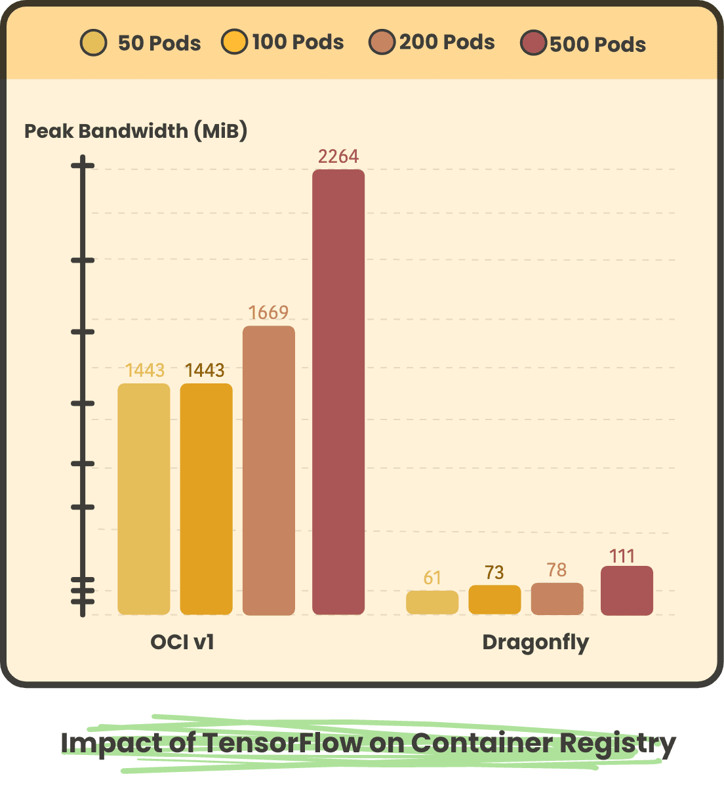

<!-- Posted on April 13, 2023 -->

[CNCF projects highlighted in this post](https://www.cncf.io/blog/2023/04/13/volcano-engine-distributed-image-acceleration-practice-based-on-dragonfly/), and migrated by [mingcheng](https://github.com/mingcheng).

 <!--  -->

<!-- _Project post by Gaius, Dragonfly Maintainer_ -->

Terms and definitions

| Term               | Definition                                                                                                                                                                                                                                                                                                                                                                                                                                                                                                                 |
| ------------------ | -------------------------------------------------------------------------------------------------------------------------------------------------------------------------------------------------------------------------------------------------------------------------------------------------------------------------------------------------------------------------------------------------------------------------------------------------------------------------------------------------------------------------- |
| OCI                | The Open Container Initiative is a Linux Foundation project launched by Docker in June 2015 to design open standards for operating system-level virtualization (and most importantly Linux containers).                                                                                                                                                                                                                                                                                                                    |
| OCI Artifact       | Products that follow the OCI image spec.                                                                                                                                                                                                                                                                                                                                                                                                                                                                                   |
| Image              | The image in this article refers to OCI Artifact                                                                                                                                                                                                                                                                                                                                                                                                                                                                           |
| Image Distribution | A product distribution implemented according to the OCI distribution spec.                                                                                                                                                                                                                                                                                                                                                                                                                                                 |
| ECS                | It is a collection of resources composed of CPU, memory, and Cloud Drive, each of which logically corresponds to the computing hardware entity of the Data center infrastructure.                                                                                                                                                                                                                                                                                                                                          |
| CR                 | Volcano Engine image distribution service.                                                                                                                                                                                                                                                                                                                                                                                                                                                                                 |
| VKE                | Volcano Engine deeply integrates the new generation of Cloud Native technology to provide high-performance Kubernetes container cluster management services with containers as the core, helping users to quickly build containerized applications.                                                                                                                                                                                                                                                                        |
| VCI                | Volcano is a serverless and containerized computing service. The current VCI seamlessly integrates with the Container Service VKE to provide Kubernetes orchestration capabilities. With VCI, you can focus on building the app itself, without having to buy and manage infrastructure such as the underlying Cloud as a Service, and pay only for the resources that the container actually consumes to run. VCI also supports second startup, high concurrent creation, sandbox Container Security isolation, and more. |
| TOS                | Volcano Engine provides massive, secure, low-cost, easy-to-use, highly reliable and highly available distributed cloud storage services.                                                                                                                                                                                                                                                                                                                                                                                   |
| Private Zone       | Private DNS service based on a proprietary network VPC (Virtual Private Cloud) environment. This service allows private domain names to be mapped to IP addresses in one or more custom VPCs.                                                                                                                                                                                                                                                                                                                              |
| P2P                | Peer-to-peer technology, when a peer in a P2P network downloads data from the server, it can also be used as a server level for other peers to download after downloading the data. When a large number of nodes download at the same time, it can ensure that the subsequent downloaded data does not need to be downloaded from the server side. Thereby reducing the pressure on the server side.                                                                                                                       |
| Dragonfly          | Dragonfly is a file distribution and image acceleration system based on P2P technology, and is the standard solution and best practice in the field of image acceleration in Cloud Native architecture. Now hosted as an incubation project by the Cloud Native Computing Foundation (CNCF).                                                                                                                                                                                                                               |
| Nydus              | Nydus Acceleration Framework implements a content-addressable filesystem that can accelerate container image startup by lazy loading. It has supported the creation of millions of accelerated image containers daily, and deeply integrated with the linux kernel's erofs and fscache, enabling in-kernel support for image acceleration.                                                                                                                                                                                 |

## Background

Volcano Engine image repository CR uses TOS to store container images. Currently, it can meet the demand of large-scale concurrent image pulling to a certain extent. However, the final concurrency of pulling is limited by the bandwidth and QPS of TOS.

Here is a brief introduction of the two scenarios that are currently encountered for large-scale image pulling:

1. The number of clients is increasing, and the images are getting larger. The bandwidth of TOS will eventually be insufficient.
2. If the client uses Nydus to convert the image format, the request volume to TOS will increase by an order of magnitude. The QPS limit of TOS API makes it unable to meet the demand.

Whether it is the image repository service itself or the underlying storage, there will be bandwidth and QPS limitations in the end. If you rely solely on the bandwidth and QPS provided by the server, it is easy to be unable to meet the demand. Therefore, P2P needs to be introduced to reduce server pressure and meet the demand for large-scale concurrent image pulling.

Investigation of image distribution system based on P2P technology

There are several P2P projects in the open source community. Here is a brief introduction to these projects.

[Dragonfly](https://github.com/dragonflyoss/dragonfly)

Architecture

Manager

- Stores dynamic configuration for consumption by seed peer cluster, scheduler cluster and dfdaemon.
- Maintain the relationship between seed peer cluster and scheduler cluster.
- Provide async task management features for image preheat combined with harbor.
- Keepalive with scheduler instance and seed peer instance.
- Filter the optimal scheduler cluster for dfdaemon.
- Provides a visual console, which is helpful for users to manage the P2P cluster.

Scheduler

- Based on the multi-feature intelligent scheduling system selects the optimal parent peer.
- Build a scheduling directed acyclic graph for the P2P cluster.
- Remove abnormal peer based on peer multi-feature evaluation results.
- In the case of scheduling failure, notice peer back-to-source download.

Dfdaemon

- Serve gRPC for dfget with downloading feature, and provide adaptation to different source protocols.
- It can be used as seed peer. Turning on the Seed Peer mode can be used as a back-to-source download peer in a P2P cluster, which is the root peer for download in the entire cluster.
- Serve proxy for container registry mirror and any other http backend.
- Download object like via http, https and other custom protocol.

[Kraken](https://github.com/uber/kraken)

Architecture

Agent

- Is a peer node in a P2P network and needs to be deployed on each node
- Implemented the docker registry interface
- Notify the tracker of the data they own
- Download the data of other agents (the tracker will tell the agent which agent to download this data from)

Origin

- Responsible for reading data from storage for seeding
- Support for different storage
- High availability in the form of a hash ring

Tracker

- A coordinator in a P2P network, tracking who is a peer and who is a seeder
- Track data owned by peers
- Provide ordered peer nodes for peers to download data
- High availability in the form of a hash ring

Proxy

- Implemented the docker registry interface
- Pass the image layer to the Origin component
- Pass the tag to the build-index component

Build-Index

- Tag and digest mapping, when the agent downloads the corresponding tag data, it obtains the corresponding digest value from Build-Index
- image replication between clusters
- Save tag data in storage
- High availability in the form of a hash ring

Dragonfly vs Kraken

|                           | Dragonfly                                                 | Kraken                                                                   |
| ------------------------- | --------------------------------------------------------- | ------------------------------------------------------------------------ |
| High availability         | Scheduler consistent hash ring supports high availability | Tracker consistent hash ring, multiple replicas ensure high availability |
| Containerd support        | Support                                                   | Support                                                                  |
| HTTPS image repository    | Support                                                   | Support                                                                  |
| Community active level    | Active                                                    | Inactive                                                                 |
| Number of users           | More                                                      | Less                                                                     |
| Maturity                  | High                                                      | High                                                                     |
| Is it optimized for Nydus | Yes                                                       | No                                                                       |
| Architecture complexity   | Middle                                                    | Middle                                                                   |

Summary

Based on the overall maturity of the project, community active level, number of users, architecture complexity, whether it is optimized for Nydus , future development trends and other factors, Dragonfly is the best choice in P2P projects.

Proposal

For Volcano Engine, the main consideration is that VKE and VCI pull images through CR.

- The product feature of VKE is K8s deployed based on ECS, so it is very suitable to deploy dfdaemon on each node, fully utilize the bandwidth of each node, and then fully utilize the capability of P2P.
- The product feature of VCI is that there are some virtual nodes with abundant resources at the bottom layer. The upper layer service is based on POD as the carrier, so it is impossible to deploy dfdaemon on each node like VKE, so the deployment form deploys several dfdaemon as cache, using the cache capability.
- VKE or VCI client pulls images that have been converted by Nydus format. In this scenario, dfdaemon needs to be used as a cache, and not too many nodes should be used to avoid putting too much scheduling pressure on the Scheduler.

Based on Volcano Engine’s demand for the above products, and combined with Dragonfly’s characteristics, a deployment scheme compatible with many factors needs to be designed. The scheme for deploying Dragonfly is designed as follows.

Architecture

- Volcano Engine resources belong to the main account, P2P control components divided by the main account level isolation, each master account under a set of P2P control components. server level implementation of P2PManager controller, through the controller to control the control plane of all P2P cgroup parts
- P2P control components are deployed in CR data plane VPC , through LB exposed to user cluster
- On a VKE cluster, Dfdaemons are deployed as DaemonSets, with one Dfdaemon deployed on each node.
- On VCI , Dfdaemon is deployed as Deployment
- Containerd on ECS accesses Dfdaemon on this node via 127.0.0.1:65001
- Through a controller component in the user Clustered Deployment , based on the PrivateZone function, generate `<clusterid>`.p2p.volces.com domain name in the user cluster, the controller will select the Dfdaemon  pod of a specific node (including VKE , VCI ) according to certain rules, and resolve to the above domain name in the form of A record.
- ECS on Nydusd by `<clusterid>`.p2p.volces.com domain name access Dfdaemon
- The image service Client and Nydusd on VCI access Dfdaemon via `<clusterid>`.p2p.volces.com domain name

Benchmark

Environment

Container Repository : Bandwidth 10Gbit/s

Dragonfly Scheduler: 2 Replicas，Request 1C2G，Limit 4C8G, Bandwidth 6Gbit/s

Dragonfly Manager: 2 Replicas，Request 1C2G，Limit 4C8G, Bandwidth 6Gbit/s

Dragonfly Peer : Limit 2C6G, Bandwidth 6Gbit/s, SSD

Image

Nginx(500M)

TensorFlow(3G)

Component Version

Dragonfly v2.0.8

POD Creation to Container Start

Nginx  pods concurrently consume time from creation to startup for all pods of 50, 100, 200, and 500

TensorFlow  pods concurrently consume time from creation to startup for all pods of 50, 100, 200, 500, respectively

In large-scale image scenarios, using Dragonfly and Dragonfly & Nydus scenarios can save more than 90% of container startup time compared to OCIv1 scenarios. The shorter startup time after using Nydus is due to the lazyload feature, which only needs to pull a small part of the metadata  Pod to start.

### Back-to-source Peak Bandwidth on Container Registry

Nginx Pod concurrent storage peak traffic of 50, 100, 200, and 500, respectively

TensorFlow  Pod concurrent storage peak traffic of 50, 100, 200, 500, respectively

### Back-to-source Traffic on Container Registry

Nginx Pod concurrent 50, 100, 200, 500 back to the source traffic respectively

TensorFlow  Pod concurrent 50, 100, 200, 500 back to the source traffic respectively

In large-scale scenarios, using Dragonfly back to the source pulls a small number of images, and all images in OCIv1 scenarios have to be back to the source, so using Dragonfly back to the source peak and back to the source traffic is much less than OCIv1. And after using Dragonfly, as the number of concurrency increases, the peak and traffic back to the source will not increase significantly.

## Reference

Volcano Engine [https://www.volcengine.com/](https://www.volcengine.com/)

Volcano Engine VKE [https://www.volcengine.com/product/vke](https://www.volcengine.com/product/vke)

Volcano Engine CR [https://www.volcengine.com/product/cr](https://www.volcengine.com/product/cr)

Dragonfly [https://d7y.io/](https://d7y.io/)

Dragonfly Github Repo [https://github.com/dragonflyoss/dragonfly](https://github.com/dragonflyoss/dragonfly)

Nydus [https://nydus.dev/](https://nydus.dev/)

Nydus Gihtub Repo [https://github.com/dragonflyoss/image-service](https://github.com/dragonflyoss/image-service)
