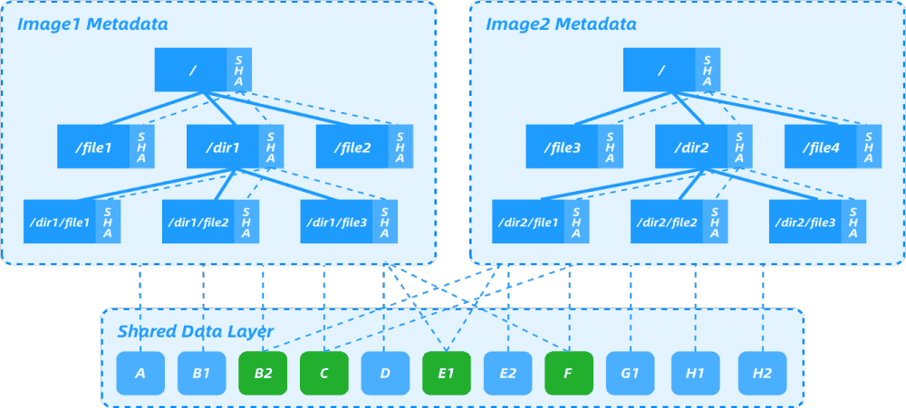
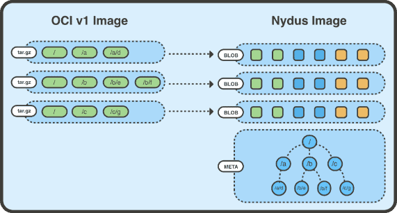
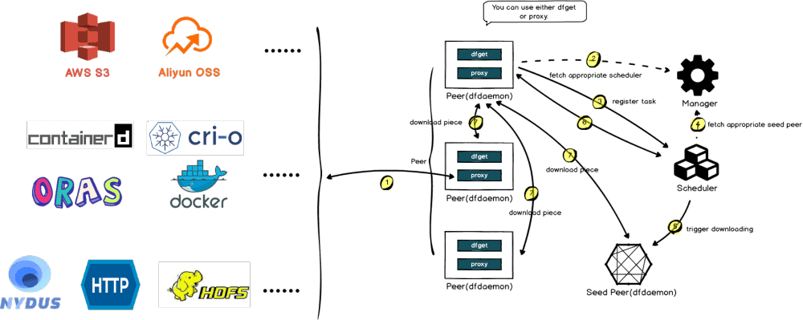
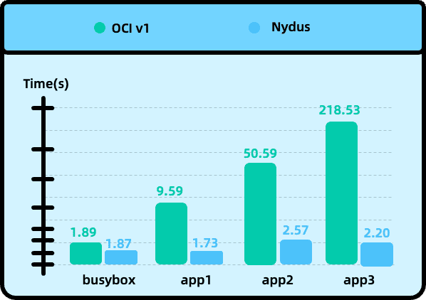
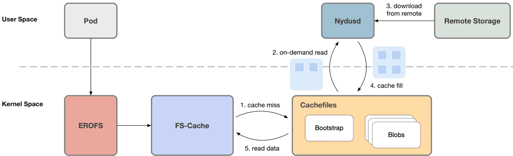
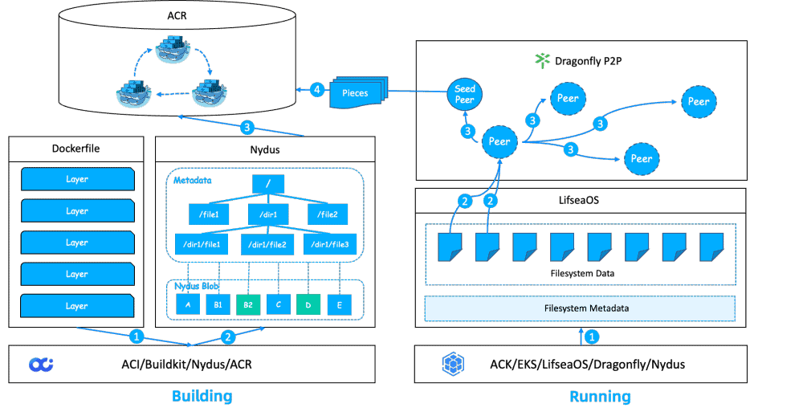

<!-- Posted on May 1, 2023 -->

[CNCF projects highlighted in this post](https://www.cncf.io/blog/2023/05/01/ant-group-security-technologys-nydus-and-dragonfly-image-acceleration-practices/), and migrated by [mingcheng](https://github.com/mingcheng).

<!-- _Guest post by Dragonfly maintainers_ -->

## Introduction

[ZOLOZ](https://www.zoloz.com/) is a global security and risk management platform under Ant Group. Through biometric, big data analysis, and artificial intelligence technologies, ZOLOZ provides safe and convenient security and risk management solutions for users and institutions. ZOLOZ has provided security and risk management technology support for more than 70 partners in 14 countries and regions, including China, Indonesia, Malaysia, and the Philippines. It has already covered areas such as finance, insurance, securities, credit, telecommunications, and public services, and has served over 1.2 billion users.

With the explosion of Kubernetes and cloud-native, ZOLOZ applications have begun to be deployed on a large scale on public clouds using containerization. The images of ZOLOZ applications have been maintained and updated for a long time, and both the number of layers and the overall size have reached a large scale (hundreds of MBs or several GBs). In particular, the basic image size of ZOLOZ’s AI algorithm inference application is much larger than that of general application images (PyTorch/PyTorch:1.13.1-CUDA 11.6-cuDNN 8-Runtime on Docker Hub is 4.92GB, compared to CentOS:latest with only about 234MB).

For container cold start, i.e., when there is no image locally, the image needs to be downloaded from the registry before creating the container. In the production environment, container cold start often takes several minutes, and as the scale increases, the registry may be unable to download images quickly due to network congestion within the cluster. Such large images have brought many challenges to application updates and scaling. With the continuous promotion of containerization on public clouds, ZOLOZ applications mainly face three challenges:

1. The algorithm image is large, and pushing it to the cloud image repository takes a long time. During the development process, when testing in the testing environment, developers often hope to iterate quickly and verify quickly. However, every time a branch is modified and released for verification, it takes several tens of minutes, which is very inefficient.
2. Pulling the algorithm image takes a long time, and pulling many image files during cluster expansion can easily cause the cluster network card to be flooded and affect the normal operation of the business.
3. The cluster machine takes a long time to start up, making it difficult to meet the needs of sudden traffic increases and elastic automatic scaling.

Although various compromise solutions have been attempted, these solutions all have their shortcomings. Now, in collaboration with multiple technical teams such as Ant Group, Alibaba Cloud, and ByteDance, a more universal solution on public clouds has been developed, which has low transformation costs and good performance, and currently appears to be an ideal solution.

## Terminology

OCI: Open Container Initiative, a Linux Foundation project initiated by Docker in June 2015, aimed at designing open standards for operating system-level virtualization, most importantly Linux containers.

OCI Manifest: The product follows the OCI Image Spec.

BuildKit: A new generation Docker build tool produced by Docker that is more efficient, Dockerfile-independent, and more suitable for cloud-native applications.

Image: In this article, the image refers to OCI Manifest, including Helm Chart and other OCI Manifests.

Image Repository: A product repository implemented in accordance with OCI Distribution Spec.

ECS: A resource collection consisting of CPUs, memory, and cloud disks, with each type of resource logically corresponding to a computing hardware entity in a data center.

ACR: Alibaba Cloud’s image repository service.

ACK: Alibaba Cloud Container Service Kubernetes version provides high-performance and scalable container application management capabilities and supports full lifecycle management of enterprise-level containerized applications.

ACI: Ant Continuous Integration, is a CI/CD efficiency product under the Ant Group’s research and development efficiency umbrella, which is centered around pipelines. With intelligent automated construction, testing, and deployment, it provides a lightweight continuous delivery solution based on code flow to improve the work efficiency of team development.

Private Zone: A private DNS service based on the Virtual Private Cloud (VPC) environment. This service allows private domain names to be mapped to IP addresses in one or more custom VPCs.

P2P: Peer-to-peer technology, when a Peer in a P2P network downloads data from the server, it can also act as a server for other Peers to download after downloading the data. When a large number of nodes are downloading simultaneously, subsequent data downloads can be obtained without downloading from the server. This can reduce the pressure on the server.

Dragonfly: Dragonfly is a file distribution and image acceleration system based on P2P technology and is the standard solution and best practice in the field of image acceleration in cloud-native architecture. It is now hosted by the Cloud Native Computing Foundation (CNCF) as an incubation-level project.

Nydus: Nydus is a sub-project of Dragonfly’s image acceleration framework that provides on-demand loading of container images and supports millions of accelerated image container creations in production environments every day. It has significant advantages over OCIv1 in terms of startup performance, image space optimization, end-to-end data consistency, kernel-level support, etc.

LifseaOS: A lightweight, fast, secure, and image-atomic management container optimization operating system launched by Alibaba Cloud for container scenarios. Compared with traditional operating systems, the number of software packages is reduced by 60%, and the image size is reduced by 70%. The first-time startup time is reduced from over 1 minute to around 2 seconds. It supports image read-only and OSTree technology, versioning management of OS images, and updating software packages or fixed configurations on the operating system on an image-level basis.

## Solution

### 1: Large image size

#### Reduce the size of the base image

The basic OS is changed from CentOS 7 to AnolisOS 8, and the installation of maintenance tools is streamlined. Only a list of essential tools (basic maintenance tools, runtime dependencies, log cleaning, security baselines, etc.) is installed by default, and the configuration of security hardening is simplified. The base image is reduced from 1.63GB to 300MB.

AnolisOS Repository: [https://hub.docker.com/r/openanolis/anolisos/tags](https://hub.docker.com/r/openanolis/anolisos/tags)

#### Dockerfile optimization

Reduce unnecessary build resources and time through Dockerfile writing constraints, image inspection, and other means.

Dockerfile Best Practices: [https://docs.docker.com/develop/develop-images/dockerfile_best-practices/](https://docs.docker.com/develop/develop-images/dockerfile_best-practices/)

#### Parallel building and build caching

AntGroup’s Build Center uses the Nydus community-optimized version of [BuildKit](https://github.com/moby/buildkit/blob/master/docs/nydus.md), which supports layer-level caching. The previous artifacts are accurately referenced and cached, and for Multistage type Dockerfiles, BuildKit can achieve parallel execution between different stages.

### 2: Slow pushing image

#### Use Nydus images for block-level data deduplication

In traditional OCI images, the smallest unit that can be shared between different images is the layer in the image, and the efficiency of deduplication is very low. There may be a lot of duplicate data between layers, even if there are slight differences, they will be treated as different layers. According to the design of deletion files and hard links in OCI Image Spec, there may be files that have been deleted in the upper layer but still exist in the lower layer and are included in the image. In addition, OCI Image uses the tar+gzip format to express the layers in the image, and the tar format does not distinguish between tar archive entries order, which brings a problem that if users build the same image on different machines, they may get different images because of using different file systems, but the substantial content of several different images is completely identical, which leads to a sharp increase in the amount of uploaded and downloaded data.

Issues with OCIv1 and OCIv2 proposals: [https://hackmd.io/@cyphar/ociv2-brainstorm](https://hackmd.io/@cyphar/ociv2-brainstorm)

Nydus image files are divided into file chunks, and the metadata layer is flattened (removing intermediate layers). Each chunk is only saved once in the image, and a base image can be specified as a chunk dictionary for other Nydus images. Based on chunk-level deduplication, it provides low-cost data deduplication capabilities between different images, greatly reducing the amount of uploaded and downloaded data for the images.



As shown in the figure above, Nydus image 1 and image 2 have the same data blocks B2, C, E1, and F. Image 2 adds E2, G1, H1, and H2. If image 1 already exists in the image repository, image 2 can be built based on image 1. Only E2, G1, H1, and H2 need to be built in one layer, and only this layer needs to be uploaded to the image repository during upload. This achieves the effect of uploading and pulling only file differences, shortens the development cycle.

#### Directly building Nydus images

Currently, in most landing scenarios for acceleration images, the production of acceleration images is based on image conversion. The following two Nydus conversion schemes are currently in place:

##### i. Repository conversion

After a traditional image is built and pushed to the image repository, the conversion action of the image repository is triggered to complete the image conversion. The disadvantage of this approach is that the build and conversion are often done on different machines. After the image is built and pushed, it needs to be pulled to the conversion machine and the output needs to be pushed to the image repository, which adds a complete image circulation process and causes high latency. Also, it occupies the network resources of the image repository. Before the acceleration image conversion is complete, application deployment cannot enjoy the acceleration effect and still needs to pull the entire image.

##### ii. Double version building

After the traditional image is built, it is converted directly on the local build machine. To improve efficiency, the conversion of each layer can be started immediately after the construction of that layer, which can significantly reduce the delay in generating acceleration images. With this approach, conversion can begin without waiting for traditional image upload, and because it is local conversion, compared to approach 1, the cost of transfer between the conversion machine and the image repository can be saved. If the accelerated image corresponding to the base image does not exist, it will be converted; if it exists, pulling can be ignored, but inevitably, pushing always requires twice the data.

##### iii. Direct building

Compared with the two conversion-based schemes mentioned above, directly building Nydus acceleration images has obvious production delays. First, OCI-based image construction is significantly slower than Nydus image construction. Second, conversion is an after-the-fact behavior and there is more or less delay. Third, there is additional data transmission in both schemes. Direct building, on the other hand, has fewer steps, is faster, and saves resources.

It can be seen that the steps and data transmission volume for building acceleration images are significantly reduced. After the construction is completed, the ability of the acceleration image can be directly enjoyed and the speed of application deployment can be greatly improved.

### 3: Slow container startup

#### Nydus images load on demand

The actual usage rate of the image data is very low. For example, [Cern’s paper](https://indico.cern.ch/event/567550/papers/2627182/files/6153-paper.pdf) mentions that only 6% of the content of a general image is actually used. The purpose of on-demand loading is to allow the container runtime to selectively download and extract files from the image layers in the Blob, but the [OCI](https://github.com/opencontainers/image-spec/)/[Docker](https://github.com/moby/moby/blob/master/image/spec/v1.2.md) image specifications package all image layers into a tar or tar.gz archive. This means that even if you want to extract a single file, you still have to scan the entire Blob. If the image is compressed using gzip, it is even more difficult to extract specific files.



The [RAFS image format](/blog/2022/06/06/evolution-of-nydus) is an archive compression format proposed by Nydus. It separates the data (Blobs) and metadata (Bootstrap) of the container image file system, so that the original image layers only store the data part of the files. Furthermore, the files are divided into chunks according to a certain granularity, and the corresponding chunk data is stored in each layer of Blob. Using chunk granularity refines the deduplication granularity, and allows easier sharing of data between layers and images, and easier on-demand loading. The original image layers only store the data part of the files (i.e. the Blob layer in the figure).

The Blob layer stores the chunk files, which are chunks of file data. For example, a 10MB file can be sliced into 10 1MB blocks, and the offset of each chunk can be recorded in an index. When requesting part of the data from a file, the container runtime can selectively obtain the file from the image repository by combining with the HTTP Range Request supported by the OCI/Docker image repository specification, thus saving unnecessary network overhead. For more details about the Nydus image format, please refer to the [Nydus Image Service project](https://github.com/dragonflyoss/image-service).

The metadata and chunk indexes are combined to form the Meta layer in the figure above, which is the entire filesystem structure that the container can see after all image layers are stacked. It includes the directory tree structure, file metadata, chunk information (block size and offset, as well as metadata such as file name, file type, owner, etc. for each file). With Meta, the required files can be extracted without scanning the entire archive file. In addition, the Meta layer contains a hash tree and the hash of each chunk data block, which ensures that the entire file tree can be verified at runtime, and the signature of the entire Meta layer can be checked to ensure that the runtime data can be detected even if it is tampered with.



Nydus uses the user-mode file system implementation [FUSE](https://www.kernel.org/doc/html/latest/filesystems/fuse.html) to implement on-demand loading by default. The user-mode Nydus daemon process mounts the Nydus image mount point as the container RootFS directory. When the container generates a file system IO such as read(fd, count), the kernel-mode FUSE driver adds the request to the processing queue. The user-mode Nydus daemon reads and processes the request through the FUSE Device, pulls the corresponding number of Chunk data blocks from the remote Registry, and finally replies to the container through the kernel-mode FUSE. Nydus also implements a layer of local cache, where chunks that have been pulled from the remote are uncompressed and cached locally. The cache can be shared between images on a layer-by-layer basis, or at a chunk level.



After using Nydus for image acceleration, the startup time of different applications has made a qualitative leap, enabling applications to be launched in a very short time, meeting the requirements of rapid scaling in the cloud.

#### Read-only file system EROFS

When there are many files in the container image, frequent file operations generate a large number of FUSE requests, which causes frequent context switching between kernel-space and user-space, resulting in performance bottlenecks. Based on the kernel-space EROFS file system (originating from Linux 4.19), Nydus has made a series of improvements and enhancements to expand its capabilities in the image scenario. The final result is a kernel-space container image format, Nydus RAFS (Registry Acceleration File System) v6. Compared with the previous format, it has the advantages of block data alignment, more concise metadata, high scalability, and high performance. When all image data is downloaded locally, the FUSE user-space solution can cause the process that accesses the file to frequently trap to user-space, and involves memory copies between kernel-space and user-space.

Furthermore, Nydus supports the EROFS over FS-Cache scheme (Linux 5.19-rc1), where the user-space Nydusd directly writes downloaded chunks into the FS-Cache cache. When the container accesses the data, it can directly read the data through the kernel-space FS-Cache without trapping to user-space. In the container image scenario, this achieves almost lossless performance and stability, outperforming the FUSE user-space solution, and comparable to native file systems (without on-demand loading).

|                              | OCI                       | Fuse + rafsv5             | Fuse + rafsv6            | Fscache + rafsv6          | Fscache + rafsv6 + opt patch |
| ---------------------------- | ------------------------- | ------------------------- | ------------------------ | ------------------------- | ---------------------------- |
| e2e startup wordpress        | 11.704s, 11.651s, 11.330s | 5.237s, 5.489s, 5.337s    | 5.094s, 5.382s, 5.314s   | 10.167s, 9.999s, 9.884s   | 4.659s, 4.541s, 4.658s       |
| e2e startup Hello bench java | 9.2186s, 8.9132s, 8.8412s | 2.8325s, 2.7671s, 2.7671s | 2.7543s, 2.8104, 2.8692s | 4.6904s, 4.7012s, 4.6654s | 2.9691s, 3.0485s, 3.0294s    |

Currently Nydus has supported this scheme in building, running, and kernel-space (Linux 5.19-rc1). For detailed usage, please refer to the [Nydus EROFS FS-Cache user guide](https://github.com/dragonflyoss/image-service/blob/master/docs/nydus-fscache.md). If you want to learn more about the implementation details of Nydus in kernel-space, you can refer to [Nydus Image Acceleration: The Evolutionary Road of the Kernel](/blog/2022/06/06/evolution-of-nydus).



#### Dragonfly P2P Accelerates Image Downloading

Both the image repository service and the underlying storage have bandwidth and QPS limitations. If we rely solely on the bandwidth and QPS provided by the server, it is easy to fail to meet the demand. Therefore, P2P needs to be introduced to relieve server pressure, thereby meeting the demand for large-scale concurrent image pulling. In scenarios where large-scale image pulling is required, using Dragonfly&Nydus can save more than 90% of container startup time compared to using OCIv1.


The shorter startup time after using Nydus is due to the lazy loading feature of the image, where only a small portion of metadata needs to be pulled for the Pod to start. In large-scale scenarios, the number of images pulled back by Dragonfly is very small. In the OCIv1 scenario, all image pulling requires a return to the source, so the peak return to the source and return to the source traffic using Dragonfly are much less than in the OCIv1 scenario. Furthermore, after using Dragonfly, as the concurrency increases, the peak return to the source and traffic do not increase significantly.

| 1GB random file for TEST |                               |                                           |                               |
| ------------------------ | ----------------------------- | ----------------------------------------- | ----------------------------- |
| Concurrency              | Completion time for OCI image | Completion time for Nydus+Dragonfly image | Performance improvement ratio |
| 1                        | 63s                           | 41s                                       | 53%                           |
| 5                        | 63s                           | 51s                                       | 23%                           |
| 50                       | 145s                          | 65s                                       | 123%                          |

### 4: Slow Cluster scaling

#### ACR Image Repository Global Synchronization

To meet customer demand for a high-quality experience and data compliance requirements, ZOLOZ deploys in multiple global sites in the cloud. With the help of ACR image repository for cross-border synchronization acceleration, multiple regions around the world are synchronized to improve the efficiency of container image distribution. Image uploading and downloading are performed within the local data center, so even in countries with poor network conditions, deployments can be made like in local data centers, truly achieving one-click deployment of applications around the world.

#### Use ContainerOS for High-Speed Startup

With cloud-native, customers can rapidly expand resource scaling, and use elasticity to reduce costs. On the cloud, virtual machines need to be scaled quickly and added to the cluster. ContainerOS simplifies the OS startup process and pre-installs necessary container images for cluster management components, reducing the time spent during node startup due to image pulling, greatly improving OS startup speed, and reducing node scaling time in the ACK link. ContainerOS is optimized in the following ways:

- ContainerOS simplifies the OS startup process to effectively reduce OS startup time. The positioning of ContainerOS is an operating system running on a cloud-based virtual machine, which does not involve too many hardware drivers. Therefore, ContainerOS modifies the necessary kernel driver modules to built-in mode. In addition, ContainerOS removes initramfs, and udev rules are greatly simplified, which significantly improves OS startup speed. For example, in the ecs.g7.large ECS instance, the first startup time of LifseaOS is about 2 seconds, while Alinux3 requires more than 1 minute.
- ContainerOS pre-installs necessary container images for cluster management components to reduce the time spent during node startup due to image pulling. After the ECS node startup is completed, some component container images need to be pulled, which are responsible for performing some basic work in the ACK scenario. For example, the Terway component is responsible for the network, and the node must be in the ready state only when the Terway component container is ready. Therefore, since the long-tail effect of network pulling will cause great time consumption, pre-installing this component in the OS in advance can directly obtain it from the local directory, avoiding the time consumption of pulling images from the network.
- ContainerOS also improves node elasticity performance by combining ACK control link optimization.

Finally, the end-to-end P90 time consumption from an empty ACK node pool expansion was statistically calculated, starting from the issuance of the expansion request and ending the timing when 90% of the nodes were ready, and compared with CentOS and [Alinux2 Optimized-OS](https://www.alibabacloud.com/help/en/container-service-for-kubernetes/latest/containeros-overview) solutions. ContainerOS has significant performance advantages.

## The overall solution



1. By using a streamlined base image and following Dockerfile conventions, we can reduce the size of our images.
2. We can utilize the buildkit provided by Ant Group for multistage and parallel image building, and use caching to speed up repeated builds. When directly building Nydus accelerated images, we can deduplicate by analyzing the repetition between images and only upload the different blocks to remote image repositories.
3. By utilizing ACR’s global acceleration synchronization capability, we can distribute our images to different repositories around the world for faster pulling.
4. We can use the Dragonfly P2P network to accelerate the on-demand pulling of Nydus image blocks.
5. We can use the ContainerOS operating system on our nodes to improve both OS and image startup speed.


| Time (3GB image as an example) | Build Image | Push Image | Schedule Node | Pull Image |
| ------------------------------ | ----------- | ---------- | ------------- | ---------- |
| Before                         | 180s        | 60s        | 506s          | 4m15s      |
| After                          | 130s        | 1s         | 56s           | 560ms      |

\*Schedule Node: This refers to the time from creating an ECS instance on Alibaba Cloud to the node joining the K8s cluster and becoming Ready. Thanks to the optimization of ContainerOS, this time is reduced significantly.

Through extreme optimization of various stages in the entire R&D process, it is found that after optimization, both R&D efficiency and online stability have been qualitatively improved. Currently, the entire solution has been deployed on both Alibaba Cloud and AWS and has been running stably for three months. In the future, standard deployment environments will be provided by cloud vendors to meet the needs of more types of business scenarios.

## Usage Guide

### Dragonfly installation

```text
$ helm repo add dragonfly https://dragonflyoss.github.io/helm-charts/
$ helm install --wait --timeout 10m --dependency-update --create-namespace --namespace dragonfly-system dragonfly dragonfly/dragonfly --set dfdaemon.config.download.prefetch=true,seedPeer.config.download.prefetch=true
NAME: dragonfly
LAST DEPLOYED: Fri Apr  7 10:35:12 2023
NAMESPACE: dragonfly-system
STATUS: deployed
REVISION: 1
TEST SUITE: None
NOTES:
1. Get the scheduler address by running these commands:
  export SCHEDULER_POD_NAME=$(kubectl get pods --namespace dragonfly-system -l "app=dragonfly,release=dragonfly,component=scheduler" -o jsonpath={.items[0].metadata.name})
  export SCHEDULER_CONTAINER_PORT=$(kubectl get pod --namespace dragonfly-system $SCHEDULER_POD_NAME -o jsonpath="{.spec.containers[0].ports[0].containerPort}")
  kubectl --namespace dragonfly-system port-forward $SCHEDULER_POD_NAME 8002:$SCHEDULER_CONTAINER_PORT
  echo "Visit http://127.0.0.1:8002 to use your scheduler"

2. Get the dfdaemon port by running these commands:
  export DFDAEMON_POD_NAME=$(kubectl get pods --namespace dragonfly-system -l "app=dragonfly,release=dragonfly,component=dfdaemon" -o jsonpath={.items[0].metadata.name})
  export DFDAEMON_CONTAINER_PORT=$(kubectl get pod --namespace dragonfly-system $DFDAEMON_POD_NAME -o jsonpath="{.spec.containers[0].ports[0].containerPort}")
  You can use $DFDAEMON_CONTAINER_PORT as a proxy port in Node.

3. Configure runtime to use dragonfly:
  https://d7y.io/docs/getting-started/quick-start/kubernetes/
```

For more details, please refer to: [nydus](/docs/next/operations/integrations/container-runtime/nydus/)

### Nydus installation

```text
$ curl -fsSL -o config-nydus.yaml https://raw.githubusercontent.com/dragonflyoss/Dragonfly2/main/test/testdata/charts/config-nydus.yaml
$ helm install --wait --timeout 10m --dependency-update --create-namespace --namespace nydus-snapshotter nydus-snapshotter dragonfly/nydus-snapshotter -f config-nydus.yaml
NAME: nydus-snapshotter
LAST DEPLOYED: Fri Apr  7 10:40:50 2023
NAMESPACE: nydus-snapshotter
STATUS: deployed
REVISION: 1
TEST SUITE: None
NOTES:
Thank you for installing nydus-snapshotter.
Your release is named nydus-snapshotter.
To learn more about the release, try:
  $ helm status nydus-snapshotter
  $ helm get all nydus-snapshotter
```

For more details, please refer to: [https://github.com/dragonflyoss/helm-charts/blob/main/INSTALL.md](https://github.com/dragonflyoss/helm-charts/blob/main/INSTALL.md)

### ContainerOS

ContainerOS has implemented high-speed scaling for elastic expansion scenarios in ACK cluster node pools through the following optimizations:

#### OS Startup Speed Improvement

LifseaOS significantly improves OS startup speed by:

- Removing unnecessary hardware drivers for cloud scenarios
- Modifying essential kernel driver modules to built-in mode
- Removing initramfs
- Simplifying udev rules

These optimizations reduce first boot time from over 1 minute (traditional OS) to approximately 2 seconds.

#### ACK-Specific Optimizations

ContainerOS is customized for ACK environments:

- Pre-installed container images for cluster management components eliminate network pull time
- ACK control link optimizations:
  - Adjusted detection frequency for critical logic
  - Modified system bottleneck thresholds under high load

#### How to Use ContainerOS

When creating a managed node pool for an ACK cluster in the Alibaba Cloud console:

1. Go to the ECS instance OS configuration menu
2. Select ContainerOS from the dropdown menu
3. Note: The version number (e.g., "1.24.6") in the OS image name corresponds to your cluster's Kubernetes version

For optimal node scaling performance, refer to ContainerOS documentation on high-speed node scaling.

Nydus Project: [https://nydus.dev/](https://nydus.dev/)

Dragonfly Project: [https://d7y.io/](https://d7y.io/)

## Reference

\[1\]ZOLOZ: [https://www.zoloz.com/](https://www.zoloz.com/)

\[2\]BuildKit: [https://github.com/moby/buildkit/blob/master/docs/nydus.md](https://github.com/moby/buildkit/blob/master/docs/nydus.md)

\[3\]Paper by Cern: [https://indico.cern.ch/event/567550/papers/2627182/files/6153-paper.pdf](https://indico.cern.ch/event/567550/papers/2627182/files/6153-paper.pdf)

\[4\]OCI: [https://github.com/opencontainers/image-spec/](https://github.com/opencontainers/image-spec/)

\[5\]Docker: [https://github.com/moby/moby/blob/master/image/spec/v1.2.md](https://github.com/moby/moby/blob/master/image/spec/v1.2.md)

\[6\]RAFS image format: [https://d7y.io/blog/2022/06/06/evolution-of-nydus/](/blog/2022/06/06/evolution-of-nydus)

\[7\]Nydus Image Service project: [https://github.com/dragonflyoss/image-service](https://github.com/dragonflyoss/image-service)

\[8\]FUSE: [https://www.kernel.org/doc/html/latest/filesystems/fuse.html](https://www.kernel.org/doc/html/latest/filesystems/fuse.html)

\[9\]Nydus EROFS fscache user guide: [https://github.com/dragonflyoss/image-service/blob/master/docs/nydus-fscache.md](https://github.com/dragonflyoss/image-service/blob/master/docs/nydus-fscache.md)

\[10\]The path of kernel evolution for Nydus image acceleration: [https://d7y.io/blog/2022/06/06/evolution-of-nydus/](/blog/2022/06/06/evolution-of-nydus)\[11\]Alinux2 Optimized-OS: [https://www.alibabacloud.com/help/en/container-service-for-kubernetes/latest/containeros-overview](https://www.alibabacloud.com/help/en/container-service-for-kubernetes/latest/containeros-overview)
