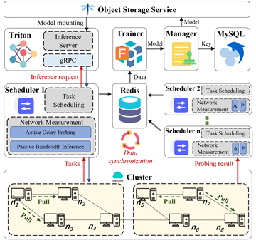
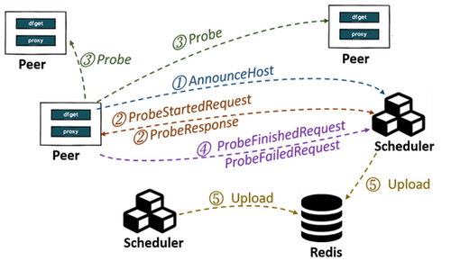
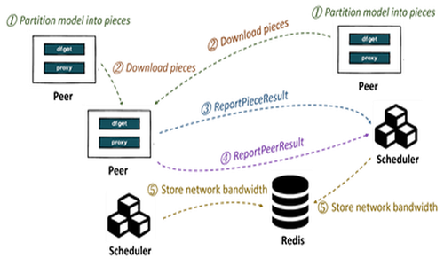
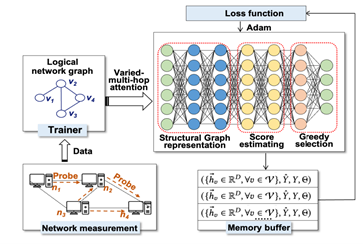

We’re excited to announce that a paper on model distribution, co-authored by researchers from Dalian University of Technology and Ant Group, has been accepted for publication in the IEEE Transactions on Networking (TON), a high-impact journal recognized by IEEE for its significant influence in networking and systems research. 🎉🎉🎉

## Title

Empowering Dragonfly: A Lightweight and Scalable Distribution System for Large Models with High Concurrency

## Link

[IEEE Xplore](https://ieeexplore.ieee.org/document/11152005)

## Authors

Zhou Xu, Dalian University of Technology
Lizhen Zhou, Dalian University of Technology
Zichuan Xu, Dalian University of Technology
Wenbo Qi, Ant Group
Jinjing Ma, Ant Group
Song Yan, Ant Group
Yuan Yang, Alibaba Cloud
Min Huang, Dalian University of Technology
Haomiao Jiang, Dalian University of Technology
Qiufen Xia, Dalian University of Technology
Guowei Wu, Dalian University of Technology

## Background

With the continuous evolution of Artificial Intelligence Generated Content (AIGC) technologies, the distribution of container images and large models has become a challenge. Traditional centralized registry often faces single-node bandwidth bottlenecks during peak concurrent downloads, leading to severe network congestion and excessively long download times. Conversely, while Content Delivery Networks (CDNs) or private links can mitigate some hotspot loads, they fail to fully leverage the idle bandwidth of cluster nodes and introduce additional overhead. Consequently, cloud-native applications and AI services urgently need a dynamic, efficient, scalable, and non-intrusive distribution system for large-scale images and models, compatible with mainstream formats like OCI spec.

## Design

### Key Design 1: A Lightweight Network Measurement Mechanism

- **Network Latency Probing:** Each peer proactively sends probes to a designated set of targets within the cluster, as assigned by the Scheduler, to measure end-to-end latency. This approach ensures efficient probing of all peers in the cluster while operating under constrained network resources.

- **Network Bandwidth Prediction:** We employ non-intrusive measurements by analyzing historical loading data to estimate network bandwidth with reasonable accuracy. When a peer initiates a model loading request, it pulls pieces of the model from other peers and reports the size and loading time of these pieces to the Scheduler. The Scheduler leverages historical data from successful loading operations to predict bandwidth.

### Key Design 2: A Scalable Scheduling Framework

- **Separating Inference from Scheduling:** To ensure the Scheduler has adequate resources for task scheduling, we separate inference services from scheduling operations.

- **Real-Time Data Synchronization:** To maintain data consistency across multiple schedulers, we store and continuously update end-to-end latency information for the entire network, as collected by the lightweight network measurement module.

### Key Design 3: An Asynchronous Model Training and Inference

- **Asynchronous Model Training:**  Asynchronous training and inference are facilitated through collaboration between the Trainer and Triton. The Scheduler retrieves end-to-end latency and bandwidth predictions from Redis and sends them to the Trainer, which then initiates training and persists the updated model. Triton periodically polls for updates and loads the new model for inference in the subsequent cycle.

- **Graph Learning Algorithm:**  This algorithm aggregates feature parameters from peers, modeling each sample as an interaction between a peer and its parent. It also incorporates information from neighboring peers to capture similarities within the cluster, thereby improving the accuracy of bandwidth predictions.

## Summary

This paper presents an efficient and scalable peer-to-peer (P2P) model distribution system that optimizes resource utilization and ensures data synchronization through a multi-layered architecture. 

- First, it introduces a lightweight network measurement mechanism that probes latency and infers bandwidth to predict real-time network conditions. 

- Second, it proposes a scalable scheduling framework that separates inference services from scheduling, enhancing both resource efficiency and system responsiveness. 

- Finally, it designs the Trainer module, which integrates asynchronous model training and inference with graph learning algorithms to support incremental learning for bursty tasks.

## Github Repository

