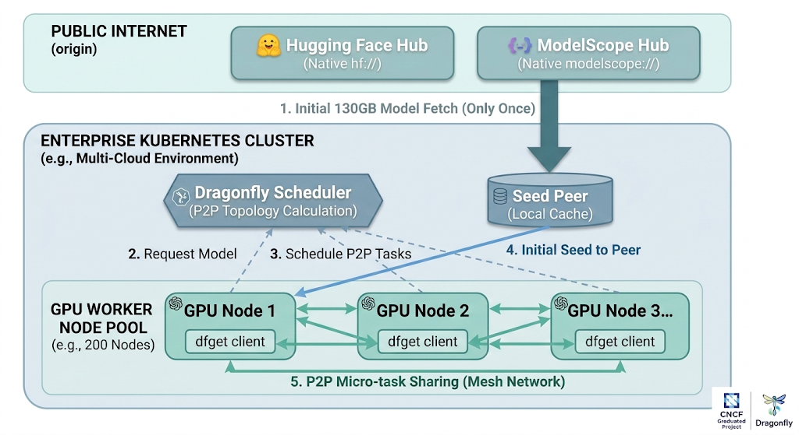

_Author: [Pavan Madduri](https://github.com/pmady), Senior Cloud Platform Engineer & CNCF Golden Kubestronaut_

Dragonfly now natively speaks `hf://` and `modelscope://` — turning the world's two largest model hubs into P2P-accelerated sources for enterprise AI infrastructure.

<!-- truncate -->

## The Problem: AI Model Distribution Is Broken at Scale

The AI industry has a dirty secret: downloading models is painfully slow and absurdly wasteful.

Consider a typical scenario. Your ML platform team manages a Kubernetes cluster with 200 GPU nodes. A new version of a 70B parameter model drops — say, DeepSeek-V3 at ~130 GB. Every node needs a local copy. That's **26 TB of data** pulled from a single model hub, all funneling through the same origin servers, the same egress bandwidth, and the same rate limits.

The numbers get worse:

- **Hugging Face Hub** serves over 1 million models, with individual files regularly exceeding 10 GB (safetensors, GGUF quantizations).
- **ModelScope Hub** hosts over 10,000 models — including some of the largest Chinese-origin models like Qwen, Yi, and inclusionAI's Ling series — serving a rapidly growing global user base.
- **Git LFS**, which backs large file storage on these platforms, was never designed for mass fan-out distribution.
- **Rate limits** throttle unauthenticated requests; even authenticated tokens hit ceilings under burst traffic.
- **Network costs** compound — every byte crosses the internet boundary N times instead of once.

Existing workarounds — NFS mounts, pre-baked container images, manual S3 mirrors — all introduce operational complexity, stale-model risk, or storage overhead.

What if the infrastructure itself could solve this? What if downloading a model to the 200th node was as fast as downloading it to the first — regardless of which model hub it came from?

That's exactly what the new **`hf://` and `modelscope://` protocol support in Dragonfly** delivers.

## What Is Dragonfly?

[Dragonfly](https://d7y.io/) is a CNCF Graduated project that provides a P2P-based file distribution system. Originally built for container image distribution at Alibaba-scale (processing billions of requests daily), Dragonfly turns every downloading node into a seed for its peers.

**Core Architecture:**



_Figure 1: End-to-end flow of the P2P model distribution in Dragonfly. The Seed Peer fetches the model from the origin hub once (Step 1), the Dragonfly Scheduler computes the P2P topology (Step 3), and GPU nodes share pieces via micro-task distribution (Step 5) — reducing origin traffic from 26 TB to ~130 GB across a 200-node cluster._

The magic: Dragonfly splits files into small pieces and distributes them across the P2P mesh. The origin (Hugging Face Hub or ModelScope Hub) is hit once by the seed peer. Critically, the Seed Peer does not need to finish downloading the entire model before sharing with other peers — as soon as any single piece is downloaded, it can be shared immediately. This **piece-based streaming download** means distribution begins in parallel with the initial fetch, dramatically reducing total transfer time. For a 130 GB model across 200 nodes, origin traffic drops from 26 TB to ~130 GB — a **99.5% reduction**.

Until now, Dragonfly supported HTTP/HTTPS, S3, GCS, Azure Blob Storage, Alibaba OSS, Huawei OBS, Tencent COS, and HDFS backends. But the two largest sources of AI model artifacts — **Hugging Face** and **ModelScope** — required users to pre-resolve hub URLs into raw HTTPS links, losing authentication context, revision pinning, and repository structure awareness.

**Not anymore.**

## Introducing Native Model Hub Protocols in Dragonfly

With two new backends merged into the Dragonfly client, `dfget` (Dragonfly's download tool) now natively understands both Hugging Face and ModelScope URLs. No proxies. No URL rewriting. No wrapper scripts.

### The `hf://` Protocol — Hugging Face Hub

Merged via [PR #1665](https://github.com/dragonflyoss/client/pull/1665), this backend adds first-class support for downloading from the world's largest open-source model repository.

**URL Format:**

```text
hf://[<repository_type>/]<owner>/<repository>[/<path>]
```

**Components:**

| Component | Required | Description | Default |
| --------- | -------- | ----------- | ------- |
| `repository_type` | No | `models`, `datasets`, or `spaces` | `models` |
| `owner/repository` | Yes | Repository identifier (e.g., `deepseek-ai/DeepSeek-R1`) | — |
| `path` | No | File path within the repo | Entire repo |

**Usage Examples:**

```bash
# Download a single model file with P2P acceleration
dfget hf://deepseek-ai/DeepSeek-R1/model.safetensors \
  -O /models/DeepSeek-R1/model.safetensors

# Download an entire repository recursively
dfget hf://deepseek-ai/DeepSeek-R1 \
  -O /models/DeepSeek-R1/ -r

# Download a specific dataset
dfget hf://datasets/huggingface/squad/train.json \
  -O /data/squad/train.json

# Access private repositories with authentication
dfget hf://owner/private-model/weights.bin \
  -O /models/private/weights.bin \
  --hf-token=hf_xxxxxxxxxxxxx

# Pin to a specific model version
dfget hf://deepseek-ai/DeepSeek-R1/model.safetensors --hf-revision v2.0 \
  -O /models/DeepSeek-R1/model.safetensors
```

### The `modelscope://` Protocol — ModelScope Hub

Merged via [PR #1673](https://github.com/dragonflyoss/client/pull/1673), this backend brings the same P2P-accelerated experience to [ModelScope Hub](https://modelscope.cn) — Alibaba's open model platform hosting thousands of models, with particularly strong coverage of Chinese-origin LLMs and multimodal models.

**URL Format:**

```text
modelscope://[<repo_type>/]<owner>/<repo>[/<path>]
```

**Components:**

| Component | Required | Description | Default |
| --------- | -------- | ----------- | ------- |
| `repo_type` | No | `models` or `datasets` | `models` |
| `owner/repo` | Yes | Repository identifier (e.g., `deepseek-ai/DeepSeek-R1`) | — |
| `path` | No | File path within the repo | Entire repo |

**Usage Examples:**

```bash
# Download a model repository with P2P acceleration
dfget modelscope://deepseek-ai/DeepSeek-R1 \
  -O /models/DeepSeek-R1/ -r

# Download a single file
dfget modelscope://deepseek-ai/DeepSeek-R1/config.json \
  -O /models/DeepSeek-R1/config.json

# Download with authentication for private repos
dfget modelscope://deepseek-ai/DeepSeek-R1/config.json \
  -O /tmp/config.json --ms-token=<token>

# Download a dataset
dfget modelscope://datasets/damo/squad-zh/train.json \
  -O /data/squad-zh/train.json

# Download from a specific revision
dfget modelscope://deepseek-ai/DeepSeek-R1/config.json --ms-revision v2.0 \
  -O /models/DeepSeek-R1/config.json
```

## Under the Hood: Technical Deep Dive

Both implementations live in the Dragonfly Rust client as new backend modules. Here's how they work at the systems level.

### 1. Pluggable Backend Architecture

Dragonfly uses a **pluggable backend system**. Each URL scheme (`http`, `s3`, `gs`, `hf`, `modelscope`, etc.) maps to a backend that implements the `Backend` trait:

```rust
#[tonic::async_trait]
pub trait Backend {
    fn scheme(&self) -> String;
    async fn stat(&self, request: StatRequest) -> Result<StatResponse>;
    async fn get(&self, request: GetRequest) -> Result<GetResponse<Body>>;
    async fn put(&self, request: PutRequest) -> Result<PutResponse>;
    async fn exists(&self, request: ExistsRequest) -> Result<bool>;
}
```

Both `hf` and `modelscope` backends are registered as **builtin backends** in the `BackendFactory`, sitting alongside HTTP, object storage, and HDFS:

```rust
// Hugging Face backend
self.backends.insert(
    "hf".to_string(),
    Box::new(hugging_face::HuggingFace::new(self.config.clone())?),
);

// ModelScope backend
self.backends.insert(
    "modelscope".to_string(),
    Box::new(modelscope::ModelScope::new()?),
);
```

This means both schemes are available everywhere `dfget` or the Dragonfly daemon operates — no additional configuration needed.

### 2. URL Parsing: Same Grammar, Different Conventions

Both backends share the same URL grammar — `scheme://[type/]owner/repo[/path]` — but respect each platform's conventions:

| Aspect | Hugging Face (`hf://`) | ModelScope (`modelscope://`) |
| ------ | -------------------- | ------------------------- |
| Repository types | models, datasets, **spaces** | models, datasets |
| Download API | `huggingface.co/<repo>/resolve/<rev>/<path>` | `modelscope.cn/models/<repo>/resolve/<rev>/<path>` |
| File listing API | `huggingface.co/api/models/<repo>?revision=<rev>` | `modelscope.cn/api/v1/models/<repo>/repo/files?Revision=<rev>&Recursive=true` |
| API response format | Flat JSON with `siblings` array | Structured JSON with `Code`, `Data`, `Message` envelope |
| Large file handling | Git LFS with HTTP redirects | Direct API download |

### 3. Two Download Modes (Both Backends)

**Single File Mode** (e.g., `hf://owner/repo/file.bin` or `modelscope://owner/repo/file.bin`):

1. Parse URL → extract file path
2. Build platform-specific download URL
3. `stat()` performs a HEAD request to get content length and validate existence
4. `get()` streams the file content through Dragonfly's piece-based P2P network
5. For HF: Git LFS redirects are handled transparently by the HTTP client

**Repository Mode** (e.g., `hf://owner/repo -r` or `modelscope://owner/repo -r`):

1. Parse URL → no file path present
2. Call platform-specific API to list repository files
3. Deserialize the repository metadata into a file listing
4. For each file, construct a **scheme-native URL** (not raw HTTPS), preserving backend semantics
5. Dragonfly's recursive download engine processes each file through the P2P mesh

This is a crucial design decision: **recursive downloads emit `hf://` or `modelscope://` URLs back into the download pipeline**, not raw HTTPS URLs. This preserves authentication context and ensures every file in the recursive download goes through the correct backend — maintaining token forwarding and URL semantics.

### 4. Platform-Specific API Integration

**Hugging Face** uses a resolve-based download pattern where the server may return the file directly or redirect to Git LFS storage for large model files. The `reqwest` HTTP client follows these redirects automatically, making LFS handling completely transparent.

**ModelScope** uses a structured REST API with explicit endpoints for file listing (`/repo/files`). The API returns a JSON envelope with `Code`, `Data`, and `Message` fields. The file listing endpoint supports recursive traversal natively via the `Recursive=true` parameter, returning structured `RepoFile` objects with name, path, type, and size metadata.

### 5. Authentication

Both backends support token-based authentication via CLI flags and bearer token headers:

```bash
# Hugging Face authentication
dfget hf://owner/private-model/weights.bin \
  --hf-token=hf_xxxxxxxxxxxxx

# ModelScope authentication
dfget modelscope://owner/private-model/config.json \
  --ms-token=<token>
```

Tokens propagate through all operations (`stat`, `get`, `exists`), enabling access to private repositories and gated models on both platforms.

## Real-World Impact: Where This Matters

### 1. Multi-Node GPU Cluster Model Deployment

In large-scale enterprise environments — the kind I architect and operate daily — distributing a 130 GB model like `meta-llama/Llama-2-70b` across 50 GPU nodes creates a debilitating network bottleneck. I've seen this pattern cripple deployment velocity firsthand.

**Before:** Each of your 50 GPU nodes downloads the model independently.

- Total bandwidth: **6.5 TB** from the model hub
- Time: Limited by origin server throughput and rate limits
- Cost: Full internet egress x 50

**After:** Seed peer fetches once, P2P distributes across the cluster.

- Origin bandwidth: **~130 GB** (once)
- Time: Near-wire-speed from local peers after initial seed
- Cost: Minimal egress, heavy intra-cluster traffic (free)

When you're managing self-healing, multi-cloud Kubernetes clusters at enterprise scale, this kind of origin traffic reduction isn't an optimization — it's a prerequisite for operational sanity.

### 2. Multi-Hub Model Sourcing

Teams increasingly source models from multiple hubs. A team might use Llama from Hugging Face and Qwen from ModelScope. With both backends built in, Dragonfly becomes the **unified distribution layer** regardless of origin:

```bash
# From Hugging Face
dfget hf://meta-llama/Llama-2-7b -O /models/llama2/ -r

# From ModelScope
dfget modelscope://qwen/Qwen-7B -O /models/qwen/ -r
```

Same P2P mesh. Same caching layer. Same operational model. Different origins.

### 3. CI/CD for ML Pipelines

Model evaluation pipelines that spin up ephemeral runners to test against specific model versions benefit from revision pinning:

```bash
# Deterministic model versions in CI — from either hub
dfget hf://org/model --hf-revision abc123def -O /workspace/model/ -r
dfget modelscope://org/model --ms-revision v1.0 -O /workspace/model/ -r
```

Combined with Dragonfly's caching layer, repeated CI runs across different runners pull from local P2P cache instead of remote hubs. In the enterprise CI/CD systems I've built, this eliminates one of the last remaining sources of non-deterministic pipeline failures: flaky model downloads.

### 4. Cross-Platform Model Sourcing

For organizations utilizing global infrastructure, Hugging Face serves as the primary hub. Dragonfly's dual-hub support enables a **single distribution platform** that routes to the optimal origin:

```bash
# Global clusters pull from Hugging Face
dfget hf://deepseek-ai/DeepSeek-R1 -O /models/DeepSeek-R1/ -r
```

### 5. Air-Gapped and Edge Deployments

For environments with limited or no internet access — common in regulated enterprise and financial services infrastructure — Dragonfly's seed peer can be pre-loaded from an internet-connected staging area. Once seeded, internal nodes use P2P to distribute models without any external connectivity.

### 6. Dataset Distribution for Training

Large-scale training jobs often need the same dataset replicated across data-parallel workers:

```bash
# From Hugging Face
dfget hf://datasets/allenai/c4/en/train-00000-of-01024.json.gz \
  -O /data/c4/train-00000.json.gz

# From ModelScope
dfget modelscope://datasets/damo/squad-zh/train.json \
  -O /data/squad-zh/train.json
```

P2P distribution turns O(N) origin fetches into O(1) origin + O(log N) P2P propagation.

## Comparison: Why Not Just Use Platform CLIs?

| Capability | `huggingface-cli` / `modelscope` CLI | `dfget hf://` / `dfget modelscope://` |
| --- | --- | --- |
| Single-source download | Yes | Yes |
| P2P acceleration | No | **Yes** |
| Piece-level parallelism | No | **Yes** |
| Cluster-wide caching | No | **Yes** |
| Bandwidth reduction (N nodes) | 1x per node | **~1x total** |
| Multi-hub unified interface | No (separate CLIs) | **Yes (single tool)** |
| Private repo auth | Yes | Yes |
| Revision pinning | Yes | Yes |
| Recursive download | Yes | Yes |
| Kubernetes-native integration | No | **Yes (DaemonSet)** |
| Pluggable backend system | No | **Yes** |

Platform-specific CLIs are excellent for individual developer workflows. The native protocol support in Dragonfly is for **infrastructure-scale** model distribution.

## Getting Started

### Prerequisites

- Dragonfly cluster deployed (scheduler + seed peer + peer on nodes)
- `dfget` CLI available on target machines

### Quick Start

**1. Install Dragonfly** (via Helm for Kubernetes):

```bash
helm repo add dragonfly https://dragonflyoss.github.io/helm-charts/
helm install dragonfly dragonfly/dragonfly \
  --namespace dragonfly-system --create-namespace
```

**2. Download models with P2P from either hub:**

```bash
# From Hugging Face
dfget hf://deepseek-ai/DeepSeek-R1/model.safetensors -O ./model.safetensors

# From ModelScope
dfget modelscope://deepseek-ai/DeepSeek-R1/config.json -O ./config.json

# Recursive repository download (works with both)
dfget hf://deepseek-ai/DeepSeek-R1 -O ./DeepSeek-R1/ -r --hf-token=$HF_TOKEN
dfget modelscope://deepseek-ai/DeepSeek-R1 -O ./DeepSeek-R1/ -r --ms-token=$MS_TOKEN
```

**3. Verify P2P is working:**

```bash
# Check Dragonfly daemon logs for peer transfer activity
journalctl -u dfdaemon | grep "peer task"
```

## What's Next

These two backends are just the beginning. The architecture is designed for extensibility — adding support for additional model hubs follows the same pattern: implement the `Backend` trait, register the scheme, and the entire P2P mesh instantly serves the new source. Potential future enhancements include:

- **Intelligent pre-warming**: Automatically seed popular models across clusters based on usage patterns
- **Deduplication across revisions**: Share common pieces between model versions (e.g., shared tokenizer files)
- **Cross-hub deduplication**: When the same model exists on both Hugging Face and ModelScope, share pieces across download sources
- **Integration with Kubernetes model serving frameworks**: Native support in KServe, Triton Inference Server, and vLLM for P2P model loading
- **Bandwidth-aware scheduling**: Prioritize P2P transfers based on GPU node topology and network proximity

## Contributing

The PRs that brought these features to life:

- **[dragonflyoss/client#1665](https://github.com/dragonflyoss/client/pull/1665)** — Rust implementation of the `hf://` backend (Hugging Face)
- **[dragonflyoss/client#1673](https://github.com/dragonflyoss/client/pull/1673)** — Rust implementation of the `modelscope://` backend (ModelScope)
- **[dragonflyoss/d7y.io#386](https://github.com/dragonflyoss/d7y.io/pull/386)** — Documentation for the `hf://` protocol in dfget
- **[dragonflyoss/d7y.io#396](https://github.com/dragonflyoss/d7y.io/pull/396)** — Documentation for the `modelscope://` protocol in dfget

Dragonfly is a CNCF Graduated project and welcomes contributions. If you're working on AI infrastructure and have ideas for improving model distribution, check out the [Dragonfly GitHub repository](https://github.com/dragonflyoss/dragonfly) and join the community.

## Conclusion

The AI industry's model distribution problem doesn't need another wrapper script or another S3 bucket. It needs infrastructure-level P2P distribution with first-class understanding of where models live — whether that's Hugging Face, ModelScope, or the next model hub that emerges.

Dragonfly now speaks both `hf://` and `modelscope://` natively: authenticated, revision-aware, P2P-accelerated paths from the world's two largest model hubs to every node in your cluster. One origin fetch per hub. Peer-distributed propagation. No operational overhead.

The models are getting bigger. The clusters are getting larger. The hubs are multiplying. The distribution layer needs to keep up.

**Now it can.**

## Links

### Dragonfly community

- Website: [https://d7y.io/](https://d7y.io/)
- Github Repo: [https://github.com/dragonflyoss/dragonfly](https://github.com/dragonflyoss/dragonfly)
- Slack Channel: [#dragonfly](https://cloud-native.slack.com/messages/dragonfly/) on [CNCF Slack](https://slack.cncf.io/)
- Discussion Group: [dragonfly-discuss@googlegroups.com](mailto:dragonfly-discuss@googlegroups.com)
- Twitter: [@dragonfly\_oss](https://twitter.com/dragonfly_oss)

### Hugging Face

- Website: [https://huggingface.co/](https://huggingface.co/)
- Github Repo: [https://github.com/huggingface/huggingface\_hub](https://github.com/huggingface/huggingface_hub)
- Document: [https://huggingface.co/docs](https://huggingface.co/docs)

### ModelScope

- Website: [https://modelscope.cn/](https://modelscope.cn/)
- Github Repo: [https://github.com/modelscope/modelscope](https://github.com/modelscope/modelscope)
- Document: [https://modelscope.cn/docs](https://modelscope.cn/docs)
