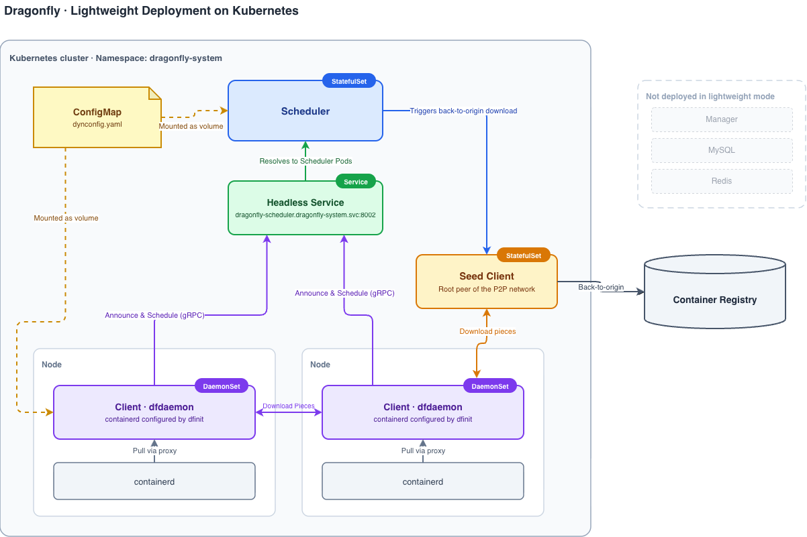

_Author:_

- _Wenbo Qi(Gaius), Dragonfly Maintainer_

<!-- truncate -->

[Dragonfly](https://d7y.io) speeds up file and container image distribution with P2P technology, but a full installation deploys several components and their dependencies. Besides the Scheduler, Seed Client and Client that actually move the data, you need a Manager for dynamic configuration, with MySQL and Redis behind it. That is a reasonable footprint for a platform team running Dragonfly across a fleet of clusters. It is a lot to ask of someone who has one cluster and whose only problem is that image pulls are overloading the registry.

Dragonfly now supports a lightweight deployment that removes the Manager, and with it MySQL and Redis. The Scheduler is the only coordination component left. You install three components with one Helm command. This post explains how it works and walks through trying it on a [kind](https://kind.sigs.k8s.io/) cluster.

## What the Manager was doing for you

The Manager is Dragonfly's control plane. It hosts the web console, exposes an Open API for integrations such as registry-triggered preheating, manages relationships across multiple P2P clusters, and distributes dynamic configuration to Schedulers and Clients. It stores its data in MySQL and uses Redis for caching and for distributing asynchronous jobs such as preheating.

None of those resources are wasted at fleet scale. But if you operate a single cluster and only want the P2P distribution, the piece you actually depend on is the last one, dynamic configuration. And the dynamic configuration for one cluster is, in practice, a page of YAML with scheduling limits, blocklists, and a way for Clients to find Schedulers. Running a database to serve a page of YAML is a hard sell, so we decoupled the Scheduler and Client from the Manager. If no Manager address is configured, they run without one.

## How it works

The lightweight deployment replaces the Manager with two mechanisms that Kubernetes already gives you, a ConfigMap and a headless Service.



**Dynamic configuration from a ConfigMap.** When `manager.addr` is not set, the Scheduler and Client load dynamic configuration from a local `dynconfig.yaml` file (`/etc/dragonfly/dynconfig.yaml` by default), which the Helm chart mounts as a ConfigMap. If the file does not exist, it is generated with default values on startup, so you do not need to write one by hand to get going. The Scheduler's `dynconfig.yaml` carries cluster-level scheduling parameters:

```yaml
# seedPeerClusterConfig is the seed peer cluster configuration.
seedPeerClusterConfig:
  # loadLimit is the seed peer concurrent upload limit.
  loadLimit: 2000

# schedulerClusterConfig is the scheduler cluster configuration.
schedulerClusterConfig:
  # candidateParentLimit is the candidate parent limit for scheduling.
  candidateParentLimit: 3
  # filterParentLimit is the filter parent limit for scheduling.
  filterParentLimit: 15

# schedulerClusterClientConfig is the client configuration.
schedulerClusterClientConfig:
  # loadLimit is the peer concurrent upload limit.
  loadLimit: 200
```

The Scheduler and Client re-read the file periodically (every minute by default, controlled by `refreshInterval`), so an edit to the ConfigMap reaches running Pods within one refresh interval without restarts. The same knobs are exposed as Helm values (`scheduler.dynconfig`, `seedClient.dynconfig` and `client.dynconfig`), which keeps the whole configuration declarative and friendly to GitOps.

**Scheduler discovery through a headless Service.** In a Manager-based deployment, Clients ask the Manager for the list of available Schedulers. In the lightweight deployment, the Client's `dynconfig.yaml` points at the Scheduler's headless Service instead:

```yaml
scheduler:
  # addr is the address of the scheduler headless service with port,
  # resolved via DNS to discover all scheduler addresses.
  addr: dragonfly-scheduler.dragonfly-system.svc.cluster.local:8002
```

The Client's dfdaemon process resolves that name via DNS to get the full set of Scheduler Pod IPs, health-checks each one, and filters out anything unhealthy. Scale the Scheduler StatefulSet up or down and Clients pick up the change through DNS, just as they would have from the Manager.

DNS is not the only option. If your Schedulers sit at fixed addresses, for example outside the cluster, you can list them directly with `scheduler.addrs`, and a non-empty list takes precedence over DNS resolution:

```yaml
scheduler:
  # addrs is a static list of scheduler addresses with port. When non-empty,
  # it takes precedence over addr.
  addrs:
    - 192.168.1.10:8002
    - 192.168.1.11:8002
```

Three components land in the cluster. The Scheduler and Seed Client each run as a StatefulSet, with the Seed Client acting as the root peer of the P2P network that fetches from the origin, and the Client runs as a DaemonSet on every node, where `dfinit` rewrites the containerd configuration so that image pulls flow through the local Client. There is no database to back up and no migration to run on upgrade. The only state anywhere in the system is the piece cache on disk, which can always be rebuilt from the origin.

## Choosing a deployment model

Dragonfly supports three deployment models, and the available features depend on which components are deployed. The Helm chart disables the Manager, MySQL and Redis by default, so lightweight is the standard starting point.

**Lightweight deployment.** Deploy only the Scheduler, Seed Client and Client. This is the recommended model for most scenarios that only need the P2P distribution capabilities, such as small Kubernetes clusters, edge environments, or CI systems. Task distribution and preheating via `dfctl` both work here.

**Lightweight deployment with Redis.** Deploy Redis in addition to the lightweight deployment and configure the Scheduler's `database.redis.addrs` to use it. The persistent task and persistent cache task features store their metadata in Redis, so they become available in this model. With the Helm chart, set `redis.enable: true` to deploy Redis, or point `externalRedis.addrs` at a Redis you already run.

**Deployment with Manager.** Deploy the Manager, with MySQL and Redis behind it, in addition to the other three components. The Manager provides the control plane, which covers the web console, Open API, preheating jobs and multi-cluster management.

The feature matrix from the [deployment models documentation](https://d7y.io/docs/next/operations/deployment/deployment-models/) summarizes the differences:

| Feature                                                                           | Lightweight | Lightweight with Redis | With Manager |
| --------------------------------------------------------------------------------- | ----------- | ---------------------- | ------------ |
| [Blocklist](https://d7y.io/docs/next/advanced-guides/blocklist/)                  | Yes         | Yes                    | Yes          |
| [Task](https://d7y.io/docs/next/concepts/task/)                                   | Yes         | Yes                    | Yes          |
| [Persistent task](https://d7y.io/docs/next/concepts/persistent-task/)             | No          | Yes                    | Yes          |
| [Persistent cache task](https://d7y.io/docs/next/concepts/persistent-cache-task/) | No          | Yes                    | Yes          |
| [Preheat via dfctl](https://d7y.io/docs/next/advanced-guides/preheat/)            | Yes         | Yes                    | Yes          |
| Preheat via Open API                                                              | No          | No                     | Yes          |
| Preheat via web console                                                           | No          | No                     | Yes          |
| [Web console](https://d7y.io/docs/next/advanced-guides/web-console/)              | No          | No                     | Yes          |
| Open API                                                                          | No          | No                     | Yes          |
| Personal access tokens                                                            | No          | No                     | Yes          |

## Trying it on a kind cluster

Create a multi-node kind cluster:

```yaml
kind: Cluster
apiVersion: kind.x-k8s.io/v1alpha4
nodes:
  - role: control-plane
  - role: worker
  - role: worker
```

```shell
kind create cluster --config kind-config.yaml
```

Pull the Dragonfly images and load them into the cluster:

```shell
docker pull dragonflyoss/scheduler:latest
docker pull dragonflyoss/client:latest
docker pull dragonflyoss/dfinit:latest

kind load docker-image dragonflyoss/scheduler:latest
kind load docker-image dragonflyoss/client:latest
kind load docker-image dragonflyoss/dfinit:latest
```

The entire Helm values file fits on one screen. Note that there is no `manager`, `mysql` or `redis` section, because all three are disabled by default.

```yaml
scheduler:
  image:
    repository: dragonflyoss/scheduler
    tag: latest
  metrics:
    enable: true

seedClient:
  image:
    repository: dragonflyoss/client
    tag: latest
  metrics:
    enable: true

client:
  image:
    repository: dragonflyoss/client
    tag: latest
  metrics:
    enable: true
  dfinit:
    enable: true
    image:
      repository: dragonflyoss/dfinit
      tag: latest
    config:
      containerRuntime:
        containerd:
          configPath: /etc/containerd/config.toml
          proxyAllRegistries: true
```

Install:

```shell
helm repo add dragonfly https://dragonflyoss.github.io/helm-charts/
helm install --wait --create-namespace --namespace dragonfly-system dragonfly dragonfly/dragonfly -f charts-config.yaml
```

Four Pods come up, a Client on each worker node plus one Scheduler and one Seed Client.

```shell
$ kubectl get po -n dragonfly-system
NAME                      READY   STATUS    RESTARTS   AGE
dragonfly-client-dhqfc    1/1     Running   0          3m
dragonfly-client-h58x6    1/1     Running   0          3m
dragonfly-scheduler-0     1/1     Running   0          3m
dragonfly-seed-client-0   1/1     Running   0          3m
```

Pull an image on a worker node and it goes through Dragonfly:

```shell
docker exec -i kind-worker /usr/local/bin/crictl pull alpine:3.19
```

To confirm that Dragonfly served the pull, find the task in the local Client's logs:

```shell
# Find the client pod on kind-worker.
export POD_NAME=$(kubectl get pods --namespace dragonfly-system -l "app=dragonfly,release=dragonfly,component=client" -o=jsonpath='{.items[?(@.spec.nodeName=="kind-worker")].metadata.name}' | head -n 1)

# Find the task id for the alpine image.
export TASK_ID=$(kubectl -n dragonfly-system exec ${POD_NAME} -- sh -c "grep -hoP 'library/alpine.*task_id=\"\K[^\"]+' /var/log/dragonfly/dfdaemon/* | head -n 1")

# Check that the download succeeded through Dragonfly.
kubectl -n dragonfly-system exec -it ${POD_NAME} -- sh -c "grep ${TASK_ID} /var/log/dragonfly/dfdaemon/* | grep 'download task succeeded'"
```

## Preheating still works

Preheating, which warms the P2P cache ahead of a rollout, sounds like a control-plane feature, but it does not actually require the Manager. The `dfctl` CLI calls the Scheduler's gRPC interface directly and triggers Seed Clients or Clients to download the content:

```shell
dfctl task preheat oci://docker.io/library/alpine:3.19 \
  --scheduler-endpoint http://dragonfly-scheduler.dragonfly-system.svc.cluster.local:8002 \
  --scope all_seed_peers
```

It handles both images (`oci://` URLs, with `--username`/`--password` for private registries) and plain files (`https://` URLs), and `--scope` controls whether the preheat goes to a single Seed Client, all Seed Clients (the default), or every Client in the cluster. Since `dfctl` ships in the Client image, running a preheat inside Kubernetes is a `kubectl exec` away. See the [preheat guide](https://d7y.io/docs/next/advanced-guides/preheat/) for details.

## Injecting Dragonfly into application Pods

Registry mirroring through containerd covers image pulls, but applications download other things too, such as models, datasets and build artifacts. For those, Dragonfly provides [dragonfly-injector](https://github.com/dragonflyoss/dragonfly-injector), a Kubernetes mutating admission webhook that injects the Dragonfly Client binaries (`dfget`, `dfcache`, `dfstore`, `dfdaemon`) and the dfdaemon socket mount into application Pods, so a Pod can download files through the P2P network without rebuilding its container image. It works with the lightweight deployment and does not require the Manager.

The injector needs [cert-manager](https://cert-manager.io/) to manage TLS certificates for the webhook server. Once cert-manager is installed, enable the injector by adding an `injector` section to the same values file:

```yaml
injector:
  enable: true
  replicas: 2
  image:
    registry: docker.io
    repository: dragonflyoss/injector
    tag: latest
  initContainerImage:
    registry: docker.io
    repository: dragonflyoss/client
    tag: latest
  certManager:
    enable: true
```

Opting a Pod in is a matter of annotations:

```yaml
apiVersion: v1
kind: Pod
metadata:
  name: test-pod
  annotations:
    dragonfly.io/inject: 'true'
    dragonfly.io/init-container-image: 'dragonflyoss/client:latest'
spec:
  containers:
    - name: app
      image: debian:stable-slim
      command: ['/bin/sh', '-c', 'sleep 3600']
```

On admission, the webhook adds an init container that copies the CLI tools into a shared volume and mounts the Unix socket of the dfdaemon already running on the node, so the application can call `dfget` and friends directly. The full walkthrough is in [Using Dragonfly with webhook injection](https://d7y.io/docs/next/getting-started/installation/helm-charts/#using-dragonfly-with-webhook-injection).

## When you still want the Manager

The Manager remains the right choice when you are operating Dragonfly as a platform rather than as a cluster add-on, with multiple P2P clusters managed from one place, a web console for the on-call team, and preheating driven through the Open API by an external system such as a registry. Enabling it is a Helm values change (set `manager.enable`, `mysql.enable` and `redis.enable` to `true`), and the [deployment with Manager guide](https://d7y.io/docs/next/getting-started/quick-start/kubernetes/deployment-with-manager/) covers the rest. Starting lightweight does not stop you from adding the Manager later.

For everything else, three components and a ConfigMap are enough for P2P image and file distribution. The full walkthrough lives in the [lightweight deployment documentation](https://d7y.io/docs/next/getting-started/quick-start/kubernetes/lightweight-deployment/).

## Links

- Dragonfly Website: [https://d7y.io/](https://d7y.io/)
- Dragonfly Repository: [https://github.com/dragonflyoss/dragonfly](https://github.com/dragonflyoss/dragonfly)
- Dragonfly Client Repository: [https://github.com/dragonflyoss/client](https://github.com/dragonflyoss/client)
- Dragonfly Injector Repository: [https://github.com/dragonflyoss/dragonfly-injector](https://github.com/dragonflyoss/dragonfly-injector)
- Dragonfly Charts Repository: [https://github.com/dragonflyoss/helm-charts](https://github.com/dragonflyoss/helm-charts)
- Lightweight Deployment Documentation: [https://d7y.io/docs/next/getting-started/quick-start/kubernetes/lightweight-deployment/](https://d7y.io/docs/next/getting-started/quick-start/kubernetes/lightweight-deployment/)
- Slack Channel: [#dragonfly](https://cloud-native.slack.com/messages/dragonfly/) on [CNCF Slack](https://slack.cncf.io/)
