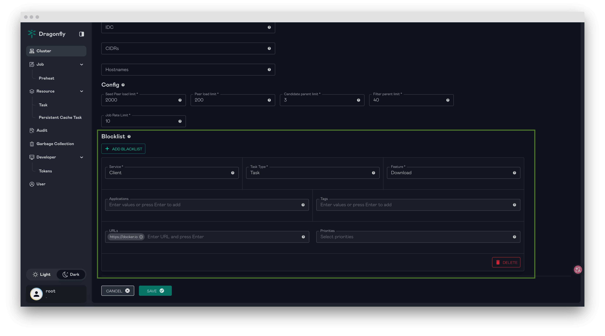

This document describes how to configure the blocklist for Dragonfly to disable specific
downloads, serving as an emergency measure to mitigate the impact of sudden abnormal requests
on the service. When a blocked download is intercepted, gRPC downloads will return a
`PermissionDenied` error code, and HTTP proxy downloads will return a `FORBIDDEN` status.

## Configure blocklist in the manager console {#configure-blocklist-in-the-manager-console}

In the deployment with Manager, the blocklist can be configured in the manager console.
The following diagram illustrates the blocklist configuration interface in the manager console.



## Configure blocklist without Manager {#configure-blocklist-without-manager}

In the lightweight deployment (without the Manager), the blocklist can be configured in the
local `dynconfig.yaml` file of the client (typically mounted as a Kubernetes ConfigMap).
`clientConfig.blockList` applies to clients running as normal peers, and
`seedClientConfig.blockList` applies to clients running as seed peers. The configuration is
refreshed within one refresh interval, refer to
[Configure Dfdaemon Dynconfig YAML File](../reference/configuration/client/dfdaemon.md#configure-dfdaemon-dynconfig-yaml-file).

Example `dynconfig.yaml` to block the downloads by application, URL regex, tag or priority:

```yaml
scheduler:
  addr: 'scheduler-headless.default.svc:8002'

clientConfig:
  blockList:
    task:
      download:
        applications: ['abnormal-app']
        urls: ['https://example.com/.*']
        tags: ['abnormal-tag']
        priorities: []
```

For the helm charts, the blocklist can be configured with the `client.dynconfig` and
`seedClient.dynconfig` values, which are rendered into the `dynconfig.yaml` ConfigMap.
