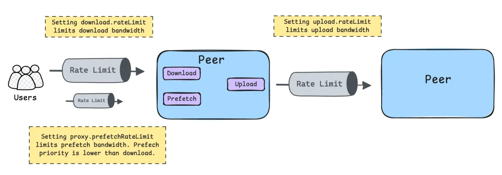

This document describes how to configure rate limiting for Dragonfly.

The following diagram illustrates the usage of download rate limit, upload rate limit,
and prefetch rate limit for the client.



### Outbound Bandwidth

Used for P2P sharing of piece bandwidth.
If the peak bandwidth is greater than the default outbound bandwidth,
you can set `rateLimit` higher to increase the upload speed.
It is recommended that the configuration be the same as the inbound bandwidth of the machine.
Please refer to [dfdaemon config](../reference/configuration/client/dfdaemon.md).

```yaml
upload:
  # -- rateLimit is the default rate limit of the upload speed in KiB/MiB/GiB per second, default is 10GiB/s.
  rateLimit: 10GiB
```

### Inbound Bandwidth

Used for back-to-source bandwidth and download bandwidth from remote peer.
If the peak bandwidth is greater than the default inbound bandwidth,
`rateLimit` can be set higher to increase download speed.
It is recommended that the configuration be the same as the outbound bandwidth of the machine.
Please refer to [dfdaemon config](../reference/configuration/client/dfdaemon.md).

```yaml
download:
  # -- rateLimit is the default rate limit of the download speed in KiB/MiB/GiB per second, default is 10GiB/s.
  rateLimit: 10GiB
```

### Prefetch Bandwidth

Download bandwidth used for prefetch requests, which can prevent network overload
and reduce competition with other active download tasks,
thereby enhancing overall system performance.
refer to [dfdaemon config](../reference/configuration/client/dfdaemon.md).

```yaml
proxy:
  # prefetchRateLimit is the rate limit of the prefetch speed in KiB/MiB/GiB per second, default is 2GiB/s.
  # The prefetch request has lower priority so limit the rate to avoid occupying the bandwidth impact other download tasks.
  prefetchRateLimit: 2GiB
```
