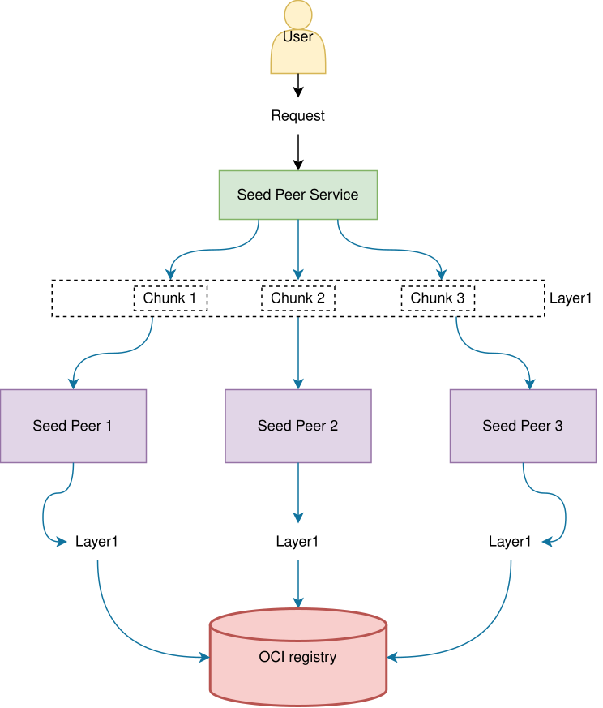
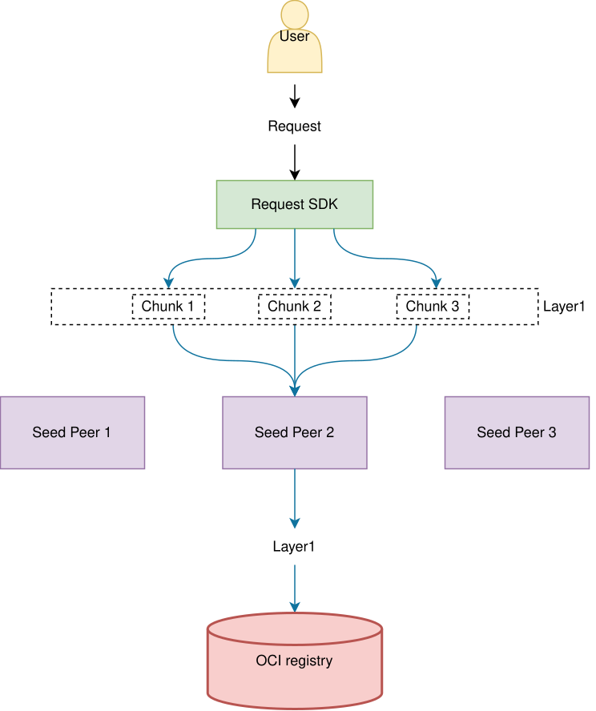

[](https://crates.io/crates/dragonfly-client-request)
[](https://pkg.go.dev/d7y.io/dragonfly-sdk/client-request/go)
[](https://github.com/dragonflyoss/dragonfly-sdk)

## Background

A SDK for routing User requests to Seed Peers using consistent hashing, replacing the previous Kubernetes Service load balancing approach.

For example, when Nydus downloads layer chunks via HTTP Range requests through Kubernetes Service load balancing:

- Same layer may be downloaded multiple times (once per Seed Peer).
- Low cache hit rate due to requests being distributed across different Seed Peers.
- Prefetch functionality cannot be effectively utilized.



### Goals

- Reduce redundant origin downloads.
- Improve chunk cache hit rate.
- Provide SDK integration with clear error handling.

## Architecture



### Task ID-Based Routing

- Generate Task ID from the request URL and metadata, identical across the Rust and Go SDKs.
- Route all chunks of the same layer to the same Seed Peer via consistent hashing.

### Consistent Hash Implementation

- **Element format**: `IP:Port`.
- **Key format**: `Task ID`.
- Uses virtual nodes for load distribution.
- Seed Peers run as StatefulSet ensuring stable IP/Port.

## SDKs

The SDKs are maintained in the [dragonfly-sdk](https://github.com/dragonflyoss/dragonfly-sdk) repository,
sending requests to remote servers via the Dragonfly P2P network, supporting streaming and buffered GET requests,
preheating files or OCI images through seed peers, and querying the distribution of OCI images in the seed peers.

| Package                                                                                                        | Description                                                                                                            |
| :------------------------------------------------------------------------------------------------------------- | :--------------------------------------------------------------------------------------------------------------------- |
| [dragonfly-client-request (Rust)](https://github.com/dragonflyoss/dragonfly-sdk/tree/main/client-request/rust) | Request library for the Dragonfly client, published on [crates.io](https://crates.io/crates/dragonfly-client-request). |
| [client-request (Go)](https://github.com/dragonflyoss/dragonfly-sdk/tree/main/client-request/go)               | Go implementation of the request library, generating identical task ids and seed peer selections as the Rust crate.    |

## Usage

### Rust

Add the dependency to your `Cargo.toml`:

```toml
[dependencies]
dragonfly-client-request = "1.6.1"
```

Send a GET request via the Dragonfly and process the response body as a stream:

```rust
use dragonfly_client_request::{GetRequest, Proxy, Request};
use futures::TryStreamExt;

let proxy = Proxy::builder()
    .scheduler_endpoint("http://127.0.0.1:8002".to_string())
    .build()
    .await?;

let response = proxy
    .get(&GetRequest {
        url: "https://example.com/file.txt".to_string(),
        ..Default::default()
    })
    .await?;

// The body is a stream of zero-copy `Bytes` chunks.
let mut body = response.body.unwrap();
while let Some(chunk) = body.try_next().await? {
    // Consume the chunk...
}
```

Or write the response body directly into a buffer for smaller or fixed-size responses:

```rust
use bytes::BytesMut;

let mut buf = BytesMut::new();
let response = proxy
    .get_into(
        &GetRequest {
            url: "https://example.com/file.txt".to_string(),
            ..Default::default()
        },
        &mut buf,
    )
    .await?;
```

Preheat with multiple replicas and scatter downloads across them. Preheating
writes the file to the given number of distinct seed peers, and downloading
scatters each request across those replicas by picking a random one, retrying
on the others up to the max retries. Preheating fails when the available seed
peers are fewer than the replicas, while downloading clamps the replicas to
the available seed peers. The default replicas is 2:

```rust
use dragonfly_client_request::PreheatRequest;

proxy
    .preheat(&PreheatRequest {
        url: "https://example.com/file.txt".to_string(),
        replicas: 3,
        ..Default::default()
    })
    .await?;

let response = proxy
    .get(&GetRequest {
        url: "https://example.com/file.txt".to_string(),
        replicas: 3,
        ..Default::default()
    })
    .await?;
```

Look up the endpoints of the seed peers serving a request, then create a proxy
bound to those endpoints and download from them directly, scattering the
request across them. The endpoints proxy keeps a client with a reusable
connection pool per endpoint and doesn't sync seed peers from the scheduler:

```rust
use dragonfly_client_request::{ProxyWithEndpoints, RequestWithEndpoints};

let request = GetRequest {
    url: "https://example.com/file.txt".to_string(),
    ..Default::default()
};

let endpoints = proxy.lookup_endpoints(&request).await?;
let proxy_with_endpoints = ProxyWithEndpoints::builder()
    .endpoints(endpoints)
    .build()
    .await?;

let response = proxy_with_endpoints.get(&request).await?;

// Or write the response body directly into a buffer:
// let response = proxy_with_endpoints.get_into(&request, &mut buf).await?;
```

The `preheat` feature enables preheating OCI images by resolving manifests from
the registry and triggering seed peers to download the matched platform
manifests (referenced by their digests) and each blob, and querying the
distribution of an OCI image with the layers cached by each seed peer:

```toml
[dependencies]
dragonfly-client-request = { version = "1.6.2", features = ["preheat"] }
```

```rust
use dragonfly_client_request::PreheatImageRequest;

proxy
    .preheat_image(&PreheatImageRequest {
        image: "docker.io/library/nginx:latest".to_string(),
        ..Default::default()
    })
    .await?;
```

Query the distribution of an OCI image, listing the layers cached by each
seed peer, such as verifying a preheat:

```rust
use dragonfly_client_request::StatImageRequest;

let response = proxy
    .stat_image(&StatImageRequest {
        image: "docker.io/library/nginx:latest".to_string(),
        ..Default::default()
    })
    .await?;

println!("image has {} layers", response.layers.len());
for peer in response.peers.iter() {
    let finished = peer
        .cached_layers
        .iter()
        .filter(|layer| layer.is_finished)
        .count();

    println!(
        "peer {} ({}) finished {} of {} cached layers",
        peer.hostname,
        peer.ip,
        finished,
        peer.cached_layers.len()
    );
}
```

For more details, please refer to [dragonfly-client-request](https://crates.io/crates/dragonfly-client-request)
and the [runnable examples](https://github.com/dragonflyoss/dragonfly-sdk/tree/main/client-request/rust/examples).

### Go

Install the package:

```console
go get d7y.io/dragonfly-sdk/client-request/go
```

Send a GET request via the Dragonfly:

```go
import (
    "context"

    request "d7y.io/dragonfly-sdk/client-request/go"
)

func main() {
    ctx := context.Background()
    proxy, err := request.New(ctx, "http://127.0.0.1:8002")
    if err != nil {
        panic(err)
    }
    defer proxy.Close()

    resp, err := proxy.Get(ctx, request.NewGetRequest("https://example.com/file.txt"))
    if err != nil {
        panic(err)
    }
    defer resp.Body.Close()
    // Read resp.Body...
}
```

Optional request parameters are set with `With*` options:

```go
req := request.NewGetRequest(
    "https://example.com/file.txt",
    request.WithGetRequestTag("tag"),
    request.WithGetRequestApplication("app"),
    request.WithGetRequestTimeout(30*time.Second),
)
```

Preheat a file or an OCI image to the seed peers:

```go
if err := proxy.Preheat(ctx, request.NewPreheatRequest("https://example.com/file.txt")); err != nil {
    panic(err)
}

if err := proxy.PreheatImage(ctx, request.NewPreheatImageRequest("docker.io/library/nginx:latest")); err != nil {
    panic(err)
}
```

Query the distribution of an OCI image, listing the layers cached by each
seed peer, such as verifying a preheat:

```go
resp, err := proxy.StatImage(ctx, request.NewStatImageRequest("docker.io/library/nginx:latest"))
if err != nil {
    panic(err)
}

fmt.Printf("image has %d layers\n", len(resp.Layers))
for _, peer := range resp.Peers {
    var finished int
    for _, layer := range peer.CachedLayers {
        if layer.IsFinished {
            finished++
        }
    }

    fmt.Printf("peer %s (%s) finished %d of %d cached layers\n", peer.Hostname, peer.IP, finished, len(peer.CachedLayers))
}
```

Preheat with multiple replicas and scatter downloads across them:

```go
if err := proxy.Preheat(ctx, request.NewPreheatRequest("https://example.com/file.txt", request.WithPreheatRequestReplicas(3))); err != nil {
    panic(err)
}

resp, err := proxy.Get(ctx, request.NewGetRequest("https://example.com/file.txt", request.WithGetRequestReplicas(3)))
if err != nil {
    panic(err)
}
defer resp.Body.Close()
```

Look up the endpoints of the seed peers serving a request, then create a proxy
bound to those endpoints and download from them directly, scattering the
request across them. The endpoints proxy keeps a client with a reusable
connection pool per endpoint and doesn't sync seed peers from the scheduler:

```go
req := request.NewGetRequest("https://example.com/file.txt")
endpoints, err := proxy.LookupEndpoints(ctx, req)
if err != nil {
    panic(err)
}

proxyWithEndpoints, err := request.NewWithEndpoints(endpoints)
if err != nil {
    panic(err)
}

resp, err := proxyWithEndpoints.Get(ctx, req)
if err != nil {
    panic(err)
}
defer resp.Body.Close()

// Or write the response body directly into a writer:
// resp, err := proxyWithEndpoints.GetInto(ctx, req, w)
```

For more details, please refer to [pkg.go.dev](https://pkg.go.dev/d7y.io/dragonfly-sdk/client-request/go)
and the [runnable examples](https://github.com/dragonflyoss/dragonfly-sdk/tree/main/client-request/go/examples).
