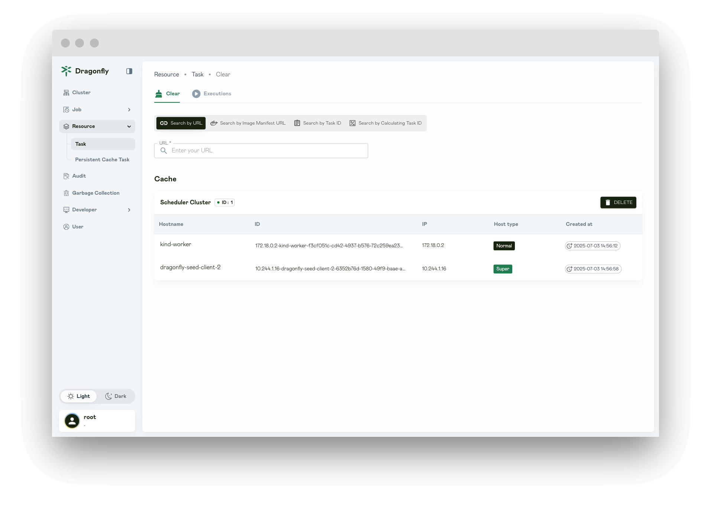
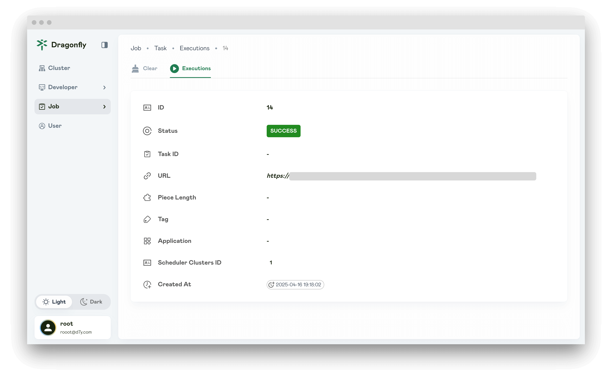

This document will help you experience how to use the console to find and clear the P2P task cache.

## Search task

### Search task by URL

**URL**: Query the task cache based on the URL.

**Tag**: When the task URL is the same but the tags are different, they will be distinguished based on the tags, and the queried tasks will also be different.

**Application**: Caller application which is used for statistics and access control.

**Filter Query Params**: Filter the query parameters of the downloaded URL. If the download URL is the same, it will be scheduled as the same task.

### Search task by task id

**Task ID**: Query the task cache based on the task id.

## Delete task

Click `DELETE` and delete task.

Click `SAVE` to delete the task. The deleted task will not return results immediately and you need to wait.

## Executions

Displays all deleted task.

## Task Success

If the status is SUCCESS and the Failed list does not exist, it means that the deletion task is successful.

## Task Failure

Failed list will show the tasks that failed to execute.

Click the Description icon to view the failure log.

