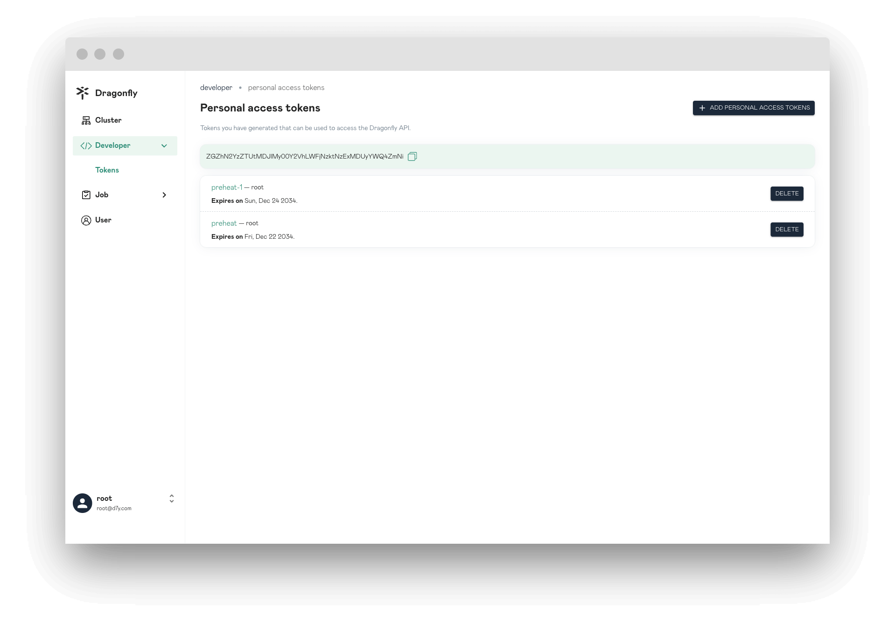
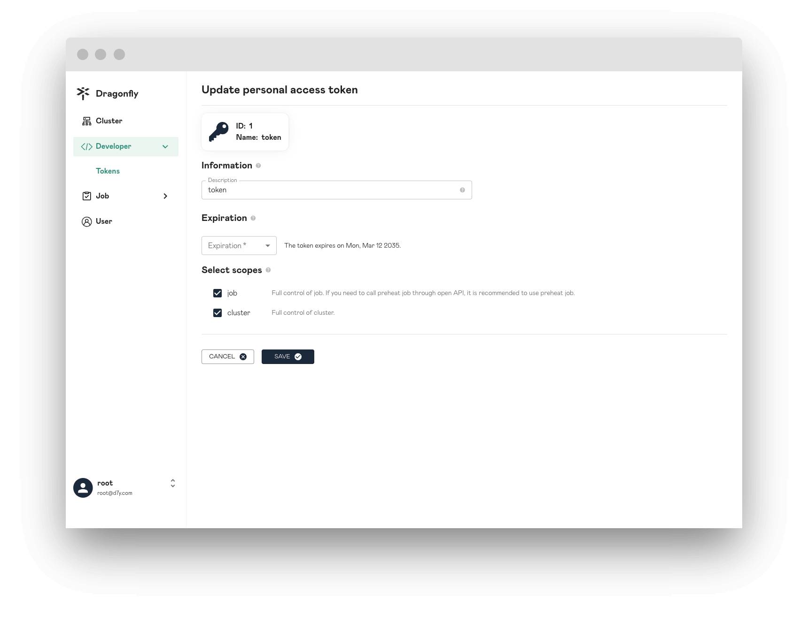
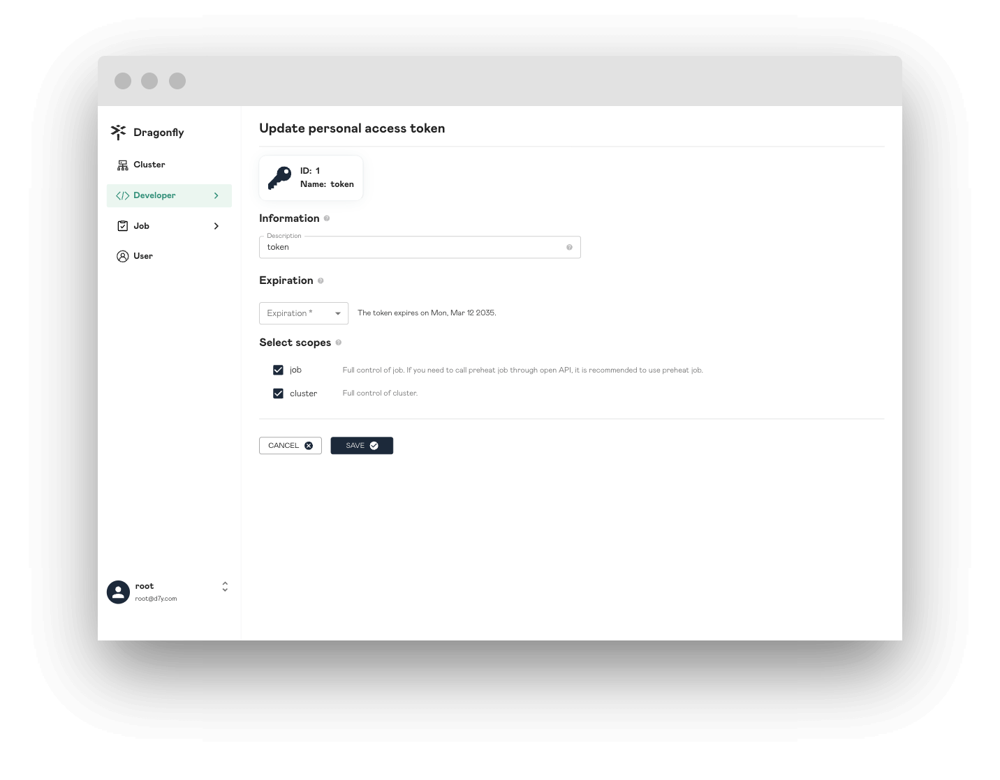
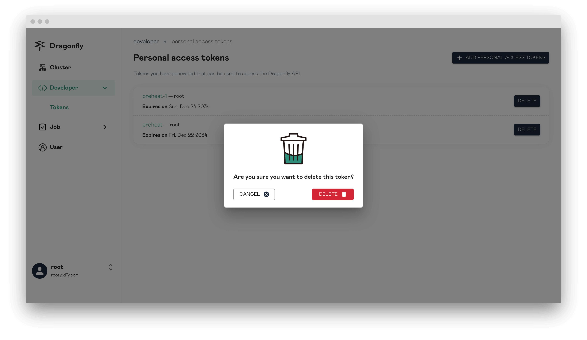

In this article, you will be shown Personal Access Tokens page information.

## Personal Access Tokens

Display all of the personal access tokens information.

## Create Personal Access Token

Create a personal access token.

### Information

The information of Personal Access Token.

### Expiration

Token expiration time.

**Expiration**: Set your token an expiration.

### Select scopes

Select the access permissions for the token.

**preheat**: Full control of preheating, it's used for preheating of harbor.

**job**: Full control of job. If you need to call preheat job through open API, it is recommended to use preheat job.

**cluster**: Full control of cluster.

## Update Personal Access Token

Update personal access token information.

## Delete Personal Access Token

Delete your personal access token.

