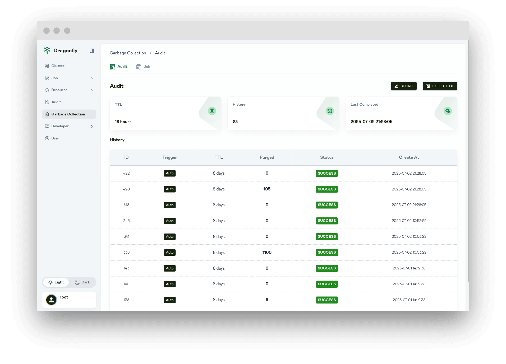
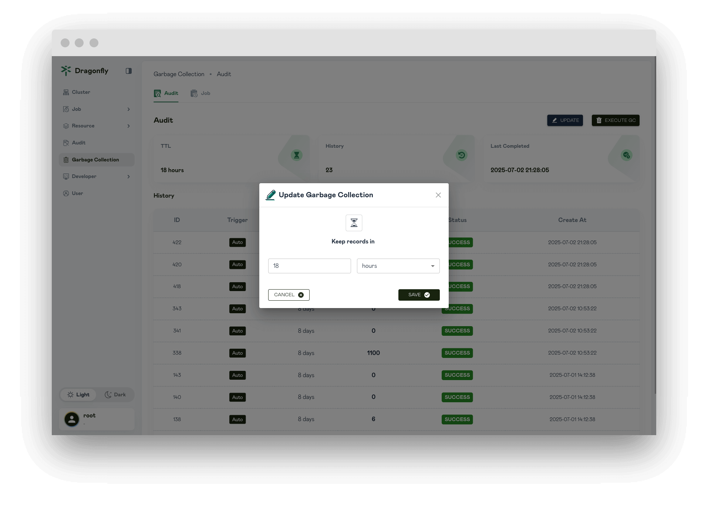
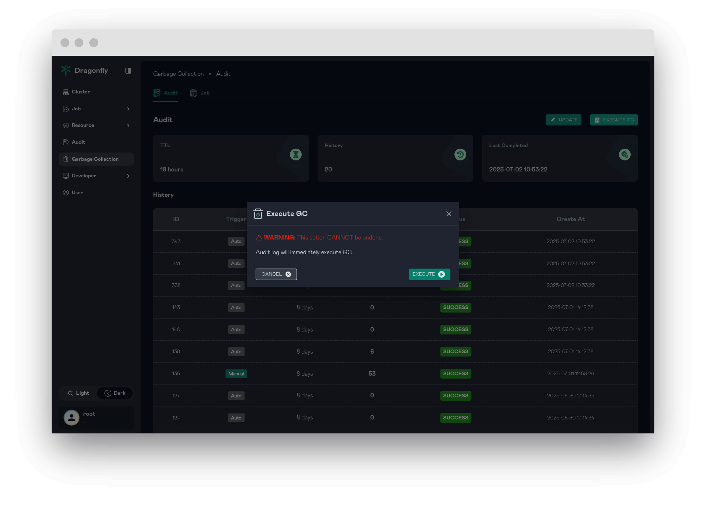
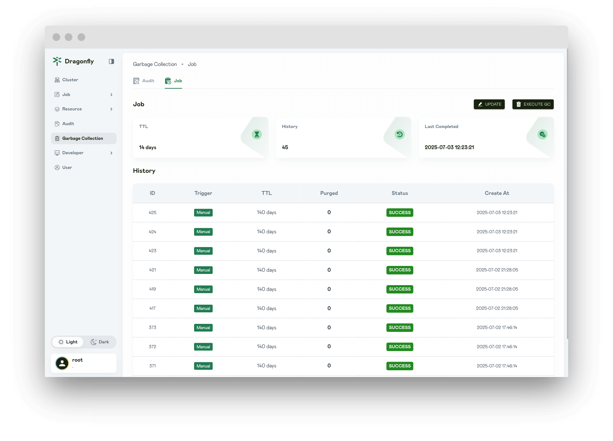
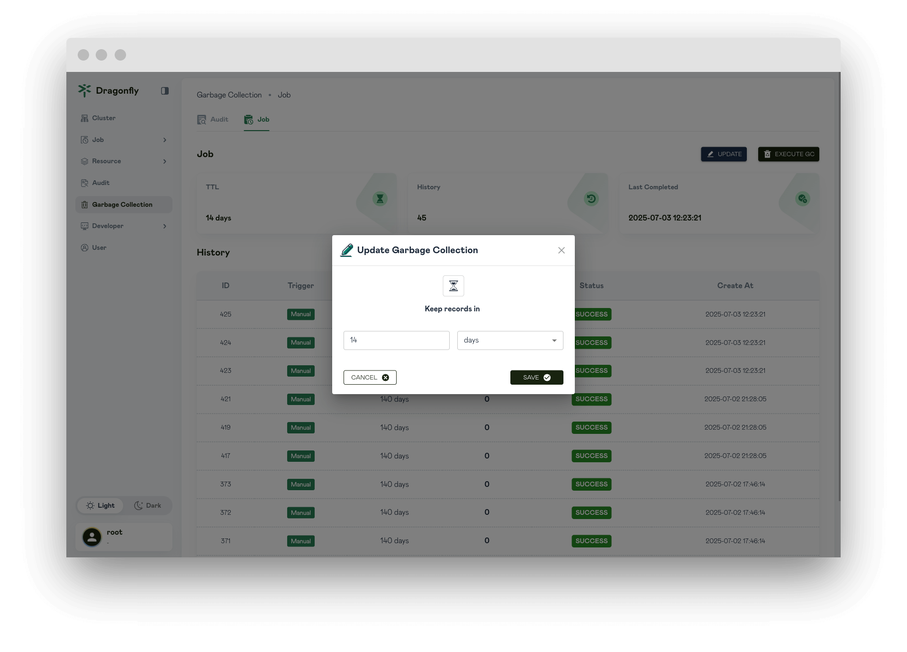
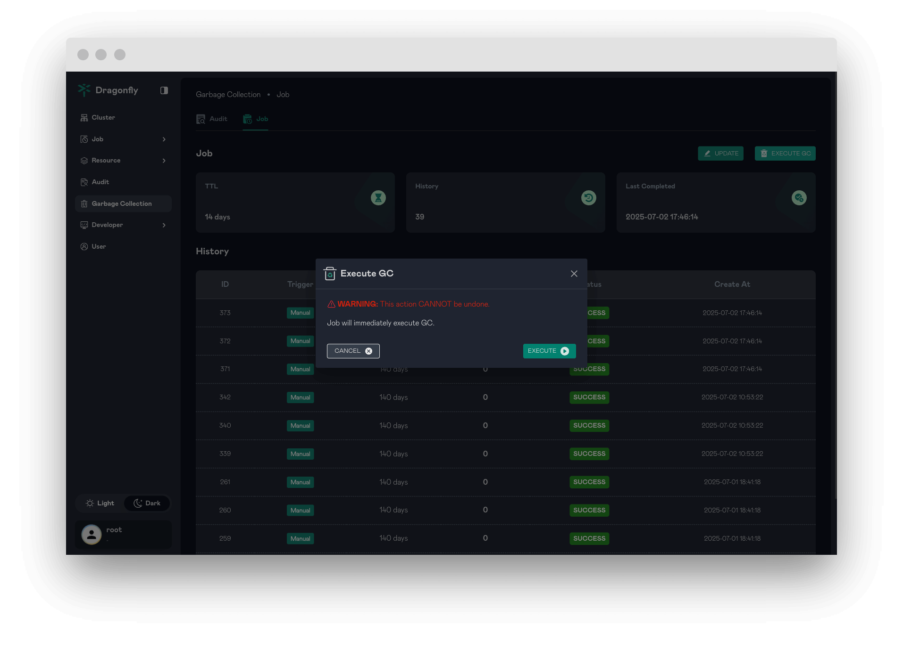

In this article, you will be shown Garbage Collection page information.

## Audit GC History

Displays Audit GC configuration and Audit GC history.

## Audit Update GC

Update Audit Garbage Collection configuration.

**Keep the records in this interval**: when executing execute garbage collection, Keep the records in this interval.

## Audit Execute GC

Audit Execute Garbage Collection.

## Job GC History

Displays Job GC configuration and Job GC history.

## Job Update GC

Update Job Garbage Collection configuration.

**Keep the records in this interval**: when executing execute garbage collection, Keep the records in this interval.

## Job Execute GC

Job Execute Garbage Collection.

