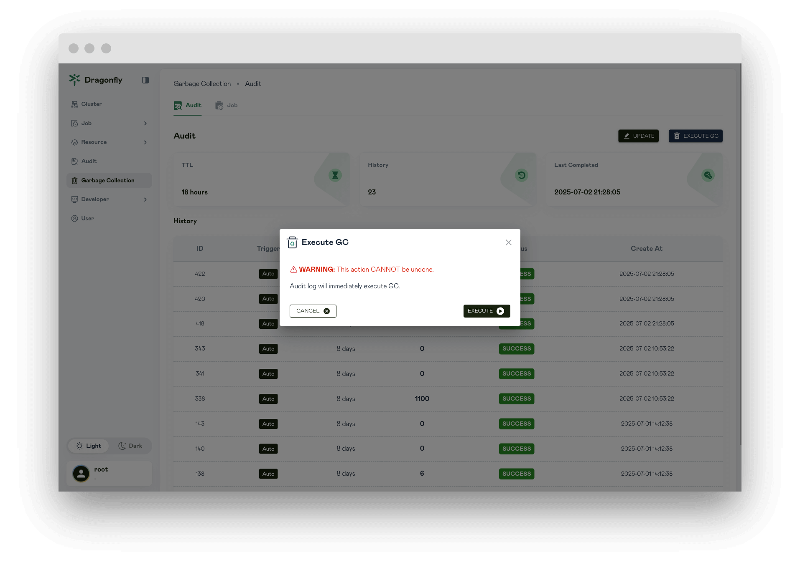
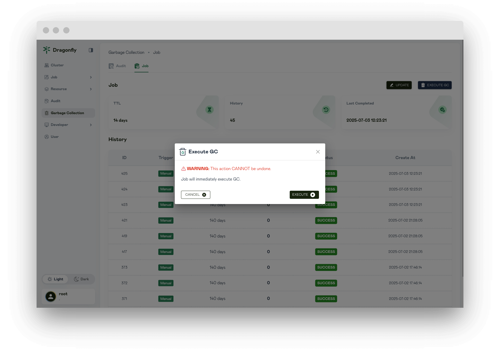

In this article, you will be shown Garbage Collection page information.

## Audit garbage collection

Display the Audit garbage collection configuration and the history of all executed garbage collections.

## Update the Audit garbage collection configuration

Update the Audit garbage collection configuration.

**Keep records in**: Use the Keep records in to configure how long audit logs should be kept. Use the drop down-menu to select Hours or Days. For example, if you set this to 7 days, Dragonfly Manager will only purge audit logs that are 8 or more days old.

## Audit runs garbage collection

To run garbage collection immediately, click `EXECUTE`.

## Job garbage collection

Display the Job garbage collection configuration and the history of all executed garbage collections.

## Update the Job garbage collection configuration

Update the Job garbage collection configuration.

**Keep records in**: Use the Keep records in to configure how long job should be kept. Use the drop down-menu to select Hours or Days. For example, if you set this to 7 days, Dragonfly Manager will only purge job that are 8 or more days old.

## Job runs garbage collection

To run garbage collection immediately, click `EXECUTE`.

