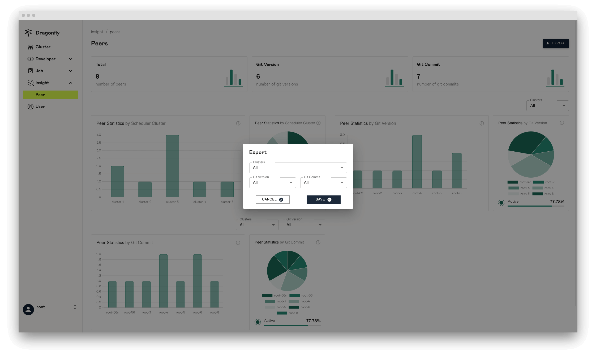

In this article, we will show you Peer page information.

## Peers

Display the peer information, You can click the `?` button to display prompt information.

> Note: peer data is T+1.

## Export Peer Date

Export the peer data.

