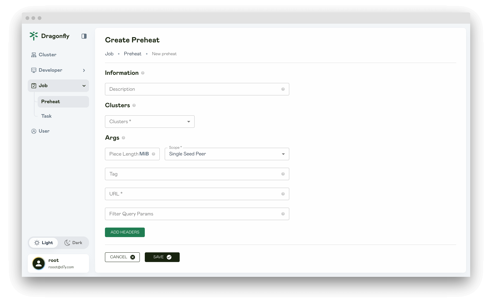

In this article, you will be shown Preheat page information.

## Preheats

Display all of the preheat tasks.

## Preheat

Display the preheat details, The `status` attribute shows whether the preheat is successful.

## Preheat Failure

If the status is `FAILURE`, the preheating is failure and an error log is displayed.

## Create Preheat

Create a preheat task for file preheating.

### Information

The information of Preheat.

**Description**: Set a description.

### Clusters

Preheat the cluster.

**Clusters**: Used for clusters that need to be preheat.

### Args

Args used to pass additional configuration options to the preheat task.

**Scope**: Select the scope of preheat as needed.

- **Single Seed Peer**: Preheat to a seed peer.

- **All Seed Peers**: Preheat to each seed peer in the P2P cluster.

- **All Peers**: Preheat to each peer in the P2P cluster.

**URL**: URL address used to specify the resource to be preheat.

**Tag**: When the URL of the preheat task are the same but the Tag are different, they will be distinguished based on the
tag and the generated preheat task will be different.

**Filtered Query Params**: By setting the filteredQueryParams parameter, you can specify
the file type of the resource that needs to be preheated.
The filteredQueryParams is used to generate a unique preheat task and filter unnecessary query parameters in the URL.

**ADD Headers**: Add headers for preheat request.
