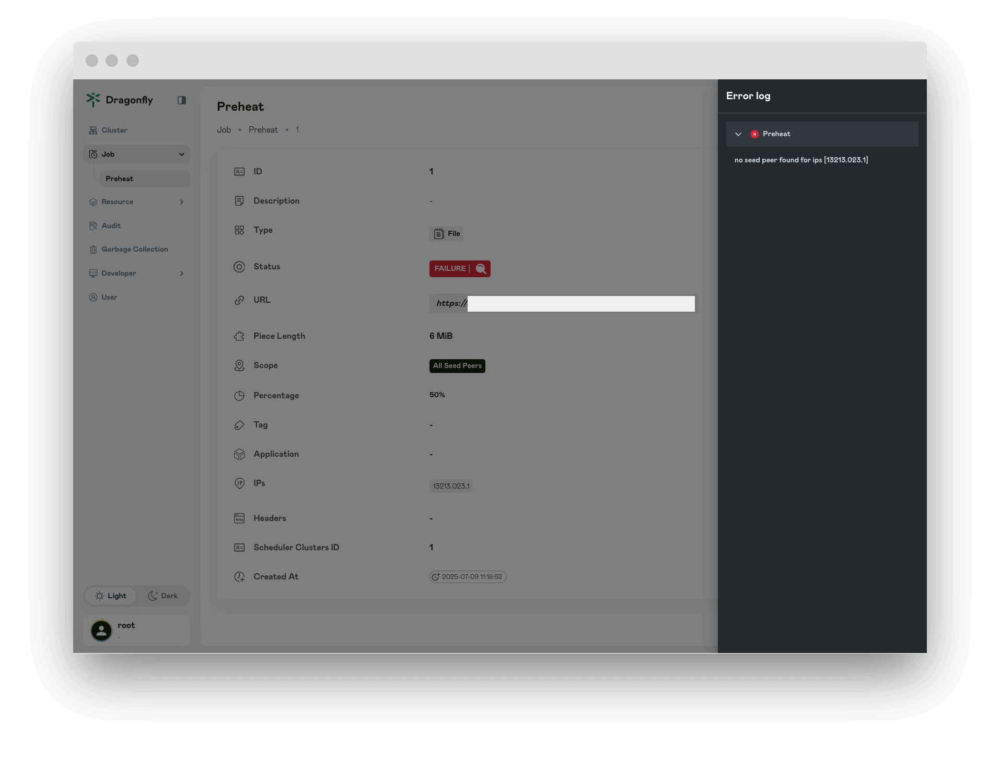
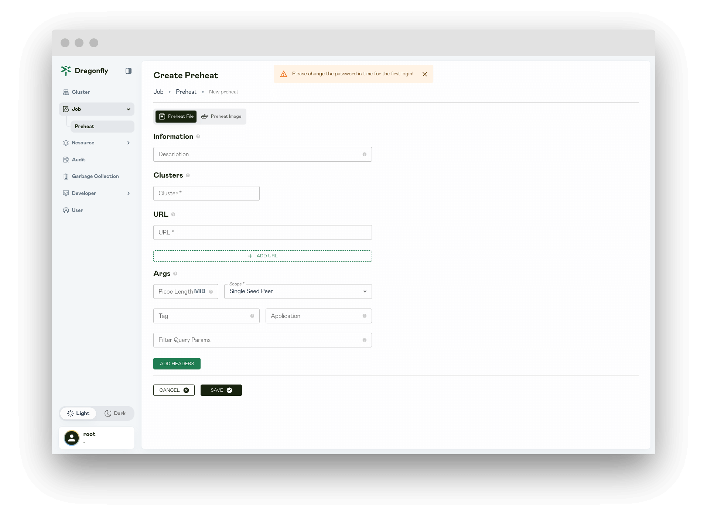

In this article, you will be shown Preheat page information.

## Preheats

Display all of the preheat tasks.

## Preheat

Display the preheat details, The `status` attribute shows whether the preheat is successful.

## Preheat Failure

If the status is `FAILURE`, the preheating is failure and an error log is displayed.

## Create Preheat

Create a preheat task.

### Preheat image

Create a preheat task for image preheating.

#### Information {#create-preheat-image-information}

The information of Preheat.

**Description**: Set a description.

#### Clusters {#create-preheat-image-cluster}

Preheat the cluster.

**Clusters**: Used for clusters that need to be preheated.

#### URL {#create-preheat-image-urel}

URL used to specify the resource to be preheated.

**URL**: The URL address is the manifest URL for the image.

#### Args {#create-preheat-image-args}

Args used to pass additional configuration options to the preheat task.

**Platform**: The image type preheating task can specify the image architecture type. eg: linux/amd64、linux/arm64.

**Piece Length**: By setting the piece length, you can define the size of each piece downloaded during preheating. If unspecified, it’s calculated based on content length, defaulting to 4-16 MiB.

**Scope**: Select the scope of preheat as needed.

- **Single Seed Peer**: Preheat to a seed peer.

- **All Seed Peers**: Preheat to each seed peer in the P2P cluster.
  - **Count**: The count of preheat seed peers desired.
    This field is used only when `IPs` is not specified.
    It must be a value between 1 and 200 (inclusive) if provided.
  - **Percentage**: The percentage of preheat seed peers desired.
    It must be a value between 1 and 100 (inclusive) if provided.
  - **IPs**: By setting the IPs, can specify a seed peer IP for preheating.

- **All Peers**: Preheat to each peer in the P2P cluster.
  - **Count**: The count of preheat peers desired.
    This field is used only when `IPs` is not specified.
    It must be a value between 1 and 200 (inclusive) if provided.
  - **Percentage**: The percentage of preheat peers desired.
    It must be a value between 1 and 100 (inclusive) if provided.
  - **IPs**: By setting the IPs, can specify a peer IP for preheating.

**User Name**: The username used to authenticate the image manifest.

**Password**: The password used to authenticate the image manifest.

**Tag**: When the URL of the preheat task are the same but the Tag are different, they will be distinguished based on the
tag and the generated preheat task will be different.

**Application**: When the URL of the preheat tasks are the same but the Application are different,
they will be distinguished based on the Application and the generated preheat tasks will be different.

**Filtered Query Params**: By setting the filter parameter, you can specify the file type of the resource that needs to be preheated. The filter is used to generate a unique preheat task and filter unnecessary query parameters in the URL, separated by & characters.

**ADD Headers**: Add headers for preheat request.

### Preheat file

Create a preheat task for file preheating.

#### Information {#create-preheat-file-information}

The information of Preheat.

**Description**: Set a description.

#### Clusters {#create-preheat-file-cluster}

Preheat the cluster.

**Clusters**: Used for clusters that need to be preheated.

#### URL {#create-preheat-file-url}

URL used to specify the resource to be preheated.

- **URL**: Used to specify the URL addresses of resources requiring preheating, supporting multiple URLs in a single preheat request.

#### Args {#create-preheat-file-args}

Args used to pass additional configuration options to the preheat task.

**Piece Length**: By setting the piece length, you can define the size of each piece downloaded during preheating. If unspecified, it’s calculated based on content length, defaulting to 4-16 MiB.

**Scope**: Select the scope of preheat as needed.

- **Single Seed Peer**: Preheat to a seed peer.

- **All Seed Peers**: Preheat to each seed peer in the P2P cluster.
  - **Count**: The count of preheat seed peers desired.
    This field is used only when `IPs` is not specified.
    It must be a value between 1 and 200 (inclusive) if provided.
  - **Percentage**: The percentage of preheat seed peers desired.
    It must be a value between 1 and 100 (inclusive) if provided.
  - **IPs**: By setting the IPs, can specify a seed peer IP for preheating.

- **All Peers**: Preheat to each peer in the P2P cluster.
  - **Count**: The count of preheat peers desired.
    This field is used only when `IPs` is not specified.
    It must be a value between 1 and 200 (inclusive) if provided.
  - **Percentage**: The percentage of preheat peers desired.
    It must be a value between 1 and 100 (inclusive) if provided.
  - **IPs**: By setting the IPs, can specify a peer IP for preheating.

**Tag**: When the URL of the preheat task are the same but the Tag are different, they will be distinguished based on the
tag and the generated preheat task will be different.

**Application**: When the URL of the preheat tasks are the same but the Application are different, they will be distinguished based on the Application and the generated preheat tasks will be different.

**Filtered Query Params**: By setting the filter parameter, you can specify the file type of the resource that needs to be preheated. The filter is used to generate a unique preheat task and filter unnecessary query parameters in the URL, separated by & characters.

**ADD Headers**: Add headers for preheat request.
