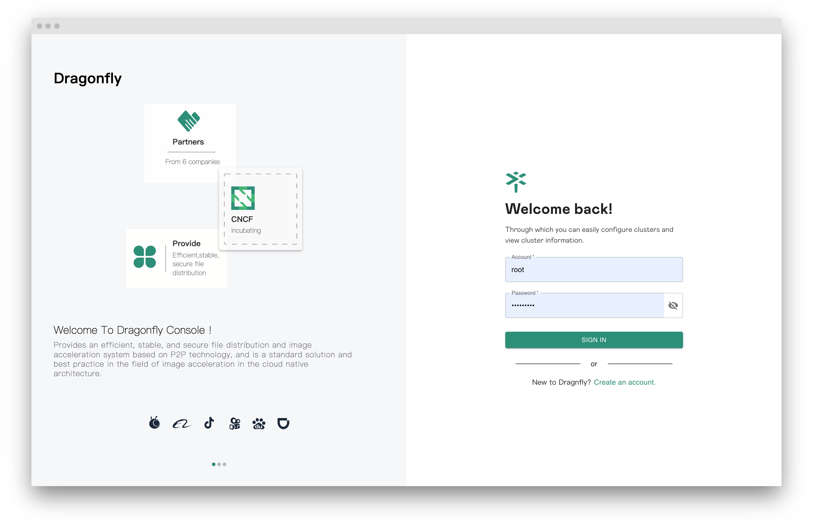

The default username and password are `root` and `dragonfly`.

> Note: It is strongly recommended that you change the default administrator password.



## Customize the initial root password

Set the `DRAGONFLY_INITIAL_ROOT_PASSWORD` environment variable of the manager to seed the root user
with a custom password instead of the default one. The password must be between 8 and 20 characters.

If you deploy Dragonfly with [Helm Charts](https://github.com/dragonflyoss/helm-charts), set it through
`manager.extraEnvVars`, preferably referencing a Kubernetes secret:

```yaml
manager:
  extraEnvVars:
    - name: DRAGONFLY_INITIAL_ROOT_PASSWORD
      valueFrom:
        secretKeyRef:
          name: dragonfly-root-password
          key: password
```

> Note: The environment variable only takes effect when the root user is created for the first time.
> After that, the password is managed in the database and can be changed from the console.
