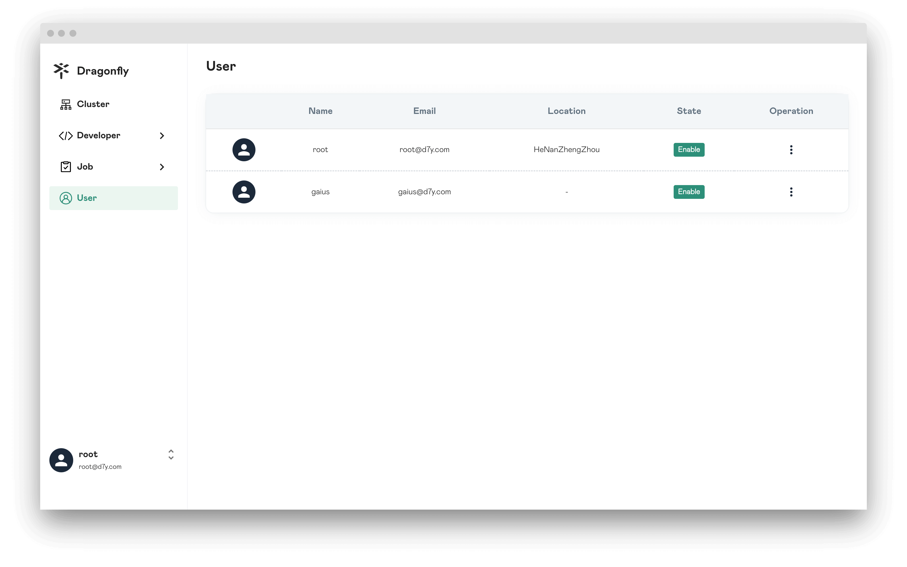
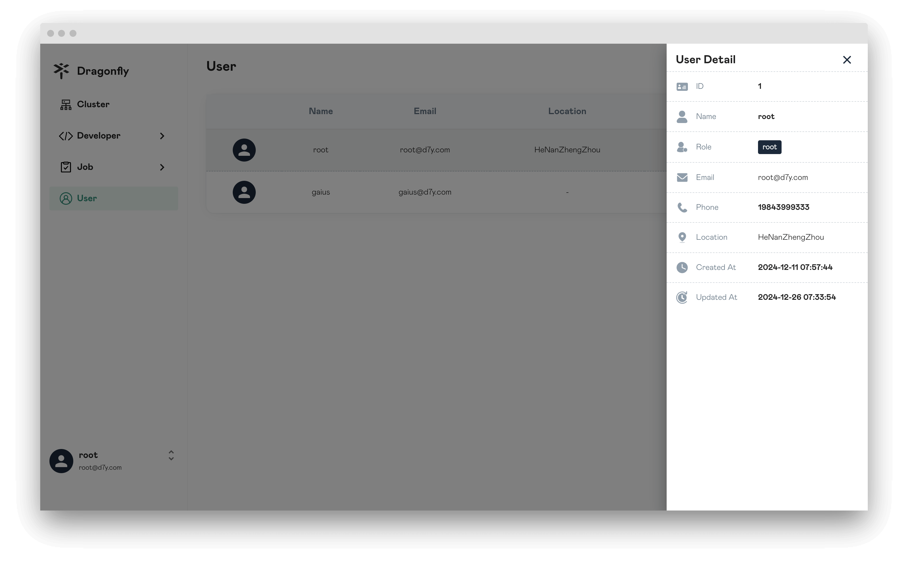
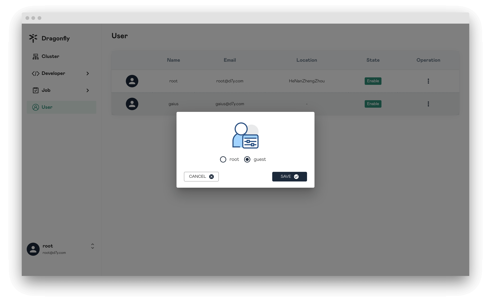
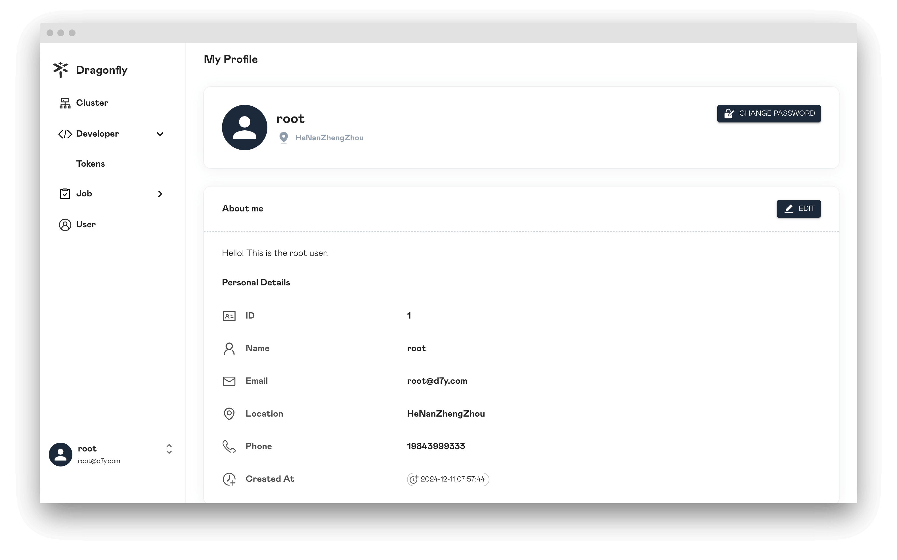
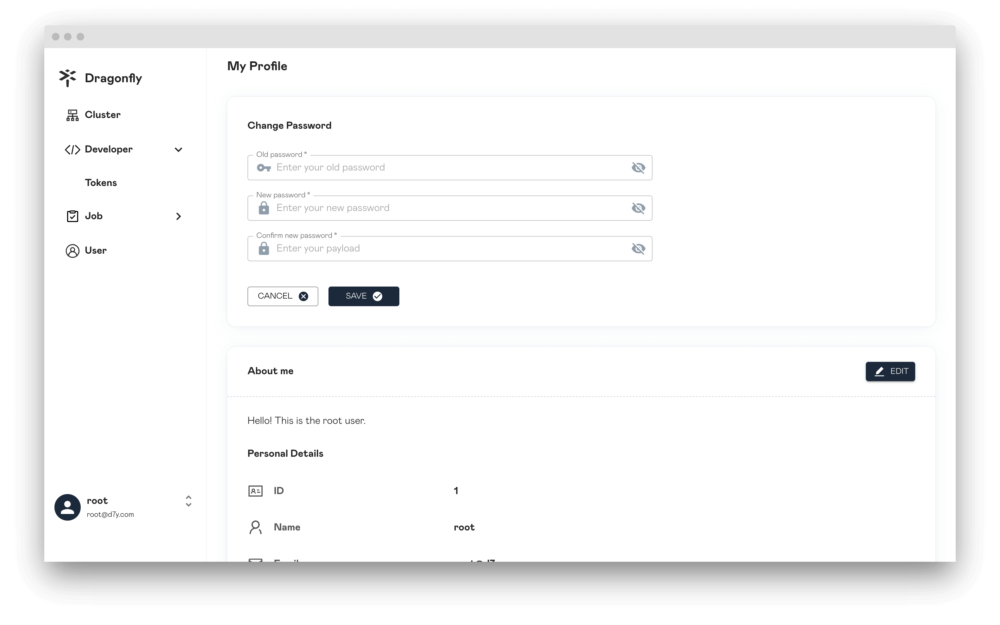
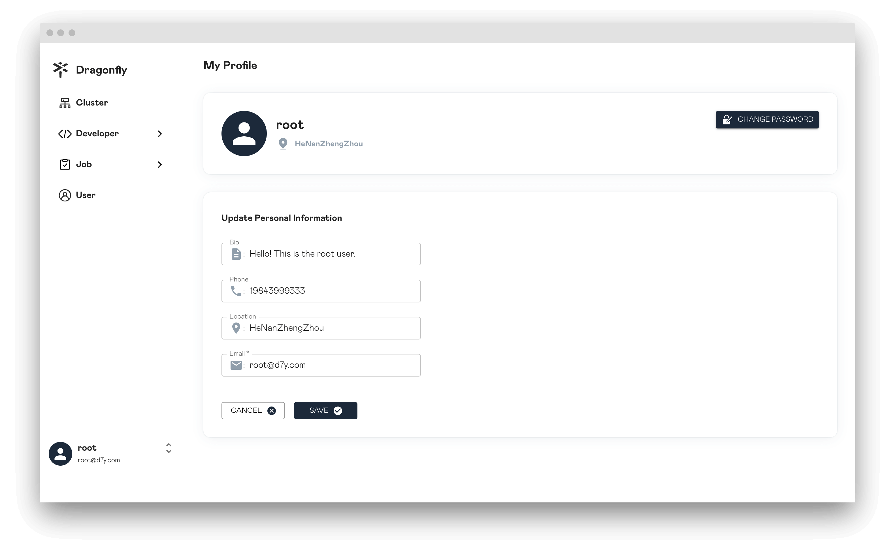

In this article, we will show you User page information.

## Users

Only users with the `root` role can view the list of all users.

## User

Display the user details.

## Update User Role

Only users with the `root` role can change the roles of other users.

## Profile

Display user's own profile.

## Change Password

You can change your password.

## Update Profile

Update user's own profile.

