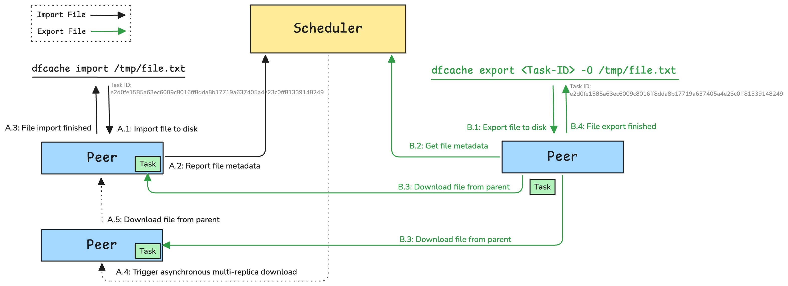

It designs to provide persistent caching for tasks. This tool can import file and export file in P2P network. The solution is specifically engineered for high-speed read and write operations. This makes it particularly advantageous for scenarios involving large files, such as machine learning model checkpoints, where rapid, reliable access and distribution across the network are critical for training and inference workflows. By leveraging P2P distribution and persistent caching, dfcache significantly reduces I/O bottlenecks and accelerates the lifecycle of large data assets.



## Dfcache

Use dfcache to import files, refer to [dfcache](../reference/commands/client/dfcache.md).

```shell
$ dfcache import /tmp/file.txt
⣷ Done: 852606796
```

Use dfcache to export files.

```shell
$ dfcache export 852606796 -O /tmp/file.txt
[00:00:00] [############################################################] 8.73 KiB/8.73 KiB (7.30 MiB/s, 0.0s)
```

## Manager Console

Now you can open browser and visit console via localhost:8080 and query the persistent cache tasks

### Cluster

Persistent cache tasks are divided according to the scheduler cluster granularity.


### Persistent Cache Tasks

Display all of the persistent cache tasks.


### Persistent Cache Task

Display the persistent cache task details.


### Delete Persistent Cache Task

Click `DELETE` and delete persistent cache task details.


