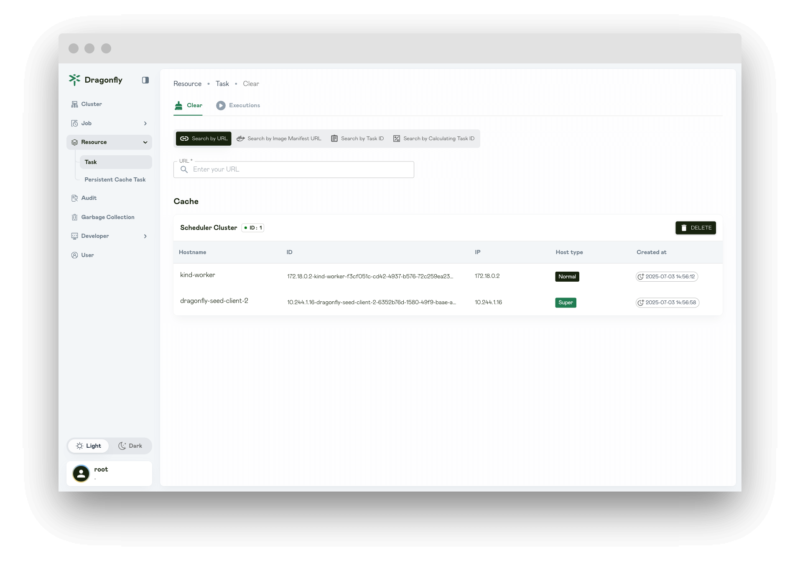
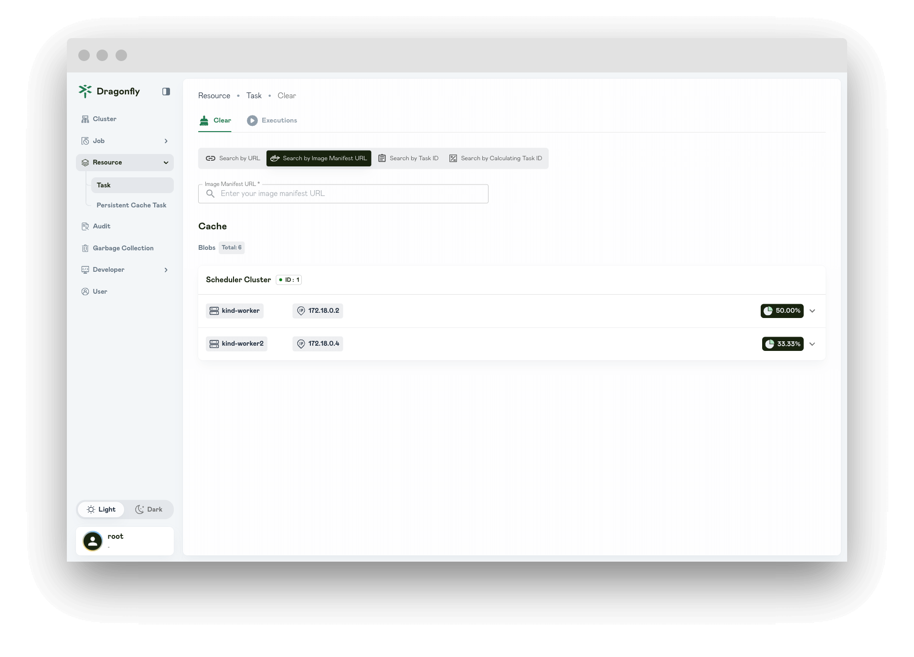
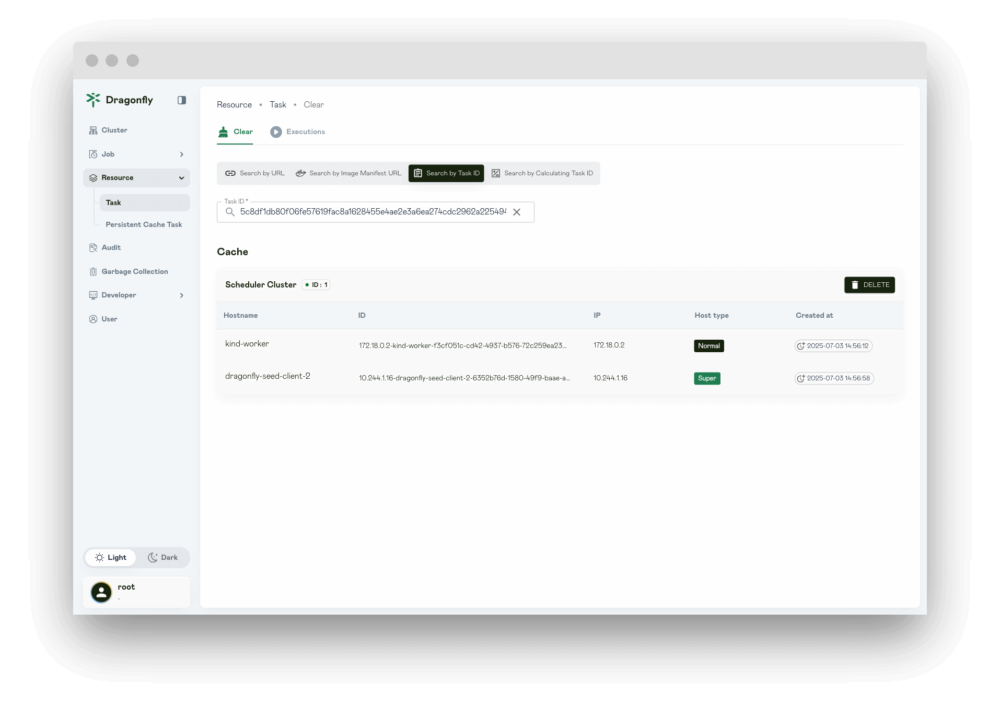
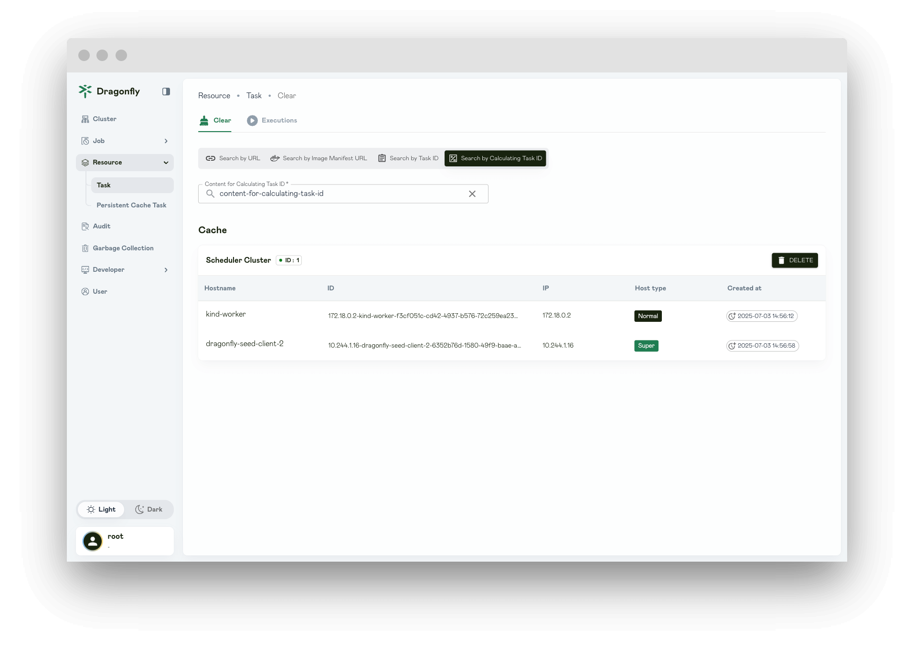
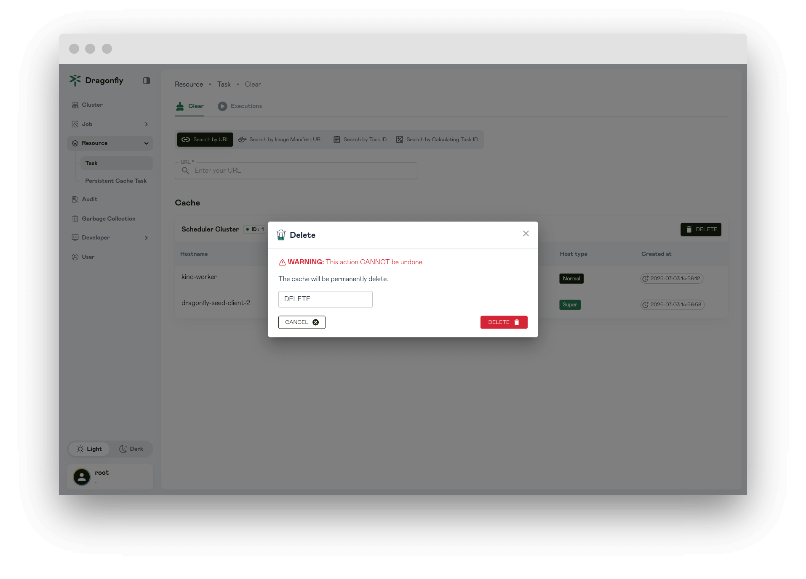
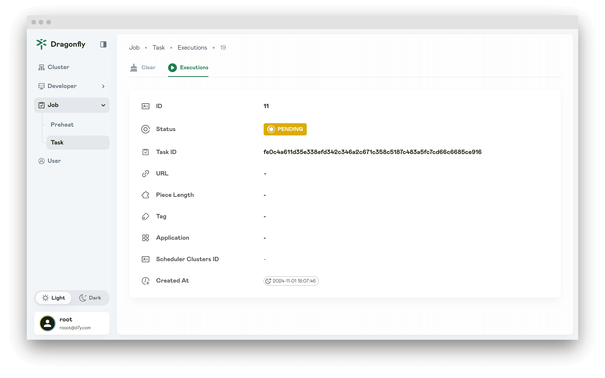
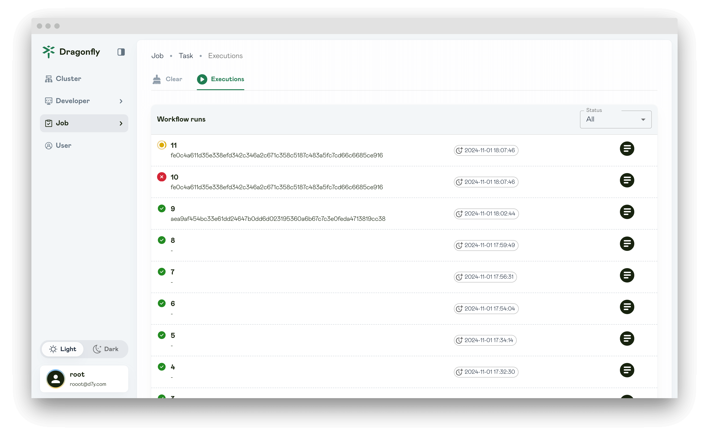
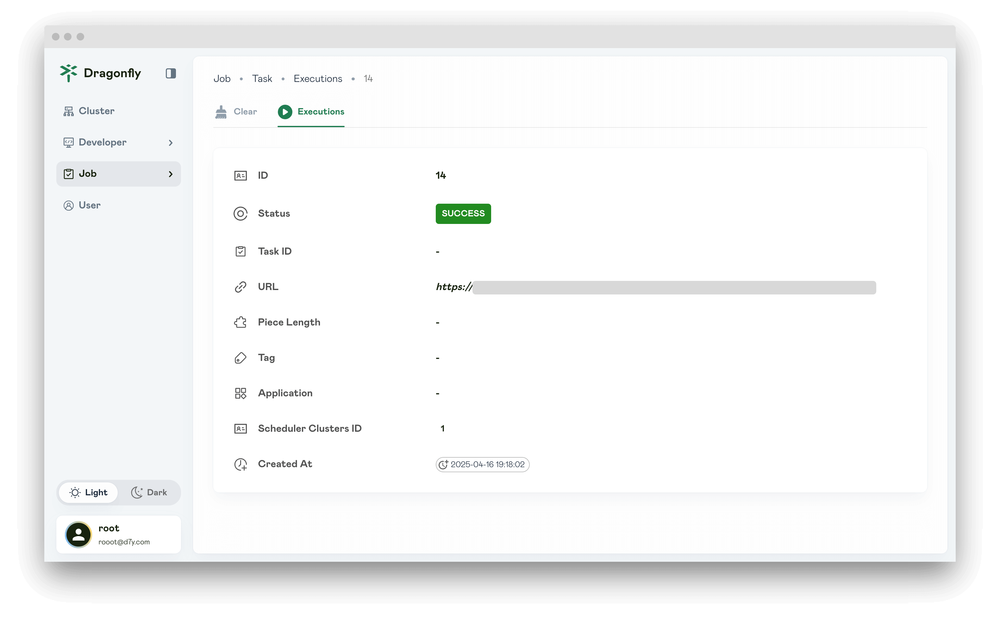
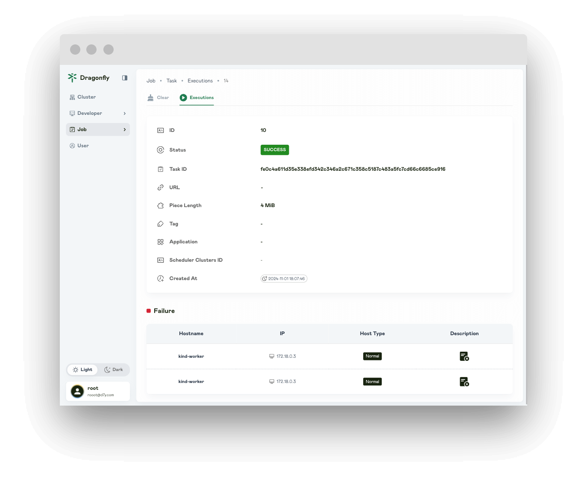
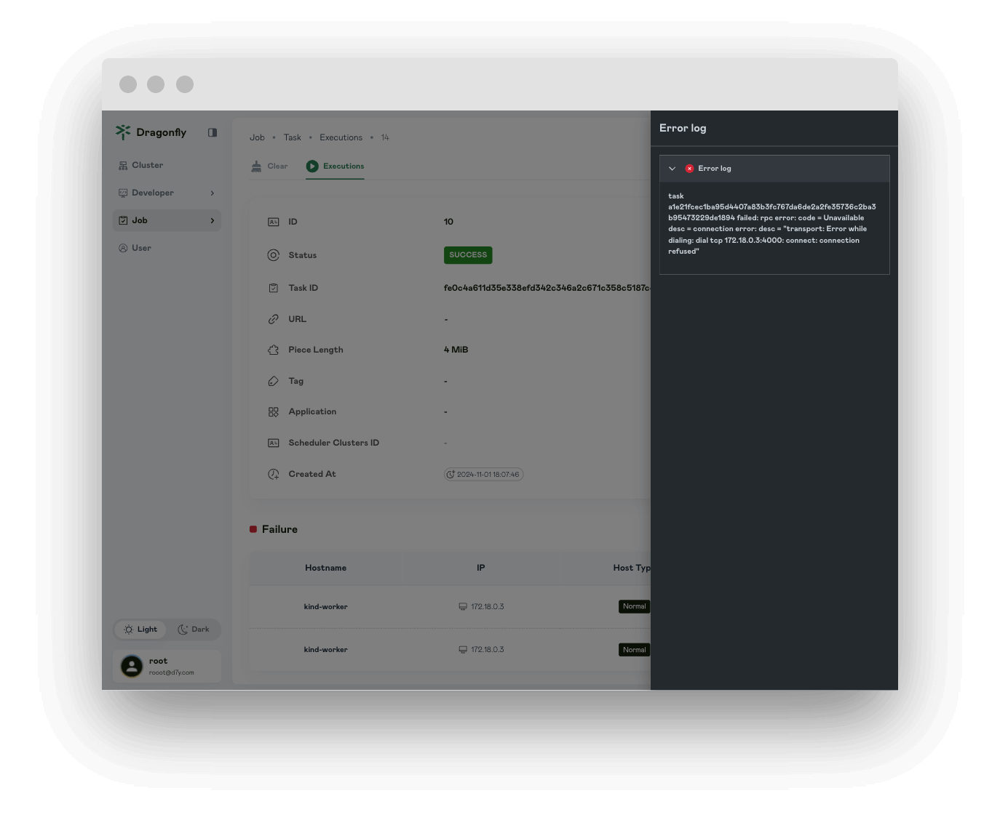

The Resource Search feature enables seamless querying of tasks, including files, images. It optimizes resource access, improving task management and retrieval efficiency.

## Search Task

### Search by URL

Download a file using dfget.

```shell
$ dfget https://<host>:<port>/<path> -O /tmp/file.txt
[00:00:00] [============================================================] 100% (209.63 KiB/s, 0.0s)
```

**URL**: Query the task cache based on the URL.

**Piece Length**: When the task URLs are the same but the Piece Length is different,
they will be distinguished based on the Piece Length, and the queried tasks will also be different.

**Tag**: When the task URL is the same but the tags are different,
they will be distinguished based on the tags, and the queried tasks will also be different.

**Application**: Caller application which is used for statistics and access control.

**Filter Query Params**: Filter the query parameters of the downloaded URL.
If the download URL is the same, it will be scheduled as the same task.



### Search by Image Manifest URL

Create a preheat task for image preheating. refer to [preheat-image](../advanced-guides/web-console/job/preheat.md#preheat-image).

> Notice: Deletion of the image manifest URL task cache is not supported yet.

**Image Manifest URL**: Query the task cache based on the image manifest URL.



### Search by Task ID

Download a file using dfget.

```shell
$ dfget https://<host>:<port>/<path> -O /tmp/file.txt
[00:00:00] [============================================================] 100% (209.63 KiB/s, 0.0s)
```

Get task_id.

```shell
# Find task id.
$ export TASK_ID=$(grep "https://<host>:<port>/<path>" /var/log/dragonfly/dfdaemon/* | grep -o 'task_id="[^"]*"')

# Check logs.
$ grep "$TASK_ID" /var/log/dragonfly/dfdaemon/* | grep 'download task succeeded'
```

The expected output is as follows:

```shell
2025-07-07T02:15:26.640865338+00:00 INFO
download_task: dragonfly-client/src/grpc/dfdaemon_download.rs:454: download task succeeded
host_id="172.18.0.4-kind-worker"
task_id="475c16c1db17af77359d59e63047fad44c56341e2fa15a744c3890a233fb5852"
peer_id="172.18.0.4-kind-worker-3aa79d4f-fe54-4b8b-81ef-60a259b30e39"
```

**Task ID**: Query the task cache based on the task id.



### Search by Content for Calculating Task ID

```shell
$ dfget --content-for-calculating-task-id <CONTENT_FOR_CALCULATING_TASK_ID> https://<host>:<port>/<path> -O /tmp/file.txt
[00:00:00] [============================================================] 100% (209.63 KiB/s, 0.0s)
```

**Content for Calculating Task ID**: Query the task cache based on the content for calculating task id.



## Delete task

Click `DELETE` and delete task.



The deleted task will not return results immediately and you need to wait.



## Executions

Displays all deleted task.



## Execution

If the status is SUCCESS and the Failure list does not exist, it means that the deletion task is successful.



## Execution failed

The Failure list will show the tasks that failed to execute.



Click the `Description` icon to view the failure log.


