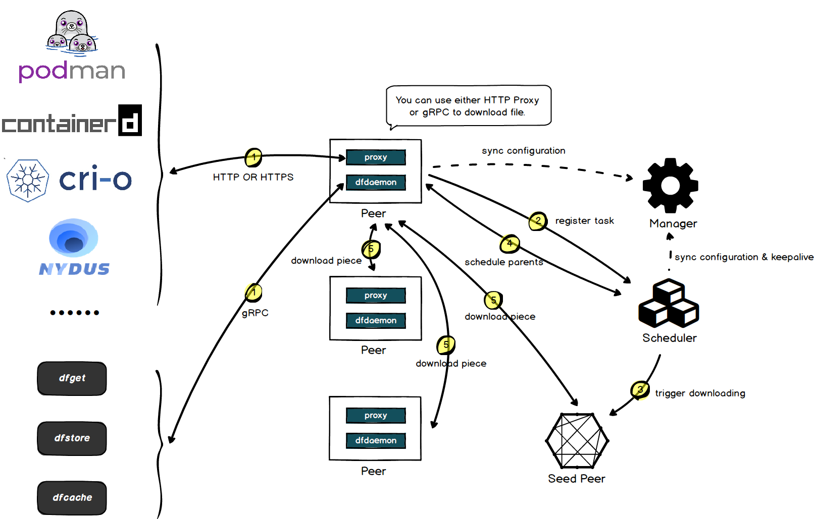
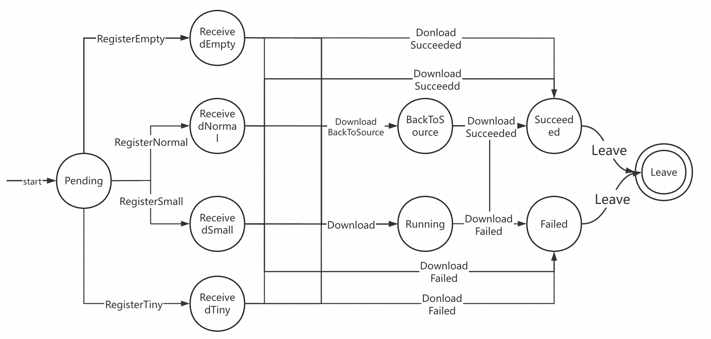
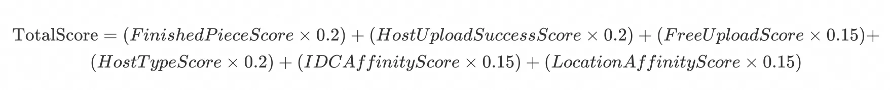

## V1.x

Note: The above analysis is based on Dragonfly v1.x version, Some details may differ from the latest version.

### Architecture

Dragonfly services could be divided into four categories: Manager, Scheduler, Seed Peer and Peer. Please refer
to [Architecture](./../operations/architecture/architecture.md).

### Overview

1. The user manually executes Dfget to download the file, and the Daemon process is started locally. The Daemon process
   requests the list of available Schedulers from the Manager and obtains the currently available Scheduler List.
2. The Daemon process uses consistent hashing to map the download task to a Scheduler node based on the TaskID of the
   file to be downloaded. Therefore, the Daemon processes downloading the same file in the same area will be scheduled
   by the same Scheduler node. These Daemon processes are perceived by the Scheduler and form a P2P network.
3. The Scheduler receives the registration message of the PeerTask and records the mapping relationship between the Task
   and the Peer in the memory. If the Task is created for the first time, it means that there is no existing file data
   in the current cluster, triggering the data back-to-source download. The Scheulder initiates an ObtainSeed request to
   the SeedPeer node, and also adds the SeedPeer node as a PeerTask to the Peer list of this Task.
4. Next, the Peers will communicate in parallel and download pieces from each other:
   - SeedPeer data back to the source: The SeedPeer node will first obtain the size of the data to be downloaded from
     the data source, and slice it into pieces according to the specified slice size to obtain a list of pieces. Download
     the piece data in parallel, and notify the Scheduler to update the piece information of the Task after each piece is
     downloaded.
   - ParentPeer scheduling: After the Daemon process completes registration with the Scheduler, it will maintain a
     two-way Stream with the Scheduler, and notify the Scheduler of the piece information that has been downloaded, as
     well as the piece information to be downloaded and the piece information that failed to download. After receiving the
     information reported by the Peer, the Scheduler will decide which ParentPeer the Peer should download the unfinished
     piece from based on the internal algorithm, or fallback to the data source to download directly back to the source.
   - P2P download between peers: After receiving the ParentPeer specified by the Scheduler, the Daemon process will
     start a two-way Stream with the ParentPeer. The Daemon process will periodically send the Piece information that
     needs to be downloaded to the ParentPeer. If there is an available Piece on the ParentPeer, the detailed information
     of the Piece will be returned. After receiving the Response, the Daemon process will asynchronously start a coroutine
     to pull the corresponding Piece from this ParentPeer.
5. When the Daemon process completes downloading the file, it will notify the Scheduler of the completion of the
   download, and the Scheduler node will mark this node as the new P2P root node.
6. When the download is completed and there is no new task, the Daemon process will be idle for a period of time, and
   then the Daemon process will notify the Scheduler to exit the P2P network and close its own process.

#### Core Concepts in P2P Downloading

- Task: In Dragonfly, a file download is defined as a Task. Task generates a TaskID through the hash value calculated by
  URL and URLMeta. Dragonfly uses TaskID as the primary key to uniquely identify a download task. This TaskID is very
  important. Peer will select Scheduler and SeedPeer nodes based on the consistent hash of TaskID, which ensures that
  all Peers download the same file by one Scheduler, and the data cache will only exist on one SeedPeer node.
- Piece: In order to speed up file downloads and improve file download parallelism, large files are divided into
  multiple pieces according to a fixed piece size. Each piece is called a Piece, and a Task will contain multiple
  Pieces.
- PeerTask: When a Peer process receives a download task, it will assign a PeerID to the download task to indicate that
  the current Peer is downloading the Task. PeerTask = Peer + Task. PeerTask is the unique key when the Peer registers
  with the Scheduler. It identifies a Peer node in a download task.
- ParentPeer: In P2P downloads, the Scheduler assigns one or more ParentPeers to each Peer. When downloading a file, the
  Peer only pulls file data from the ParentPeer assigned to it by the Scheduler.

### System Core Implementation

#### Peer Lifecycle

The process of interaction between Deamon and Scheduler when downloading a file is divided into 4 stages, and each stage corresponds to a gRPC interface on Scheduler.

- registerPeerTask registration:
  - When starting to download, Peer first registers its current Task with Scheduler. Scheduler will create a new PeerTask for this registration and maintain it in memory. If this PeerTask is the first time this Task is created, then Scheduler will initiate a back-to-source download request to SeedPeer node. There is a detail here. Scheduler will behave differently according to the size of the file to be downloaded. If the file is too small, then Scheduler will find a Peer to download the file back and return all the data directly when registering.
- ReportPieceResult Scheduling
  - In Daemon, every time the status of a downloaded Piece changes (success, failure), the download result of this Piece will be reported to the Scheduler. The Scheduler will record this information in memory and trigger the calculation logic for the ParentPeer (the specific calculation logic will be analyzed separately in detail), and then return the newly calculated ParentPeer list to the Daemon process through the two-way Stream with Daemon.
- ReportPeerResult Reporting Result:
  - After Daemon finishes downloading the file, it reports the download result of this Task. If the Task download fails, the Scheduler will remove all ChildPeers of this Peer, that is, other nodes in the P2P network will no longer use it as a ParentPeer, and notify these ChildPeers through the Stream.
- LeaveTask Destruction:
  - When the GC of the data is triggered or the process exits, the Daemon notifies the Scheduler to remove the corresponding PeerTask information from the list, and the Scheduler will no longer send it as the ParentPeer of other nodes.

#### Piece Download

TODO: The interaction between peer nodes when downloading a piece mainly requires to clearly describe the data flow process of the piece stream.

#### Parent Peer Selection Algorithm

Scheduler maintains a directed acyclic graph (DAG) of Peers for each Task to identify the current P2P network composition. Each Peer will be a point in the graph, pointing to its ParentPeer.
The logic of selecting Parent Peer is:

1. Randomly select several Peers from DAG as candidates (the number of selections is determined by the configuration value `filterParentLimit`, the default value is 15), and start selecting from these Peers.
2. Peers that meet the following conditions can become Candidate Parent Peers:
   - Not in the pre-configured blacklist.
   - The time taken by this Peer to download the Piece in the last time is less than 20 times the average time taken by all Pieces. If it does not meet the requirements, it is considered to be a bad node with network problems and is removed from the candidate list.
   - The number of pieces uploaded by the peer node in transit must be less than the configured threshold, that is, the traffic of a single node cannot be too large.
3. After selecting the peers that meet the above conditions, each peer must be sorted according to a scoring mechanism. The highest-scoring peers (the number is determined by the configuration candidateParentLimit, the default value is 4) will be selected and eventually become Candidate Parent Peers. Calculate several specific factors (feature score) for each Candidate Parent Peer. Each factor has a fixed weight. In the end, each Candidate Parent Peer will have a comprehensive total score. `TotalScore = (FeatureScore1 * FeatureWeight1) + (FeatureScore2 * FeatureWeight2) + (FeatureScore3 * FeatureWeight3)...` The specific feature score calculation logic is as follows:
   - FinishedPieceScore, this value is used to reflect the number of pieces that can be selected on the Candidate Parent Peer. The more pieces that the Candidate Parent Peer has downloaded, the larger this value is. This value can be used to select peers with more pieces.
   - HostUploadSuccessScore, this value is used to reflect the health of the Host where the Candidate Parent Peer is located. It indicates the proportion of the number of pieces successfully downloaded by the Host to the total number of pieces that need to be downloaded. In other words, the value can be used to eliminate abnormal hosts that are broken.
   - FreeUploadScore, this value is used to reflect the busyness of the Host where the Candidate Parent Peer is located. It is calculated by the concurrent file upload volume of the current Host. Through this value, the currently relatively idle Host can be selected.
   - HostTypeScore, this value is used to reflect the type of the Candidate Parent Peer. Its main function is to give priority to SeedPeer for file downloading when the Task is downloaded for the first time.
   - IDCAffinityScore, this value is used to reflect the IDC information where the Candidate Parent Peer is located. Peer nodes with the same IDC are given priority for Piece transmission.
   - LocationAffinityScore, this value is similar to IDCAffinityScroe, and is used to reflect the Location information where the Candidate Parent Peer is located. Peer nodes with the same Location are given priority for Piece transmission.

#### Failover

Failover implementation of each node of Dragonfly:

1. Manager node is a stateless service, data is stored in DB, any Manager node is peer-to-peer, and a single node failure will not affect the service.
2. The Scheduler node maintains the status of the Task in memory. Task routing is based on consistent hashing, so the same Task will always be routed to the same Scheduler node. This means that when the Scheduler node goes down, it will affect all in-transit Tasks on the node, and the existing P2P network will be completely cleared. After the Scheduler heartbeat is disconnected, the Manager will remove the broken Scheduler node, and the client's request will be assigned to a new Scheduler node by the Manager to re-establish the P2P network.
3. SeedPeer node is similar to Scheduler node. Requests for the same Task will always be routed to the same SeedPeer node. Therefore, if a single SeedPeer node fails and there is no other available ParentPeer node, the data will be returned to the source, and the source data will be downloaded again on another SeedPeer node.
4. If the daemon process on the Peer node exits normally, it will call the LeaveTask interface according to the normal life cycle to remove itself from the Task. If it exits abnormally, the long connection with the Scheduler will be disconnected. If the Piece information is not updated to the Scheduler for a long time, it will be cleaned up during the Scheduler's GC process.
