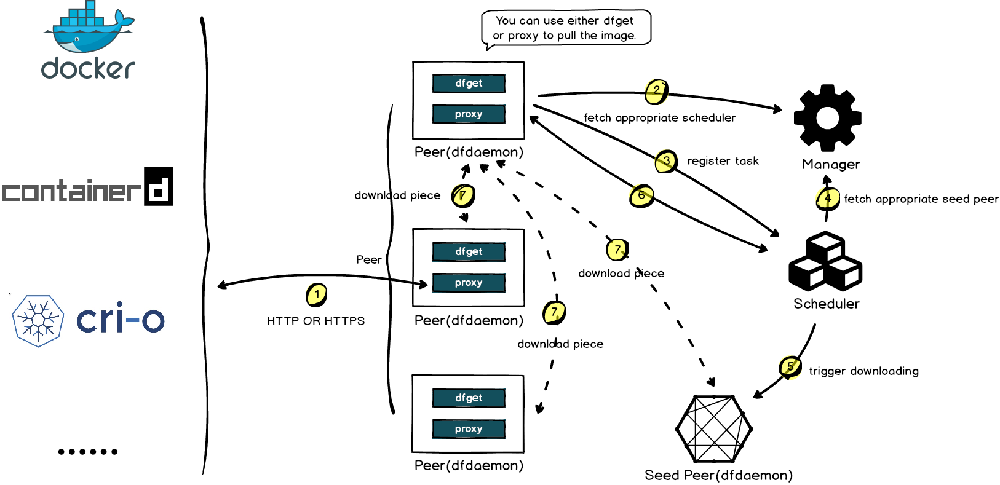

## Architecture
Dragonfly services could be divided into four categories: Manager, Scheduler, Seed Peer and Peer. Please refer to [Architecture](./operations/deployment/architecture.md).

## Overview

1. The user manually executes Dfget to download the file, and the Daemon process is started locally. The Daemon process requests the list of available Schedulers from the Manager and obtains the currently available Scheduler List.
2. The Daemon process uses consistent hashing to map the download task to a Scheduler node based on the TaskID of the file to be downloaded. Therefore, the Daemon processes downloading the same file in the same area will be scheduled by the same Scheduler node. These Daemon processes are perceived by the Scheduler and form a P2P network.
3. The Scheduler receives the registration message of the PeerTask and records the mapping relationship between the Task and the Peer in the memory. If the Task is created for the first time, it means that there is no existing file data in the current cluster, triggering the data back-to-source download. The Scheulder initiates an ObtainSeed request to the SeedPeer node, and also adds the SeedPeer node as a PeerTask to the Peer list of this Task.
4. Next, the Peers will communicate in parallel and download pieces from each other:
   a. SeedPeer data back to the source: The SeedPeer node will first obtain the size of the data to be downloaded from the data source, and slice it into pieces according to the specified slice size to obtain a list of pieces. Download the piece data in parallel, and notify the Scheduler to update the piece information of the Task after each piece is downloaded.
   b. ParentPeer scheduling: After the Daemon process completes registration with the Scheduler, it will maintain a two-way Stream with the Scheduler, and notify the Scheduler of the piece information that has been downloaded, as well as the piece information to be downloaded and the piece information that failed to download. After receiving the information reported by the Peer, the Scheduler will decide which ParentPeer the Peer should download the unfinished piece from based on the internal algorithm, or fallback to the data source to download directly back to the source.
   c. P2P download between peers: After receiving the ParentPeer specified by the Scheduler, the Daemon process will start a two-way Stream with the ParentPeer. The Daemon process will periodically send the Piece information that needs to be downloaded to the ParentPeer. If there is an available Piece on the ParentPeer, the detailed information of the Piece will be returned. After receiving the Response, the Daemon process will asynchronously start a coroutine to pull the corresponding Piece from this ParentPeer.
5. When the Daemon process completes downloading the file, it will notify the Scheduler of the completion of the download, and the Scheduler node will mark this node as the new P2P root node.
6. When the download is completed and there is no new task, the Daemon process will be idle for a period of time, and then the Daemon process will notify the Scheduler to exit the P2P network and close its own process.

### Core Concepts in P2P Downloading
* Task: In Dragonfly, a file download is defined as a Task. Task generates a TaskID through the hash value calculated by URL and URLMeta. Dragonfly uses TaskID as the primary key to uniquely identify a download task. This TaskID is very important. Peer will select Scheduler and SeedPeer nodes based on the consistent hash of TaskID, which ensures that all Peers download the same file by one Scheduler, and the data cache will only exist on one SeedPeer node.
* Piece: In order to speed up file downloads and improve file download parallelism, large files are divided into multiple pieces according to a fixed piece size. Each piece is called a Piece, and a Task will contain multiple Pieces.
* PeerTask: When a Peer process receives a download task, it will assign a PeerID to the download task to indicate that the current Peer is downloading the Task. PeerTask = Peer + Task. PeerTask is the unique key when the Peer registers with the Scheduler. It identifies a Peer node in a download task.
* ParentPeer: In P2P downloads, the Scheduler assigns one or more ParentPeers to each Peer. When downloading a file, the Peer only pulls file data from the ParentPeer assigned to it by the Scheduler.

## System Core Implementation
### Peer Lifecycle
### Piece Download
### Parent Peer Selection Algorithm
### Failover
