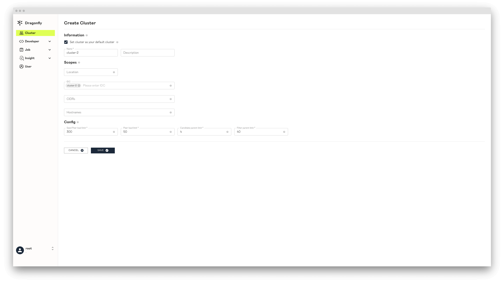
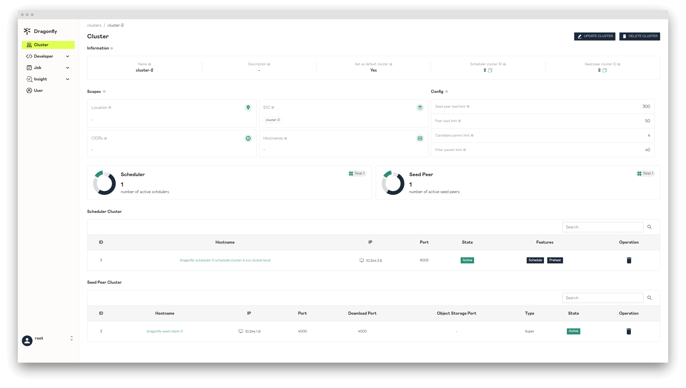

Documentation for deploying dragonfly on multi-cluster kubernetes using helm. A dragonfly cluster manages cluster within
a network. If you have two clusters with disconnected networks, you can use two dragonfly clusters to manage their own clusters.

The recommended deployment in a multi-cluster kubernetes is to use a dragonfly cluster to manage a kubernetes cluster,
and use a centralized manager service to manage multiple dragonfly clusters. Because peer can only transmit data in
its own dragonfly cluster, if a kubernetes cluster deploys a dragonfly cluster, then a kubernetes cluster forms a p2p network,
and internal peers can only schedule and transmit data in a kubernetes cluster.


## Runtime

You can have a quick start following [Helm Charts](../../installation/helm-charts).
We recommend to use `Containerd with CRI` and `CRI-O` client.

This table describes some container runtimes version and documents.

<!-- markdownlint-disable -->

| Runtime                 | Version | Document                                         | CRI Support | Pull Command                                |
| ----------------------- | ------- | ------------------------------------------------ | ----------- | ------------------------------------------- |
| Containerd<sup>\*</sup> | v1.1.0+ | [Link](../../../setup/runtime/containerd/mirror) | Yes         | crictl pull docker.io/library/alpine:latest |
| Containerd without CRI  | v1.1.0  | [Link](../../../setup/runtime/containerd/proxy)  | No          | ctr image pull docker.io/library/alpine     |
| CRI-O                   | All     | [Link](../../../setup/runtime/cri-o)             | Yes         | crictl pull docker.io/library/alpine:latest |

<!-- markdownlint-restore -->

`containerd` is recommended.

## Setup kubernetes cluster

[Kind](https://kind.sigs.k8s.io/) is recommended if no Kubernetes cluster is available for testing.

Create kind cluster configuration file `kind-config.yaml`, configuration content is as follows:

```yaml
kind: Cluster
apiVersion: kind.x-k8s.io/v1alpha4
nodes:
  - role: control-plane
  - role: worker
    extraPortMappings:
      - containerPort: 30950
        hostPort: 8080
    labels:
      cluster: a
  - role: worker
    labels:
      cluster: a
  - role: worker
    labels:
      cluster: b
  - role: worker
    labels:
      cluster: b
```

Create cluster using the configuration file:

```shell
kind create cluster --config kind-config.yaml
```

Switch the context of kubectl to kind cluster A:

```shell
kubectl config use-context kind-kind
```

## Kind loads dragonfly image

Pull dragonfly latest images:

```shell
docker pull dragonflyoss/scheduler:latest
docker pull dragonflyoss/manager:latest
docker pull dragonflyoss/dfdaemon:latest
```

Kind cluster loads dragonfly latest images:

```shell
kind load docker-image dragonflyoss/scheduler:latest
kind load docker-image dragonflyoss/manager:latest
kind load docker-image dragonflyoss/dfdaemon:latest
```

## Create dragonfly cluster A

Create dragonfly cluster A, the schedulers, seed peers, peers and centralized manager included in
the cluster should be installed using helm.

### Create dragonfly cluster A based on helm charts

Create dragonfly cluster A charts configuration file `charts-config-cluster-a.yaml`, configuration content is as follows:

```yaml
containerRuntime:
  containerd:
    enable: true
    injectConfigPath: true
    registries:
      - 'https://ghcr.io'

scheduler:
  image: dragonflyoss/scheduler
  tag: latest
  nodeSelector:
    cluster: a
  replicas: 1
  metrics:
    enable: true
  config:
    verbose: true
    pprofPort: 18066

seedPeer:
  image: dragonflyoss/dfdaemon
  tag: latest
  nodeSelector:
    cluster: a
  replicas: 1
  metrics:
    enable: true
  config:
    verbose: true
    pprofPort: 18066

dfdaemon:
  image: dragonflyoss/dfdaemon
  tag: latest
  nodeSelector:
    cluster: a
  metrics:
    enable: true
  config:
    verbose: true
    pprofPort: 18066

manager:
  image: dragonflyoss/manager
  tag: latest
  nodeSelector:
    cluster: a
  replicas: 1
  metrics:
    enable: true
  config:
    verbose: true
    pprofPort: 18066

jaeger:
  enable: true
```

Create dragonfly cluster A using the configuration file:

<!-- markdownlint-disable -->

```shell
$ helm repo add dragonfly https://dragonflyoss.github.io/helm-charts/
$ helm install --wait --create-namespace --namespace cluster-a dragonfly dragonfly/dragonfly -f charts-config-cluster-a.yaml
NAME: dragonfly
LAST DEPLOYED: Mon Aug  7 22:07:02 2023
NAMESPACE: cluster-a
STATUS: deployed
REVISION: 1
TEST SUITE: None
NOTES:
1. Get the scheduler address by running these commands:
  export SCHEDULER_POD_NAME=$(kubectl get pods --namespace cluster-a -l "app=dragonfly,release=dragonfly,component=scheduler" -o jsonpath={.items[0].metadata.name})
  export SCHEDULER_CONTAINER_PORT=$(kubectl get pod --namespace cluster-a $SCHEDULER_POD_NAME -o jsonpath="{.spec.containers[0].ports[0].containerPort}")
  kubectl --namespace cluster-a port-forward $SCHEDULER_POD_NAME 8002:$SCHEDULER_CONTAINER_PORT
  echo "Visit http://127.0.0.1:8002 to use your scheduler"

2. Get the dfdaemon port by running these commands:
  export DFDAEMON_POD_NAME=$(kubectl get pods --namespace cluster-a -l "app=dragonfly,release=dragonfly,component=dfdaemon" -o jsonpath={.items[0].metadata.name})
  export DFDAEMON_CONTAINER_PORT=$(kubectl get pod --namespace cluster-a $DFDAEMON_POD_NAME -o jsonpath="{.spec.containers[0].ports[0].containerPort}")
  You can use $DFDAEMON_CONTAINER_PORT as a proxy port in Node.

3. Configure runtime to use dragonfly:
  https://d7y.io/docs/getting-started/quick-start/kubernetes/


4. Get Jaeger query URL by running these commands:
  export JAEGER_QUERY_PORT=$(kubectl --namespace cluster-a get services dragonfly-jaeger-query -o jsonpath="{.spec.ports[0].port}")
  kubectl --namespace cluster-a port-forward service/dragonfly-jaeger-query 16686:$JAEGER_QUERY_PORT
  echo "Visit http://127.0.0.1:16686/search?limit=20&lookback=1h&maxDuration&minDuration&service=dragonfly to query download events"
```

<!-- markdownlint-restore -->

Check that dragonfly cluster A is deployed successfully:

```shell
$ kubectl get po -n cluster-a
NAME                                 READY   STATUS    RESTARTS      AGE
dragonfly-dfdaemon-7t6wc             1/1     Running   0             3m18s
dragonfly-dfdaemon-r45bk             1/1     Running   0             3m18s
dragonfly-jaeger-84dbfd5b56-fmhh6    1/1     Running   0             3m18s
dragonfly-manager-75f4c54d6d-tr88v   1/1     Running   0             3m18s
dragonfly-mysql-0                    1/1     Running   0             3m18s
dragonfly-redis-master-0             1/1     Running   0             3m18s
dragonfly-redis-replicas-0           1/1     Running   1 (2m ago)    3m18s
dragonfly-redis-replicas-1           1/1     Running   0             96s
dragonfly-redis-replicas-2           1/1     Running   0             45s
dragonfly-scheduler-0                1/1     Running   0             3m18s
dragonfly-seed-peer-0                1/1     Running   1 (37s ago)   3m18s
```

### Create NodePort service of the manager REST service

Create the manager REST service configuration file `manager-rest-svc.yaml`,
configuration content is as follows:

```yaml
apiVersion: v1
kind: Service
metadata:
  name: manager-rest
  namespace: cluster-a
spec:
  type: NodePort
  ports:
    - name: http
      nodePort: 30950
      port: 8080
  selector:
    app: dragonfly
    component: manager
    release: dragonfly
```

Create manager REST service using the configuration file:

```shell
kubectl apply -f manager-rest-svc.yaml -n cluster-a
```

### Visit manager console

Visit address `localhost:8080` to see the manager console. Sign in the console with the default root user,
the username is `root` and password is `dragonfly`.


By default, Dragonfly will automatically create dragonfly cluster A record in manager when
it is installed for the first time. You can click dragonfly cluster A to view the details.


## Create dragonfly cluster B

Create dragonfly cluster B, you need to create a dragonfly cluster record in the manager console first,
and the schedulers, seed peers and peers included in the dragonfly cluster should be installed using helm.

### Create dragonfly cluster B in the manager console

Visit manager console and click the `ADD CLUSTER` button to add dragonfly cluster B record.
Note that the IDC is set to `cluster-2` to match the peer whose IDC is `cluster-2`.



Create dragonfly cluster B record successfully.


### Use scopes to distinguish different dragonfly clusters

The dragonfly cluster needs to serve the scope. It wil provide scheduler services and
seed peer services to peers in the scope. The scopes of the dragonfly cluster are configured
when the console is created and updated. The scopes of the peer are configured in peer YAML config,
the fields are `host.idc`, `host.location` and `host.advertiseIP`,
refer to [dfdaemon config](../../../reference/configuration/dfdaemon).

If the peer scopes match the dragonfly cluster scopes, then the peer will use
the dragonfly cluster's scheduler and seed peer first, and if there is no matching
dragonfly cluster then use the default dragonfly cluster.

**Location**: The dragonfly cluster needs to serve all peers in the location. When the location in
the peer configuration matches the location in the dragonfly cluster, the peer will preferentially
use the scheduler and the seed peer of the dragonfly cluster. It separated by "|",
for example "area|country|province|city".

**IDC**: The dragonfly cluster needs to serve all peers in the IDC. When the IDC in the peer
configuration matches the IDC in the dragonfly cluster, the peer will preferentially use the
scheduler and the seed peer of the dragonfly cluster. IDC has higher priority than location
in the scopes.

**CIDRs**: The dragonfly cluster needs to serve all peers in the CIDRs. The advertise IP will be reported in the peer
configuration when the peer is started, and if the advertise IP is empty in the peer configuration,
peer will automatically get expose IP as advertise IP. When advertise IP of the peer matches the CIDRs in dragonfly cluster,
the peer will preferentially use the scheduler and the seed peer of the dragonfly cluster.
CIDRs has higher priority than IDC in the scopes.

### Create dragonfly cluster B based on helm charts

Create charts configuration with cluster information in the manager console.


- `Scheduler.config.manager.schedulerClusterID` using the `Scheduler cluster ID`
  from `cluster-2` information in the manager console.
- `Scheduler.config.manager.addr` is address of the manager GRPC server.
- `seedPeer.config.scheduler.manager.seedPeer.clusterID` using the `Seed peer cluster ID`
  from `cluster-2` information in the manager console.
- `seedPeer.config.scheduler.manager.netAddrs[0].addr` is address of the manager GRPC server.
- `dfdaemon.config.host.idc` using the `IDC` from `cluster-2` information in the manager console.
- `dfdaemon.config.scheduler.manager.netAddrs[0].addr` is address of the manager GRPC server.
- `externalManager.host` is host of the manager GRPC server.
- `externalRedis.addrs[0]` is address of the redis.

Create dragonfly cluster B charts configuration file `charts-config-cluster-b.yaml`,
configuration content is as follows:

```yaml
containerRuntime:
  containerd:
    enable: true
    injectConfigPath: true
    registries:
      - 'https://ghcr.io'

scheduler:
  image: dragonflyoss/scheduler
  tag: latest
  nodeSelector:
    cluster: b
  replicas: 1
  config:
    manager:
      addr: dragonfly-manager.cluster-a.svc.cluster.local:65003
      schedulerClusterID: 2

seedPeer:
  image: dragonflyoss/dfdaemon
  tag: latest
  nodeSelector:
    cluster: b
  replicas: 1
  config:
    scheduler:
      manager:
        netAddrs:
          - type: tcp
            addr: dragonfly-manager.cluster-a.svc.cluster.local:65003
        seedPeer:
          enable: true
          clusterID: 2

dfdaemon:
  image: dragonflyoss/dfdaemon
  tag: latest
  nodeSelector:
    cluster: b
  config:
    host:
      idc: cluster-2
    scheduler:
      manager:
        netAddrs:
          - type: tcp
            addr: dragonfly-manager.cluster-a.svc.cluster.local:65003

manager:
  enable: false

externalManager:
  enable: true
  host: dragonfly-manager.cluster-a.svc.cluster.local
  restPort: 8080
  grpcPort: 65003

redis:
  enable: false

externalRedis:
  addrs:
    - dragonfly-redis-master.cluster-a.svc.cluster.local:6379
  password: dragonfly

mysql:
  enable: false

jaeger:
  enable: true
```

Create dragonfly cluster B using the configuration file:

<!-- markdownlint-disable -->

```shell
$ helm install --wait --create-namespace --namespace cluster-b dragonfly dragonfly/dragonfly -f charts-config-cluster-b.yaml
NAME: dragonfly
LAST DEPLOYED: Mon Aug  7 22:13:51 2023
NAMESPACE: cluster-b
STATUS: deployed
REVISION: 1
TEST SUITE: None
NOTES:
1. Get the scheduler address by running these commands:
  export SCHEDULER_POD_NAME=$(kubectl get pods --namespace cluster-b -l "app=dragonfly,release=dragonfly,component=scheduler" -o jsonpath={.items[0].metadata.name})
  export SCHEDULER_CONTAINER_PORT=$(kubectl get pod --namespace cluster-b $SCHEDULER_POD_NAME -o jsonpath="{.spec.containers[0].ports[0].containerPort}")
  kubectl --namespace cluster-b port-forward $SCHEDULER_POD_NAME 8002:$SCHEDULER_CONTAINER_PORT
  echo "Visit http://127.0.0.1:8002 to use your scheduler"

2. Get the dfdaemon port by running these commands:
  export DFDAEMON_POD_NAME=$(kubectl get pods --namespace cluster-b -l "app=dragonfly,release=dragonfly,component=dfdaemon" -o jsonpath={.items[0].metadata.name})
  export DFDAEMON_CONTAINER_PORT=$(kubectl get pod --namespace cluster-b $DFDAEMON_POD_NAME -o jsonpath="{.spec.containers[0].ports[0].containerPort}")
  You can use $DFDAEMON_CONTAINER_PORT as a proxy port in Node.

3. Configure runtime to use dragonfly:
  https://d7y.io/docs/getting-started/quick-start/kubernetes/


4. Get Jaeger query URL by running these commands:
  export JAEGER_QUERY_PORT=$(kubectl --namespace cluster-b get services dragonfly-jaeger-query -o jsonpath="{.spec.ports[0].port}")
  kubectl --namespace cluster-b port-forward service/dragonfly-jaeger-query 16686:$JAEGER_QUERY_PORT
  echo "Visit http://127.0.0.1:16686/search?limit=20&lookback=1h&maxDuration&minDuration&service=dragonfly to query download events"
```

<!-- markdownlint-restore -->

Check that dragonfly cluster B is deployed successfully:

```shell
$ kubectl get po -n dragonfly-system
NAME                                READY   STATUS    RESTARTS   AGE
dragonfly-dfdaemon-q8bsg            1/1     Running   0          67s
dragonfly-dfdaemon-tsqls            1/1     Running   0          67s
dragonfly-jaeger-84dbfd5b56-rg5dv   1/1     Running   0          67s
dragonfly-scheduler-0               1/1     Running   0          67s
dragonfly-seed-peer-0               1/1     Running   0          67s
```

Create dragonfly cluster B successfully.



## Using dragonfly to distribute images for multi-cluster kubernetes

### Containerd pull image back-to-source for the first time through dragonfly in cluster A

Pull `ghcr.io/dragonflyoss/dragonfly2/scheduler:v2.0.5` image in `kind-worker` node:

```shell
docker exec -i kind-worker /usr/local/bin/crictl pull ghcr.io/dragonflyoss/dragonfly2/scheduler:v2.0.5
```

Expose jaeger's port `16686`:

```shell
kubectl --namespace cluster-a port-forward service/dragonfly-jaeger-query 16686:16686
```

Visit the Jaeger page in [http://127.0.0.1:16686/search](http://127.0.0.1:16686/search), Search for tracing with Tags
`http.url="/v2/dragonflyoss/dragonfly2/scheduler/blobs/sha256:82cbeb56bf8065dfb9ff5a0c6ea212ab3a32f413a137675df59d496e68eaf399?ns=ghcr.io"`:


Tracing details:


When pull image back-to-source for the first time through dragonfly, peer uses `cluster-a`'s scheduler and seed peer.
It takes `1.47s` to download the `82cbeb56bf8065dfb9ff5a0c6ea212ab3a32f413a137675df59d496e68eaf399` layer.

### Containerd pull image hits the cache of remote peer in cluster A

Pull `ghcr.io/dragonflyoss/dragonfly2/scheduler:v2.0.5` image in `kind-worker2` node:

```shell
docker exec -i kind-worker2 /usr/local/bin/crictl pull ghcr.io/dragonflyoss/dragonfly2/scheduler:v2.0.5
```

Expose jaeger's port `16686`:

```shell
kubectl --namespace cluster-a port-forward service/dragonfly-jaeger-query 16686:16686
```

Visit the Jaeger page in [http://127.0.0.1:16686/search](http://127.0.0.1:16686/search), Search for tracing with Tags
`http.url="/v2/dragonflyoss/dragonfly2/scheduler/blobs/sha256:82cbeb56bf8065dfb9ff5a0c6ea212ab3a32f413a137675df59d496e68eaf399?ns=ghcr.io"`:


Tracing details:


When pull image hits cache of remote peer, peer uses `cluster-a`'s scheduler and seed peer. It takes `37.48ms` to
download the `82cbeb56bf8065dfb9ff5a0c6ea212ab3a32f413a137675df59d496e68eaf399` layer.

### Containerd pull image back-to-source for the first time through dragonfly in cluster B

Pull `ghcr.io/dragonflyoss/dragonfly2/scheduler:v2.0.5` image in `kind-worker3` node:

```shell
docker exec -i kind-worker3 /usr/local/bin/crictl pull ghcr.io/dragonflyoss/dragonfly2/scheduler:v2.0.5
```

Expose jaeger's port `16686`:

```shell
kubectl --namespace cluster-b port-forward service/dragonfly-jaeger-query 16686:16686
```

Visit the Jaeger page in [http://127.0.0.1:16686/search](http://127.0.0.1:16686/search), Search for tracing with Tags
`http.url="/v2/dragonflyoss/dragonfly2/scheduler/blobs/sha256:82cbeb56bf8065dfb9ff5a0c6ea212ab3a32f413a137675df59d496e68eaf399?ns=ghcr.io"`:


Tracing details:


When pull image back-to-source for the first time through dragonfly, peer uses `cluster-b`'s scheduler and seed peer.
It takes `4.97s` to download the `82cbeb56bf8065dfb9ff5a0c6ea212ab3a32f413a137675df59d496e68eaf399` layer.

### Containerd pull image hits the cache of remote peer in cluster B

Pull `ghcr.io/dragonflyoss/dragonfly2/scheduler:v2.0.5` image in `kind-worker4` node:

```shell
docker exec -i kind-worker4 /usr/local/bin/crictl pull ghcr.io/dragonflyoss/dragonfly2/scheduler:v2.0.5
```

Expose jaeger's port `16686`:

```shell
kubectl --namespace cluster-b port-forward service/dragonfly-jaeger-query 16686:16686
```

Visit the Jaeger page in [http://127.0.0.1:16686/search](http://127.0.0.1:16686/search), Search for tracing with Tags
`http.url="/v2/dragonflyoss/dragonfly2/scheduler/blobs/sha256:82cbeb56bf8065dfb9ff5a0c6ea212ab3a32f413a137675df59d496e68eaf399?ns=ghcr.io"`:


Tracing details:


When pull image hits cache of remote peer, peer uses `cluster-b`'s scheduler and seed peer. It takes `14.53ms` to
download the `82cbeb56bf8065dfb9ff5a0c6ea212ab3a32f413a137675df59d496e68eaf399` layer.
