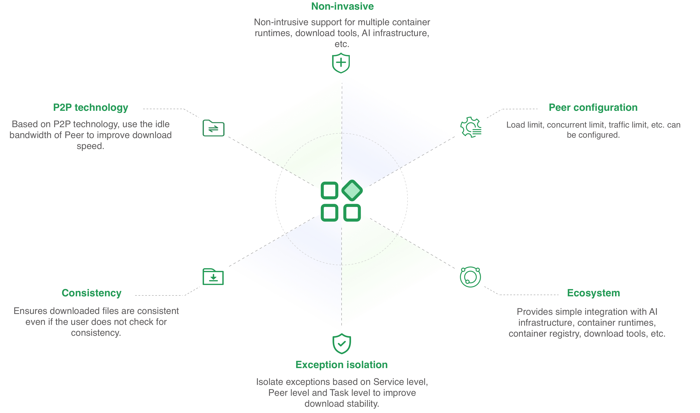
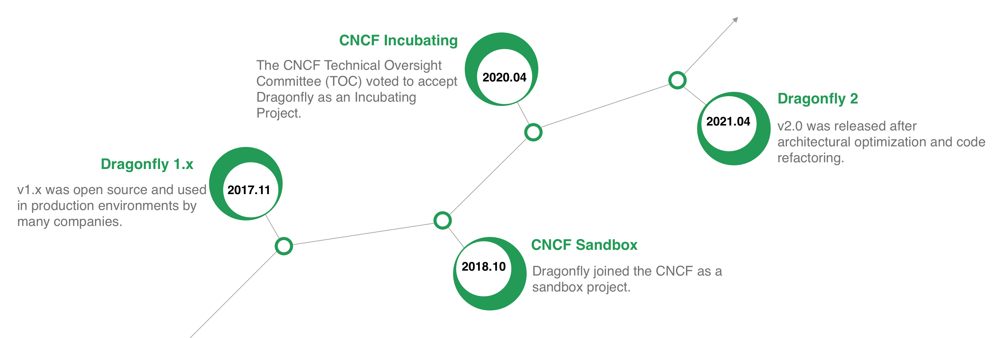

Dragonfly is a file distribution and mirror acceleration system based on P2P technology, which improves the efficiency of large-scale file transfer and maximizes the use of network bandwidth. It is used in the fields of image distribution, file distribution, log distribution, AI model distribution, and AI data set distribution.

## Features

- **P2P technology**: Based on P2P technology, use the idle bandwidth of Peer to improve download speed.
- **Non-invasive**: Non-intrusive support for multiple container runtimes, download tools, AI infrastructure, etc.
- **Peer configuration**: Load limit, concurrent limit, traffic limit, etc. can be configured.
- **Consistency**: Ensures downloaded files are consistent even if the user does not check for consistency.
- **Exception isolation**: Isolate exceptions based on Service level, Peer level and Task level to improve download stability.
-**Ecosystem**: Provides simple integration with AI infrastructure, container runtimes, container registry, download tools, etc.

## Milestone

Since being open sourced in 2017, Dragonfly has been selected by many companies and put into production. And officially entered CNCF in October 2018,
becoming the third project in China to become a CNCF Sandbox. In April 2020,
the CNCF Technical Oversight Committee (TOC) voted to accept Dragonfly as a CNCF Incubating project.
On the basis of maintaining the original core capabilities of [Dragonfly1.x](https://github.com/dragonflyoss/Dragonfly),
Dragonfly 2 was released after architecture optimization and code reconstruction.

## Architecture

Dragonfly architecture includes Manager, Scheduler, Seed Peer and Peer. For details, please refer to  [Architecture](./concepts/terminology/architecture),The following are the functions of each module:

- **Manager**: Manager plays the role of a manager and provides functions such as dynamic configuration management and data collection. It also includes a front-end console to facilitate users to visually operate the cluster.
- **Scheduler**: Choose the best parent node for the download node. At the appropriate time, control the Seed Peer to perform back-to-source downloading or the Peer to perform back-to-source downloading.
- **Seed Peer**: Provides upload and download capabilities. It can be actively triggered by the Scheduler to go back to the source and serve as the root node in the P2P node.
- **Peer**: Provides upload and download capabilities.

## How it works

When downloading an image or file, the download request is proxied to Dragonfly through the Peer's HTTP Proxy. The Peer will register the Task with the Scheduler, and the Scheduler will determine whether the Task is downloaded for the first time. If it is the first download, the Seed Peer will be triggered to download back to the source. During the download process, the Task will be segmented based on Pieces. Peer will establish a shared stream with Scheduler, and then schedule Seed Peer to Peer for downloading. Download transmission between Seed Peer and Peer is based on Piece level streaming. Every time Peer successfully downloads a Piece, it will report the information to Scheduler for next scheduling use. If it is not the first download, the Scheduler will schedule other Peer downloads. Peer downloads Piece from different Peers, splices and returns the entire file, and the P2P download is completed.

