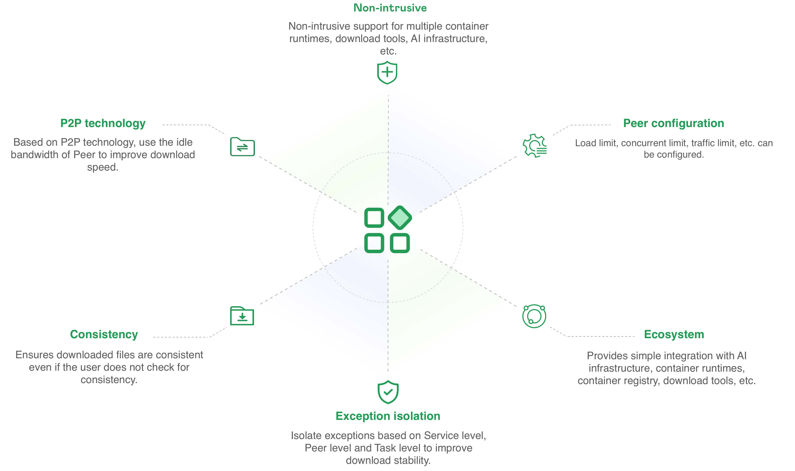
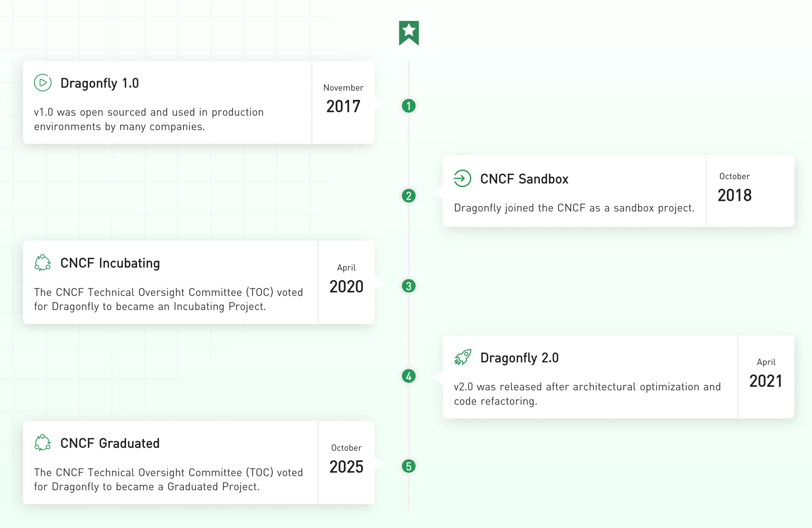

Delivers efficient, stable, and secure data distribution and acceleration powered by P2P technology,
with an optional content‑addressable filesystem that accelerates OCI container launch.
It aims to provide a best‑practice, standards‑based solution for cloud‑native architectures, improving large‑scale delivery of
files, container images, OCI artifacts, AI/ML models, caches, logs, dependencies, etc.

## Features {#features}

Here are some of the features that Dragonfly offers:

- **P2P technology**: Based on P2P technology to utilize idle bandwidth across Peers, significantly improving download speeds.
- **Non-intrusive Integration**: Seamlessly supports multiple container runtimes, download tools, AI infrastructure, etc.
- **Load-Aware Scheduling Algorithm**: A two-stage scheduling algorithm combining central scheduling with node-level secondary
  scheduling to optimize P2P download performance based on real-time load awareness.
- **Data Consistency**: Ensures downloaded files are consistent, even when users do not explicitly verify consistency.
- **Exception isolation**: Isolate exceptions at Service level, Peer level and Task level to improve
  download stability and reliability.
- **Ecosystem**: Provides simple integration with AI infrastructure, container runtimes, container registry,
  download tools, etc.

## Milestones {#milestones}

Dragonfly was accepted to CNCF on November 13, 2018, moved to the Incubating maturity level on April 9,
2020, and then moved to the Graduated maturity level on October 28, 2025.

## Architecture

Dragonfly services could be divided into four categories: Manager, Scheduler, Seed Peer and Peer. Please refer to [Architecture](./operations/deployment/architecture.md).

- **Manager**: Manages relationships across P2P clusters. It provides dynamic configuration management
  and data collection capabilities. It also includes a front-end console that enables users to
  visually operate and manage clusters.
- **Scheduler**: Selects the optimal parents for each downloading Peer. It triggers Seed Peers or Peers to download directly
  from the source when necessary.
- **Seed Peer**: Serves as a root Peer in the P2P network, providing both upload and download capabilities.
  It can be actively triggered by the Scheduler to download from the source and distribute content to other Peers.
- **Peer**: Provides upload and download capabilities.

## How it works

When downloading container images or files, clients can initiate requests to the Peer via either HTTP/HTTPS Proxy or gRPC.
The Peer first registers the Task with the Scheduler, which then checks the Task metadata to determine whether this Task
is being downloaded for the first time within the P2P cluster.

**First-time Download in P2P Cluster:** If this is the first download, the Scheduler triggers the Seed Peer to download directly from the source.
The Task is then divided into pieces. After successful registration, the Peer establishes a connection with the Scheduler for this Task.
The Scheduler then coordinates streaming from the Seed Peer to the Peer on a piece-by-piece basis. As each piece is successfully downloaded,
its metadata is reported back to the Scheduler to facilitate subsequent scheduling.

**Subsequent Downloads in P2P Cluster:** If the Peer already has the required pieces cached locally,
it directly assembles and returns the file without contacting the Scheduler. Otherwise, if this
is not the first-time download, the Scheduler assigns other Peers that already have the content
to serve the request. The Peer downloads pieces from multiple Parents in parallel, assembles
them into the complete file, and the P2P download is complete.

