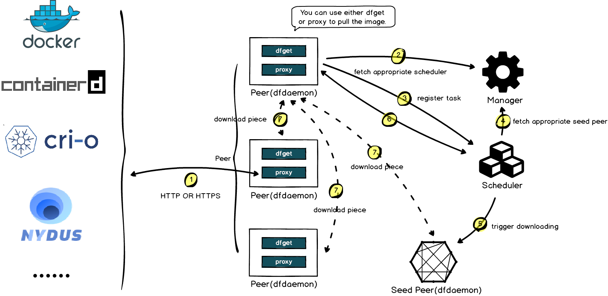

Dragonfly is an open-source p2p-based image and file Distribution System.
It is designed to improve the efficiency and speed of large-scale file distribution.
It is extensively used in areas such as image distribution, file delivery, AI model distribution,
and AI dataset distribution.

## Features

The fundamental capabilities offered include:

- **P2P technology**: Based on P2P technology, use the idle bandwidth of Peer to improve download speed.
- **Non-invasive**: Non-intrusive support for multiple container runtimes, download tools, AI infrastructure, etc.
- **Peer configuration**: Load limit, concurrent limit, traffic limit, etc. can be configured.
- **Consistency**: Ensures downloaded files are consistent even if the user does not check for consistency.
- **Exception isolation**: Isolate exceptions based on Service level, Peer level and Task level to improve
download stability.
- **Ecosystem**: Provides simple integration with AI infrastructure, container runtimes, container registry,
download tools, etc.

## Milestone

Since its open source inception in 2017, Dragonfly has been embraced by numerous companies for production use.
It officially became a part of the Cloud Native Computing Foundation (CNCF) in October 2018,
marking it as the third Chinese project to enter the CNCF Sandbox. In April 2020,
the CNCF Technical Oversight Committee (TOC) voted to accept Dragonfly as an incubating project.
Following enhancements in architecture and code
refactoring while preserving the original core capabilities of
[Dragonfly1.x](https://github.com/dragonflyoss/Dragonfly), Dragonfly 2 was released.

## Architecture

The Dragonfly architecture is primarily divided into four components: Manager, Scheduler,
Seed Peer, and Peer. 
For detailed information, please refer to the [Architecture](./concepts/terminology/architecture).

- **Manager**: In a multi-P2P cluster deployment scenario, the Manager plays the role of an administrator.
It primarily offers functions such as dynamic configuration management and data collection.
It also includes a front-end console, enabling users to visually operate and manage the cluster.
- **Scheduler**: Select the optimal download parent peer for the download peer.
When appropriate,
it triggers the Seed Peer to perform a back-to-source download,
or enables the Peer to carry out the download from the back-to-source.
- **Seed Peer**: It offers upload and download capabilities and can serve as a root node in the P2P network,
allowing the Scheduler to actively initiate back-to-source.
- **Peer**: Provides the capability for both uploading and downloading.

## How it works

When downloading an image or file, it proxies the request via its HTTP Proxy to Dragonfly.
The Peer registers the Task with the Scheduler, which determines if it is the first
time the Task is being downloaded.
If it is, the Scheduler triggers a Seed Peer to perform a back-to-source download,
with the Task being split into Pieces during this process.
The Peer establishes a shared stream with the Scheduler, which then schedules the Seed Peer for the download.
The download between the Seed Peer and the Peer is conducted in a streaming manner at the Piece level.
After each successful Piece download, the Peer reports the information back to the Scheduler for future scheduling.
If it's not the first download,
the Scheduler assigns other Peers for the download. The Peer then downloads Pieces from various Peers,
assembles the complete file and thus the P2P download is completed.

