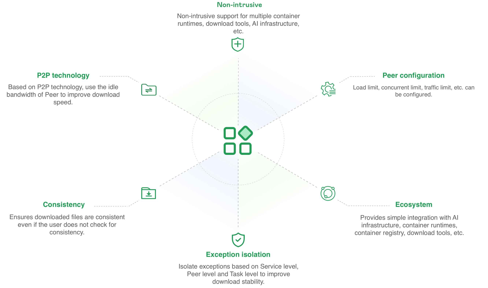
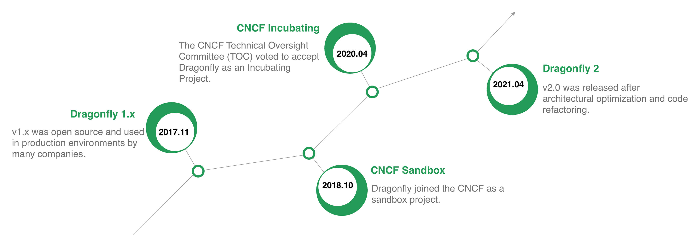

Dragonfly is an file distribution and image acceleration based on p2p technology.
It is designed to increase the efficiency of large-scale data distribution and improve idle bandwidth usage of peer.
It is widely used in various domains such as image acceleration, file distribution,
AI model distribution, AI dataset distribution, etc.

## Features {#features}

Here are some of the features that Dragonfly offers:

- **P2P technology**: Based on P2P technology, use the idle bandwidth of Peer to improve download speed.
- **Non-invasive**: Non-intrusive support for multiple container runtimes, download tools, AI infrastructure, etc.
- **Peer configuration**: Load limit, concurrent limit, traffic limit, etc. can be configured.
- **Consistency**: Ensures downloaded files are consistent even if the user does not check for consistency.
- **Exception isolation**: Isolate exceptions based on Service level, Peer level and Task level to improve
download stability.
- **Ecosystem**: Provides simple integration with AI infrastructure, container runtimes, container registry,
download tools, etc.

## Milestones {#milestones}

[Dragonfly 1.x](https://github.com/dragonflyoss/Dragonfly) has been open source in November 2017 and used in production
environments by many companies.
And joined the CNCF as a sandbox project in October 2018.
In April 2020, The CNCF Technical Oversight Committee (TOC) voted to accept Dragonfly as an Incubating Project.
In April 2021, Dragonfly 2.0 was released after architectural optimization and code refactoring.

## Architecture

Dragonfly services could be divided into four categories: Manager, Scheduler, Seed Peer and Peer.

- **Manager**: Maintain the relationship between each P2P cluster,
It primarily offers functions such as dynamic configuration management and data collection.
It also includes a front-end console, enabling users to visually operate and manage the cluster.
- **Scheduler**: Select the best download parent node for the download node. At the appropriate time,
trigger Seed Peer to perform back-to-source downloading, or Peer to perform back-to-source downloading.
- **Seed Peer**: Provides upload and download functions and can serve as a root node in the P2P network,
allowing the Scheduler to actively initiate back-to-source.
- **Peer**: Provides upload and download functions.

Below is the Dragonfly architecture diagram. You can find more detailed architecture docs in [Architecture](./concepts/terminology/architecture).

## How it works

When downloading an image or file, the download request is proxied to Dragonfly via the Peer HTTP Proxy.
Peer will first register the Task with the Scheduler, and the Scheduler will check the Task metadata
to determine whether the Task is downloaded for the first time in the P2P cluster.
If this is the first time downloading, the Seed Peer will be triggered to download back-to-source,
and the Task will be divided based on the piece level.
After successful registration, The peer establishes a connection to the scheduler based on this task,
and then schedule the Seed Peer to the Peer for streaming based on piece level.
when a piece is successfully downloaded, the piece metadata will be reported to the Scheduler for next scheduling.
If this is not the first time downloading, the Scheduler will schedule other Peers for the download.
The Peer will download pieces from different Peers, splices and returns the entire file, then the P2P download is completed.

