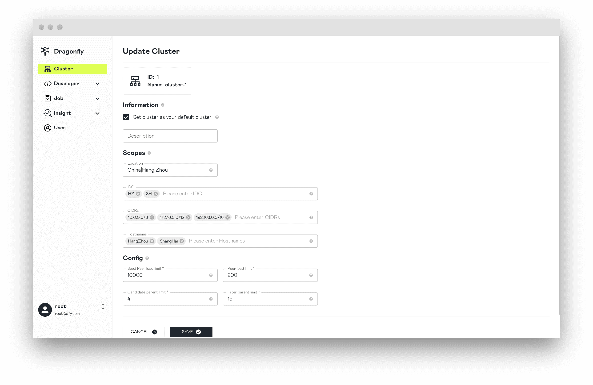

## Capacity Planning

First, you need to estimate the highest expected file/image storage capacity for
the cluster for a considerable period in the future.

Second, you need to have a clear understanding of the machine resources currently available.
Know the memory size, CPU core count, and disk capacity of each machine.

### Manager

It is recommended to deploy at least 3 per cluster.

<!-- markdownlint-disable -->

| Peer Count | CPU | Memory | Disk  |
| ---------- | --- | ------ | ----- |
| 1K         | 8C  | 16G    | 200Gi |
| 5K         | 16C | 32G    | 200Gi |
| 10K        | 16C | 64G    | 200Gi |

<!-- markdownlint-restore -->

### Scheduler

It is recommended to deploy at least 3 per cluster.

<!-- markdownlint-disable -->

| Downloads Per Second | CPU | Memory | Disk  |
| -------------------- | --- | ------ | ----- |
| 1K                   | 8C  | 16G    | 200Gi |
| 3K                   | 16C | 32G    | 200Gi |
| 5K                   | 16C | 64G    | 200Gi |

<!-- markdownlint-restore -->

### Client

<!-- markdownlint-disable -->

If it is a Seed Peer, it is recommended to deploy at least 3 per cluster. The Disk size is based on the total size of different files/images in the Cache and is calculated by the user based on needs.

| Downloads Per Second | CPU | Memory | Disk  |
| -------------------- | --- | ------ | ----- |
| 500                  | 8C  | 16G    | 500Gi |
| 1K                   | 8C  | 16G    | 3Ti   |
| 3K                   | 16C | 32G    | 5Ti   |

<!-- markdownlint-restore -->

### Cluster

<!-- markdownlint-disable -->

| Peer Count | Manager            | Scheduler          | Seed Peer         | Peer        |
| ---------- | ------------------ | ------------------ | ----------------- | ----------- |
| 500        | 4C-8G-200Gi \* 3   | 8C-16G-200Gi \* 3  | 8C-16G-1Ti \* 3   | 4C-8G-500Gi |
| 1K         | 8C-16G-200Gi \* 3  | 8C-16G-200Gi \* 3  | 8C-16G-3Ti \* 3   | 4C-8G-500Gi |
| 3K         | 16C-32G-200Gi \* 3 | 16C-32G-200Gi \* 3 | 16C-32G-5Ti \* 3  | 4C-8G-500Gi |
| 5K         | 16C-64G-200Gi \* 3 | 32C-64G-200Gi \* 3 | 32C-64G-10Ti \* 3 | 4C-8G-500Gi |

<!-- markdownlint-restore -->

## Performance tuning

### Upstream bandwidth

Mainly used for node P2P sharing of Piece bandwidth.
it is recommended that the configuration be the same as the upstream bandwidth of the machine.
Please refer to [dfdaemon.yaml](../../reference/configuration/client/dfdaemon.md).

```yaml
upload:
  server:
    # -- port is the port to the grpc server.
    port: 4000
    ## ip is the listen ip of the grpc server.
    # ip: ""
  # -- rateLimit is the default rate limit of the upload speed in bps(bytes per second), default is 20Gbps.
  rateLimit: 20000000000
```

### Downlink bandwidth

It mainly affects the bandwidth of the node returning to the source and the bandwidth downloaded from Remote Peer.
It is recommended that the configuration be the same as the downlink bandwidth of the machine.
Please refer to [dfdaemon.yaml](../../reference/configuration/client/dfdaemon.md).

```yaml
download:
  server:
    # -- socketPath is the unix socket path for dfdaemon GRPC service.
    socketPath: /var/run/dragonfly/dfdaemon.sock
  # -- rateLimit is the default rate limit of the download speed in bps(bytes per second), default is 20Gbps.
  rateLimit: 20000000000
```

### Piece concurrency

When downloading a single task of the main role node,
the number of concurrent pieces downloaded back to the source and the
number of concurrent pieces downloaded from the Remote Peer.
The larger the number of Piece concurrency, the faster the task download, and the more CPU and Memory will be consumed.
Users can adjust the CPU and Memory configuration of the Client while adjusting the
number of Piece concurrency according to the actual situation.
Please refer to [dfdaemon.yaml](../../reference/configuration/client/dfdaemon.md).

```yaml
download:
  # --   pieceTimeout is the timeout for downloading a piece from source.
  pieceTimeout: 30s
  # -- concurrentPieceCount is the number of concurrent pieces to download.
  concurrentPieceCount: 10
```

### Force GC

Mainly used for task GC in the node disk, `taskTTL` is calculated by itself according to the cache time required by the task.
Please refer to [dfdaemon.yaml](../../reference/configuration/client/dfdaemon.md).

```yaml
gc:
  # interval is the interval to do gc.
  interval: 900s
  policy:
    # taskTTL is the ttl of the task.
    taskTTL: 21600s
    # distHighThresholdPercent is the high threshold percent of the disk usage.
    # If the disk usage is greater than the threshold, dfdaemon will do gc.
    distHighThresholdPercent: 80
    # distLowThresholdPercent is the low threshold percent of the disk usage.
    # If the disk usage is less than the threshold, dfdaemon will stop gc.
    distLowThresholdPercent: 60
```

### Nydus

When Dragonfly serves as Nydus cache, you only need to deploy Manager, Scheduler and Seed Peer.
Since Nydus will split the file into chunks of about 1MB, it requests to load the file on demand.
Therefore, Seed Peer's HTTP Proxy is used as the cache server of Nydus
and P2P is performed internally to reduce return-to-origin requests and return-to-origin bandwidth.
Please refer to [nydus](../integrations/container-runtime/nydus.md)

**1.** `proxy.rules.regex` is to match the URL of the Nydus repository. In this way,
traffic can be intercepted and sent to the P2P network.

```yaml
proxy:
  # rules is the list of rules for the proxy server.
  # regex is the regex of the request url.
  # useTLS indicates whether use tls for the proxy backend.
  # redirect is the redirect url.
  # filteredQueryParams is the filtered query params to generate the task id.
  # When filter is ["Signature", "Expires", "ns"], for example:
  # http://example.com/xyz?Expires=e1&Signature=s1&ns=docker.io and http://example.com/xyz?Expires=e2&Signature=s2&ns=docker.io
  # will generate the same task id.
  # Default value includes the filtered query params of s3, gcs, oss, obs, cos.
  rules:
    - regex: 'blobs/sha256.*'
      # useTLS: false
      # redirect: ""
      # filteredQueryParams: []
```

**2.** It is recommended to change the `Seed peer load limit` to 10000 or higher,
which can improve the P2P Cache hit rate between Seed Peers.

Click the `UPDATE CLUSTER` button to change the `Seed peer load limit` to 10000.
Please refer to [update-cluster](https://d7y.io/docs/next/advanced-guides/web-console/cluster/#update-cluster).



Changed `Seed peer load limit` successfully.


**3.** When Prefetch is turned on, Nydus will initiate an HTTP Range request of about 1MB to achieve on-demand downloading.
When Prefetch is turned on, the Seed Peer can prefetch the complete resource after receiving the HTTP Range request,
improving the cache hit rate. Please refer to [dfdaemon.yaml](../../reference/configuration/client/dfdaemon.md).

```yaml
proxy:
  # prefetch pre-downloads full of the task when download with range request.
  prefetch: false
```

**4.** Proxy's readBufferSize can be adjusted to 64KB to reduce Proxy request time.
Please refer to [dfdaemon.yaml](../../reference/configuration/client/dfdaemon.md).

```yaml
proxy:
  # -- readBufferSize is the buffer size for reading piece from disk, default is 32KB.
  readBufferSize: 32768
```
