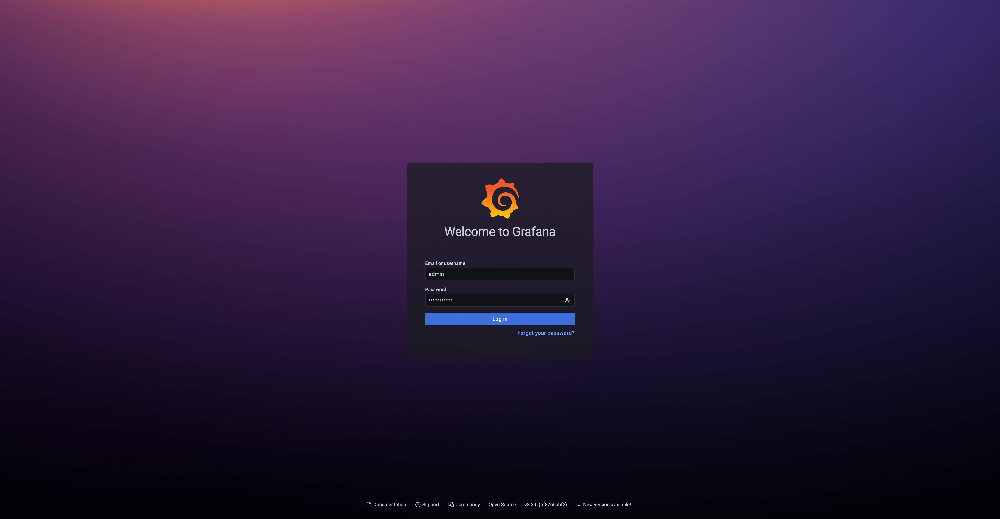
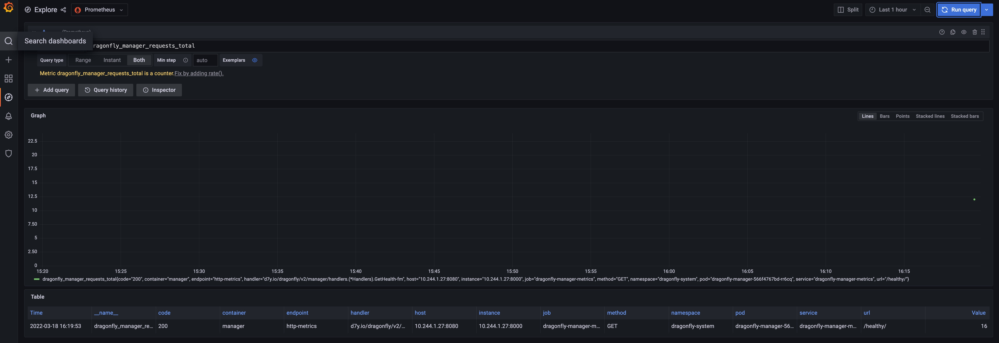
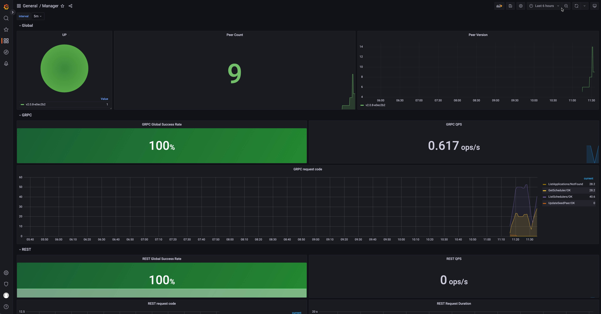

Dragonfly is recommending to use [prometheus](https://prometheus.io/) for monitoring.
Prometheus and grafana configurations are maintained in the
[dragonflyoss/monitoring](https://github.com/dragonflyoss/monitoring/) repository.

Grafana dashboards are published in [grafana.com](https://grafana.com/),
and the address of the dashboards are [Manager](https://grafana.com/grafana/dashboards/15945/),
[Scheduler](https://grafana.com/grafana/dashboards/15944/) and
[Peer](https://grafana.com/grafana/dashboards/15946/).

The following Dragonfly monitoring example is based on [kubernetes](https://kubernetes.io/), and uses the
[prometheus-community/kube-prometheus-stack](https://artifacthub.io/packages/helm/prometheus-community/kube-prometheus-stack/)
charts to deploy prometheus and grafana.

## Prerequisites {#prerequisites}

| Name               | Version  | Document                                |
| ------------------ | -------- | --------------------------------------- |
| Kubernetes cluster | 1.20+    | [kubernetes.io](https://kubernetes.io/) |
| Helm               | v3.8.0+  | [helm.sh](https://helm.sh/)             |
| Prometheus         | v2.40.0+ | [prometheus.io](https://prometheus.io/) |

## Setup kubernetes cluster {#setup-kubernetes-cluster}

[Kind](https://kind.sigs.k8s.io/) is recommended if no Kubernetes cluster is available for testing.

Create kind multi-node cluster configuration file `kind-config.yaml`, configuration content is as follows:

```yaml
kind: Cluster
apiVersion: kind.x-k8s.io/v1alpha4
nodes:
  - role: control-plane
  - role: worker
  - role: worker
```

Create a kind multi-node cluster using the configuration file:

```shell
kind create cluster --config kind-config.yaml
```

Switch the context of kubectl to kind cluster:

```shell
kubectl config use-context kind-kind
```

## Kind loads Dragonfly image {#kind-loads-dragonfly-image}

Pull Dragonfly latest images:

```shell
docker pull dragonflyoss/scheduler:latest
docker pull dragonflyoss/manager:latest
docker pull dragonflyoss/client:latest
docker pull dragonflyoss/dfinit:latest
```

Kind cluster loads Dragonfly latest images:

```shell
kind load docker-image dragonflyoss/scheduler:latest
kind load docker-image dragonflyoss/manager:latest
kind load docker-image dragonflyoss/client:latest
kind load docker-image dragonflyoss/dfinit:latest
```

## Create Prometheus and Grafana based on Helm Charts{#create-prometheus-and-grafana-based-on-helm-charts}

Install prometheus and grafana based on [kube-prometheus-stack](https://artifacthub.io/packages/helm/prometheus-community/kube-prometheus-stack)

<!-- markdownlint-disable -->

```bash
$ helm repo add prometheus-community https://prometheus-community.github.io/helm-charts
$ helm install --create-namespace --namespace prometheus prometheus prometheus-community/kube-prometheus-stack -f https://raw.githubusercontent.com/dragonflyoss/monitoring/main/prometheus/values.yaml
NAME: prometheus
LAST DEPLOYED: Tue Jun 11 15:37:56 2024
NAMESPACE: default
STATUS: deployed
REVISION: 1
NOTES:
kube-prometheus-stack has been installed. Check its status by running:
  kubectl --namespace default get pods -l "release=prometheus"

Visit https://github.com/prometheus-operator/kube-prometheus for instructions on how to create & configure Alertmanager and Prometheus instances using the Operator.
```

<!-- markdownlint-restore -->

Check that Prometheus is deployed successfully:

```shell
$ kubectl get po -n prometheus
NAME                                                     READY   STATUS    RESTARTS      AGE
alertmanager-prometheus-kube-prometheus-alertmanager-0   2/2     Running   2 (47m ago)   71m
prometheus-grafana-7576556869-jzpsf                      3/3     Running   3 (47m ago)   73m
prometheus-kube-prometheus-operator-fd56bbb4f-29sp6      1/1     Running   2 (47m ago)   73m
prometheus-kube-state-metrics-7d7654ff7-7vtrg            1/1     Running   2 (47m ago)   73m
prometheus-prometheus-kube-prometheus-prometheus-0       2/2     Running   2 (47m ago)   71m
prometheus-prometheus-node-exporter-8dl68                1/1     Running   1 (47m ago)   73m
prometheus-prometheus-node-exporter-jlgcp                1/1     Running   1 (47m ago)   73m
prometheus-prometheus-node-exporter-tlhld                1/1     Running   1 (47m ago)   73m
```

Expose grafana port 8080 and access the address `localhost:8080` to see the grafana dashboard,
You can login with username `admin` and password `prom-operator`

```bash
kubectl --namespace prometheus port-forward svc/prometheus-grafana 8080:80
```

- 

## Create Dragonfly cluster based on helm charts {#create-dragonfly-cluster-based-on-helm-charts}

Create the Helm Charts configuration file `values.yaml`, Turn on the `ServiceMonitor` function, Please refer to the [serviceMonitor](https://github.com/dragonflyoss/helm-charts/blob/main/charts/dragonfly/values.yaml#L247).

```yaml
manager:
  image:
    repository: dragonflyoss/manager
    tag: latest
  metrics:
    enable: true
    serviceMonitor:
      enable: true
    prometheusRule:
      enable: true
  config:
    verbose: true
    pprofPort: 18066

scheduler:
  image:
    repository: dragonflyoss/scheduler
    tag: latest
  metrics:
    enable: true
    enableHost: true
    serviceMonitor:
      enable: true
    prometheusRule:
      enable: true
  config:
    verbose: true
    pprofPort: 18066

seedClient:
  image:
    repository: dragonflyoss/client
    tag: latest
  metrics:
    enable: true
    serviceMonitor:
      enable: true
    prometheusRule:
      enable: true
  config:
    verbose: true
    log:
      level: info
    proxy:
      prefetch: true
      registryMirror:
        addr: https://index.docker.io
      rules:
        - regex: blobs/sha256.*

client:
  image:
    repository: dragonflyoss/client
    tag: latest
  metrics:
    enable: true
    serviceMonitor:
      enable: true
    prometheusRule:
      enable: true
  config:
    verbose: true
  dfinit:
    enable: true
    image:
      repository: dragonflyoss/dfinit
      tag: latest
    config:
      containerRuntime:
        containerd:
          configPath: /etc/containerd/config.toml
          registries:
            - hostNamespace: docker.io
              serverAddr: https://index.docker.io
              capabilities: ['pull', 'resolve']
            - hostNamespace: ghcr.io
              serverAddr: https://ghcr.io
              capabilities: ['pull', 'resolve']
  config:
    verbose: true
    log:
      level: info
    proxy:
      prefetch: true
      registryMirror:
        addr: https://index.docker.io
      rules:
        - regex: blobs/sha256.*
```

Create a Dragonfly cluster using the configuration file:

<!-- markdownlint-disable -->

```shell
$ helm repo add dragonfly https://dragonflyoss.github.io/helm-charts/
$ helm install --create-namespace --namespace dragonfly-system dragonfly dragonfly/dragonfly -f values.yaml
NAME: dragonfly
LAST DEPLOYED: Tue Jun 11 16:12:19 2024
NAMESPACE: dragonfly-system
STATUS: deployed
REVISION: 1
TEST SUITE: None
NOTES:
1. Get the scheduler address by running these commands:
  export SCHEDULER_POD_NAME=$(kubectl get pods --namespace dragonfly-system -l "app=dragonfly,release=dragonfly,component=scheduler" -o jsonpath="{.items[0].metadata.name}")
  export SCHEDULER_CONTAINER_PORT=$(kubectl get pod --namespace dragonfly-system $SCHEDULER_POD_NAME -o jsonpath="{.spec.containers[0].ports[0].containerPort}")
  kubectl --namespace dragonfly-system port-forward $SCHEDULER_POD_NAME 8002:$SCHEDULER_CONTAINER_PORT
  echo "Visit http://127.0.0.1:8002 to use your scheduler"

1. Get the dfdaemon port by running these commands:
  export DFDAEMON_POD_NAME=$(kubectl get pods --namespace dragonfly-system -l "app=dragonfly,release=dragonfly,component=dfdaemon" -o jsonpath="{.items[0].metadata.name}")
  export DFDAEMON_CONTAINER_PORT=$(kubectl get pod --namespace dragonfly-system $DFDAEMON_POD_NAME -o jsonpath="{.spec.containers[0].ports[0].containerPort}")
  You can use $DFDAEMON_CONTAINER_PORT as a proxy port in Node.

1. Configure runtime to use dragonfly:
  https://d7y.io/docs/getting-started/quick-start/kubernetes/
```

<!-- markdownlint-restore -->

Check that Dragonfly is deployed successfully:

```shell
$ kubectl get po -n dragonfly-system
NAME                                 READY   STATUS    RESTARTS   AGE
dragonfly-client-b6vjg               1/1     Running   0          63m
dragonfly-client-mpc7w               1/1     Running   0          63m
dragonfly-manager-6598986b85-22n7k   1/1     Running   0          63m
dragonfly-manager-6598986b85-4lfvv   1/1     Running   0          63m
dragonfly-manager-6598986b85-cngzb   1/1     Running   0          63m
dragonfly-mysql-0                    1/1     Running   0          63m
dragonfly-redis-master-0             1/1     Running   0          63m
dragonfly-redis-replicas-0           1/1     Running   0          63m
dragonfly-redis-replicas-1           1/1     Running   0          61m
dragonfly-redis-replicas-2           1/1     Running   0          61m
dragonfly-scheduler-0                1/1     Running   0          63m
dragonfly-scheduler-1                1/1     Running   0          58m
dragonfly-scheduler-2                1/1     Running   0          45m
dragonfly-seed-client-0              1/1     Running   0          63m
dragonfly-seed-client-1              1/1     Running   0          50m
dragonfly-seed-client-2              1/1     Running   0          47m
```

## Validate metrics {#step-3-validate-metrics}

Visit grafana explore page at `localhost:8080/explore` and
query `dragonfly_manager_requests_total` to validate that Dragonfly metrics have been collected.



## Import Dragonfly grafana dashboards {#step-4-import-dragonfly-grafana-dashboards}

Dragonfly grafana dashboard info is:

<!-- markdownlint-disable -->

| Name                  | ID    | Link                                         | Description                                                       |
| :-------------------- | :---- | :------------------------------------------- | :---------------------------------------------------------------- |
| Dragonfly Manager     | 15945 | https://grafana.com/grafana/dashboards/15945 | Grafana dashboard for dragonfly manager.                          |
| Dragonfly Scheduler   | 15944 | https://grafana.com/grafana/dashboards/15944 | Granafa dashboard for dragonfly scheduler.                        |
| Dragonfly Client      | 21053 | https://grafana.com/grafana/dashboards/21053 | Grafana dashboard for dragonfly client and dragonfly seed client. |
| Dragonfly Seed Client | 21054 | https://grafana.com/grafana/dashboards/21054 | Grafana dashboard for dragonfly seed client.                      |

<!-- markdownlint-restore -->

Import Dragonfly grafana dashboard using ID, IDs are `15945`, `15944`, `21053` and `21054`, refer to [export-import](https://grafana.com/docs/grafana/latest/dashboards/export-import/)


Import Dragonfly grafana dashboard successfully, you can visit the dashboard




