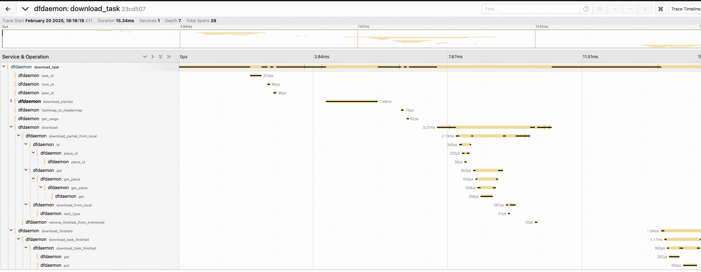

This documents will give a explanation about the process of encrypting data and
introducing how to find the possible issue by creating a tracing system.

### Setup Jaeger

Let's take the jaeger deployment as an example, refer to [jaeger getting started guide](https://www.jaegertracing.io/docs/2.3/getting-started/).

```base
docker run --rm --name jaeger \
  -p 16686:16686 \
  -p 4317:4317 \
  -p 4318:4318 \
  -p 5778:5778 \
  -p 9411:9411 \
  jaegertracing/jaeger:2.3.0
```

### Configure the endpoint in Dragonfly

#### 1. Add tracing configuration as follows(in manager, scheduler and dfdaemon)

```yaml
tracing:
#   # addr is the address to report tracing log. 6831 is default udp port.
  addr: {endpoint}:6831
```

#### 2. Make a download request and check the tracing UI

Every request details will be recorded in the tracing UI,
including the validation for the checksum of the request and response.


