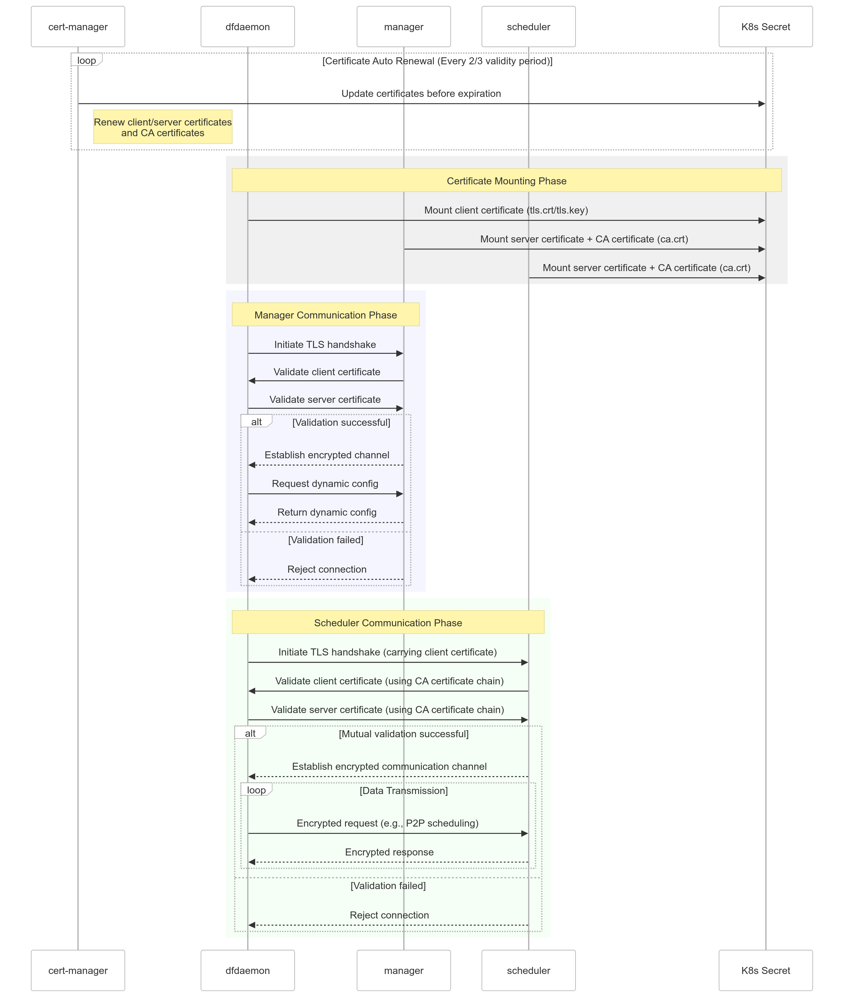

This document provides an overview of Dragonfly security considerations.
Dragonfly security features provide strong identity, powerful policy,
transparent TLS encryption, authentication and
authorization to protect your services and data.

## Mutual TLS



1. Cert-manager will generate a self-signed CA certificate and a server certificate signed by the CA certificate.
2. Cert-manager will automatically renew the CA certificate and server certificate every 2/3 of their validity period.
3. Dfdaemon/manager/scheduler will mount the CA certificate and server certificate from the K8s Secret.
4. Before dfdaemon connects to manager or scheduler, the two side will initiate a TLS handshake with mutual validation.
5. After TLS handshake, the two side will establish encrypted channel.

> Note: You can trace the communication process by setting up opentelemetry tracing system, refer to [Tracing](../../../operations/best-practices/observability/tracing.md).

## Manager Console

### Console HTTPS support

If you need to use `HTTPS` for the manager console, you must configure the certificate.
Configure `manager.yaml`, the default path is `/etc/dragonfly/manager.yaml`,
refer to [manager](../../reference/configuration/manager.md) config.

> Notice: It is recommended to use `HTTPS`.

<!-- markdownlint-disable -->

```yaml
server:
  rest:
    # REST server tls configuration.
    tls:
      # Certificate file path.
      cert: server.crt
      # Key file path.
      key: server.pem
```

<!-- markdownlint-restore -->

### Json Web Token (JWT) for Signining

You can configure the JWT for signing in the manager console. Configure `manager.yaml`,
the default path is `/etc/dragonfly/manager.yaml`, refer to
[manager](../../reference/configuration/manager.md) config.

<!-- markdownlint-disable -->

```yaml
# Auth configuration.
auth:
  # JWT configuration used for sigining.
  jwt:
    # Realm name to display to the user, default value is Dragonfly.
    realm: 'Dragonfly'
    # Key is secret key used for signing, default value is
    # encoded base64 of dragonfly.
    # Please change the key in production.
    key: 'ZHJhZ29uZmx5Cg=='
    # Timeout is duration that a jwt token is valid,
    # default duration is two days.
    timeout: 48h
    # MaxRefresh field allows clients to refresh their token
    # until MaxRefresh has passed, default duration is two days.
    maxRefresh: 48h
```

<!-- markdownlint-restore -->

## Job

### Preheat with Self-Signed Certificate

When preheating the image, dragonfly needs to call the container registry to get the image manifest.
If container regsitry is configured with a self-signed certificate, then dragonfly must be configured
with a self-signed certificate. Configure `manager.yaml`,
the default path is `/etc/dragonfly/manager.yaml`, refer to
[manager](../../reference/configuration/manager.md) config.

```yaml
# Job configuration.
job:
  # Preheat configuration.
  preheat:
    tls:
      # insecureSkipVerify controls whether a client verifies the server's certificate chain and hostname.
      insecureSkipVerify: false
      # caCert is the CA certificate for preheat tls handshake, it can be path or PEM format string.
      caCert: ca.crt
```

## Peer's HTTP proxy

Peer's HTTP proxy has several security options that you need to configure according to the following documentation.

- connections over TLS (SSL/HTTPS)
- username+password basic-auth credentials

### HTTPS support

If you need to use `HTTPS` proxy, you must configure the certificate,
`certificate authentication` can be used simultaneously with `Basic Authentication`
in order to provide a two levels authentication.
Configure `dfdaemon.yaml`, the default path is `/etc/dragonfly/dfdaemon.yaml`,
refer to [dfdaemon](../../reference/configuration/client/dfdaemon.md) config.

> Notice: It is recommended to use `HTTPS`.

<!-- markdownlint-disable -->

```yaml
proxy:
  # caCert is the root CA cert path with PEM format for the proxy server to generate the server cert.
  # If ca_cert is empty, proxy will generate a smaple CA cert by rcgen::generate_simple_self_signed.
  # When client requests via the proxy, the client should not verify the server cert and set
  # insecure to true. If ca_cert is not empty, proxy will sign the server cert with the CA cert. If openssl is installed,
  # you can use openssl to generate the root CA cert and make the system trust the root CA cert.
  # Then set the ca_cert and ca_key to the root CA cert and key path. Dfdaemon generates the server cert
  # and key, and signs the server cert with the root CA cert. When client requests via the proxy,
  # the proxy can intercept the request by the server cert.
  caCert: 'ca.crt'

  # caKey is the root CA key path with PEM format for the proxy server to generate the server cert.
  # If ca_key is empty, proxy will generate a smaple CA key by rcgen::generate_simple_self_signed.
  # When client requests via the proxy, the client should not verify the server cert and set
  # insecure to true. If ca_key is not empty, proxy will sign the server cert with the CA cert. If openssl is installed,
  # you can use openssl to generate the root CA cert and make the system trust the root CA cert.
  # Then set the ca_cert and ca_key to the root CA cert and key path. Dfdaemon generates the server cert
  # and key, and signs the server cert with the root CA cert. When client requests via the proxy,
  # the proxy can intercept the request by the server cert.
  caKey: 'ca.key'
```

<!-- markdownlint-restore -->

### Basic Auth

Using Basic Auth validation in Peer's HTTP Proxy.
Please note that Basic Auth is not the most secure access control technique.
Configure `dfdaemon.yaml`, the default path is `/etc/dragonfly/dfdaemon.yaml`,
refer to [dfdaemon](../../reference/configuration/client/dfdaemon.md) config.

<!-- markdownlint-disable -->

```yaml
proxy:
  # basic_auth is the basic auth configuration for HTTP proxy in dfdaemon. If basic_auth is not
  # empty, the proxy will use the basic auth to authenticate the client by Authorization
  # header. The value of the Authorization header is "Basic base64(username:password)", refer
  # to https://en.wikipedia.org/wiki/Basic_access_authentication.
  basicAuth:
    # username is the username for basic auth.
    username: 'admin'
    # password is the password for basic auth.
    password: 'dragonfly'
```

<!-- markdownlint-restore -->

## DDoS attacks

DDoS is where an attacker uses multiple sources,
such as distributed groups of malware infected computers, routers,
IoT devices and other endpoints to orchestrate an attack against a target,
preventing legitimate users from accessing the target.

According to analysis of Dragonfly architecture, DDoS attackers can be divided into the following types:

- Consumes the bandwidth of target network or service.

- Send a massive amount of traffic to the target network with the
  goal of consuming so much bandwidth that users are denied access.

- Bandwitdh depletion attack: Flood Attack and Amplification attack.

### What can Dragonfly do against DDoS attacks?

Dragonfly implements bandwidth and request limiting to effectively mitigate
the impact of attacks and ensure system stability.
Please refer to [Rate limit](../../advanced-guides/rate-limit.md).
