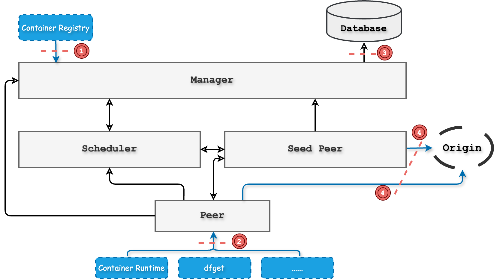
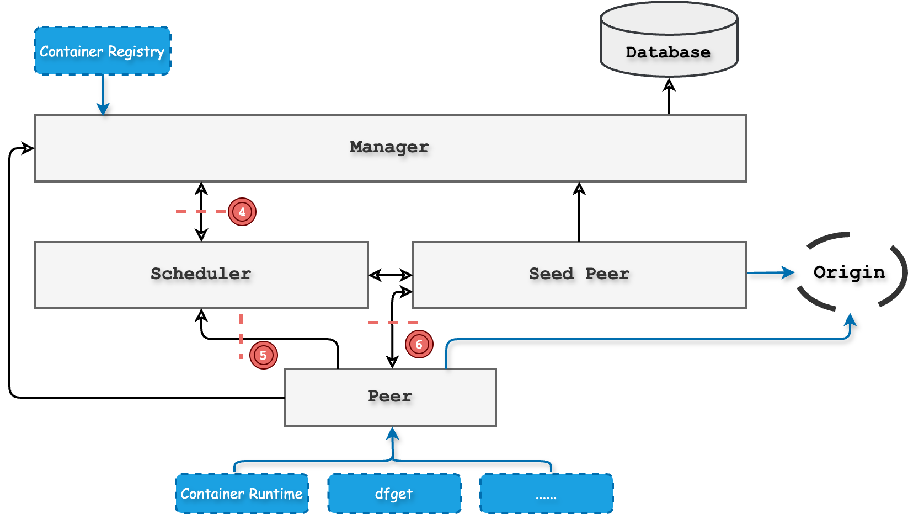

This document outlines the threat model for the Dragonfly system. The threat model outlines potential threats faced by
Dragonfly designers and operators, aiming to mitigate risks associated with bypassing, reducing efficacy,
or misusing the system. Dragonfly community analysts system security based on the [STRIDE model](https://en.wikipedia.org/wiki/STRIDEmodel).

## Threat Model

According to analysis of Dragonfly architecture, the threat attackers are classified into the following categories:

- **External Malicious Attackers**: These are attackers who are not part of the Dragonfly system but can interact with
  the system to exploit vulnerabilities.
- **Internal Malicious Attackers**: These are attackers who are part of the Dragonfly system and have access to
  the system's resources to exploit vulnerabilities.

### Attack surface of external malicious attackers

Considering the external malicious attackers and the architecture of the Dragonfly system, the following attack surfaces
are identified:

#### Threat ID 1：Attacker gets access to valid credentials for the manager

Scenario

An attacker gets access to valid credentials for the manager and can control the manager to perform malicious operations.

Impact

The attacker can preheat images or files with the access of the manager and manager will call the scheduler to preheat
the images or files in the seed peers. If a large number of files are downloaded, the seed peer will frequently request origin,
resulting in reduced origin performance. The disk space of the seed peer will be occupied by the downloaded files.

Mitigation

- Personal access tokens are used to authenticate the manager and RBAC is used to control the manager's permissions.
- Set expiration time for personal access tokens and rotate them regularly.
- Decrease the rate limit of the preheat operation in manager to prevent the seed peer requesting origin frequently.
- Set the rate limit of downloading files in the seed peer to prevent the origin pressure.
- GC the disk space of the seed peer regularly.

Recommendations

- Issue personal access tokens in manager console and set the expiration time for the tokens.
- Set the rate limit of the RESTful API for the manager in the configuration.
- Add the certificate to the manager to ensure the security of the communication.
- Set the rate limit of the downloading files in the seed peer in the configuration, and the value
  needs to evaluate according to the actual situation.
- Set the GC policy of the disk space in the seed peer in the configuration to prevent the disk space
  to be occupied fully.

#### Threat ID 2：Attacker get access for the GRPC server of the peer

Scenario

An attacker gets access to the GRPC server of the peer and can control the peer to perform malicious operations.

Impact

The attacker can download files from the peer and the peer will request the scheduler to schedule the download task.
If a large number of files are downloaded, the peer will frequently request the scheduler, resulting
in reduced scheduler performance. The disk space of the peer will be occupied by the downloaded files.

Mitigation

- The system user is used to authenticate the GRPC server with unix domain socket.
- If the scheduler receives a large number of requests from the peer, the scheduler will reject
  the request by rate limiting.
- GC the disk space of the peer regularly.

Recommendations

- The system user is important to ensure the security of the communication between the user and the peer,
  so it needs to be set by security policy.
- The GRPC server of the scheduler needs to set the rate limit of the request to prevent the scheduler
  from receiving a large number of requests from the peer.
- Set the GC policy of the disk space in the seed peer in the configuration to prevent the disk space

#### Threat ID 3：Attacker gets access for the database

Scenario

An attacker gets access to the database and can control the database to perform malicious operations.

Impact

The attacker can delete the data in the database, which will cause the system to be unavailable. The peer and seed peer
can not find the available scheduler to schedule the download task and the scheduler can not find the available seed peer
to trigger download task back-to-origin.

Mitigation

- Scheduler and manager will cache the data in the memory to reduce the impact of the database being
  attacked in the short time. Users can use the short time to recover the database.

Recommendations

- Use the password to protect the database and set the password policy.
- Use the TLS to protect the communication between the database and the manager.
- The database needs to be backed up regularly to prevent the data from being lost.

#### Threat ID 4：Attacker uploads malicious files to the origin

Scenario

An attacker uploads malicious files to the origin and the seed peer will download the malicious files.

Impact

The seed peer will download the malicious files and the peer will download the malicious files from the seed peer.
The malicious files will be transferred to the user and the user will be attacked.

Mitigation

- The peer and seed peer will check the digest of the file from origin to ensure the file is not modified.
- The peer will check the digest of the file between peer and peer to ensure the file is not modified.

Recommendations

- The origin needs to pervent the attacker from uploading the malicious files.
- Use the TLS to protect the communication between the origin and the peer.

### Attack surface of internal malicious attackers

Considering the internal malicious attackers and the architecture of the Dragonfly system, the following attack surfaces
are identified:

#### Threat ID 4: Attacker hijacks communication between the manager and the scheduler

Scenario

An attacker hijacks the communication between the manager and the scheduler and can control the
scheduler to perform malicious operations.

Impact

The attacker can hijack the communication between the manager and the scheduler and the scheduler will not receive the
correct dynamic config, resulting in the risk of spoofing and tampering in the communication.

Mitigation

- Mutual authentication is used to authenticate the manager and the scheduler, the encryption is used to prevent
  the communication to avoid risk of spoofing and tampering.

Recommendations

- Set the self-signed certificate to the manager and the scheduler to ensure the security of the communication.
- The certificate needs to be rotated regularly to prevent the certificate from being stolen.

#### Threat ID 5: Attacker hijacks communication between the scheduler and the peer

Scenario

An attacker hijacks the communication between the scheduler and the peer and can control the scheduler to
perform malicious operations.

Impact

The attacker can hijack the communication between the scheduler and the peer and the scheduler will not receive the correct
message, resulting in the risk of spoofing and tampering in the communication.

Mitigation

- Mutual authentication is used to authenticate the scheduler and the peer, the encryption is used to prevent the communication
  to avoid risk of spoofing and tampering.

Recommendations

- Set the self-signed certificate to the scheduler and the peer to ensure the security of the communication.
- The certificate needs to be rotated regularly to prevent the certificate from being stolen.

#### Threat ID 6: Attacker destroys the download task cache in the seed peer

Scenario

An attacker destroys the download task cache in the seed peer and the dirty data will be transferred to the other peers.

Impact

- The dirty data will be transferred to the other peers and the user will download the dirty data.
- As long as one peer has dirty data in the P2P cluster, no peers will not be able to download correct data.

Mitigation

- Verify the digest of the file based on the piece level to ensure the file is not modified.
- Clean the dirty data based on the task ID in manager console.

Recommendations

- Enable the piece level verification to ensure the file is not modified.
