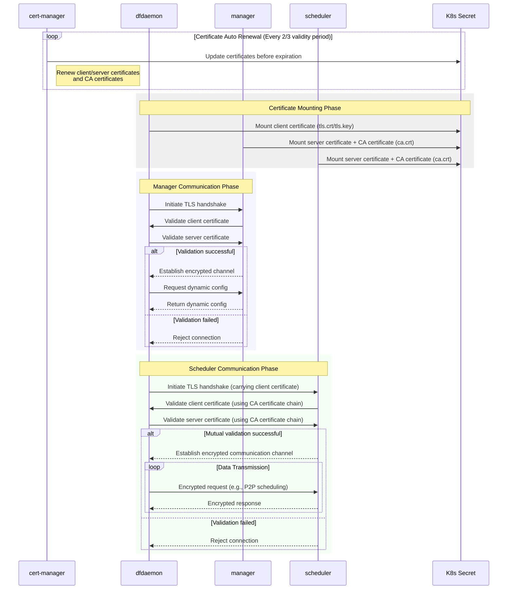
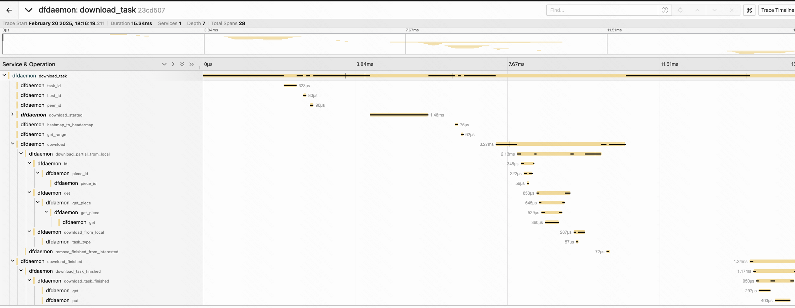

This documents will give a explaination about the process of encrypting data and
introducing how to find the possible issue by creating a tracing system.

## Encryption Process



1. Cert-manager will generate a self-signed CA certificate and a server certificate signed by the CA certificate.
2. Cert-manager will automatically renew the CA certificate and server certificate every 2/3 of their validity period.
3. Dfdaemon/manager/scheduler will mount the CA certificate and server certificate from the K8s Secret.
4. Before dfdaemon connects to manager or scheduler, the two side will initiate a TLS handshake with mutual validation.
5. After TLS handshake, the two side will establish encrypted channel.

## Tracing

### Setup OpenTelemetry Component

Let's take the jaeger deployment as an example. More info about jaeger: [https://www.jaegertracing.io/docs/2.3/getting-started/)

```base
docker run --rm --name jaeger \
  -p 16686:16686 \
  -p 4317:4317 \
  -p 4318:4318 \
  -p 5778:5778 \
  -p 9411:9411 \
  jaegertracing/jaeger:2.3.0
```

### Configure the endpoint in d7y

#### 1. Add tracing configuration as follows(in manager, scheduler and dfdaemon)

```yaml
tracing:
#   # addr is the address to report tracing log. 6831 is default udp port.
  addr: {endpoint}:6831
```

#### 2. Make a download request and check the tracing UI



> Every request details will be recorded in the tracing UI,
> including the validation for the checksum of the request and response.
