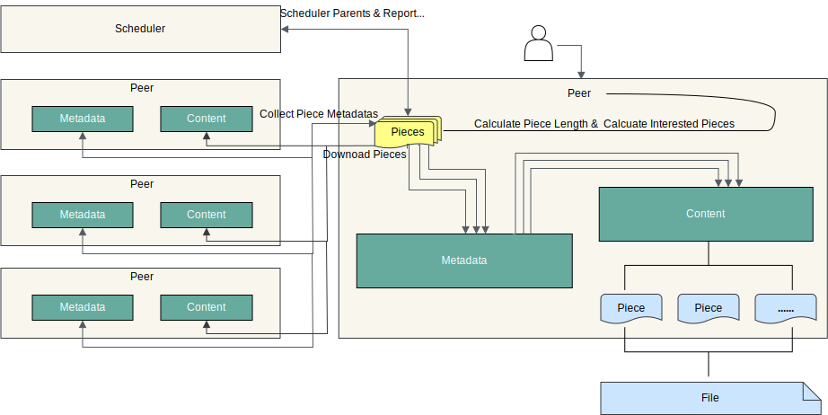

Client is the peer client in P2P network. Use `dfdaemon` to start, or `dfget` to download and upload.

## Features {#features}

- Serve gRPC for `dfget` with downloading feature,
  and provide adaptation to different source protocols.
- It can be used as seed peer. Turning on the Seed Peer mode can be used as
  a back-to-source download peer in a P2P cluster,
  which is the root peer for download in the entire cluster.
- Serve proxy for container registry mirror and any other http backend.
- Download object like via `http`, `https` and other custom protocol.
- Set disk usage, automatic GC capabilities.
- Customize the download task piece size.
- Supports RDMA for faster network transmission in the P2P network.
  It can better support the loading of AI inference models into memory.
- Supports file writing and seeding, it can be accessed in the P2P cluster without uploading to other storage.
  Helps AI models and AI datasets to be read and written faster in the P2P network.

## Relationship {#relationship}

- Client registers itself to Manager for fetching Scheduler.
- Client registers P2P tasks to Scheduler.
- Client uploads data to other Client.

## Overview

When the client executes a download task, if this is the first time downloading, the Seed Peer will be triggered to download back-to-source, and the Task will be divided based on the piece level. After successful registration, The peer establishes a connection to the scheduler based on this task, and then schedule the Seed Peer to the Peer for streaming based on piece level. when a piece is successfully downloaded, the piece metadata will be reported to the Scheduler for next scheduling. If this is not the first time downloading, the Scheduler will schedule other Peers for the download. The Peer will download pieces from different Peers, splices and returns the entire file

