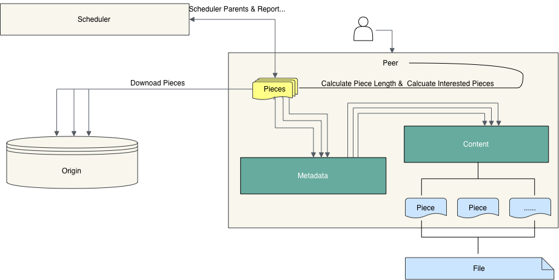
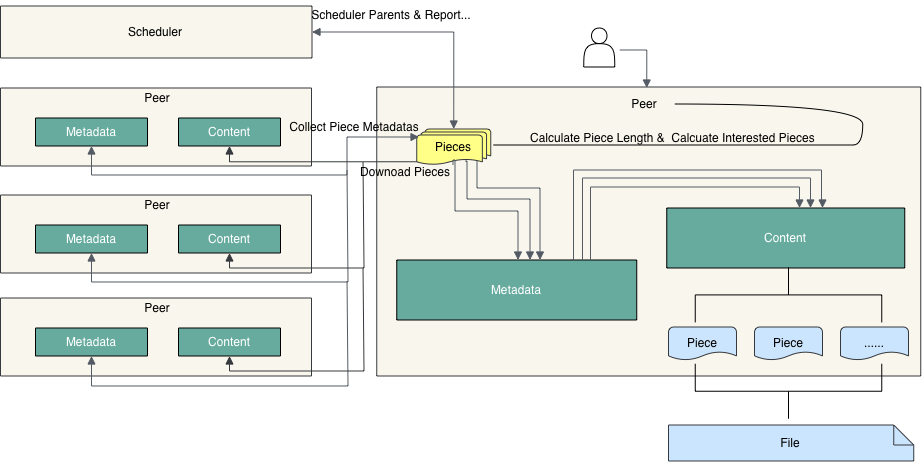

Client is the peer client in P2P network. Use `dfdaemon` to start, or `dfget` to download and upload.

## Client written in Rust

Rust language secure design guarantees that an attacker can't compromise the sidecar
due to problems with memory safety. At the same time,
since sidecar is responsible for most of the application's system-level functionality,
it is crucial to minimise sidecar's impact on the performance. As Rust has no runtime
nor garbage collector, it can run very fast and with small latency.

The client is written in [Rust](https://www.rust-lang.org/),
offering advantages such as ensuring memory safety, improving performance, etc. The client is a submodule of Dragonfly.

## Features {#features}

- Serve gRPC for `dfget` with downloading feature,
  and provide adaptation to different source protocols.
- It can be used as seed peer. Turning on the Seed Peer mode can be used as
  a back-to-source download peer in a P2P cluster,
  which is the root peer for download in the entire cluster.
- Serve proxy for container registry mirror and any other http backend.
- Download object like via `http`, `https` and other custom protocol.
- Set disk usage, automatic GC capabilities.
- Customize the download task piece size.
- Supports RDMA for faster network transmission in the P2P network.
  It can better support the loading of AI inference models into memory.
- Supports file writing and seeding, it can be accessed in the P2P cluster without uploading to other storage.
  Helps AI models and AI datasets to be read and written faster in the P2P network.

## Relationship {#relationship}

- Client registers itself to Manager for fetching Scheduler.
- Client registers P2P tasks to Scheduler.
- Client uploads data to other Client.
