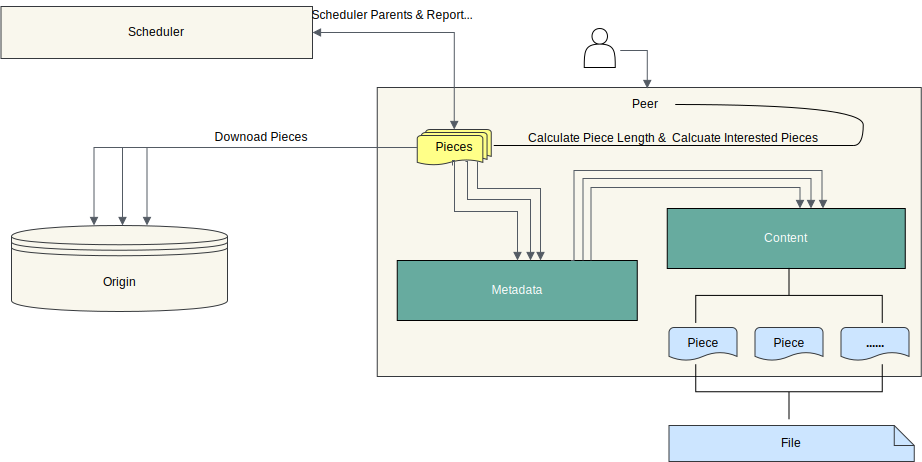

Client is the peer client in P2P network. Use `dfdaemon` to start, or `dfget` to download and upload.

## Overview

When the Peer downloads task, Peer will first register the Task with the Scheduler,
and the Scheduler will check the Task metadata to determine whether the
Task is downloaded for the first time in the P2P cluster.
If this is the first time downloading, the Seed Peer will be triggered to download back-to-source.
After successful registration, the Peer establishes a connection to the Scheduler based on this task,
and then schedules the Seed Peer as parent to the Peer for downloading.
Peer will send the interested piece numbers to Seed Peer, and Seed Peer will return the piece metadatas which has download.
When the Peer receives the notification, it will download the piece from the Seed Peer.
Transmission is performed based on piece size of 4MB to 12MB.
The specific piece size is calculated based on the length of the task. The longer the Task length, the larger the piece size.
Each time the peer downloads a piece,
it will calculate the piece hash and compare it with the piece hash notified by the Seed Peer.
If there is an error, it means that the transmitted data is incorrect. When a piece is successfully downloaded,
its metadata is reported to the Scheduler for subsequent scheduling. If this is not the first time downloading,
the Scheduler will schedule other Peers for the download. The Peer will download pieces from different Peers,
splices and returns the entire file, then the P2P download is completed.

## Features {#features}

- Serve gRPC for `dfget` with downloading feature,
  and provide adaptation to different source protocols.
- It can be used as seed peer. Turning on the Seed Peer mode can be used as
  a back-to-source download peer in a P2P cluster,
  which is the root peer for download in the entire cluster.
- Serve proxy for container registry mirror and any other http backend.
- Download object like via `http`, `https` and other custom protocol.
- Set disk usage, automatic GC capabilities.
- Customize the download task piece size.
- Supports RDMA for faster network transmission in the P2P network.
  It can better support the loading of AI inference models into memory.
- Supports file writing and seeding, it can be accessed in the P2P cluster without uploading to other storage.
  Helps AI models and AI datasets to be read and written faster in the P2P network.

## Relationship {#relationship}

- Client registers itself to Manager for fetching Scheduler.
- Client registers P2P tasks to Scheduler.
- Client uploads data to other Client.
