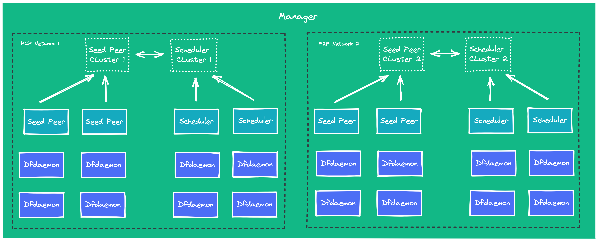

It plays the role of Manager in the multi-P2P cluster deployment process.
Used to manage the dynamic configuration that each module depends on,
and provide keepalive and metrics functions.

## Features {#features}

- Stores dynamic configuration for consumption by seed peer cluster, Scheduler cluster and Client.
- Maintain the relationship between seed peer cluster and Scheduler cluster.
- Provide async task management features for image preheat combined with harbor.
- Keepalive with Scheduler instance and seed peer instance.
- Filter the optimal Scheduler cluster for Client.
- Provides a visual console, which is helpful for users to manage the P2P cluster.
- Peer features are configurable. For example, you can make the peer can not be uploaded and can only be downloaded.
- Clear P2P task cache.
- Display P2P traffic distribution.
- Peer information display, including CPU, Memory, etc.

## Relationship {#relationship}

- Seed peer cluster and Scheduler cluster have a `1:1` relationship
- Seed peer cluster and Seed peer instance have a `1:N` relationship
- Scheduler cluster and Scheduler instance have a `1:N` relationship

## Manage multiple P2P networks {#manage-multiple-p2p-networks}

Manager can manage multiple P2P networks.
Usually, a P2P network includes a Scheduler cluster, a seed peer cluster and many dfdaemons.
The service network must be available in a P2P network.

