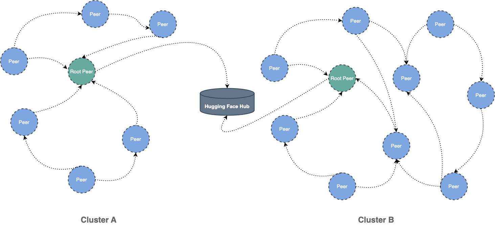
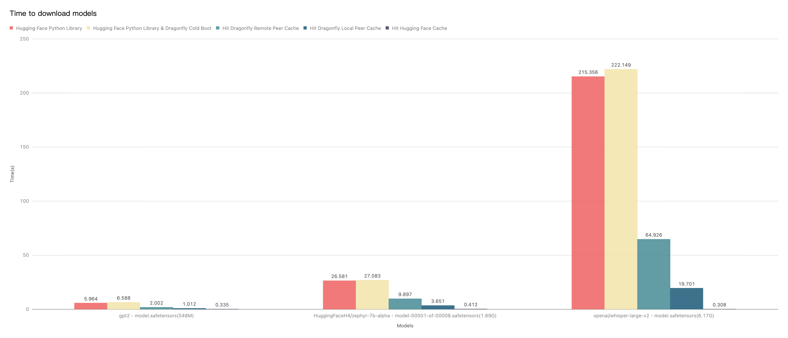

This document will help you experience how to use dragonfly with hugging face.
During the downloading of datasets or models, the file size is large and
there are many services downloading the files at the same time.
The bandwidth of the storage will reach the limit and the download will be slow.


Dragonfly can be used to eliminate the bandwidth limit of the storage through P2P technology, thereby accelerating file downloading.



## Prerequisites {#prerequisites}

<!-- markdownlint-disable -->

| Name               | Version | Document                                |
| ------------------ | ------- | --------------------------------------- |
| Kubernetes cluster | 1.20+   | [kubernetes.io](https://kubernetes.io/) |
| Helm               | 3.8.0+  | [helm.sh](https://helm.sh/)             |
| Python             | 3.8.0+  | [python.org](https://www.python.org/)   |

<!-- markdownlint-restore -->

## Dragonfly Kubernetes Cluster Setup {#dragonfly-kubernetes-cluster-setup}

For detailed installation documentation based on kubernetes cluster, please refer to [quick-start-kubernetes](../../getting-started/quick-start/kubernetes.md).

### Setup kubernetes cluster {#setup-kubernetes-cluster}

[Kind](https://kind.sigs.k8s.io/) is recommended if no Kubernetes cluster is available for testing.

Create kind multi-node cluster configuration file `kind-config.yaml`, configuration content is as follows:

```yaml
kind: Cluster
apiVersion: kind.x-k8s.io/v1alpha4
nodes:
  - role: control-plane
  - role: worker
    extraPortMappings:
      - containerPort: 30950
        hostPort: 4001
  - role: worker
```

Create a kind multi-node cluster using the configuration file:

```shell
kind create cluster --config kind-config.yaml
```

Switch the context of kubectl to kind cluster:

```shell
kubectl config use-context kind-kind
```

### Kind loads Dragonfly image {#kind-loads-dragonfly-image}

Pull Dragonfly latest images:

```shell
docker pull dragonflyoss/scheduler:latest
docker pull dragonflyoss/manager:latest
docker pull dragonflyoss/client:latest
```

Kind cluster loads Dragonfly latest images:

```shell
kind load docker-image dragonflyoss/scheduler:latest
kind load docker-image dragonflyoss/manager:latest
kind load docker-image dragonflyoss/client:latest
```

### Create Dragonfly cluster based on helm charts {#create-dragonfly-cluster-based-on-helm-charts}

Create helm charts configuration file `charts-config.yaml` and set `client.config.proxy.registryMirror.addr` to
the address of the Hugging Face Hub's LFS server, configuration content is as follows:

```yaml
manager:
  image:
    repository: dragonflyoss/manager
    tag: latest
  metrics:
    enable: true
  config:
    verbose: true
    pprofPort: 18066

scheduler:
  image:
    repository: dragonflyoss/scheduler
    tag: latest
  metrics:
    enable: true
  config:
    verbose: true
    pprofPort: 18066

seedClient:
  image:
    repository: dragonflyoss/client
    tag: latest
  metrics:
    enable: true
  config:
    verbose: true

client:
  image:
    repository: dragonflyoss/client
    tag: latest
  hostNetwork: true
  metrics:
    enable: true
  config:
    verbose: true
    proxy:
      server:
        port: 4001
      registryMirror:
        addr: https://cdn-lfs.huggingface.co
      rules:
        - regex: repos.*
          useTLS: true
```

Create a Dragonfly cluster using the configuration file:

<!-- markdownlint-disable -->

```shell
$ helm repo add dragonfly https://dragonflyoss.github.io/helm-charts/
$ helm install --wait --create-namespace --namespace dragonfly-system dragonfly dragonfly/dragonfly -f charts-config.yaml
NAME: dragonfly
LAST DEPLOYED: Mon Jun  3 16:32:28 2024
NAMESPACE: dragonfly-system
STATUS: deployed
REVISION: 1
TEST SUITE: None
NOTES:
1. Get the scheduler address by running these commands:
  export SCHEDULER_POD_NAME=$(kubectl get pods --namespace dragonfly-system -l "app=dragonfly,release=dragonfly,component=scheduler" -o jsonpath={.items[0].metadata.name})
  export SCHEDULER_CONTAINER_PORT=$(kubectl get pod --namespace dragonfly-system $SCHEDULER_POD_NAME -o jsonpath="{.spec.containers[0].ports[0].containerPort}")
  kubectl --namespace dragonfly-system port-forward $SCHEDULER_POD_NAME 8002:$SCHEDULER_CONTAINER_PORT
  echo "Visit http://127.0.0.1:8002 to use your scheduler"

2. Get the dfdaemon port by running these commands:
  export DFDAEMON_POD_NAME=$(kubectl get pods --namespace dragonfly-system -l "app=dragonfly,release=dragonfly,component=dfdaemon" -o jsonpath={.items[0].metadata.name})
  export DFDAEMON_CONTAINER_PORT=$(kubectl get pod --namespace dragonfly-system $DFDAEMON_POD_NAME -o jsonpath="{.spec.containers[0].ports[0].containerPort}")
  You can use $DFDAEMON_CONTAINER_PORT as a proxy port in Node.

3. Configure runtime to use dragonfly:
  https://d7y.io/docs/getting-started/quick-start/kubernetes/
```

<!-- markdownlint-restore -->

Check that Dragonfly is deployed successfully:

```shell
$ kubectl get po -n dragonfly-system
NAME                                 READY   STATUS    RESTARTS       AGE
dragonfly-client-6jgzn               1/1     Running   0             21m
dragonfly-client-qzcz9               1/1     Running   0             21m
dragonfly-manager-6bc4454d94-ldsk7   1/1     Running   0             21m
dragonfly-mysql-0                    1/1     Running   0             21m
dragonfly-redis-master-0             1/1     Running   0             21m
dragonfly-redis-replicas-0           1/1     Running   0             21m
dragonfly-redis-replicas-1           1/1     Running   0             21m
dragonfly-redis-replicas-2           1/1     Running   0             21m
dragonfly-scheduler-0                1/1     Running   0             21m
dragonfly-scheduler-1                1/1     Running   0             21m
dragonfly-scheduler-2                1/1     Running   0             21m
dragonfly-seed-client-0              1/1     Running   2 (21m ago)   21m
dragonfly-seed-client-1              1/1     Running   0             21m
dragonfly-seed-client-2              1/1     Running   0             21m
```

Create peer service configuration file `peer-service-config.yaml`, configuration content is as follows:

```yaml
apiVersion: v1
kind: Service
metadata:
  name: peer
  namespace: dragonfly-system
spec:
  type: NodePort
  ports:
    - name: http-4001
      nodePort: 30950
      port: 4001
  selector:
    app: dragonfly
    component: client
    release: dragonfly
```

Create a peer service using the configuration file:

```shell
kubectl apply -f peer-service-config.yaml
```

## Use Hub Python Library to download files and distribute traffic through Draognfly {#use-hub-python-library-to-download-files-and-distribute-traffic-through-draognfly}

Any API in the [Hub Python Library](https://huggingface.co/docs/huggingface_hub/index)
that uses `Requests` library for downloading files can
distribute the download traffic in the P2P network by
setting `DragonflyAdapter` to the requests `Session`.

### Download a single file with Dragonfly {#download-a-single-file-with-dragonfly}

A single file can be downloaded using the [`hf_hub_download`](https://huggingface.co/docs/huggingface_hub/v0.17.1/en/package_reference/file_download#huggingface_hub.hf_hub_download),
distribute traffic through the Dragonfly peer.

Create `hf_hub_download_dragonfly.py` file. Use `DragonflyAdapter` to forward the file download request of
the LFS protocol to Dragonfly HTTP proxy, so that it can use the P2P network
to distribute file, configuration content is as follows:

> Notice: Replace the `session.proxies` address with your actual address.

```python
import requests
from requests.adapters import HTTPAdapter
from urllib.parse import urlparse
from huggingface_hub import hf_hub_download
from huggingface_hub import configure_http_backend

class DragonflyAdapter(HTTPAdapter):
    def get_connection(self, url, proxies=None):
        # Change the schema of the LFS request to download large files from https:// to http://,
        # so that Dragonfly HTTP proxy can be used.
        if url.startswith('https://cdn-lfs.huggingface.co'):
            url = url.replace('https://', 'http://')
        return super().get_connection(url, proxies)

    def add_headers(self, request, **kwargs):
        super().add_headers(request, **kwargs)

        # If there are multiple different LFS repositories, you can override the
        # default repository address by adding X-Dragonfly-Registry header.
        if request.url.find('example.com') != -1:
            request.headers["X-Dragonfly-Registry"] = 'https://example.com'

# Create a factory function that returns a new Session.
def backend_factory() -> requests.Session:
    session = requests.Session()
    session.mount('http://', DragonflyAdapter())
    session.mount('https://', DragonflyAdapter())
    session.proxies = {'http': 'http://127.0.0.1:4001'}
    return session

# Set it as the default session factory
configure_http_backend(backend_factory=backend_factory)

hf_hub_download(repo_id="tiiuae/falcon-rw-1b", filename="pytorch_model.bin")
```

Download a single file of th LFS protocol with Dragonfly:

<!-- markdownlint-disable -->

```shell
$ python3 hf_hub_download_dragonfly.py
(…)YkNX13a46FCg__&Key-Pair-Id=KVTP0A1DKRTAX: 100%|████████████████████████████████████████████████████████████████████████████████████████████████████████████████████████████████████████████████████████████████████████| 2.62G/2.62G [00:52<00:00, 49.8MB/s]
```

<!-- markdownlint-restore -->

#### Verify a single file download with Dragonfly {#verify-a-single-file-download-with-dragonfly}

Execute the command:

```shell
# Find pod name.
export POD_NAME=$(kubectl get pods --namespace dragonfly-system -l "app=dragonfly,release=dragonfly,
component=client" -o=jsonpath='{.items[?(@.spec.nodeName=="kind-worker")].metadata.name}' | head -n 1 )

# Check logs.
kubectl -n dragonfly-system exec -it ${POD_NAME} -- grep "download task succeeded" /var/log/dragonfly/dfdaemon/*
```

The expected output is as follows:

<!-- markdownlint-disable -->

```shell
  2024-04-19T02:44:09.259458Z  INFO
  "download_task":"dragonfly-client/src/grpc/dfdaemon_download.rs:276":: "download task succeeded"
  "host_id": "172.18.0.3-kind-worker",
  "task_id": "a46de92fcb9430049cf9e61e267e1c3c9db1f1aa4a8680a048949b06adb625a5",
  "peer_id": "172.18.0.3-kind-worker-86e48d67-1653-4571-bf01-7e0c9a0a119d"
```

<!-- markdownlint-restore -->

### Download a snapshot of the repo with Dragonfly {#download-a-snapshot-of-the-repo-with-dragonfly}

A snapshot of the repo can be downloaded using the [`snapshot_download`](https://huggingface.co/docs/huggingface_hub/v0.17.1/en/package_reference/file_download#huggingface_hub.snapshot_download),
distribute traffic through the Dragonfly peer.

Create `snapshot_download_dragonfly.py` file. Use `DragonflyAdapter` to forward the file download request of
the LFS protocol to Dragonfly HTTP proxy, so that it can use the P2P network
to distribute file. Only the files of the LFS protocol will be distributed
through the Dragonfly P2P network. content is as follows:

> Notice: Replace the `session.proxies` address with your actual address.

```python
import requests
from requests.adapters import HTTPAdapter
from urllib.parse import urlparse
from huggingface_hub import snapshot_download
from huggingface_hub import configure_http_backend

class DragonflyAdapter(HTTPAdapter):
    def get_connection(self, url, proxies=None):
        # Change the schema of the LFS request to download large files from https:// to http://,
        # so that Dragonfly HTTP proxy can be used.
        if url.startswith('https://cdn-lfs.huggingface.co'):
            url = url.replace('https://', 'http://')
        return super().get_connection(url, proxies)

    def add_headers(self, request, **kwargs):
        super().add_headers(request, **kwargs)

        # If there are multiple different LFS repositories, you can override the
        # default repository address by adding X-Dragonfly-Registry header.
        if request.url.find('example.com') != -1:
            request.headers["X-Dragonfly-Registry"] = 'https://example.com'

# Create a factory function that returns a new Session.
def backend_factory() -> requests.Session:
    session = requests.Session()
    session.mount('http://', DragonflyAdapter())
    session.mount('https://', DragonflyAdapter())
    session.proxies = {'http': 'http://127.0.0.1:4001'}
    return session

# Set it as the default session factory
configure_http_backend(backend_factory=backend_factory)

snapshot_download(repo_id="tiiuae/falcon-rw-1b")
```

Download a snapshot of the repo with Dragonfly:

<!-- markdownlint-disable -->

```shell
$ python3 snapshot_download_dragonfly.py
(…)03165eb22f0a867d4e6a64d34fce19/README.md: 100%|█████████████████████████████████████████████████████████████████████████████████████████████████████████████████████████████████████████████████████████████████████████| 7.60k/7.60k [00:00<00:00, 374kB/s]
(…)7d4e6a64d34fce19/configuration_falcon.py: 100%|█████████████████████████████████████████████████████████████████████████████████████████████████████████████████████████████████████████████████████████████████████████| 6.70k/6.70k [00:00<00:00, 762kB/s]
(…)f0a867d4e6a64d34fce19/modeling_falcon.py: 100%|████████████████████████████████████████████████████████████████████████████████████████████████████████████████████████████████████████████████████████████████████████| 56.9k/56.9k [00:00<00:00, 5.35MB/s]
(…)3165eb22f0a867d4e6a64d34fce19/merges.txt: 100%|██████████████████████████████████████████████████████████████████████████████████████████████████████████████████████████████████████████████████████████████████████████| 456k/456k [00:00<00:00, 9.07MB/s]
(…)867d4e6a64d34fce19/tokenizer_config.json: 100%|█████████████████████████████████████████████████████████████████████████████████████████████████████████████████████████████████████████████████████████████████████████████| 234/234 [00:00<00:00, 106kB/s]
(…)eb22f0a867d4e6a64d34fce19/tokenizer.json: 100%|████████████████████████████████████████████████████████████████████████████████████████████████████████████████████████████████████████████████████████████████████████| 2.11M/2.11M [00:00<00:00, 27.7MB/s]
(…)3165eb22f0a867d4e6a64d34fce19/vocab.json: 100%|██████████████████████████████████████████████████████████████████████████████████████████████████████████████████████████████████████████████████████████████████████████| 798k/798k [00:00<00:00, 19.7MB/s]
(…)7d4e6a64d34fce19/special_tokens_map.json: 100%|██████████████████████████████████████████████████████████████████████████████████████████████████████████████████████████████████████████████████████████████████████████| 99.0/99.0 [00:00<00:00, 45.3kB/s]
(…)67d4e6a64d34fce19/generation_config.json: 100%|████████████████████████████████████████████████████████████████████████████████████████████████████████████████████████████████████████████████████████████████████████████| 115/115 [00:00<00:00, 5.02kB/s]
(…)165eb22f0a867d4e6a64d34fce19/config.json: 100%|████████████████████████████████████████████████████████████████████████████████████████████████████████████████████████████████████████████████████████████████████████| 1.05k/1.05k [00:00<00:00, 75.9kB/s]
(…)eb22f0a867d4e6a64d34fce19/.gitattributes: 100%|█████████████████████████████████████████████████████████████████████████████████████████████████████████████████████████████████████████████████████████████████████████| 1.48k/1.48k [00:00<00:00, 171kB/s]
(…)t-oSSW23tawg__&Key-Pair-Id=KVTP0A1DKRTAX: 100%|████████████████████████████████████████████████████████████████████████████████████████████████████████████████████████████████████████████████████████████████████████| 2.62G/2.62G [00:50<00:00, 52.1MB/s]
Fetching 12 files: 100%|███████████████████████████████████████████████████████████████████████████████████████████████████████████████████████████████████████████████████████████████████████████████████████████████████████| 12/12 [00:50<00:00,  4.23s/it]
```

<!-- markdownlint-restore -->

#### Verify a snapshot of the repo download with Dragonfly {#verify-a-snapshot-of-the-repo-download-with-dragonfly}

Execute the command:

```shell
# Find pod name.
export POD_NAME=$(kubectl get pods --namespace dragonfly-system -l "app=dragonfly,release=dragonfly,
component=client" -o=jsonpath='{.items[?(@.spec.nodeName=="kind-worker")].metadata.name}' | head -n 1 )

# Check logs.
kubectl -n dragonfly-system exec -it ${POD_NAME} -- grep "download task succeeded" /var/log/dragonfly/dfdaemon/*
```

The expected output is as follows:

<!-- markdownlint-disable -->

```shell
{
  2024-04-19T02:44:09.259458Z  "INFO"
  "download_task":"dragonfly-client/src/grpc/dfdaemon_download.rs:276":: "download task succeeded"
  "host_id": "172.18.0.3-kind-worker",
  "task_id": "a46de92fcb9430049cf9e61e267e1c3c9db1f1aa4a8680a048949b06adb625a5",
  "peer_id": "172.18.0.3-kind-worker-86e48d67-1653-4571-bf01-7e0c9a0a119d"
}
```

<!-- markdownlint-restore -->

## Performance testing {#performance-testing}

Test the performance of single-machine file download by `hf_hub_download` API after the integration of
Hugging Face Python Library and Dragonfly P2P.
Due to the influence of the network environment of the machine itself, the actual download time is not important,
but the ratio of the increase in the download time in different scenarios is very important.



<!-- markdownlint-disable -->

- Hugging Face Python Library: Use `hf_hub_download` API to download models directly.
- Hugging Face Python Library & Dragonfly Cold Boot: Use `hf_hub_download` API to download models via Dragonfly P2P network and no cache hits.
- Hit Dragonfly Remote Peer Cache: Use `hf_hub_download` API to download models via Dragonfly P2P network and hit the remote peer cache.
- Hit Dragonfly Local Peer Cache: Use `hf_hub_download` API to download models via Dragonfly P2P network and hit the local peer cache.
- Hit Hugging Face Cache: Use `hf_hub_download` API to download models via Dragonfly P2P network and hit the Hugging Face local cache.

<!-- markdownlint-restore -->

Test results show Hugging Face Python Library and Dragonfly P2P integration.
It can effectively reduce the file download time.
Note that this test was a single-machine test, which means that in the case of cache hits,
the performance limitation is on the disk.
If Dragonfly is deployed on multiple machines for P2P download, the models download speed will be faster.
