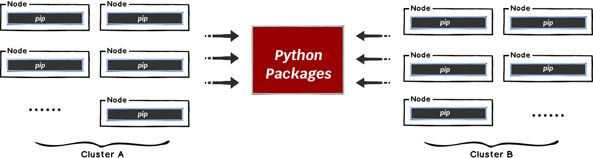

This document will help you experience how to use Dragonfly with [Pip](https://pypi.org/).
When installing Python packages, the Python packages is large in size and there are multiple services
downloading at the same time. The storage bandwidth will reach its limit and the download speed will be very slow.



Dragonfly can be used to eliminate the bandwidth limit of the storage through P2P technology,
thereby accelerating file downloading.


## Prerequisites {#prerequisites}

<!-- markdownlint-disable -->

| Name               | Version | Document                                  |
| ------------------ | ------- | ----------------------------------------- |
| Kubernetes cluster | 1.20+   | [kubernetes.io](https://kubernetes.io/)   |
| Helm               | 3.8.0+  | [helm.sh](https://helm.sh/)               |
| Python             | 3.8.0+  | [python.org](https://www.python.org/)     |
| Pip                | 23.0.1+ | [pypi.org](https://pypi.org/project/pip/) |

<!-- markdownlint-restore -->

## Prepare Kubernetes Cluster

[Kind](https://kind.sigs.k8s.io/) is recommended if no Kubernetes cluster is available for testing.

Create kind multi-node cluster configuration file `kind-config.yaml`, configuration content is as follows:

```yaml
kind: Cluster
apiVersion: kind.x-k8s.io/v1alpha4
nodes:
  - role: control-plane
  - role: worker
  - role: worker
```

Create a kind multi-node cluster using the configuration file:

```shell
kind create cluster --config kind-config.yaml
```

Switch the context of kubectl to kind cluster:

```shell
kubectl config use-context kind-kind
```

## Kind loads Dragonfly image

Pull Dragonfly latest images:

```shell
docker pull dragonflyoss/scheduler:latest
docker pull dragonflyoss/manager:latest
docker pull dragonflyoss/client:latest
```

Kind cluster loads Dragonfly latest images:

```shell
kind load docker-image dragonflyoss/scheduler:latest
kind load docker-image dragonflyoss/manager:latest
kind load docker-image dragonflyoss/client:latest
```

## Create Dragonfly cluster based on helm charts

Create helm charts configuration file `charts-config.yaml`.
Add `files.pythonhosted.org/packages/.*\.(whl|tar.gz|zip)`, `pypi.python.org/.*\.(whl|tar.gz|zip)`
and `pypi.org/.*\.(whl|tar.gz|zip)` rules to `client.config.proxy.rules.regex`
to forward HTTP file downloads of Python packages to the P2P network.

```yaml
manager:
  image:
    repository: dragonflyoss/manager
    tag: latest
  metrics:
    enable: true
  config:
    verbose: true
    pprofPort: 18066

scheduler:
  image:
    repository: dragonflyoss/scheduler
    tag: latest
  metrics:
    enable: true
  config:
    verbose: true
    pprofPort: 18066

seedClient:
  image:
    repository: dragonflyoss/client
    tag: latest
  metrics:
    enable: true
  config:
    verbose: true

client:
  image:
    repository: dragonflyoss/client
    tag: latest
  hostNetwork: true
  metrics:
    enable: true
  config:
    verbose: true
    proxy:
      server:
        port: 4001
      registryMirror:
        addr: https://index.docker.io
      rules:
        - regex: 'blobs/sha256.*'
        - regex: 'files.pythonhosted.org/packages/.*\.(whl|tar.gz|zip)'
          useTLS: true
        - regex: 'pypi.python.org/.*\.(whl|tar.gz|zip)'
          useTLS: true
        - regex: 'pypi.org/.*\.(whl|tar.gz|zip)'
          useTLS: true
```

Create a Dragonfly cluster using the configuration file:

<!-- markdownlint-disable -->

```shell
$ helm repo add dragonfly https://dragonflyoss.github.io/helm-charts/
$ helm install --wait --create-namespace --namespace dragonfly-system dragonfly dragonfly/dragonfly -f charts-config.yaml
NAME: dragonfly
LAST DEPLOYED: Wed Jan 22 20:17:14 2025
NAMESPACE: dragonfly-system
STATUS: deployed
REVISION: 1
TEST SUITE: None
NOTES:
1. Get the manager address by running these commands:
  export MANAGER_POD_NAME=$(kubectl get pods --namespace dragonfly-system -l "app=dragonfly,release=dragonfly,component=manager" -o jsonpath={.items[0].metadata.name})
  export MANAGER_CONTAINER_PORT=$(kubectl get pod --namespace dragonfly-system $MANAGER_POD_NAME -o jsonpath="{.spec.containers[0].ports[0].containerPort}")
  kubectl --namespace dragonfly-system port-forward $MANAGER_POD_NAME 8080:$MANAGER_CONTAINER_PORT
  echo "Visit http://127.0.0.1:8080 to use your manager"

1. Get the scheduler address by running these commands:
  export SCHEDULER_POD_NAME=$(kubectl get pods --namespace dragonfly-system -l "app=dragonfly,release=dragonfly,component=scheduler" -o jsonpath={.items[0].metadata.name})
  export SCHEDULER_CONTAINER_PORT=$(kubectl get pod --namespace dragonfly-system $SCHEDULER_POD_NAME -o jsonpath="{.spec.containers[0].ports[0].containerPort}")
  kubectl --namespace dragonfly-system port-forward $SCHEDULER_POD_NAME 8002:$SCHEDULER_CONTAINER_PORT
  echo "Visit http://127.0.0.1:8002 to use your scheduler"

1. Configure runtime to use dragonfly:
  https://d7y.io/docs/getting-started/quick-start/kubernetes/
```

<!-- markdownlint-restore -->

Check that Dragonfly is deployed successfully:

```shell
$ kubectl get po -n dragonfly-system
NAME                                READY   STATUS    RESTARTS      AGE
dragonfly-client-dfjrj              1/1     Running   0             17m
dragonfly-client-kzskj              1/1     Running   0             17m
dragonfly-manager-89df99478-gf6bm   1/1     Running   1 (17m ago)   17m
dragonfly-manager-89df99478-lh5wm   1/1     Running   0             17m
dragonfly-manager-89df99478-ljt2r   1/1     Running   0             17m
dragonfly-mysql-0                   1/1     Running   0             17m
dragonfly-redis-master-0            1/1     Running   0             17m
dragonfly-redis-replicas-0          1/1     Running   0             17m
dragonfly-redis-replicas-1          1/1     Running   0             17m
dragonfly-redis-replicas-2          1/1     Running   0             17m
dragonfly-scheduler-0               1/1     Running   0             17m
dragonfly-scheduler-1               1/1     Running   0             17m
dragonfly-scheduler-2               1/1     Running   0             17m
dragonfly-seed-client-0             1/1     Running   0             17m
dragonfly-seed-client-1             1/1     Running   0             17m
dragonfly-seed-client-2             1/1     Running   0             17m
```

## Install Python packages using pip and distribute traffic through Draognfly

### Create a configuration file for pip

Create the `~/.pip/pip.conf` file and use `global.proxy` to forward Python packages
download requests to the Dragonfly HTTP proxy,
so that it can use the P2P network to distribute file, configuration content is as follows:

> Notice: Replace the `proxy` address with your actual address.

```conf
[global]
proxy = http://$NODE_IP:4001
index-url = https://pypi.org/simple/

[install]
default-timeout = 500
trusted-host = pypi.python.org
               pypi.org
               files.pythonhosted.org
```

### Pip downloads Python package through Dragonfly

Install `torch` via pip:

```shell
pip install torch
```

The expected output is as follows:

<!-- markdownlint-disable -->

```shell
Looking in indexes: https://pypi.org/simple/
Collecting torch
  Using cached torch-2.5.1-cp311-cp311-manylinux2014_aarch64.whl (91.9 MB)
Collecting filelock
  Using cached filelock-3.17.0-py3-none-any.whl (16 kB)
Collecting typing-extensions>=4.8.0
  Downloading typing_extensions-4.12.2-py3-none-any.whl (37 kB)
Collecting networkx
  Downloading networkx-3.4.2-py3-none-any.whl (1.7 MB)
     ━━━━━━━━━━━━━━━━━━━━━━━━━━━━━━━━━━━━━━━━ 1.7/1.7 MB 195.8 MB/s eta 0:00:00
Collecting jinja2
  Downloading jinja2-3.1.5-py3-none-any.whl (134 kB)
     ━━━━━━━━━━━━━━━━━━━━━━━━━━━━━━━━━━━━━━━━ 134.6/134.6 kB 38.5 MB/s eta 0:00:00
Collecting fsspec
  Downloading fsspec-2024.12.0-py3-none-any.whl (183 kB)
     ━━━━━━━━━━━━━━━━━━━━━━━━━━━━━━━━━━━━━━━━ 183.9/183.9 kB 37.5 MB/s eta 0:00:00
Collecting sympy==1.13.1
  Downloading sympy-1.13.1-py3-none-any.whl (6.2 MB)
     ━━━━━━━━━━━━━━━━━━━━━━━━━━━━━━━━━━━━━━━━ 6.2/6.2 MB 245.3 MB/s eta 0:00:00
Collecting mpmath<1.4,>=1.1.0
  Downloading mpmath-1.3.0-py3-none-any.whl (536 kB)
     ━━━━━━━━━━━━━━━━━━━━━━━━━━━━━━━━━━━━━━━━ 536.2/536.2 kB 170.5 MB/s eta 0:00:00
Collecting MarkupSafe>=2.0
  Downloading MarkupSafe-3.0.2-cp311-cp311-manylinux_2_17_aarch64.manylinux2014_aarch64.whl (23 kB)
Installing collected packages: mpmath, typing-extensions, sympy, networkx, MarkupSafe, fsspec, filelock, jinja2, torch
Successfully installed MarkupSafe-3.0.2 filelock-3.17.0 fsspec-2024.12.0 jinja2-3.1.5 mpmath-1.3.0 networkx-3.4.2 sympy-1.13.1 torch-2.5.1 typing-extensions-4.12.2

```

### Verify

Execute the command:

```shell
# Find pod name.
export POD_NAME=$(kubectl get pods --namespace dragonfly-system -l "app=dragonfly,release=dragonfly,
component=client" -o=jsonpath='{.items[?(@.spec.nodeName=="kind-worker")].metadata.name}' | head -n 1 )

# Check logs.
kubectl exec -n dragonfly-system ${POD_NAME} -- sh -c 'grep "download task succeeded" /var/log/dragonfly/dfdaemon/*'
```

The expected output is as follows:

```shell
{
  2025-01-23T05:39:15.828741839+00:00  INFO
  download_task: dragonfly-client/src/grpc/dfdaemon_upload.rs:395: download task succeeded
  host_id="10.244.2.15-dragonfly-seed-client-2-seed"
  task_id="92d8d9e20c608edcca38790dfc76b99746e65592321923b552afe6337b275257"
  peer_id="10.244.2.15-dragonfly-seed-client-2-01f2e222-f517-47d8-98b4-18540e4c5be5-seed"
}
{
  2025-01-23T05:39:18.955058382+00:00
  INFO download_task: dragonfly-client/src/grpc/dfdaemon_upload.rs:395: download task succeeded
  host_id="10.244.2.15-dragonfly-seed-client-2-seed"
  task_id="7f684c300a629072a61536344a0369df2e049829ab8ab703e6de145cef18eb14"
  peer_id="10.244.2.15-dragonfly-seed-client-2-0f27a38b-97af-45c7-9e57-43cbc2bcd8d9-seed"
}
```

<!-- markdownlint-restore -->
