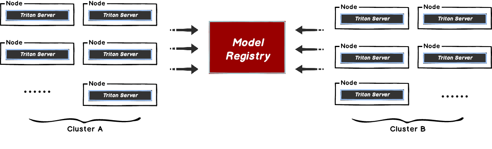
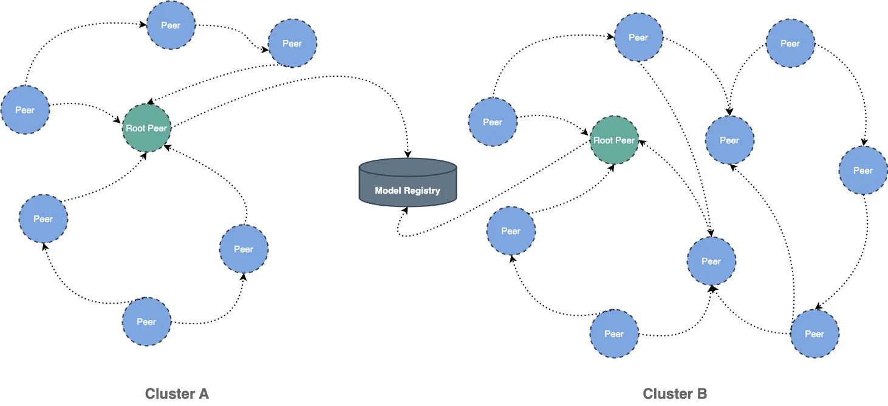

This document will help you experience how to use Dragonfly with [TritonServe](https://github.com/pytorch/serve).
During the downloading of models, the file size is large and there are many services downloading the files at the same time.
The bandwidth of the storage will reach the limit and the download will be slow.



Dragonfly can be used to eliminate the bandwidth limit of the storage through P2P technology, thereby accelerating file downloading.



## Installation

By integrating Dragonfly Repository Agent into Triton, download traffic through Dragonfly to
pull models stored in S3, OSS, GCS, and ABS, and register models in Triton. The Dragonfly Repository Agent is in
the [dragonfly-repository-agent](https://github.com/dragonflyoss/dragonfly-repository-agent) repository.

### Prerequisites

| Name               | Version   | Document                                                           |
| ------------------ | --------- | ------------------------------------------------------------------ |
| Kubernetes cluster | 1.20+     | [kubernetes.io](https://kubernetes.io/)                            |
| Helm               | 3.8.0+    | [helm.sh](https://helm.sh/)                                        |
| Triton Server      | 23.08-py3 | [Triton Server](https://github.com/triton-inference-server/server) |

### Dragonfly Kubernetes Cluster Setup

For detailed installation documentation, please refer to [quick-start-kubernetes](../../getting-started/quick-start/kubernetes.md).

#### Prepare Kubernetes Cluster

[Kind](https://kind.sigs.k8s.io/) is recommended if no kubernetes cluster is available for testing.

Create kind multi-node cluster configuration file `kind-config.yaml`, configuration content is as follows:

```yaml
kind: Cluster
apiVersion: kind.x-k8s.io/v1alpha4
nodes:
  - role: control-plane
  - role: worker
  - role: worker
```

Create a kind multi-node cluster using the configuration file:

```shell
kind create cluster --config kind-config.yaml
```

Switch the context of kubectl to kind cluster:

```shell
kubectl config use-context kind-kind
```

#### Kind loads Dragonfly image

Pull Dragonfly latest images:

```shell
docker pull dragonflyoss/scheduler:latest
docker pull dragonflyoss/manager:latest
docker pull dragonflyoss/client:latest
```

Kind cluster loads Dragonfly latest images:

```shell
kind load docker-image dragonflyoss/scheduler:latest
kind load docker-image dragonflyoss/manager:latest
kind load docker-image dragonflyoss/client:latest
```

#### Create Dragonfly cluster based on helm charts

Create helm charts configuration file `charts-config.yaml` and set
`client.config.proxy.rules.regex` to match the download path of the object storage.
Example: add `regex:.*models.*` to match download request from object storage bucket `models`.
Configuration content is as follows:

```yaml
manager:
  image:
    repository: dragonflyoss/manager
    tag: latest
  metrics:
    enable: true
  config:
    verbose: true
    pprofPort: 18066

scheduler:
  image:
    repository: dragonflyoss/scheduler
    tag: latest
  metrics:
    enable: true
  config:
    verbose: true
    pprofPort: 18066

seedClient:
  image:
    repository: dragonflyoss/client
    tag: latest
  metrics:
    enable: true
  config:
    verbose: true

client:
  image:
    repository: dragonflyoss/client
    tag: latest
  metrics:
    enable: true
  config:
    verbose: true
    proxy:
      server:
        port: 4001
      registryMirror:
        addr: https://index.docker.io
      rules:
        - regex: 'blobs/sha256.*'
        # Proxy all http downlowd requests of model bucket path.
        - regex: '.*models.*'
```

Create a Dragonfly cluster using the configuration file:

<!-- markdownlint-disable -->

```shell
$ helm repo add dragonfly https://dragonflyoss.github.io/helm-charts/
$ helm install --wait --create-namespace --namespace dragonfly-system dragonfly dragonfly/dragonfly -f charts-config.yaml
LAST DEPLOYED: Mon June 27 19:56:34 2024
NAMESPACE: dragonfly-system
STATUS: deployed
REVISION: 1
TEST SUITE: None
NOTES:
1. Get the scheduler address by running these commands:
  export SCHEDULER_POD_NAME=$(kubectl get pods --namespace dragonfly-system -l "app=dragonfly,release=dragonfly,component=scheduler" -o jsonpath="{.items[0].metadata.name}")
  export SCHEDULER_CONTAINER_PORT=$(kubectl get pod --namespace dragonfly-system $SCHEDULER_POD_NAME -o jsonpath="{.spec.containers[0].ports[0].containerPort}")
  kubectl --namespace dragonfly-system port-forward $SCHEDULER_POD_NAME 8002:$SCHEDULER_CONTAINER_PORT
  echo "Visit http://127.0.0.1:8002 to use your scheduler"

2. Get the dfdaemon port by running these commands:
  export DFDAEMON_POD_NAME=$(kubectl get pods --namespace dragonfly-system -l "app=dragonfly,release=dragonfly,component=dfdaemon" -o jsonpath="{.items[0].metadata.name}")
  export DFDAEMON_CONTAINER_PORT=$(kubectl get pod --namespace dragonfly-system $DFDAEMON_POD_NAME -o jsonpath="{.spec.containers[0].ports[0].containerPort}")
  You can use $DFDAEMON_CONTAINER_PORT as a proxy port in Node.

3. Configure runtime to use dragonfly:
  https://d7y.io/docs/getting-started/quick-start/kubernetes/


4. Get Jaeger query URL by running these commands:
  export JAEGER_QUERY_PORT=$(kubectl --namespace dragonfly-system get services dragonfly-jaeger-query -o jsonpath="{.spec.ports[0].port}")
  kubectl --namespace dragonfly-system port-forward service/dragonfly-jaeger-query 16686:$JAEGER_QUERY_PORT
  echo "Visit http://127.0.0.1:16686/search?limit=20&lookback=1h&maxDuration&minDuration&service=dragonfly to query download events"
```

<!-- markdownlint-restore -->

Check that Dragonfly is deployed successfully:

```shell
$ kubectl get pods -n dragonfly-system
NAME                                 READY   STATUS    RESTARTS       AGE
dragonfly-client-qhkn8               1/1     Running   0              21m3s
dragonfly-client-qzcz9               1/1     Running   0              21m3s
dragonfly-manager-6bc4454d94-ldsk7   1/1     Running   0              21m3s
dragonfly-mysql-0                    1/1     Running   0              21m3s
dragonfly-redis-master-0             1/1     Running   0              21m3s
dragonfly-redis-replicas-0           1/1     Running   0              21m3s
dragonfly-redis-replicas-1           1/1     Running   0              21m3s
dragonfly-redis-replicas-2           1/1     Running   0              21m3s
dragonfly-scheduler-0                1/1     Running   0              21m3s
dragonfly-scheduler-1                1/1     Running   0              21m3s
dragonfly-scheduler-2                1/1     Running   0              21m3s
dragonfly-seed-client-0              1/1     Running   0              21m3s
dragonfly-seed-client-1              1/1     Running   0              21m3s
dragonfly-seed-client-2              1/1     Running   0              21m3s
```

#### Expose the Proxy service port

Create the `dfstore.yaml` configuration file to expose the port on which the
Dragonfly Peer's HTTP proxy listens. The default port is `4001` and set`targetPort` to `4001`.

```yaml
kind: Service
apiVersion: v1
metadata:
  name: dfstore
spec:
  selector:
    app: dragonfly
    component: client
    release: dragonfly

  ports:
    - protocol: TCP
      port: 4001
      targetPort: 4001

  type: NodePort
```

Create service:

```shell
kubectl --namespace dragonfly-system apply -f dfstore.yaml
```

Forward request to Dragonfly Peer's HTTP proxy:

```shell
kubectl --namespace dragonfly-system port-forward service/dfstore 4001:4001
```

### Install Dragonfly Repository Agent

#### Set Dragonfly Repository Agent configuration

Create the `dragonfly_config.json`configuration file, the configuration is as follows:

> Notice: Replace the `addr` address with your actual address.

```shell
{
  "proxy": "http://127.0.0.1:4001",
	"header": {
	},
	"filter": [
  	"X-Amz-Algorithm",
  	"X-Amz-Credential&X-Amz-Date",
  	"X-Amz-Expires",
  	"X-Amz-SignedHeaders",
  	"X-Amz-Signature"
	]
}
```

- proxy: The address of Dragonfly Peer's HTTP Proxy.
- header: Adds a request header to the request.
- filter: Used to generate unique tasks and filter unnecessary query parameters in the URL.

In the filter of the configuration, set different values when using different object storage:

<!-- markdownlint-disable -->

| type | value                                                                                                                          |
| ---- | ------------------------------------------------------------------------------------------------------------------------------ |
| OSS  | ["Expires","Signature","ns"]                                                                                                   |
| S3   | ["X-Amz-Algorithm", "X-Amz-Credential", "X-Amz-Date", "X-Amz-Expires", "X-Amz-SignedHeaders", "X-Amz-Signature"]               |
| OBS  | ["X-Amz-Algorithm", "X-Amz-Credential", "X-Amz-Date", "X-Obs-Date", "X-Amz-Expires", "X-Amz-SignedHeaders", "X-Amz-Signature"] |

<!-- markdownlint-restore -->

#### Set Model Repository configuration

Create `cloud_credential.json` cloud storage credential, the configuration is as follows:

```shell
{
  "gs": {
    "": "PATH_TO_GOOGLE_APPLICATION_CREDENTIALS",
    "gs://gcs-bucket-002": "PATH_TO_GOOGLE_APPLICATION_CREDENTIALS_2"
  },
  "s3": {
    "": {
      "secret_key": "AWS_SECRET_ACCESS_KEY",
      "key_id": "AWS_ACCESS_KEY_ID",
      "region": "AWS_DEFAULT_REGION",
      "session_token": "",
      "profile": ""
    },
    "s3://s3-bucket-002": {
      "secret_key": "AWS_SECRET_ACCESS_KEY_2",
      "key_id": "AWS_ACCESS_KEY_ID_2",
      "region": "AWS_DEFAULT_REGION_2",
      "session_token": "AWS_SESSION_TOKEN_2",
      "profile": "AWS_PROFILE_2"
    }
  },
  "as": {
    "": {
      "account_str": "AZURE_STORAGE_ACCOUNT",
      "account_key": "AZURE_STORAGE_KEY"
    },
    "as://Account-002/Container": {
      "account_str": "",
      "account_key": ""
    }
  }
}
```

In order to pull the model through Dragonfly, the model configuration file needs to
be added following code in `config.pbtxt` file:

```shell
model_repository_agents
{
  agents [
    {
      name: "dragonfly",
    }
  ]
}
```

The [densenet_onnx example](https://github.com/dragonflyoss/dragonfly-repository-agent/tree/main/examples/model_repository/densenet_onnx)
contains modified configuration and model file. Modified `config.pbtxt` such as:

```shell
name: "densenet_onnx"
platform: "onnxruntime_onnx"
max_batch_size : 0
input [
  {
    name: "data_0"
    data_type: TYPE_FP32
    format: FORMAT_NCHW
    dims: [ 3, 224, 224 ]
    reshape { shape: [ 1, 3, 224, 224 ] }
  }
]
output [
  {
    name: "fc6_1"
    data_type: TYPE_FP32
    dims: [ 1000 ]
    reshape { shape: [ 1, 1000, 1, 1 ] }
    label_filename: "densenet_labels.txt"
  }
]
model_repository_agents
{
  agents [
    {
      name: "dragonfly",
    }
  ]
}
```

### Triton Server integrates Dragonfly Repository Agent plugin

#### Install Triton Server with Docker

Pull `dragonflyoss/dragonfly-repository-agent` image which is integrated Dragonfly Repository Agent plugin
in Triton Server, refer to [Dockerfile](https://github.com/dragonflyoss/dragonfly-repository-agent/blob/main/Dockerfile).

```shell
docker pull dragonflyoss/dragonfly-repository-agent:latest
```

Run the container and mount the configuration directory:

```shell
docker run --network host --rm \
  -v ${path-to-config-dir}:/home/triton/ \
  dragonflyoss/dragonfly-repository-agent:latest tritonserver \
  --model-repository=${model-repository-path}
```

- `path-to-config-dir`: The files path of `dragonfly_config.json`&`cloud_credential.json`.
- `model-repository-path`: The path of remote model repository.

The correct output is as follows:

<!-- markdownlint-disable -->

```shell
=============================
== Triton Inference Server ==
=============================
successfully loaded 'densenet_onnx'
I1130 09:43:22.595672 1 server.cc:604]
+------------------+------------------------------------------------------------------------+
| Repository Agent | Path                                                                   |
+------------------+------------------------------------------------------------------------+
| dragonfly        | /opt/tritonserver/repoagents/dragonfly/libtritonrepoagent_dragonfly.so |
+------------------+------------------------------------------------------------------------+

I1130 09:43:22.596011 1 server.cc:631]
+-------------+-----------------------------------------------------------------+---------------------------------------------------------------------------------------------------------------------------------------------------------------+
| Backend     | Path                                                            | Config                                                                                                                                                        |
+-------------+-----------------------------------------------------------------+---------------------------------------------------------------------------------------------------------------------------------------------------------------+
| pytorch     | /opt/tritonserver/backends/pytorch/libtriton_pytorch.so         | {}                                                                                                                                                            |
| onnxruntime | /opt/tritonserver/backends/onnxruntime/libtriton_onnxruntime.so | {"cmdline":{"auto-complete-config":"true","backend-directory":"/opt/tritonserver/backends","min-compute-capability":"6.000000","default-max-batch-size":"4"}} |
+-------------+-----------------------------------------------------------------+---------------------------------------------------------------------------------------------------------------------------------------------------------------+

I1130 09:43:22.596112 1 server.cc:674]
+---------------+---------+--------+
| Model         | Version | Status |
+---------------+---------+--------+
| densenet_onnx | 1       | READY  |
+---------------+---------+--------+

I1130 09:43:22.598318 1 metrics.cc:703] Collecting CPU metrics
I1130 09:43:22.599373 1 tritonserver.cc:2435]
+----------------------------------+-----------------------------------------------------------------------------------------------------------------------------------------------------------------------------------------------------------------+
| Option                           | Value                                                                                                                                                                                                           |
+----------------------------------+-----------------------------------------------------------------------------------------------------------------------------------------------------------------------------------------------------------------+
| server_id                        | triton                                                                                                                                                                                                          |
| server_version                   | 2.37.0                                                                                                                                                                                                          |
| server_extensions                | classification sequence model_repository model_repository(unload_dependents) schedule_policy model_configuration system_shared_memory cuda_shared_memory binary_tensor_data parameters statistics trace logging |
| model_repository_path[0]         | s3://192.168.36.128:9000/models                                                                                                                                                                                 |
| model_control_mode               | MODE_NONE                                                                                                                                                                                                       |
| strict_model_config              | 0                                                                                                                                                                                                               |
| rate_limit                       | OFF                                                                                                                                                                                                             |
| pinned_memory_pool_byte_size     | 268435456                                                                                                                                                                                                       |
| min_supported_compute_capability | 6.0                                                                                                                                                                                                             |
| strict_readiness                 | 1                                                                                                                                                                                                               |
| exit_timeout                     | 30                                                                                                                                                                                                              |
| cache_enabled                    | 0                                                                                                                                                                                                               |
+----------------------------------+-----------------------------------------------------------------------------------------------------------------------------------------------------------------------------------------------------------------+

I1130 09:43:22.610334 1 grpc_server.cc:2451] Started GRPCInferenceService at 0.0.0.0:8001
I1130 09:43:22.612623 1 http_server.cc:3558] Started HTTPService at 0.0.0.0:8000
I1130 09:43:22.695843 1 http_server.cc:187] Started Metrics Service at 0.0.0.0:8002
```

<!-- markdownlint-restore -->

Execute the following command to check the Dragonfly logs:

```shell
# Find pod name.
export POD_NAME=$(kubectl get pods --namespace dragonfly-system -l "app=dragonfly,release=dragonfly,
component=client" -o=jsonpath='{.items[?(@.spec.nodeName=="kind-worker")].metadata.name}' | head -n 1 )

# Check logs.
kubectl -n dragonfly-system exec -it ${POD_NAME} -- grep "download task succeeded" /var/log/dragonfly/dfdaemon/*
```

The expected output is as follows:

```shell
{
  2024-04-19T02:44:09.259458Z  "INFO"
  "download_task":"dragonfly-client/src/grpc/dfdaemon_download.rs:276":: "download task succeeded"
  "host_id": "172.18.0.3-kind-worker",
  "task_id": "a46de92fcb9430049cf9e61e267e1c3c9db1f1aa4a8680a048949b06adb625a5",
  "peer_id": "172.18.0.3-kind-worker-86e48d67-1653-4571-bf01-7e0c9a0a119d"
}
```

#### Verify

Call inference API：

<!-- markdownlint-disable -->

```shell
docker run -it --rm --net=host nvcr.io/nvidia/tritonserver:23.08-py3-sdk /workspace/install/bin/image_client -m densenet_onnx -c 3 -s INCEPTION /workspace/images/mug.jpg
```

<!-- markdownlint-restore -->

Check the response successful:

```shell
Request 01
Image '/workspace/images/mug.jpg':
    15.349563 (504) = COFFEE MUG
    13.227461 (968) = CUP
    10.424893 (505) = COFFEEPOT
```

## Performance testing

Test the performance of single-machine model download by Triton API after the integration of Dragonfly P2P.
Due to the influence of the network environment of the machine itself, the actual download time is not important,
but The proportion of download speed in different scenarios is more meaningful:


- Triton API: Use signed URL provided by Object Storage to download the model directly.
- Triton API & Dragonfly Cold Boot: Use `Triton Serve API` to download model via Dragonfly P2P network and no cache hits.
- Hit Remote Peer: Use `Triton Serve API` to download model via Dragonfly P2P network and hit the remote peer cache.
- Hit Local Peer: Use `Triton Serve API` to download model via Dragonfly P2P network and hit the local peer cache.

Test results show Triton and Dragonfly integration. It can effectively reduce the file download time.
Note that this test was a single-machine test, which means that in the case of cache hits,
the performance limitation is on the disk. If Dragonfly is deployed on multiple machines for P2P download,
the models download speed will be faster.
