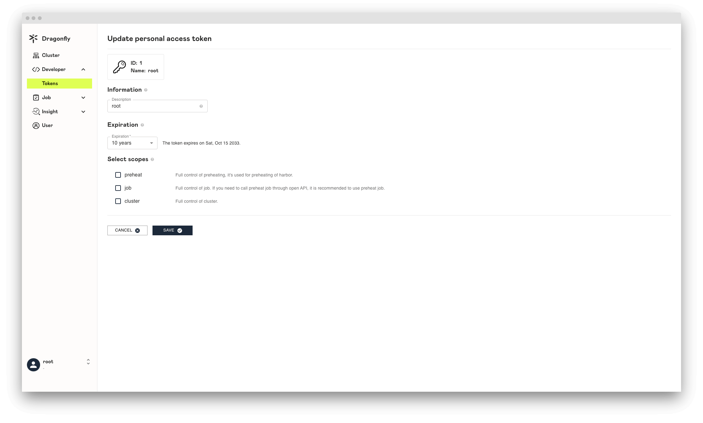

## Sign in

Default root username: `root` password: `dragonfly`.

## Sign up

You can register a new account through the sign up page.

## Clusters

When you sign in successfully, you will come to the clusters list page, which will display all of the clusters information.

## Cluster

Display the cluster details, each attribute has prompt information on the button `?`.

## Create Cluster

Create a cluster, and at the same time create a set of scheduler cluster and seed peer cluster with `1:1` relationship.
A Cluster can represent a P2P cluster, including a scheduler cluster and a seed peer cluster.

### Information

The information of cluster.

**Set cluster as your default cluster**: When peer does not find a matching cluster based on scopes,
the default cluster will be used.

### Scopes

The cluster needs to serve the scope. It wil provide scheduler services and seed peer services to peers in the scope.

**Location**: The cluster needs to serve all peers in the location. When the location in the peer configuration matches
the location in the cluster, the peer will preferentially use the scheduler and the seed peer of the cluster.
It separated by "|", for example "area|country|province|city".

**IDC**: The cluster needs to serve all peers in the IDC. When the IDC in the peer configuration matches the IDC in the cluster,
the peer will preferentially use the scheduler and the seed peer of the cluster.
IDC has higher priority than location in the scopes.

**CIDRs**: The cluster needs to serve all peers in the CIDRs. The advertise IP will be reported in the peer
configuration when the peer is started, and if the advertise IP is empty in the peer configuration,
peer will automatically get expose IP as advertise IP. When advertise IP of the peer matches the CIDRs in cluster,
the peer will preferentially use the scheduler and the seed peer of the cluster.
CIDRs has higher priority than IDC in the scopes.

### Config

The configuration for P2P downloads.

**Seed Peer load limit**: Int If other peers download from the seed peer, the load of the seed peer will increase.
When the load limit of the seed peer is reached, the scheduler will no longer schedule other peers to
download from the seed peer until the it has the free load.

**Peer load limit**: If other peers download from the peer, the load of the peer will increase.
When the load limit of the peer is reached, the scheduler will no longer schedule other peers to
download from the peer until the it has the free load.

**Number of concurrent download pieces**: The number of pieces that a peer can concurrent download from other peers.

**Candidate parent limit**: The maximum number of parents that the scheduler can schedule for download peer.

**Filter parent limit**: The scheduler will randomly select the number of parents from all the parents according to
the filter parent limit and evaluate the optimal parents in selecting parents for the peer to download task.
The number of optimal parent is the scheduling parent limit.

## Update Cluster

Update cluster information.

## Delete Cluster

Delete cluster and at the same time delete scheduler cluster and seed peer cluster.

## Scheduler

Display the scheduler details.

## Delete Scheduler

Delete scheduler record in database.

## Seed Peer

Display the seed peer details.

## Delete Seed Peer

Delete seed peer record in database.

## Personal Access Tokens

Display all of the personal access tokens information.

## Create Personal Access Token

Create a personal access token.

**Expiration**: Set your token an expiration.

**Scopes**: Select the access permissions for the token.

## Update Personal Access Token

Update personal access token information.

## Delete Personal Access Token

Delete your personal access token.

## Preheats

Display all of the preheat tasks.

## Preheat

Display the preheat details,The `status` attribute shows whether the preheat is successful.

## Preheat Failure

If the status is `FAILURE`, the preheating is failure and an error log is displayed.

## Create Preheat

Create a preheat task for file preheating.

**Clusters**: Used for clusters that need to be preheat.

**URL**: URL address used to specify the resource to be preheat.

**Tag**: When the URL of the preheat task are the same but the Tag are different, they will be distinguished based on the
tag and the generated preheat task will be different.

**Filter**: By setting the filter parameter, you can specify the file type of the resource that needs to be preheated.
The filter is used to generate a unique preheat task and filter unnecessary query parameters in the URL.

## Peers

Display the number of peers according to different attributes. If the chart is unclear, you can click the ‘?’ button
to display specific prompt information.

## Export Peer Date

Export the peer data you need.

## Users

Only users with the `root` role can view the list of all users.

## User

Display the user details.

## Update User Role

Only users with the `root` role can change the roles of other users.

## Profile

Display user's own profile.

## Change Password

You can change your password.

## Update Profile

Update user's own profile.

