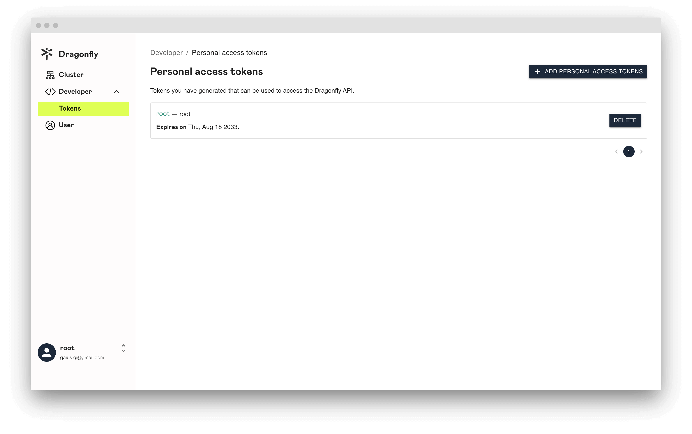

You can use a personal access token to call open API.

In this article, we will show you how to create, use, modify and delete personal access token.

## About personal access tokens

Only users with `root` role can browse all personal access token lists.

## Create personal access token

**Step 1:** Click the `ADD PERSONAL ACCESS TOKENS` button to create personal access token.

**Step 2:** In the `Name` field, give your token a descriptive name.

**Step 3:** In the `Description` field, add a description describing what the token is for.

**Step 4:** To give your token an expiration, select `Expiration`, Then choose the default option.

**Step 5:** Under `Select scopes`, select the access permissions for the token.

**Step 6:** Click `SAVE`.

**Step 7:** When you're done, copy the token and store it in a secure location. For your security, it doesn't display again.

## Update personal access token

On the left side of the personal access token to be updated, click `personal access token name`.

## Delete personal access token

To the right of the personal access token you want to delete, click `DELETE`.

## Use personal access token to call open API

**Step 1:** Open Postman, and import [postman_collection.json](https://github.com/gaius-qi/dragonfly-docs/blob/main/manager/postman/Dragonfly.postman_collection.json).

**Step 2:** Click **OpenAPI** in the left sidebar.

**Step 3:** Click **Authorization** and select **Bearer Token**, paste `personal access token` in `Token`.

**Step 4:** Click **Headers**, check whether `Authorization` is added to Headers.

**Step 5:** Click **Send** button to initiate a request.

**Step 6:** If successful, it means that the call to the open API is completed through the personal access token.

