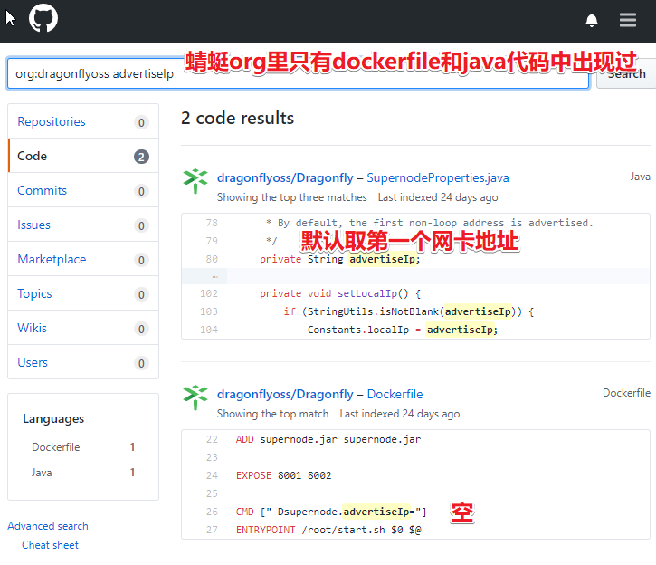
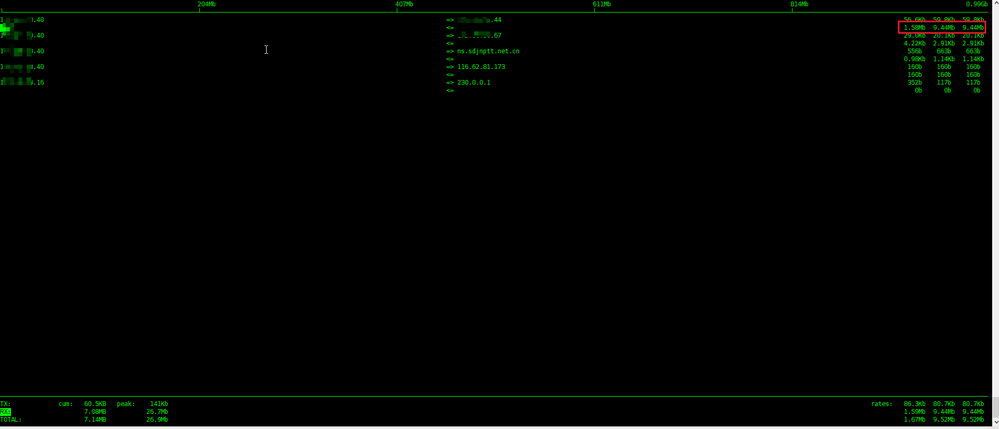

## 使用 Dragonfly 加速 Docker 镜像分发(基于 0.3.0)

### 介绍

如果说，微服务和容器是最佳拍档，那么模块多实例是肯定少不了。
假如没有使用类似 [Google jib](https://github.com/GoogleContainerTools/jib) 等手段进行镜像分层（利用镜像缓存），势必会造成:

- 带宽浪费：尤其是公网带宽，如果是自建 harbor，那么会容易导致单节点网卡被打满，如果用了 harbor 联邦，又会导致数据同步等运维问题。
- 集群拉起慢：镜像下载慢，必然会导致服务拉起慢。

关于 Google jib 可以参见我另外一篇 [加速和简化构建 Docker(基于 Google jib)](https://juejin.im/post/5c60c021f265da2dd37bf85b)，
本文只介绍 Dragonfly + dfdaemon

Dragonfly 是阿里巴巴自研并开源的一款基于 P2P 协议的文件分发系统。除了使用 dfget 进行文件下载外，还支持 dfdaemon 进行 docker 镜像下载。

关于 Dragonfly 的镜像分发的原理性说明，可参见[直击阿里双 11 神秘技术：PB 级大规模文件分发系统“蜻蜓”](https://yq.aliyun.com/articles/244897)
，文中介绍很详细，此处不多说明。

#### 实验环境

| 类型      | 系统                          | ip           | docker version      |
| --------- | ----------------------------- | ------------ | ------------------- |
| supernode | Ubuntu Server 16.04.6 LTS X64 | 192.168.0.44 | 17.06.2~ce-0~ubuntu |
| clinet1   | Ubuntu Server 16.04.6 LTS X64 | 192.168.0.40 | 17.06.2~ce-0~ubuntu |
| clinet2   | Ubuntu Server 16.04.6 LTS X64 | 192.168.0.45 | 17.06.2~ce-0~ubuntu |

##### 注意

如果是实验目的，建议用 Vmware，并且在关键操作时备份快照（比如，刚装完环境，升级完 PS 和.Net 后），这样能够及时，干净的还原现场，
节省每次重装系统导致的时间浪费安装吐槽一下 Dragonfly 的文档，简直让人不知所以。结合 issues + 钉钉群内请教，遂整理出最简使用文档。

#### supernode

可选：给 supernode 增加 docker 加速器，可以参考 <https://cr.console.aliyun.com/cn-hangzhou/instances/mirrors> ，如果不需要，可以去掉。

```bash
$ cat << EOD >/etc/docker/daemon.json
{
"registry-mirrors": ["https://xxxx.mirror.aliyuncs.com"]
}
EOD
$ systemctl restart docker
```

```bash
$ docker run --name dragonfly-supernode --restart=always -d -p 8001:8001 -p 8002:8002 \
  -v /data/dragonfly/supernode:/home/admin/supernode registry.cn-hangzhou.aliyuncs.com/dragonflyoss/supernode:0.3.0 \
  -Dsupernode.advertiseIp=172.60.20.44
```

##### 说明

- --restart=always 在容器退出时，自动重启容器，防止异常 kill 或者 oom 导致的异常退出
- registry.cn-hangzhou.aliyuncs.com/dragonflyoss/supernode:0.3.0 dragonfly 的 supernode 目前没有 docker hub 镜像，只能用阿里云的
  -v /data/dragonfly/supernode:/home/admin/supernode 将 supernode 的 data dir 挂载到宿主机上
- -Dsupernode.advertiseIp=172.60.20.44 设置 clinet 可以访问的 supernode ip,这是一个大坑。如果不设置，有可能会导致 client 无法连接
  supernode，届时，docker pull 会走 clinet 的网络，从真实的 registry 直接下载镜像



#### dfdaemon

```bash
$ cat <<EOD >/etc/dragonfly.conf
[node]
address=192.168.0.44
EOD
$ docker run --name dragonfly-dfclient --restart=always -d -p 65001:65001 \
  -v /root/.small-dragonfly:/root/.small-dragonfly \
  -v /etc/dragonfly.conf:/etc/dragonfly.conf dragonflyoss/dfclient:v0.3.0 \
  --registry=https://xxx.mirror.aliyuncs.com  --ratelimit 100M

$ cat <<EOD >/etc/docker/daemon.json
{
"registry-mirrors": ["http://127.0.0.1:65001"]
}
EOD

$ systemctl restart docker
```

##### 解释

- 在 /etc/dragonfly.conf 中配置 client 可以访问的 supernode 的 ip 地址，但是，目前官方没有做 HA，supernode 没法组集群，撑死算是联邦，
  不能共享文件信息，而且最坑的是，快速开始里，中英文均未提供需要配置此文件，
  等有所提及（我都是被坑完后，用关键词在 d7y 的 org 里搜索，类似知道答案后，找出处 手动[捂脸]）
- `-v /root/.small-dragonfly:/root/.small-dragonfly` ,将容器中的关键目录挂载到宿主机上，防止重启或者镜像升级时，数据丢失
- `--registry=https://xxx.mirror.aliyuncs.com` 从何处下载镜像，可以写 harbor 地址，也可以写加速器地址。默认是
  [https://index.docker.io](https://index.docker.io) ，但是，因为国内网络原因，会导致大概率性失败。很灵异。
  而官方文档是写的 `--registry https://xxx.xx.x` 不能算是坑，但是，对于 docker 不熟悉的，往往会不知能不能用加速器。
- `--ratelimit 100M` 是限速，默认是 20M ,这肯定不算坑哈，这是正常特性，但是，文档是有误的 `-ratelimit`
  而实际是 `--ratelimit` ,如果不改此参数，会发现，下载很慢。
- 修改/etc/docker/daemon.json 是为了让 docker engine 走 dfdaemon
- systemctl restart docker 是为了让 daemon 生效

### 测试

#### 大文件测试

```bash
docker pull anjia0532/kubeflow-images-public.tensorflow-1.6.0-notebook-gpu:v20180604-b3733835
```

可以通过 `iftop` 等软件，查看带宽使用情况判断是否生效，也可以通过查看日志来判断。


但是会经常性的出现 `error pulling image configuration: received unexpected HTTP status: 502 Bad Gateway`

### 最后

需要结合实际情况，配置相关参数，比如，文件失效时间，用来平衡文件有效期及磁盘使用量。

### 参考资料

- [直击阿里双 11 神秘技术：PB 级大规模文件分发系统“蜻蜓”](https://yq.aliyun.com/articles/244897)
- [深度解读阿里巴巴云原生镜像分发系统 Dragonfly](https://mp.weixin.qq.com/s?__biz=MzUzNzYxNjAzMg==&mid=2247484045&idx=1&sn=2e4586171930b8d3080eadd55be09723)
- [加速和简化构建 Docker(基于 Google jib)](https://juejin.im/post/5c60c021f265da2dd37bf85b)
- [浙江移动容器云基于 Dragonfly 的统一文件分发平台生产实践](https://d7y.io/zh-cn/blog/china-mobile-practice.html)

### 招聘小广告

山东济南的小伙伴欢迎投简历啊 [加入我们](https://www.zhipin.com/gongsi/e78fa84f96fef4e733J60tq8EA~~.html) , 一起搞事情。

长期招聘，Java 程序员，大数据工程师，运维工程师，前端工程师。
