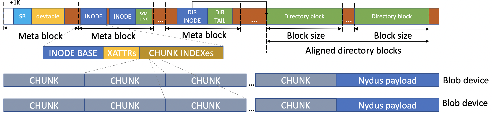
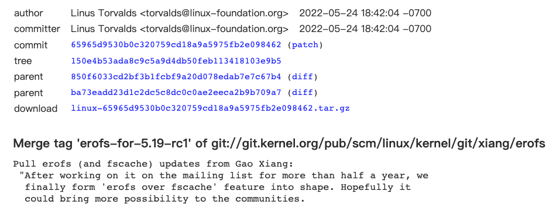
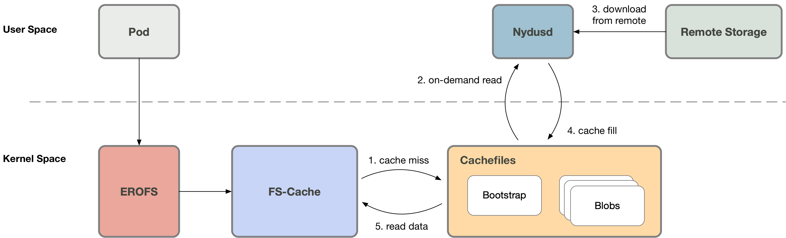
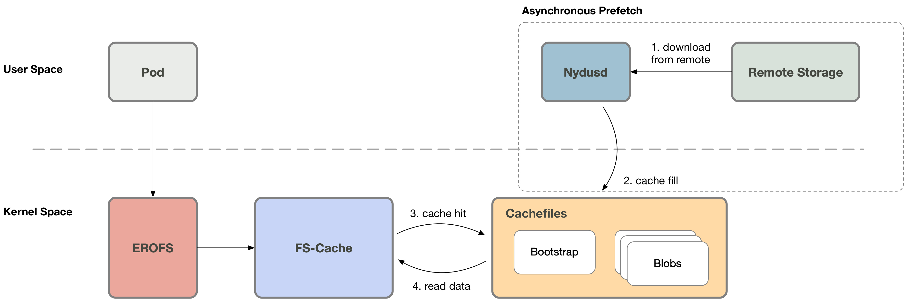

## Nydus 镜像加速之内核演进之路

多年来容器化实践告诉我们，优化后的容器镜像搭配 P2P 网络等技术可以有效降低容器部署启动的时间，并可保障容器持续稳定运行。为此我们开发了 Nydus 项目，作为 Dragonfly 下的镜像服务。

而除了启动速度，镜像分层、按需加载等核心特性在容器镜像领域也尤为重要。但是由于没有原生的文件系统支持，大多数都选择了用户态方案，Nydus 最初亦如此。随着方案和需求的不断演进，用户态方案遇到了越来越多的挑战，如性能与原生文件系统相比有较大差距、高密场景下资源开销较大等等。

为此我们设计并实现了兼容内核原生 EROFS 文件系统的 RAFS v6 格式，希望将容器镜像方案下沉到内核态。
同时随着 erofs over fscache 按需加载技术合入 [5.19 内核](https://git.kernel.org/pub/scm/linux/kernel/git/torvalds/linux.git/commit/?id=65965d9530b0c320759cd18a9a5975fb2e098462)，
Nydus 镜像服务的下一代容器镜像分发方案逐渐清晰起来。
同时这也是 [Linux 主线内核](https://git.kernel.org/pub/scm/linux/kernel/git/torvalds/linux.git/tree/) **首个**原生支持、开箱即用的容器镜像分发方案，为容器镜像终态的高密、高性能、高可用和易用性提供坚实保障。

本文将从 Nydus 架构回顾、RAFS v6 镜像格式和 EROFS over Fscache 按需加载技术三个角度来介绍该方案的演变历程。

为了解更多详情，请关注[Nydus](https://github.com/dragonflyoss/image-service)。
请参考[用户手册](https://github.com/dragonflyoss/image-service/blob/master/docs/nydus-fscache.md) 以使用 Nydus 的上述特性.

### Nydus 架构回顾

一句话总结一下，Nydus 镜像加速服务是一种优化了现有的 OCIv1 容器镜像架构，设计了 RAFS (Registry Acceleration File System) 磁盘格式，最终呈现为一种 *文件系统* 的容器镜像格式的镜像加速实现。

容器镜像的根本需求，本质上是为了提供容器的根目录 (rootfs)，这可以通过文件系统 (file system) 或者是归档格式 (archive format) 来承载，当然也可以在文件系统的基础上二次套娃 (例如通过自定义的块格式来承载)，
但本质载体是一个 *目录树*，体现为文件接口。

先看一下 OCIv1 标准镜像，OCIv1 格式是一种基于 Docker Image Manifest Version 2 Schema 2 格式的镜像格式规范，由 manifest、镜像索引 (optional)、一系列容器镜像层及配置文件组成，细节可以参见相关文档，本文不再赘述。
本质上说 OCI 镜像是一个以层为基本单位的镜像格式，每个层存储了文件级别的 diff data，以 tgz 归档格式存储，如下所示：

由于 tgz 的限制，OCIv1 存在一些固有问题，例如无法按需加载、较粗的层级的去重粒度、每层 hash 值易变等等。

而一些“二次套娃”方案 (例如基于自定义块格式的容器镜像方案)，也存在一些原理性的设计缺陷。例如：

- 容器镜像最终要体现为一棵目录树，那么就需要相应的文件系统来承载 (例如 ext4)，这样整个链路为“自定义块格式 + 用户态块设备 + 文件系统”，相对于文件系统方案其链路更长更复杂，端到端稳定性不可控；
- 由于块格式对上层的文件系统不感知，无法区分文件系统的元数据和数据并分别处理 (例如压缩)；
- 无法实现基于文件的镜像分析特性例如安全扫描、热点分析和运行时拦截等；
- 对于多个“二次套娃”容器镜像，无法做到不修改 blob 内容直接 merge 成一个大镜像，而这是文件系统方案的天然能力。

而我们实现的 Nydus 则是一种基于文件系统的容器镜像存储方案。其中将容器镜像文件系统的数据 (blobs) 和元数据 (bootstrap) 分离，让原来的镜像层只存储文件的数据部分。
并且把文件以 chunk 为粒度分割，每层 blob 存储对应的 chunk 数据；因为采用了 chunk 粒度，这细化了去重粒度，chunk 级去重让层与层之间，镜像与镜像之间共享数据更容易，也更容易实现按需加载。
由于元数据被单独分离出来合为一处，因此对于元数据的访问不需拉取对应的 blob 数据，需要拉取的数据量要小很多，I/O 效率更高。Nydus RAFS 镜像格式如下图所示：

### RAFS v6 镜像格式

#### RAFS 镜像格式演变

在 RAFS v6 格式引入之前，Nydus 使用的是一个完全用户态实现的镜像格式，通过 FUSE 或 virtiofs 接口提供服务。但用户态文件系统方案在设计上存在以下缺陷：

- 大量系统调用开销不可忽略，例如深度为 1 的随机小 I/O 访问；
- 当容器镜像中存在大量文件时，频繁的文件操作会产生大量的 fuse 请求，造成内核态/用户态上下文的频繁切换，造成性能瓶颈；
- 非 FSDAX 场景下，用户态到内核态的 buffer copy 会消耗 CPU 占用；
- 在 FSDAX (virtiofs 作为接口) 场景下，大量小文件会大量占用 DAX window 资源，存在潜在的性能抖动；频繁切换访问小文件也会产生大量 DAX mapping setup 开销。

这些问题是**用户态**文件系统方案的天然限制带来的，而如果将容器镜像格式的实现下沉到内核态，就可以从原理上根治上述问题。因而我们引入了 RAFS v6 镜像格式，一个依托于内核 EROFS 文件系统，实现于内核态的容器镜像格式。

#### EROFS 文件系统介绍

EROFS 文件系统自 Linux 4.19 内核开始存在于 Linux 主线中，过去主要用于嵌入式和移动终端领域，存在于当前各大流行发行版中 (例如 Fedora，Ubuntu，Archlinux，Debian，Gentoo 等等)。
用户态工具 erofs-utils 也已经存在于这些发行版和 [OIN Linux system definition](https://openinventionnetwork.com/linux-system/table-11/) 列表中，社区较活跃。

EROFS 文件系统具备如下特征：

- 适用于多种场景的原生本地只读块文件系统，磁盘格式具备最小 I/O 单位定义；
- page-sized 块对齐的不压缩元数据；
- 通过 Tail-packing 内联技术有效节省空间，同时维持高访问性能;
- 数据均以块为单位寻址 (mmap I/O 友好，不需 I/O 后处理);
- 随机访问友好的磁盘目录格式；
- 核心磁盘格式非常简单，且易于增加 payload，扩展性更好；
- 支持 DIRECT I/O 访问，支持块设备、FSDAX 等多种后端；
- 同时 EROFS 预留了 boot sector，可支持 bootloader 自启动等需求。

#### RAFS v6 镜像格式介绍

过去一年，阿里云内核团队对 EROFS 文件系统进行了一系列的改进与增强，拓展其在云原生下的使用场景，使其适应容器镜像存储系统的需求，最终呈现为一个实现于内核态的容器镜像格式，RAFS v6。而除了将镜像格式下沉到内核态，RAFS v6 还在镜像格式上进行了一系列优化，例如块对齐、更加精简的元数据等等。

新的 RAFS v6 镜像格式如下：

改进后的 Nydus 镜像服务架构如下图所示，增加了对 (EROFS based) RAFS v6 镜像格式的支持：

### EROFS over Fscache

erofs over fscache 是阿里云内核团队为 Nydus 开发的下一代容器镜像**按需加载**技术，同时也是 Linux 内核**原生**的镜像按需加载特性，于 [5.19 版本合入 Linux 内核主线](https://git.kernel.org/pub/scm/linux/kernel/git/torvalds/linux.git/commit/?id=65965d9530b0c320759cd18a9a5975fb2e098462)。

并于 LWN.net 作为 5.19 合并窗口的 [高亮特性](https://lwn.net/SubscriberLink/896140/3d7b8c63b70776d4/)：

在此之前业界已有的按需加载几乎都是用户态方案。用户态方案会涉及频繁的内核态/用户态上下文切换，以及内核态/用户态之间的内存拷贝，从而造成性能瓶颈。这一问题在容器镜像已经全部下载到本地的时候尤其突出，此时容器运行过程中涉及的文件访问，都还是会陷出到用户态的服务进程。

事实上我们可以将按需加载的 1) 缓存管理和 2) 缓存未命中的时候，通过各种途径 (例如网络) 获取数据，这两个操作解耦开。缓存管理可以下沉到内核态执行，这样当镜像在本地 ready 的时候，就可以避免内核态/用户态上下文的切换。
而这也正是 erofs over fscache 技术的价值所在。

#### 方案原理

fscache/cachefiles (以下统称 fscache) 是 Linux 系统中相对成熟的文件缓存方案，广泛应用于网络文件系统 (例如 NFS、Ceph 等)。我们的主要工作是，使其支持本地文件系统 (例如 erofs) 的按需加载特性。

此时容器在访问容器镜像的时候，fscache 会检查当前请求的数据是否已经缓存，如果缓存命中 (cache hit)，那么直接从缓存文件读取数据。这一过程全程处于内核态之中，并不会陷出到用户态。

否则 (cache miss) 需要通知用户态的 Nydusd 进程以处理这一访问请求，此时容器进程会陷入睡眠等待状态；Nydusd 通过网络从远端获取数据，通过 fscache 将这些数据写入对应的缓存文件，之后通知之前陷入睡眠等待状态的进程该请求已经处理完成；之后容器进程即可从缓存文件读取到数据。

#### 方案优势

正如之前所描述的，在镜像数据已经全部下载到本地的情况下，用户态方案会导致访问文件的进程频繁陷出到用户态，并涉及内核态/用户态之间的内存拷贝。
而 erofs over fscache 下则不会再陷出到用户态，让按需加载真的“**按需**”，从而在提前下载容器镜像的场景下实现**几乎无损的性能和稳定性**，
最终获得 1) 按需加载与 2) 提前下载容器镜像 这两种场景下真正 **统一**、**无损** 的方案。

具体来说 erofs over fscache 相对于用户态方案具有以下优势。

##### 1. 异步预取

容器创建之后，当容器进程尚未触发按需加载 (cache miss) 的时候，用户态的 Nydusd 就可以开始从网络下载数据并写入缓存文件，之后当容器访问的文件位置恰好处于预取范围内的时候，就会触发 cache hit 直接从缓存文件读取数据，而**不会再陷出到用户态**。用户态方案则无法实现该优化。

##### 2. 网络 IO 优化

当触发按需加载 (cache miss) 的时候，Nydusd 可以一次性从网络下载比当前实际请求的数据量更多的数据，并将下载的数据写入缓存文件。
例如容器访问 4K 数据触发的 cache miss，而 Nydusd 实际一次性下载 1MB 数据，以减小单位文件大小的网络传输延时。之后容器访问接下来的这 1MB 数据的时候，就**不必再陷出到用户态**。
用户态方案则无法实现该优化，因为即使触发 cache miss 的时候，用户态的服务进程同样实现了该优化，下一次容器访问位于读放大范围内的文件数据的时候，同样会陷出到用户态。

##### 3. 更佳的性能表现

当镜像数据已经全部下载到本地的时候 (即不考虑按需加载的影响)，erofs over fscache 的性能表现**显著优于用户态方案**，同时与原生文件系统的性能相近，从而实现与原生容器镜像方案 (未实现按需加载) 相近的性能表现。
以下是几个工作负载下的性能测试数据 [1]。

###### read/randread IO

以下是文件 read/randread buffer IO [2] 的性能对比

| read   | IOPS | BW | 性能
| -------- | -------- | -------- | -------- |
| native ext4 | 267K | 1093MB/s | 1 |
| loop | 240K | 982MB/s | 0.90 |
| fscache | 227K | 931MB/s | 0.85 |
| fuse  | 191K | 764MB/s | 0.70 |

| randread   | IOPS | BW | 性能
| -------- | -------- | -------- | -------- |
| native ext4 | 10.1K | 41.2MB/s | 1 |
| loop | 8.7K | 34.8MB/s | 0.84 |
| fscache | 9.5K | 38.2MB/s | 0.93 |
| fuse | 7.6K | 31.2MB/s | 0.76 |

> - "native" 表示测试文件直接位于本地的 ext4 文件系统中
> - "loop" 表示测试文件位于 erofs 镜像内，通过 loop 设备的 DIRECT IO 模式挂载 erofs 镜像
> - "fscache" 表示测试文件位于 erofs 镜像内，通过 erofs over fscache 方案挂载 erofs 镜像
> - "fuse" 表示挂载测试文件位于 fuse 文件系统 [3] 内
> - "性能" 一栏对各个模式下的性能进行归一化处理，以原生 ext4 文件系统的性能为基准，比较其他模式下的性能

可以看到，fscache 模式下的 read/randread 性能与 loop 模式下的性能基本持平，同时要优于 fuse 模式；但是与原生 ext4 文件系统的性能仍存在一定差距，我们正在进一步分析和优化，理论上该方案可以达到原生文件系统的水平。

###### 文件元数据操作测试

通过对大量小文件执行 tar 操作 [4] 测试文件元数据操作的性能。

|   | Time | 性能
| -------- | -------- | -------- |
| native ext4 | 1.04s | 1 |
| loop | 0.550s | 1.89 |
| fscache | 0.570s | 1.82 |
| fuse  | 3.2s | 0.33 |

可以看到 erofs 格式的容器镜像的元数据性能甚至优于原生 ext4 文件系统，这是 erofs 特殊的文件系统格式导致的。
由于 erofs 是一个只读 (read-only) 文件系统，因而其所有元数据可以紧密排布在一起，而 ext4 作为可写文件系统，其元数据则分散排布在多个 BG (block group) 中。

###### 典型工作负载测试

测试 linux 源码编译 [5] 这一典型工作负载下的性能表现。

| Linux Compiling   | Time | 性能
| -------- | -------- | -------- |
| native ext4 | 156s | 1 |
| loop | 154s | 1.0 |
| fscache | 156s | 1.0 |
| fuse  | 200s | 0.78 |

可以看到，fscache 模式下的 Linux 编译负载性能与 loop 模式、原生 ext4 文件系统的性能基本持平，同时要优于 fuse 模式。

##### 4. 高密部署

由于 erofs over fscache 方案基于文件实现，即每个容器镜像都表现为 fscache 下的一个缓存文件，因而其**天然支持高密部署**的场景。例如一个典型的 node.js 容器镜像在该方案下对应 ~20 个缓存文件，那么在一个部署有上百个容器的机器中，只需要维护上千个缓存文件。

##### 5. 故障恢复与热升级

当镜像文件全部下载到本地的时候，镜像中文件的访问不再需要用户态服务进程的介入，因而用户态服务进程存在更加充裕的时间窗口来实现**故障恢复与热升级**功能。这种场景下甚至不再需要用户态进程，从而实现与原生容器镜像方案 (未实现按需加载) 相近的稳定性表现。

##### 6. 统一的容器镜像方案

有了 RAFS v6 镜像格式和 erofs over fscache 按需加载技术，Nydus 同时适用于 runc 与 rund，作为这两种容器场景下的统一的容器镜像分发方案。

另外更重要的，erofs over fscache 是 1) 按需加载与 2) 提前下载容器镜像 这两种场景下真正 **统一**、**无损** 的方案。一方面，它实现了按需加载特性，在容器启动的时候不需要容器镜像全部下载到本地，从而助力极致的容器启动速度。
另一方面，它又完美兼容容器镜像已经下载到本地的这一场景，在文件访问过程中不再频繁陷出到用户态，从而实现与原生容器镜像方案 (未实现按需加载) 近乎无损的性能和稳定性表现。

### 展望与感谢

之后我们会对 erofs over fscache 方案进行持续迭代与完善，例如不同容器之间的镜像复用，stargz 和 FSDAX 支持，以及性能优化等。

最后感谢方案开发过程中支持和帮助过我们的所有个人与团队，感谢快手与字节跳动的同学对该方案的大力支持，让我们携手一起构建一个更好的容器镜像生态 ：）

1. 测试环境 ECS ecs.i2ne.4xlarge (16 vCPU, 128 GiB Mem)，本地 NVMe 盘
2. 测试命令 "fio -ioengine=psync -bs=4k -direct=0 -rw=[read|randread] -numjobs=1"
3. 使用 [passthrough_hp](https://github.com/libfuse/libfuse/blob/master/example/passthrough_hp.cc) 作为 fuse daemon
4. 测试 "tar -cf /dev/null linux_src_dir" 命令的执行时间
5. 测试 "time make -j16" 命令的执行时间
