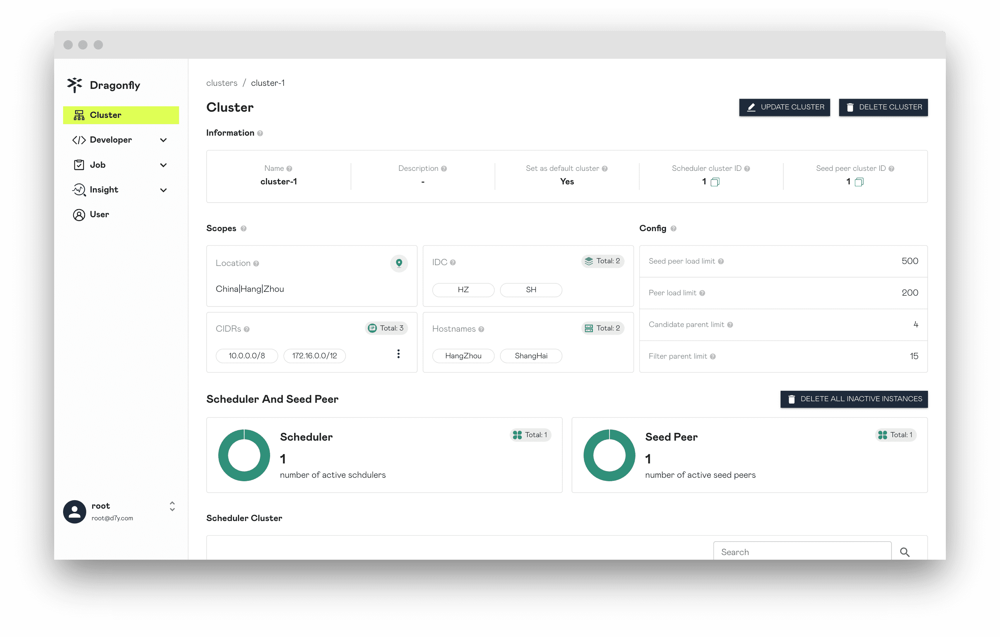
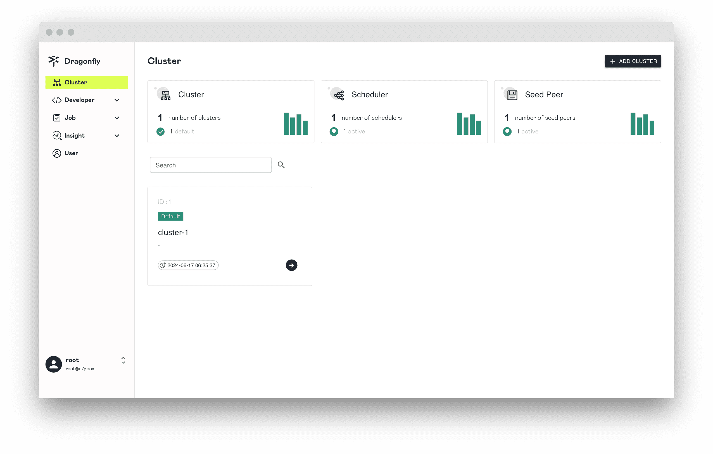
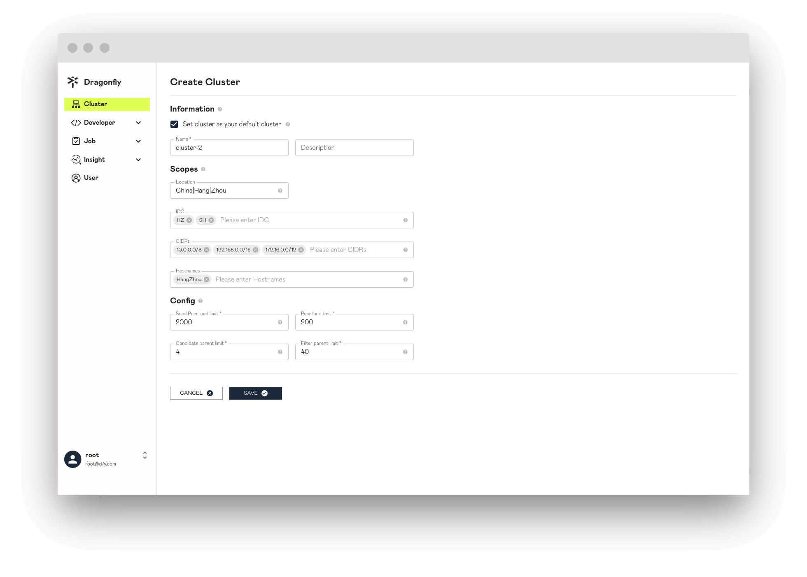
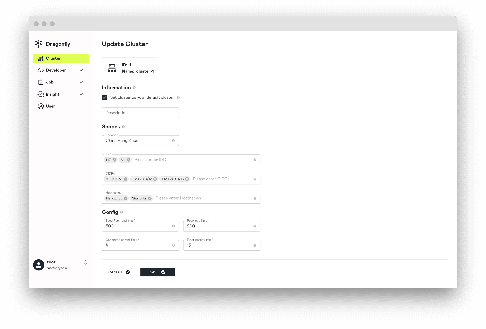
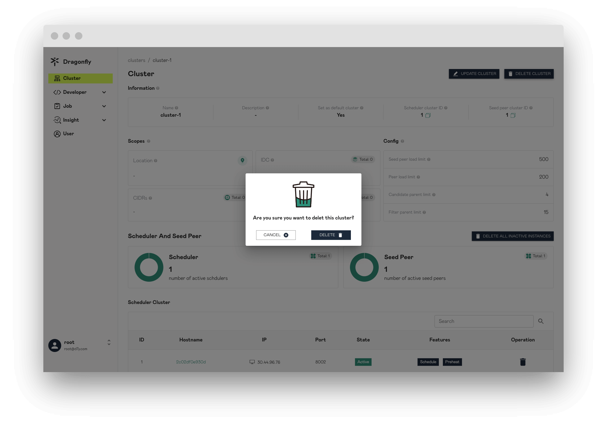
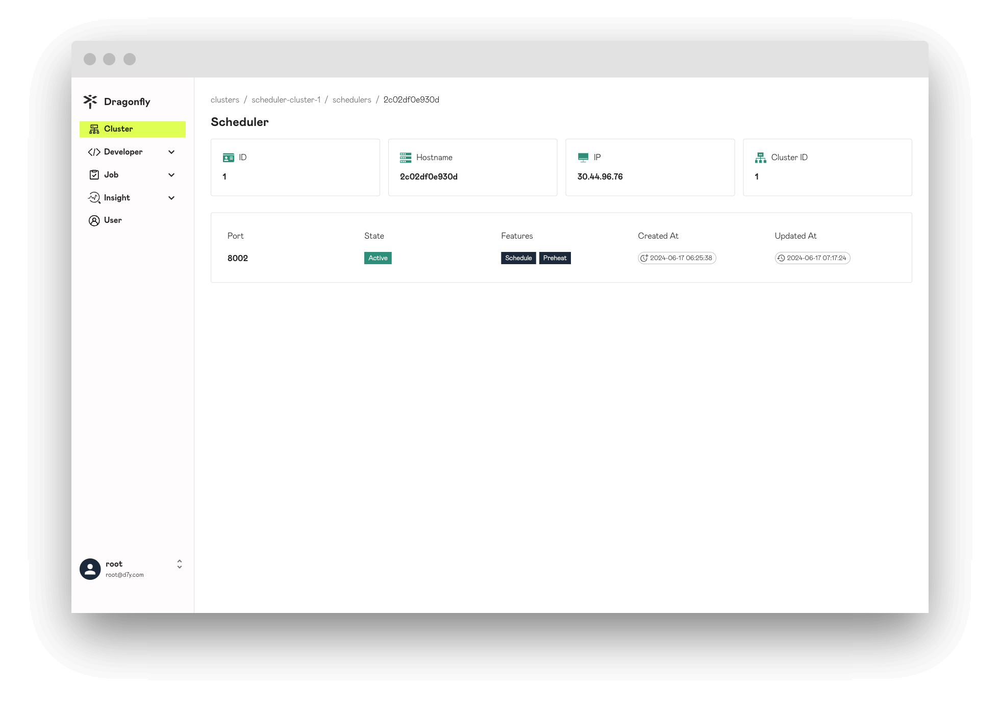
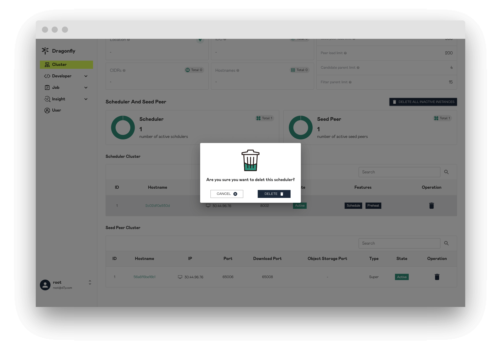
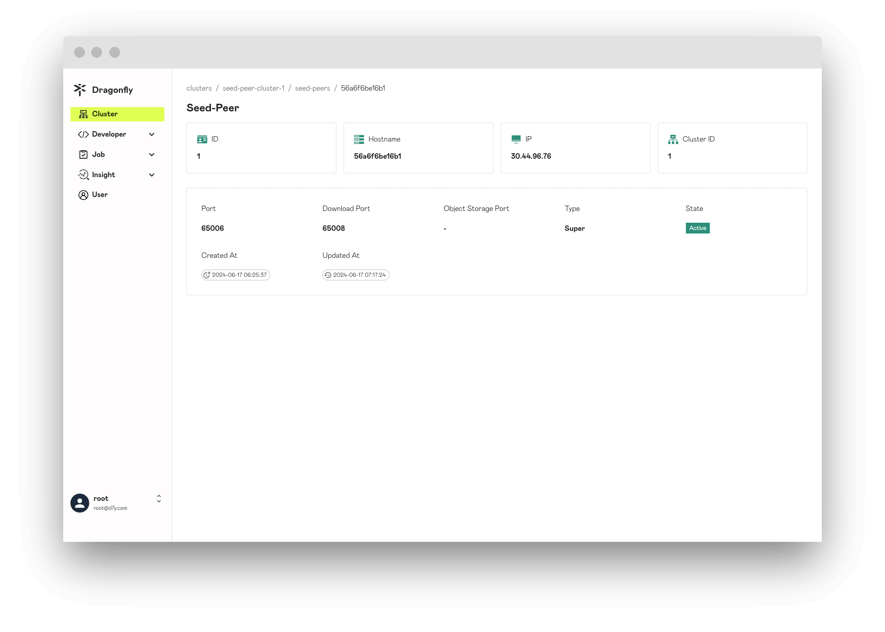
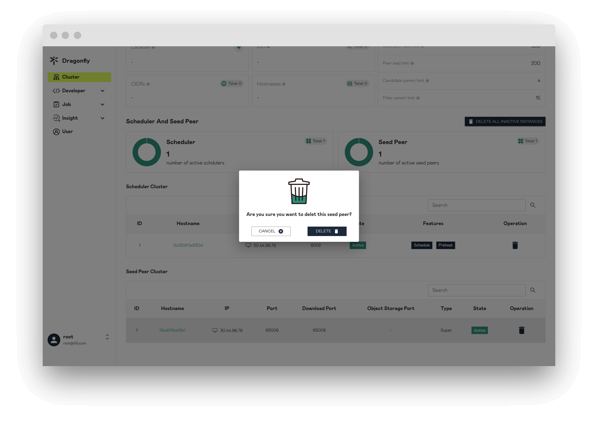
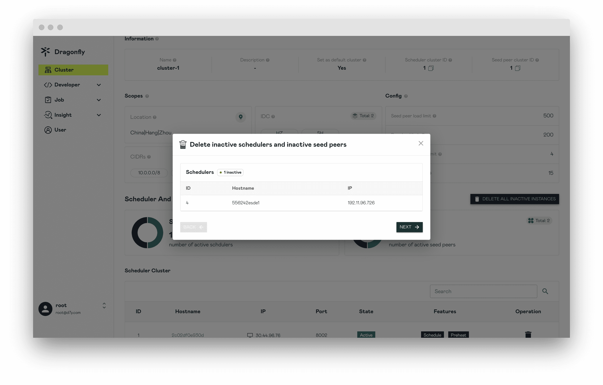

在本文中，我们将向您展示 Cluster 页面相关信息。

## Clusters

当用户登陆成功会直接重定向到 Clusters 页面，该页面展示所有 Clusters 的列表信息。

## Cluster

展示 Cluster 的详细信息，如果对属性表述不清楚，可以点击 `?` 按钮展示具体提示信息。

## Create Cluster

创建 Cluster 资源，同时会创建一组 `1:1` 关系的 Scheduler Cluster 和 Seed Peer Cluster。
一个 Cluster 即可以表示一个 P2P 集群，包含 1 个 Scheduler Cluster 和 1 个 Seed Peer Cluster。

### Information

Cluster 基本信息。

**Set cluster as your default cluster**: 当 Peer 根据 Scopes 信息没有找到匹配的 Cluster 服务时，会使用默认的 Cluster 服务。

### Scopes

Cluster 管辖的 Scopes 信息。Peer 会根据 Dfdaemon 启动的配置文件 IDC、Location 以及 IP 的内容上报给 Manager。然后 Manager 选择
跟 Cluster Scopes 中 IDC、Location 以及 CIDRs 匹配的 Cluster。被选中的 Cluster 会提供自身的 Scheduler Cluster 和 Seed Peer Cluster 对
当前 Peer 进行服务。这样可以通过 Scopes 来区分不同 Cluster 服务的 Peer 群，在多集群场景中非常重要。

**Location**: Cluster 需要为该 Location 的所有 Peer 提供服务。当对 Peer 配置中的 Location 与 Cluster 中的 Location 配时，
Peer 将优先使用 Cluster 的 Scheduler 和 Seed Peer。用“|”分隔，例如“地区|国家|省|城市”。

**IDC**: Cluster 需要服务 IDC 内的所有 Peer。当 Peer 配置中的 IDC 与 Cluster 中的 IDC 匹配时，Peer 将优先使用 Cluster 的 Scheduler 和 Seed Peer。
IDC 在 Scopes 内的优先级高于 Location。

**CIDRs**: Cluster 需要为 CIDR 中的所有 Peer 提供服务。当 Peer 启动时，将在 Peer 配置中使用 Advertise IP，如果 Peer 配置中的 Advertise IP 为空，
则 Peer 将自动获取 Expose IP 作为 Advertise IP。当 Peer 上报的 IP 与 Cluster 中的 CIDR 匹配时，Peer 将优先使用 Cluster 的 Scheduler 和 Seed Peer。
CIDR 在 Scopes 内的优先级高于 IDC。

**Hostnames**: Cluster 需要为 Hostnames 中的所有 Peer 提供服务。当 Peer 启动时，Hostnames 将在 Peer 配置中报告。
当 Hostnames 与 Cluster 中的多个 Hostnames 正则表达式匹配时，Peer 将优先使用 Cluster 的 Scheduler 和 Seed Peer。
Hostnames 在 Scopes 的优先级高于 IDC。Hostnames 的优先级等于 Scopes 的 CIDR。

### Config

P2P 中的下载配置。

**Seed Peer load limit**: 如果其他 Peer 从 Seed Peer 下载，Seed Peer 的负载将会增加。当达到 Seed Peer 的负载限制时，
Scheduler 将不再调度其他 Peer 从 Seed Peer 下载，直到它有可用的负载。

**Peer load limit**: 如果其他 Peer 从该 Peer 下载，该 Peer 的负载将会增加。当达到 Peer 的负载限制时，
Scheduler 将不再调度其他 Peer 从该 Peer 下载，直到它有可用的负载。

**Candidate parent limit**: Scheduler 最多可以为 Peer 调度的父节点个数。

**Filter parent limit**: Scheduler 将根据限制从所有 Peer 中随机选择对应数量的 Parents，并且对 Parents 进行评估，并且根据 Candidate parent limit 值
选择分数最高的一组 Parents 供当前 Peer 使用。

## Update Cluster

更新 Cluster 信息。

## Delete Cluster

删除 Cluster 信息，同时会删除 Scheduler Cluster 和 Seed Peer Cluster 信息。

## Scheduler

展示 Scheduler 实例信息。

## Delete Scheduler

删除 Scheduler 实例信息，如果被删除掉那么该 Scheduler 就无法提供服务。

## Seed Peer

展示 Seed Peer 实例信息。

## Delete seed peer

删除 Seed Peer 实例信息，如果被删除掉那么该 Seed Peer 就无法提供服务。

## Delete all inative instances

删除数据库中所有 Inactive Scheduler 和 Inactive Seed Peers 实例信息。

