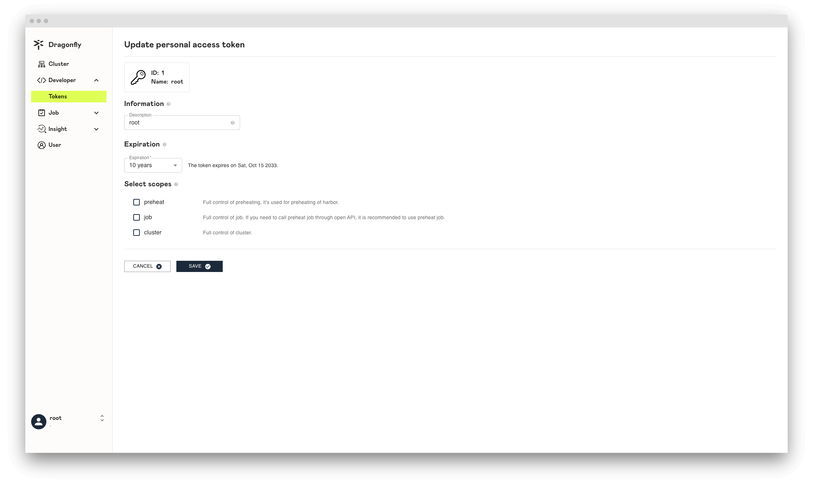
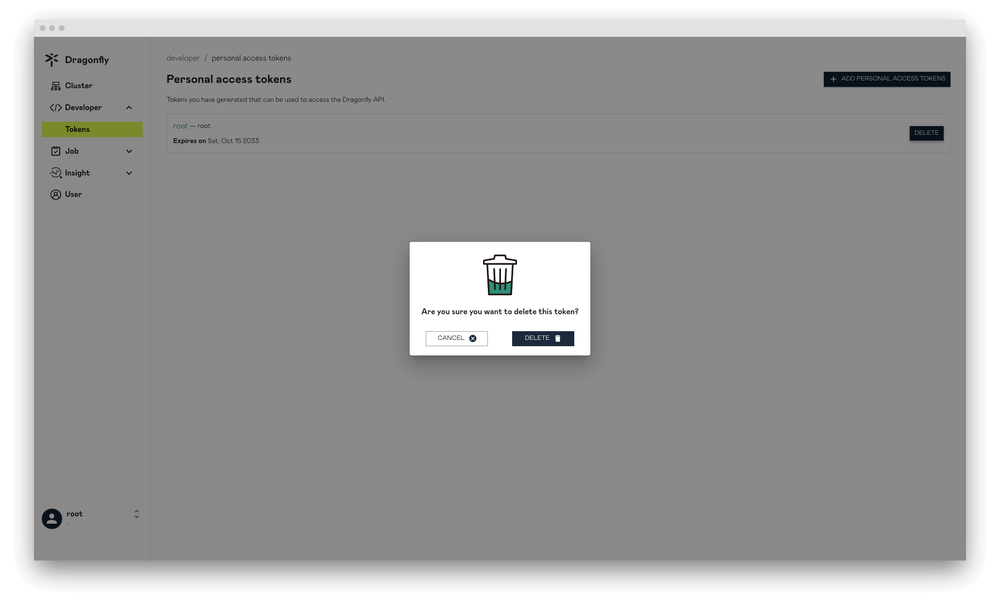

在本文中，我们将向您展示 Personal Access Token 页面相关信息。

## Personal Access Tokens

展示所有 Personal Access Tokens 的列表信息。

## Create Personal Access Token

创建 Personal Access Token。

### Information

Personal Access Token 基本信息。

**Description**: 添加说明来描述令牌的用途。

### Expiration

令牌过期时间。

**Expiration**: 为令牌提供过期时间。

### Select scopes

选择令牌的访问权限。

**preheat**: 用于 Harbor 预热。

**job**: 如果需要通过 Open API 调用预热，建议使用 job 进行预热。

**cluster**: 完全控制 Cluster。

## Update Personal Access Token

更新 Personal Access Token 信息。

## Delete Personal Access Token

删除 Personal Access Token，如果被删除那么该 Personal Access Token 将无法提供服务。

