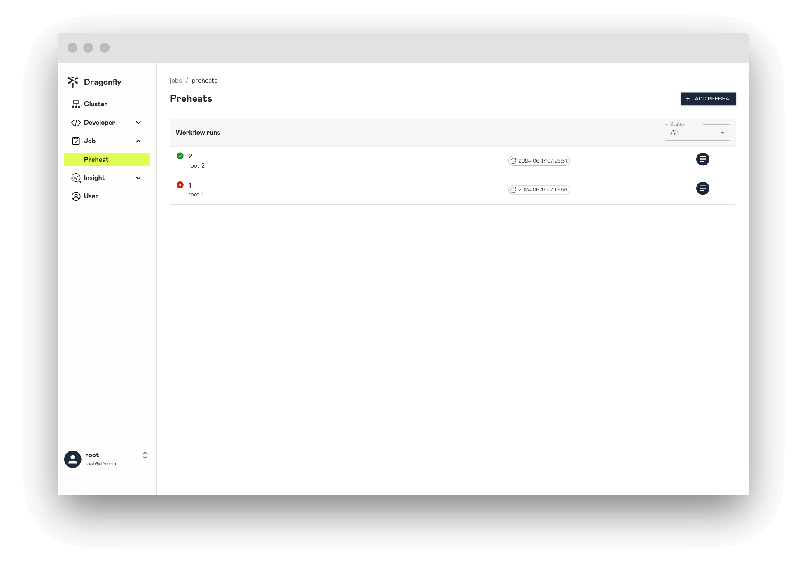
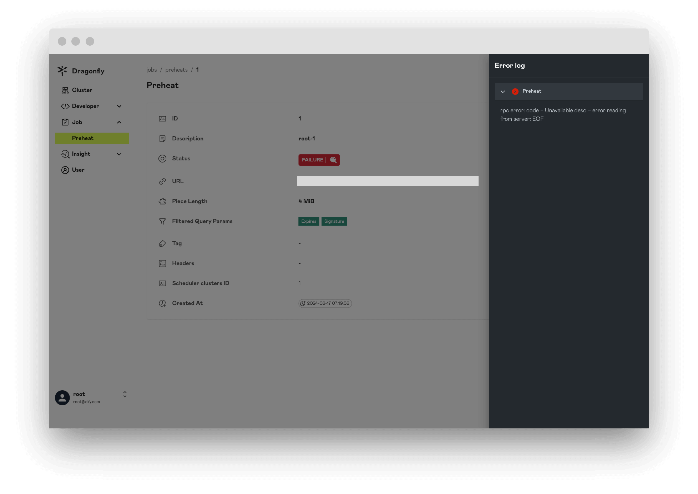
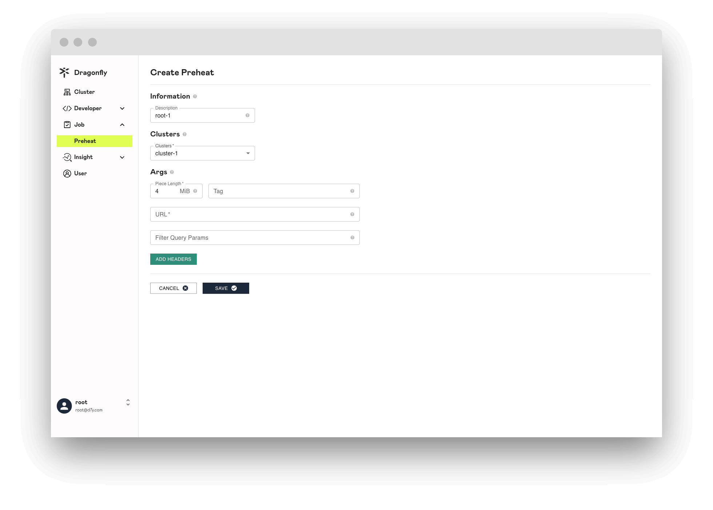

在本文中，我们将向您展示 Preheat 页面相关信息。

## Preheats

展示所有预热任务列表信息。

## Preheat

显示预热任务详细信息，`status` 属性显示预热任务是否成功。

## Preheat Failure

如果返回预热任务状态为 `FAILURE`，表示预热失败，并且可以查看失败日志。

## Create Preheat

创建预热任务，该任务用于文件预热。

### Information

Preheat 基本信息。

**Description**: 添加说明来描述预热的用途。

### Clusters

指定预热 Cluster。

**Clusters**: 至少选择一个或多个 Cluster 进行预热。

### Args

将附加配置选项传递给预热任务。

**Piece Length**: 指定预热期间要下载的 Piece 的大小。默认最小值为 4MiB，最大值为 1024MiB。

**Tag**: 当预热任务的 URL 相同但 Tag 不同时，会根据 Tag 进行区分，生成的预热任务也会不同。

**URL**: 需要进行预热资源的 URL 地址。

**Filtered Query Params**: 通过设置 filteredQueryParams 参数，可以指定需要预热的资源的文件类型，过滤器用于生成唯一的任务 ID，过滤 URL 中不必要的查询参数。

**ADD Headers**: 添加预热请求的 headers。
