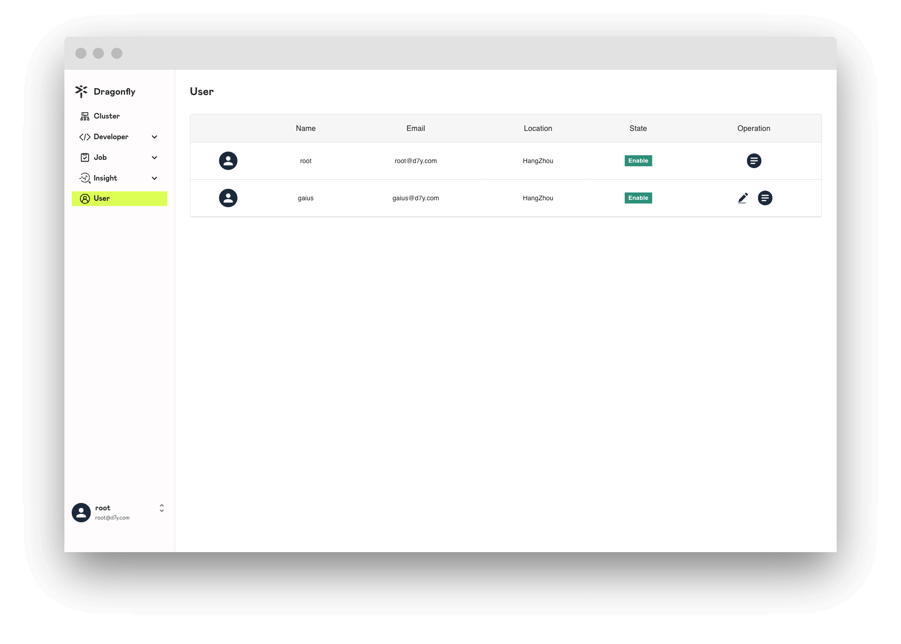
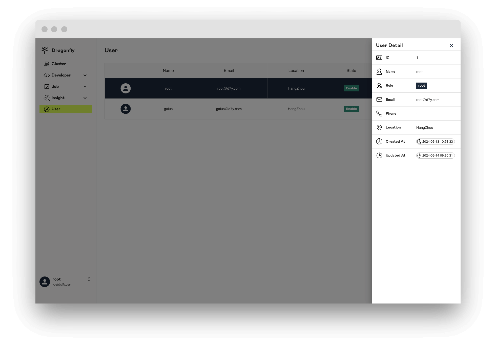
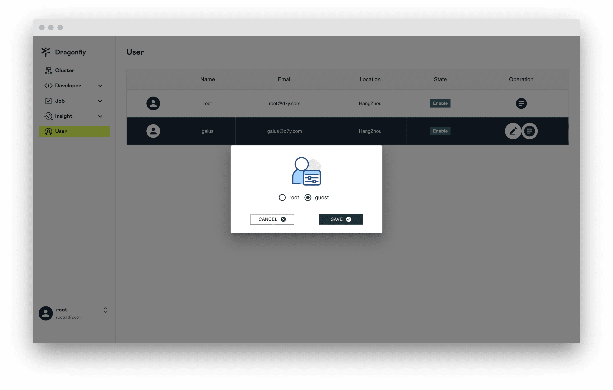
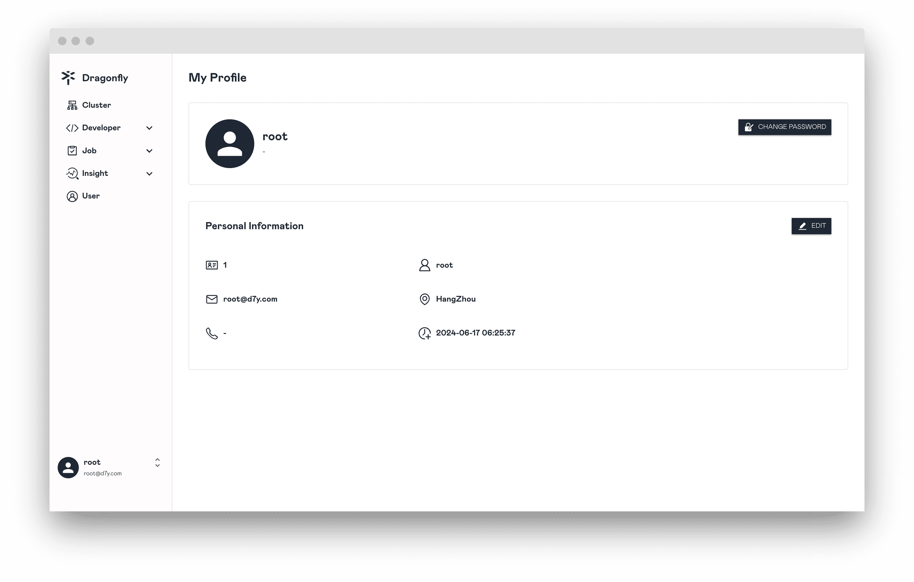
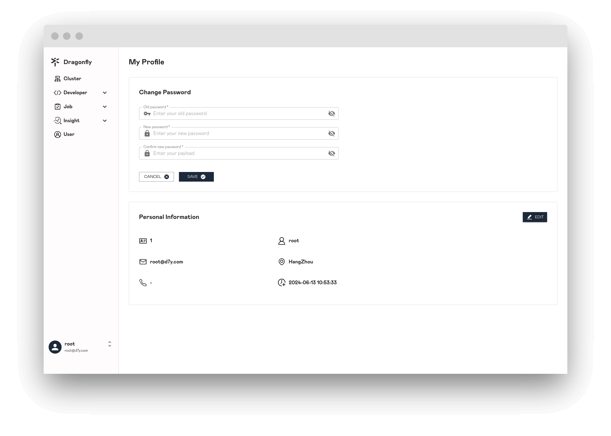
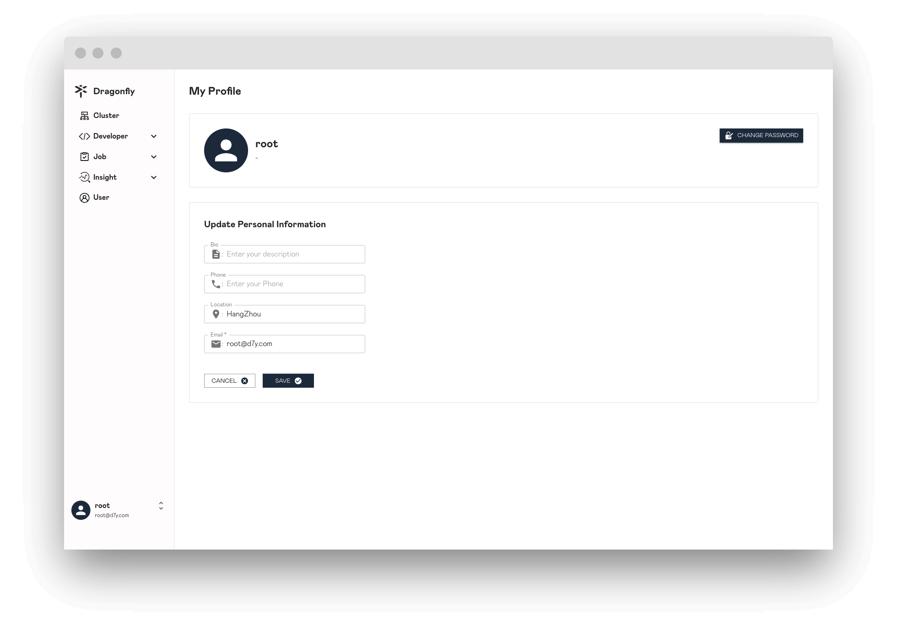

## Users

只有 `root` 角色的用户可以浏览所有用户的信息列表。

## User

展示用户的详细信息。

## Update User Role

只有 `root` 角色的用户可以更改其他用户的角色。

## Profile

展示用户自己的信息。

## Change Password

更改密码。

## Update Profile

更新用户自己的信息。

