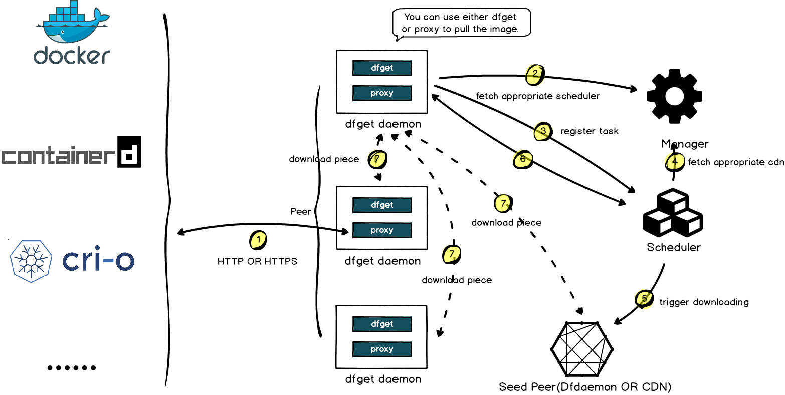

## 简介

Dragonfly 是一款基于 P2P 的智能镜像和文件分发工具。它旨在提高大规模文件传输的效率和速率，最大限度地利用网络带宽。在应用分发、缓存分发、日志分发和镜像分发等领域被大规模使用。

现阶段 Dragonfly 基于 [Dragonfly1.x](https://github.com/dragonflyoss/Dragonfly) 演进而来，在保持 Dragonfly1.x 原有核心能力的基础上，Dragonfly
在系统架构设计、产品能力、使用场景等几大方向上进行了全面升级。

## 特性

如开篇所述， Dragonfly 提供了大规模文件分发一站式解决方案。Dragonfly 提供的基础能力包括：

- **基于 P2P 的文件分发**：通过利用 P2P 技术进行文件传输，它能最大限度地利用每个对等节点（Peer）的带宽资源，以提高下载效率，并节省大量跨机房带宽，尤其是昂贵的跨境带宽。
- **非侵入式接入**：Dragonfly 可无缝支持多种容器用于分发镜像。
- **主机级别的限速**：除了像许多其他下载工具针对当前下载任务的限速之外，Dragonfly 还支持针对整个机器的限速。
- **高度一致性**：Dragonfly 可确保所有下载的文件是一致的，即使用户不进行最终一致性校验。
- **隔离异常节点**：Dragonfly 会自动隔离异常节点来提高下载稳定性。
- **生态**：Harbor 可以基于 Dragonfly 进行镜像分发以及预热。 镜像加速项目 Nydus 可以在容器运行时使用 Dragonfly 进行数据分发。

## 演进

自 17 年开源以来，Dragonfly 被许多大规模互联网公司选用并投入生产使用，并在 18 年 10 月正式进入 CNCF，成为中国第三个进入 CNCF 沙箱级别的项目。2020 年 4 月，CNCF 技术监督委员会（TOC）投票决定接受
Dragonfly 作为孵化级别的托管项目。Dragonfly 多年生产实践经验打磨的下一代产品，它汲取了上一代 [Dragonfly1.x](https://github.com/dragonflyoss/Dragonfly)
的优点并针对已知问题做了大量的优化。

Dragonfly 在解决大规模文件分发场景下有着无可比拟的优势。随着 Dragonfly 大版本更新也带来了以下特性:

**全新架构**：

Dragonfly 整体由四部分组成 Manager、Scheduler、Seed Peer 和 Peer，将 Scheduler 和 Seed Peer 独立从根本上解决了调度和存储 IO 之间相互影响的问题。
同时支持 Seed Peer 插件化可按需部署，灵活满足不同场景的实际需要。此外整个系统采用更加高效的 GRPC 框架，并采用自定义一致性 hash 实现系统间的交互，极大提升了 P2P 的规模和分发效率。

**更广泛的应用场景**：

Dragonfly 通过统一的回源适配层实现支持各种不同类型存储源的 P2P 文件分发能力, 例如 HDFS、OSS、NAS 以及各云厂商的存储服务等。
同时未来还会支持更多的分发模式：主动拉取、主动推送、实时同步、远程复制、自动预热、跨云传输等等。

**产品能力**：

Dragonfly 通过管控系统支持配置管理、各种分发模式的任务管理、数据视图以及全局管控等功能，使得系统更加简单易用。此外，数据大盘、流量计费等能力也在未来规划中。

## 技术架构

Dragonfly 架构主要分为三部分 Manager、Scheduler、Seed Peer 以及 Peer 各司其职组成 P2P 下载网络, Dfdaemon 可以作为 Seed Peer 和 Peer。
详细内容可以参考[架构文档](../concepts/terminology/architecture.md), 下面是各模块功能:

- **Manager**: 维护各 P2P 集群的关联关系、动态配置管理、用户态以及权限管理等功能。也包含了前端控制台，方便用户进行可视化操作集群。
- **Scheduler**: 为下载节点选择最优下载父节点。异常情况控制 Dfdaemon 回源。
- **Seed Peer**: Dfdaemon 开启 Seed Peer 模式可以作为 P2P 集群中回源下载节点, 也就是整个集群中下载的根节点。
- **Peer**: 通过 Dfdaemon 部署，基于 C/S 架构提供 `dfget` 命令行下载工具，以及 `dfget daemon` 运行守护进程，提供任务下载能力。

