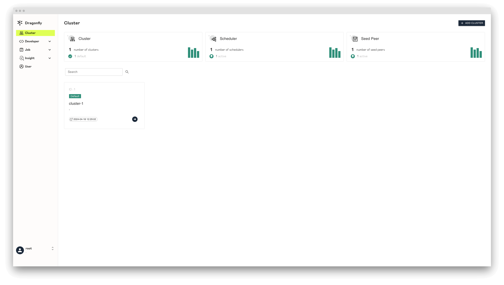
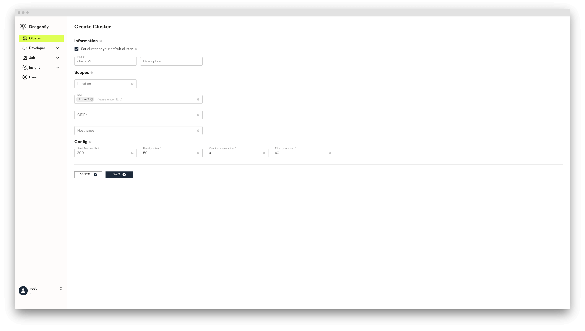
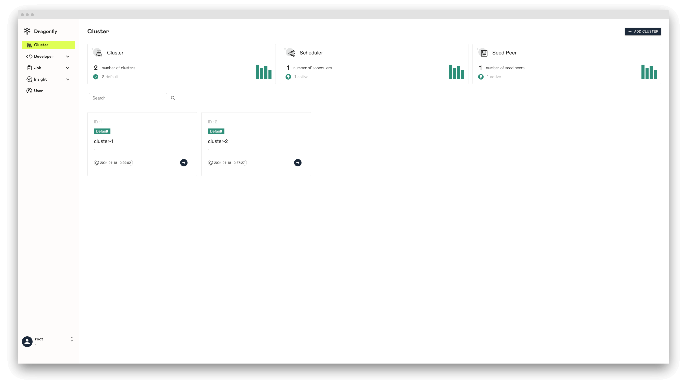
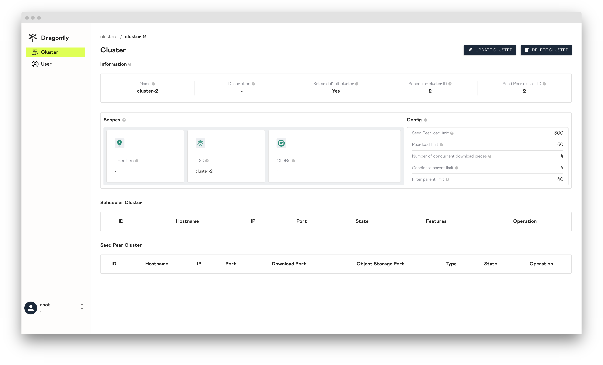
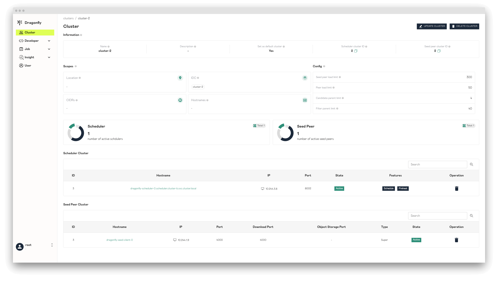
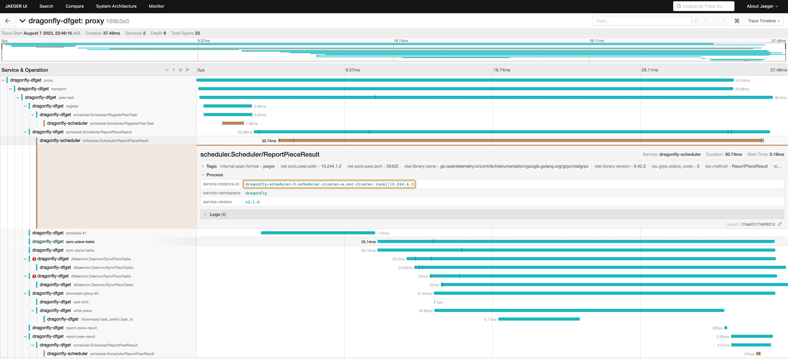

文档的目标是帮助您快速开始使用 Helm 在多 Kubernetes 集群场景下部署 Dragonfly。一个 Dragonfly 集群管理
一个单独网络环境的集群。如果有两个集群是相互隔离的网络环境，需要有两个 Dragonfly 集群管理各自的集群。

推荐用户在多 Kubernetes 集群场景下，使用一个 Dragonfly 集群管理一个 Kubernetes 集群，二者 `1:1` 关系。
并且使用一个中心化的 Manager 服务去管理多个 Dragonfly 集群。因为对于 Dragonfly 一个 Dragonfly 集群中的所有
Peers 只能在当前 Dragonfly 集群内 P2P 传输数据，所以一定要保证一个 Dragonfly 集群中的所有 Peers 网络是互通的。
那么如果一个 Dragonfly 集群管理一个 Kubernetes 集群，那么代表集群内的 Peers 只在 Kubernetes 集群纬度进行 P2P 传输数据。


## 容器运行时

您可以根据 [Helm Charts](../installation/helm-charts.md)文档中的内容快速搭建 Dragonfly 的 Kubernetes 集群。
我们推荐使用 `containerd`。

| 容器运行时                | 版本要求 |  文档                                             |
| ----------------------- | ------- | ------------------------------------------------ |
| containerd              | v1.1.0+ | [Link](../../setup/runtime/containerd/mirror.md) |
| Docker                  | v20.0.1+| [Link](../../setup/runtime/docker.md)            |
| CRI-O                   | All     | [Link](../../setup/runtime/cri-o.md)             |

## 准备 Kubernetes 集群

如果没有可用的 Kubernetes 集群进行测试，推荐使用 [Kind](https://kind.sigs.k8s.io/)。

创建 Kind 多节点集群配置文件 `kind-config.yaml`，配置如下:

```yaml
kind: Cluster
apiVersion: kind.x-k8s.io/v1alpha4
nodes:
  - role: control-plane
  - role: worker
    extraPortMappings:
      - containerPort: 30950
        hostPort: 8080
    labels:
      cluster: a
  - role: worker
    labels:
      cluster: a
  - role: worker
    labels:
      cluster: b
  - role: worker
    labels:
      cluster: b
```

使用配置文件创建 Kind 集群:

```shell
kind create cluster --config kind-config.yaml
```

切换 Kubectl 的 context 到 Kind 集群:

```shell
kubectl config use-context kind-kind
```

## Kind 加载 Dragonfly 镜像

下载 Dragonfly latest 镜像:

```shell
docker pull dragonflyoss/scheduler:latest
docker pull dragonflyoss/manager:latest
docker pull dragonflyoss/dfdaemon:latest
```

Kind 集群加载 Dragonfly latest 镜像:

```shell
kind load docker-image dragonflyoss/scheduler:latest
kind load docker-image dragonflyoss/manager:latest
kind load docker-image dragonflyoss/dfdaemon:latest
```

## 创建 Dragonfly 集群 A

创建 Dragonfly 集群 A，应该使用 Helm 在当前集群内安装中心化的 Manager、Scheduler、Seed Peer、Peer。

### 基于 Helm Charts 创建 Dragonfly 集群 A

创建 Helm Charts 的 Dragonfly 集群 A 的配置文件 `charts-config-cluster-a.yaml`，配置如下:

```yaml
containerRuntime:
  containerd:
    enable: true
    injectConfigPath: true
    registries:
      - 'https://ghcr.io'

scheduler:
  image: dragonflyoss/scheduler
  tag: latest
  nodeSelector:
    cluster: a
  replicas: 1
  metrics:
    enable: true
  config:
    verbose: true
    pprofPort: 18066

seedPeer:
  image: dragonflyoss/dfdaemon
  tag: latest
  nodeSelector:
    cluster: a
  replicas: 1
  metrics:
    enable: true
  config:
    verbose: true
    pprofPort: 18066

dfdaemon:
  image: dragonflyoss/dfdaemon
  tag: latest
  nodeSelector:
    cluster: a
  metrics:
    enable: true
  config:
    verbose: true
    pprofPort: 18066

manager:
  image: dragonflyoss/manager
  tag: latest
  nodeSelector:
    cluster: a
  replicas: 1
  metrics:
    enable: true
  config:
    verbose: true
    pprofPort: 18066

jaeger:
  enable: true
```

使用配置文件部署 Helm Charts 的 Dragonfly 集群 A:

<!-- markdownlint-disable -->

```shell
$ helm repo add dragonfly https://dragonflyoss.github.io/helm-charts/
$ helm install --wait --create-namespace --namespace cluster-a dragonfly dragonfly/dragonfly -f charts-config-cluster-a.yaml
NAME: dragonfly
LAST DEPLOYED: Mon Aug  7 22:07:02 2023
NAMESPACE: cluster-a
STATUS: deployed
REVISION: 1
TEST SUITE: None
NOTES:
1. Get the scheduler address by running these commands:
  export SCHEDULER_POD_NAME=$(kubectl get pods --namespace cluster-a -l "app=dragonfly,release=dragonfly,component=scheduler" -o jsonpath={.items[0].metadata.name})
  export SCHEDULER_CONTAINER_PORT=$(kubectl get pod --namespace cluster-a $SCHEDULER_POD_NAME -o jsonpath="{.spec.containers[0].ports[0].containerPort}")
  kubectl --namespace cluster-a port-forward $SCHEDULER_POD_NAME 8002:$SCHEDULER_CONTAINER_PORT
  echo "Visit http://127.0.0.1:8002 to use your scheduler"

2. Get the dfdaemon port by running these commands:
  export DFDAEMON_POD_NAME=$(kubectl get pods --namespace cluster-a -l "app=dragonfly,release=dragonfly,component=dfdaemon" -o jsonpath={.items[0].metadata.name})
  export DFDAEMON_CONTAINER_PORT=$(kubectl get pod --namespace cluster-a $DFDAEMON_POD_NAME -o jsonpath="{.spec.containers[0].ports[0].containerPort}")
  You can use $DFDAEMON_CONTAINER_PORT as a proxy port in Node.

3. Configure runtime to use dragonfly:
  https://d7y.io/docs/getting-started/quick-start/kubernetes/


4. Get Jaeger query URL by running these commands:
  export JAEGER_QUERY_PORT=$(kubectl --namespace cluster-a get services dragonfly-jaeger-query -o jsonpath="{.spec.ports[0].port}")
  kubectl --namespace cluster-a port-forward service/dragonfly-jaeger-query 16686:$JAEGER_QUERY_PORT
  echo "Visit http://127.0.0.1:16686/search?limit=20&lookback=1h&maxDuration&minDuration&service=dragonfly to query download events"
```

<!-- markdownlint-restore -->

检查 Dragonfly 集群 A 是否部署成功:

```shell
$ kubectl get po -n cluster-a
NAME                                 READY   STATUS    RESTARTS      AGE
dragonfly-dfdaemon-7t6wc             1/1     Running   0             3m18s
dragonfly-dfdaemon-r45bk             1/1     Running   0             3m18s
dragonfly-jaeger-84dbfd5b56-fmhh6    1/1     Running   0             3m18s
dragonfly-manager-75f4c54d6d-tr88v   1/1     Running   0             3m18s
dragonfly-mysql-0                    1/1     Running   0             3m18s
dragonfly-redis-master-0             1/1     Running   0             3m18s
dragonfly-redis-replicas-0           1/1     Running   1 (2m ago)    3m18s
dragonfly-redis-replicas-1           1/1     Running   0             96s
dragonfly-redis-replicas-2           1/1     Running   0             45s
dragonfly-scheduler-0                1/1     Running   0             3m18s
dragonfly-seed-peer-0                1/1     Running   1 (37s ago)   3m18s
```

### 创建 Manager REST 服务的 NodePort Service 资源

创建 Manager REST 服务的配置文件 `manager-rest-svc.yaml`，配置如下:

```yaml
apiVersion: v1
kind: Service
metadata:
  name: manager-rest
  namespace: cluster-a
spec:
  type: NodePort
  ports:
    - name: http
      nodePort: 30950
      port: 8080
  selector:
    app: dragonfly
    component: manager
    release: dragonfly
```

使用配置文件创建 Manager REST 服务的 Service 资源：

```shell
kubectl apply -f manager-rest-svc.yaml -n cluster-a
```

### 访问 Manager 控制台

使用默认用户名 `root`，密码 `dragonfly` 访问 `localhost:8080` 的 Manager 控制台地址，并且进入控制台。




在 Dragonfly Manager 部署成功后，默认情况下 Dragonfly Manager 在第一次启动的时候，如果没有任何集群，
那么会自动创建集群 A 的记录。用户可以点击 Manager 控制台看到集群 A 的详细信息。


## 创建 Dragonfly 集群 B

创建 Dragonfly 集群 B，需要在 Manager 控制台首先创建 Dragonfly 集群记录，
然后再使用 Helm 安装 Scheduler、Seed Peer 和 Peer。

### Manager 控制台创建 Dragonfly 集群 B 的记录

点击 `ADD CLUSTER` 按钮创建集群 B 的记录，注意 IDC 设置为 `cluster-2` 使其能够跟后面 Peer 配置文件中
IDC 值为 `cluster-2` 的 Peer 相匹配。



创建 Dragonfly 集群 B 记录成功。



### 使用 Scopes 配置区分不同 Dragonfly 集群

Cluster 管辖的 Scopes 信息。Peer 会根据 Dfdaemon 启动的配置文件 `host.idc`、`host.location` 以及 `host.advertiseIP`
的内容上报给 Manager。然后 Manager 选择跟 Cluster Scopes 中 IDC、Location 以及 CIDRs 匹配的 Cluster。
被选中的 Cluster 会提供自身的 Scheduler Cluster 和 Seed Peer Cluster 对
当前 Peer 进行服务。这样可以通过 Scopes 来区分不同 Cluster 服务的 Peer 群，在多集群场景中非常重要。
Peer 的配置文件可以参考文档 [dfdaemon config](../../reference/configuration/dfdaemon.md)。

如果 Peer 的 Scopes 信息和 Dragonfly 集群匹配，那么会优先使用当前 Dragonfly 集群的
Scheduler 和 Seed Peer 提供服务。也就是说当前 Dragonfly 集群内的 Peer 只能在集群内部
进行 P2P 传输数据。如果没有匹配的 Dragonfly 集群，那么使用默认的 Dragonfly 集群提供服务。

**Location**: Cluster 需要为该 Location 的所有 Peer 提供服务。当对 Peer 配置中的 Location 与 Cluster 中的 Location 配时，
Peer 将优先使用 Cluster 的 Scheduler 和 Seed Peer。用“|”分隔，例如“地区|国家|省|城市”。

**IDC**: Cluster 需要服务 IDC 内的所有 Peer。当 Peer 配置中的 IDC 与 Cluster 中的 IDC 匹配时，Peer 将优先使用 Cluster 的 Scheduler 和 Seed Peer。
IDC 在 Scopes 内的优先级高于 Location。

**CIDRs**: Cluster 需要为 CIDR 中的所有 Peer 提供服务。当 Peer 启动时，将在 Peer 配置中使用 Advertise IP，如果 Peer 配置中的 Advertise IP 为空，
则 Peer 将自动获取 Expose IP 作为 Advertise IP。当 Peer 上报的 IP 与 Cluster 中的 CIDR 匹配时，Peer 将优先使用 Cluster 的 Scheduler 和 Seed Peer。
CIDR 在 Scopes 内的优先级高于 IDC。

### 基于 Helm Charts 创建 Dragonfly 集群 B

创建 Helm Charts 文件的内容可以在 Manager 控制台对应的 Dragonfly 集群信息详情中查看。



- `Scheduler.config.manager.schedulerClusterID` 是 Manager 控制台的 `cluster-2` 集群信息中的 `Scheduler cluster ID` 值。
- `Scheduler.config.manager.addr` 是 Manager 的 GRPC 服务地址。
- `seedPeer.config.scheduler.manager.seedPeer.clusterID` 是 Manager 控制台的 `cluster-2` 集群信息中的 `Seed peer cluster ID` 值。
- `seedPeer.config.scheduler.manager.netAddrs[0].addr` 是 Manager 的 GRPC 服务地址。
- `dfdaemon.config.host.idc` 是 Manager 控制台的 `cluster-2` 集群信息中的 `IDC` 值。
- `dfdaemon.config.scheduler.manager.netAddrs[0].addr` 是 Manager 的 GRPC 服务地址。
- `externalManager.host` 是 Manager 的 GRPC 服务的 Host。
- `externalRedis.addrs[0]` 是 Redis 的服务地址。

创建 Helm Charts 的 Dragonfly 集群 B 的配置文件 `charts-config-cluster-b.yaml`，配置如下:

```yaml
containerRuntime:
  containerd:
    enable: true
    injectConfigPath: true
    registries:
      - 'https://ghcr.io'

scheduler:
  image: dragonflyoss/scheduler
  tag: latest
  nodeSelector:
    cluster: b
  replicas: 1
  config:
    manager:
      addr: dragonfly-manager.cluster-a.svc.cluster.local:65003
      schedulerClusterID: 2

seedPeer:
  image: dragonflyoss/dfdaemon
  tag: latest
  nodeSelector:
    cluster: b
  replicas: 1
  config:
    scheduler:
      manager:
        netAddrs:
          - type: tcp
            addr: dragonfly-manager.cluster-a.svc.cluster.local:65003
        seedPeer:
          enable: true
          clusterID: 2

dfdaemon:
  image: dragonflyoss/dfdaemon
  tag: latest
  nodeSelector:
    cluster: b
  config:
    host:
      idc: cluster-2
    scheduler:
      manager:
        netAddrs:
          - type: tcp
            addr: dragonfly-manager.cluster-a.svc.cluster.local:65003

manager:
  enable: false

externalManager:
  enable: true
  host: dragonfly-manager.cluster-a.svc.cluster.local
  restPort: 8080
  grpcPort: 65003

redis:
  enable: false

externalRedis:
  addrs:
    - dragonfly-redis-master.cluster-a.svc.cluster.local:6379
  password: dragonfly

mysql:
  enable: false

jaeger:
  enable: true
```

使用配置文件部署 Helm Charts 的 Dragonfly 集群 B:

<!-- markdownlint-disable -->

```shell
$ helm install --wait --create-namespace --namespace cluster-b dragonfly dragonfly/dragonfly -f charts-config-cluster-b.yaml
NAME: dragonfly
LAST DEPLOYED: Mon Aug  7 22:13:51 2023
NAMESPACE: cluster-b
STATUS: deployed
REVISION: 1
TEST SUITE: None
NOTES:
1. Get the scheduler address by running these commands:
  export SCHEDULER_POD_NAME=$(kubectl get pods --namespace cluster-b -l "app=dragonfly,release=dragonfly,component=scheduler" -o jsonpath={.items[0].metadata.name})
  export SCHEDULER_CONTAINER_PORT=$(kubectl get pod --namespace cluster-b $SCHEDULER_POD_NAME -o jsonpath="{.spec.containers[0].ports[0].containerPort}")
  kubectl --namespace cluster-b port-forward $SCHEDULER_POD_NAME 8002:$SCHEDULER_CONTAINER_PORT
  echo "Visit http://127.0.0.1:8002 to use your scheduler"

2. Get the dfdaemon port by running these commands:
  export DFDAEMON_POD_NAME=$(kubectl get pods --namespace cluster-b -l "app=dragonfly,release=dragonfly,component=dfdaemon" -o jsonpath={.items[0].metadata.name})
  export DFDAEMON_CONTAINER_PORT=$(kubectl get pod --namespace cluster-b $DFDAEMON_POD_NAME -o jsonpath="{.spec.containers[0].ports[0].containerPort}")
  You can use $DFDAEMON_CONTAINER_PORT as a proxy port in Node.

3. Configure runtime to use dragonfly:
  https://d7y.io/docs/getting-started/quick-start/kubernetes/


4. Get Jaeger query URL by running these commands:
  export JAEGER_QUERY_PORT=$(kubectl --namespace cluster-b get services dragonfly-jaeger-query -o jsonpath="{.spec.ports[0].port}")
  kubectl --namespace cluster-b port-forward service/dragonfly-jaeger-query 16686:$JAEGER_QUERY_PORT
  echo "Visit http://127.0.0.1:16686/search?limit=20&lookback=1h&maxDuration&minDuration&service=dragonfly to query download events"
```

<!-- markdownlint-restore -->

检查 Dragonfly 集群 B 是否部署成功:

```shell
$ kubectl get po -n cluster-b
NAME                                READY   STATUS    RESTARTS   AGE
dragonfly-dfdaemon-q8bsg            1/1     Running   0          67s
dragonfly-dfdaemon-tsqls            1/1     Running   0          67s
dragonfly-jaeger-84dbfd5b56-rg5dv   1/1     Running   0          67s
dragonfly-scheduler-0               1/1     Running   0          67s
dragonfly-seed-peer-0               1/1     Running   0          67s
```

创建 Dragonfly 集群 B 成功。



## 使用 Dragonfly 在多集群环境下分发镜像

### 集群 A 中 containerd 通过 Dragonfly 首次回源拉镜像

在 `kind-worker` Node 下载 `ghcr.io/dragonflyoss/dragonfly2/scheduler:v2.0.5` 镜像:

```shell
docker exec -i kind-worker /usr/local/bin/crictl pull ghcr.io/dragonflyoss/dragonfly2/scheduler:v2.0.5
```

暴露 Jaeger `16686` 端口:

```shell
kubectl --namespace cluster-a port-forward service/dragonfly-jaeger-query 16686:16686
```

进入 Jaeger 页面 [http://127.0.0.1:16686/search](http://127.0.0.1:16686/search)，搜索 Tags 值为
`http.url="/v2/dragonflyoss/dragonfly2/scheduler/blobs/sha256:82cbeb56bf8065dfb9ff5a0c6ea212ab3a32f413a137675df59d496e68eaf399?ns=ghcr.io"`
Tracing:


Tracing 详细内容:


集群 A 内首次回源时，下载 `82cbeb56bf8065dfb9ff5a0c6ea212ab3a32f413a137675df59d496e68eaf399` 层需要消耗时间为 `1.47s`。

### 集群 A 中 containerd 下载镜像命中 Dragonfly 远程 Peer 的缓存

删除 Node 为 `kind-worker` 的 dfdaemon，为了清除 Dragonfly 本地 Peer 的缓存。

<!-- markdownlint-disable -->

```shell
# 获取 Pod Name
export POD_NAME=$(kubectl get pods --namespace cluster-a -l "app=dragonfly,release=dragonfly,component=dfdaemon" -o=jsonpath='{.items[?(@.spec.nodeName=="kind-worker")].metadata.name}' | head -n 1 )

# 删除 Pod
kubectl delete pod ${POD_NAME} -n cluster-a
```

<!-- markdownlint-restore -->

删除 `kind-worker` Node 的 containerd 中镜像 `ghcr.io/dragonflyoss/dragonfly2/scheduler:v2.0.5` 的缓存:

```shell
docker exec -i kind-worker /usr/local/bin/crictl rmi ghcr.io/dragonflyoss/dragonfly2/scheduler:v2.0.5
```

在 `kind-worker` Node 下载 `ghcr.io/dragonflyoss/dragonfly2/scheduler:v2.0.5` 镜像:

```shell
docker exec -i kind-worker /usr/local/bin/crictl pull ghcr.io/dragonflyoss/dragonfly2/scheduler:v2.0.5
```

暴露 Jaeger `16686` 端口:

```shell
kubectl --namespace cluster-a port-forward service/dragonfly-jaeger-query 16686:16686
```

进入 Jaeger 页面 [http://127.0.0.1:16686/search](http://127.0.0.1:16686/search)，搜索 Tags 值为
`http.url="/v2/dragonflyoss/dragonfly2/scheduler/blobs/sha256:82cbeb56bf8065dfb9ff5a0c6ea212ab3a32f413a137675df59d496e68eaf399?ns=ghcr.io"`
Tracing:


Tracing 详细内容:



集群 A 中命中远程 Peer 缓存时，下载 `82cbeb56bf8065dfb9ff5a0c6ea212ab3a32f413a137675df59d496e68eaf399` 层需要消耗时间为 `37.48ms`。

### 集群 B 中 containerd 通过 Dragonfly 首次回源拉镜像

在 `kind-worker3` Node 下载 `ghcr.io/dragonflyoss/dragonfly2/scheduler:v2.0.5` 镜像:

```shell
docker exec -i kind-worker3 /usr/local/bin/crictl pull ghcr.io/dragonflyoss/dragonfly2/scheduler:v2.0.5
```

暴露 Jaeger `16686` 端口:

```shell
kubectl --namespace cluster-b port-forward service/dragonfly-jaeger-query 16686:16686
```

进入 Jaeger 页面 [http://127.0.0.1:16686/search](http://127.0.0.1:16686/search)，搜索 Tags 值为
`http.url="/v2/dragonflyoss/dragonfly2/scheduler/blobs/sha256:82cbeb56bf8065dfb9ff5a0c6ea212ab3a32f413a137675df59d496e68eaf399?ns=ghcr.io"`
Tracing:


Tracing 详细内容:


集群 B 中命中远程 Peer 缓存时，下载 `82cbeb56bf8065dfb9ff5a0c6ea212ab3a32f413a137675df59d496e68eaf399` 层需要消耗时间为 `4.97s`。

### 集群 B 中 containerd 下载镜像命中 Dragonfly 远程 Peer 的缓存

删除 Node 为 `kind-worker3` 的 dfdaemon，为了清除 Dragonfly 本地 Peer 的缓存。

<!-- markdownlint-disable -->

```shell
# 获取 Pod Name
export POD_NAME=$(kubectl get pods --namespace cluster-b -l "app=dragonfly,release=dragonfly,component=dfdaemon" -o=jsonpath='{.items[?(@.spec.nodeName=="kind-worker3")].metadata.name}' | head -n 1 )

# 删除 Pod
kubectl delete pod ${POD_NAME} -n cluster-b
```

<!-- markdownlint-restore -->

删除 `kind-worker3` Node 的 containerd 中镜像 `ghcr.io/dragonflyoss/dragonfly2/scheduler:v2.0.5` 的缓存:

```shell
docker exec -i kind-worker3 /usr/local/bin/crictl rmi ghcr.io/dragonflyoss/dragonfly2/scheduler:v2.0.5
```

在 `kind-worker3` Node 下载 `ghcr.io/dragonflyoss/dragonfly2/scheduler:v2.0.5` 镜像:

```shell
docker exec -i kind-worker3 /usr/local/bin/crictl pull ghcr.io/dragonflyoss/dragonfly2/scheduler:v2.0.5
```

暴露 Jaeger `16686` 端口:

```shell
kubectl --namespace cluster-b port-forward service/dragonfly-jaeger-query 16686:16686
```

进入 Jaeger 页面 [http://127.0.0.1:16686/search](http://127.0.0.1:16686/search)，搜索 Tags 值为
`http.url="/v2/dragonflyoss/dragonfly2/scheduler/blobs/sha256:82cbeb56bf8065dfb9ff5a0c6ea212ab3a32f413a137675df59d496e68eaf399?ns=ghcr.io"`
Tracing:


Tracing 详细内容:


集群 B 中命中远程 Peer 缓存时，下载 `82cbeb56bf8065dfb9ff5a0c6ea212ab3a32f413a137675df59d496e68eaf399` 层需要消耗时间为 `14.53ms`。
